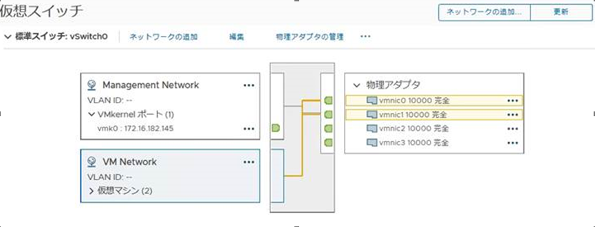
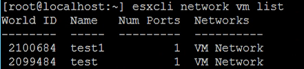
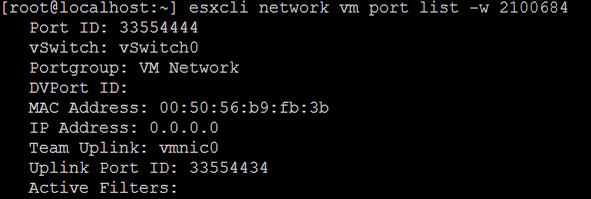
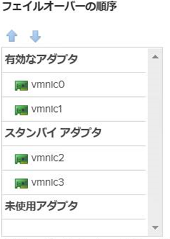

お客様から質問があったものの、地味に確認の方法が分からなかったため、備忘録として残しておく。

標準スイッチに対してアップリンク（＝物理NIC）をアクティブとして複数割り当てた場合、デフォルトの設定である「仮想ポートに基づいたルート」では、仮想マシンが使用する仮想NIC ごとにアクティブなアップリンクが割り当てられる。アップリンクが2 つの場合、仮想マシンA はアップリンク1、仮想マシンB はアップリンク2 を使用するといった感じ。

ここで、ある仮想マシンがどのアップリンクを使用しているかを確認したい場合、GUI からでは（おそらく）判断できない。したがって、CLI で確かめる方法を紹介する。

<figure>



<figcaption>

ポートグループとしてアクティブなアップリンクは分かるが、  
仮想マシンがどのアップリンクを使っているかは分からない。

</figcaption>

</figure>

まずは下記コマンドにて、対象の仮想マシンのworld ID （ちなみにESXi におけるworld とはスレッドであり、プロセスとは異なることに注意）を特定する。

```
esxcli network vm list
```



次に、得られたworld ID をもとに下記コマンドを入力する。

```
esxcli network vm port list -w xxx
```



すると、Team Uplink というところで、現在使用しているアップリンクを特定できる。

ちなみに、vmnic0 とvmnic1 をこの順番でアクティブなアップリンクにして、vmnic2 をスタンバイにしている場合、vmnic0 側のネットワークが切断された場合は、vmnic1、vmnic2 の順番でアクティブとして使用される。vmnic0 の代わりにvmnic2 がアサインされるわけではないことに注意。あくまでも、事前に設定した優先度に基づき仮想マシンが使用するアップリンクが決定される。

<figure>



<figcaption>

vmnic0 障害時有効なアダプタはvmnic1、vmnic2 の順番になる。

</figcaption>

</figure>
