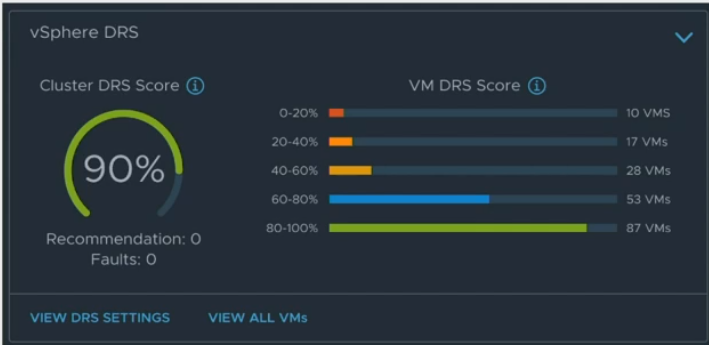
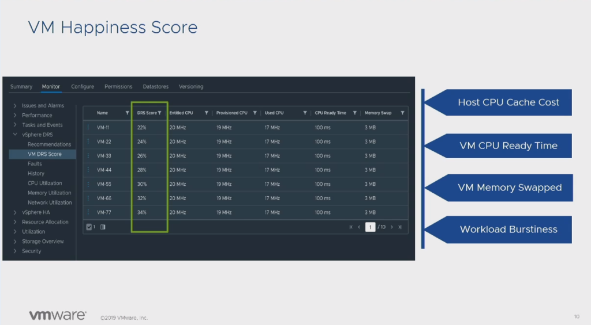
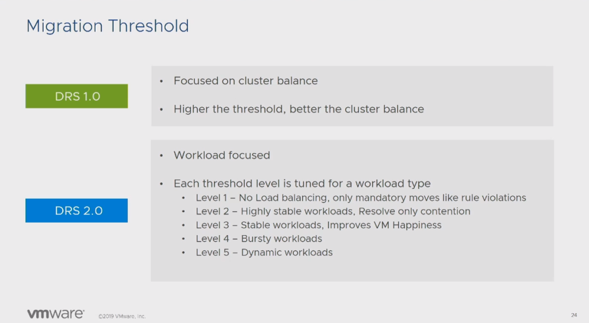

VMworld2019 にて紹介されたDRS2.0 を紹介する。クラスタ内のリソースを最適化することを目的とするのではなく、VM それ自身のリソース最適化を目的とした新しいアルゴリズムである。なお、本記事はVMworld 2019 の「[Extreme Performance Series: DRS 2.0 Performance Deep Dive](https://videos.vmworld.com/global/2019/videoplayer/27658)」のセッションを聴いてまとめたものである。

各仮想マシンは **Happiness Score** という**相対スコア**を持つ。これは、多数のメトリックから構成されており、例えば、CPU のキャッシュ（セッションを聴く限りCPU キャッシュのことを言っていると思う、キャッシュヒット率をメトリックに入れているってこと？）、CPU 待ち時間、メモリのスワップ、リソースの安定度、が含まれる。DRS2.0 では、各仮想マシンのHappiness Score を最大化するよう、仮想マシンをvMotion させる。

DRS1.0 では、クラスタのリソース使用率の標準偏差を計算している点、加えて仮想マシンが割り当てられたリソースを十分に活用できているのであればクラスタのリソースが偏っていたとしてもvMotion を行わないことから、DRS において、仮想マシンの負荷分散正しく表現は正しくないと言われてきた。

DRS2.0 では、仮想マシンごとのHappiness Score に基づくため、DRS1.0 よりもvMotion の頻度は多く（DRS1.0 では5分ごとに判定が行われる一方で2.0 では1分ごとに判定）最終的にはクラスタ内のリソースはDRS1.0 よりも平準化される（らしい）。また、スナップショットモデルを採用していないことから、DRS の計算も高速化されている。

とはいえ、1分ごとに計算するのであれば、仮想マシンの移動は激しくなり、結果的にNIC への負荷も大きくなることが予想される。また、いわゆるリソース使用率にスパイクを持つような仮想マシンの移動が1分ごとの移動判定に引っかかり、ホスト間で移動が繰り返される可能性がある。

DRS2.0 では、仮想マシンのリソース使用率がStable かUnstable かを調べ、Unstable であれば移動を実施しないという仕組みがある。また、Demand Interval を変更できる。Demand Interval とは、直近N 分間の仮想マシンのリソース使用率である、N を5-40 の範囲で仮想マシンごとに変更できる（デフォルトは15）。仮想マシンごとというのがポイントで、もしスパイクが多い仮想マシンであれば、Nを45 にすることで、DRS の判定に引っかからせないようにすることができる（とはいえ、仮想マシンごとにこれを設定するのは正直難しいと思う）。

また、DRS2.0 ではネットワークの負荷に基づく移動を実施する。vSphere6.5 ではNetwork-Aware DRS という機能があったが、これはあくまでも副次的なメトリックであり、DRS での移動の最終的な可否に使うだけであった。DRS2.0 では、これをメモリやCPU と同じような扱いのメトリックとした。

もう1つの変更点として、アクティブメモリをメトリックに使用しなくなった。アクティブメモリとは仮想マシンが実際に使用しているメモリと考えてよく（厳密にはESXi ホストから"推定"する仮想マシンのメモリ使用率）、DRS2.0 ではGranted メモリを使用する。このGranted メモリは物理メモリにマッピングされたメモリ量で、実際には消費メモリ+TPS によってシェアされたメモリということで、実質消費メモリと考えてよい。 とはいえ、6.5 時点でも消費メモリに基づくコンサバなDRS は設定可能である。

DRS2.0 設定時にレベルを選択できる。レベル1 では、アフィニティルールやメンテナンスモード時の強制移動のみを実施する。レベル2 はリソース競合時のみ移動を行う（DRS1.0 に近い）。レベル3 はデフォルトで、Stable な仮想マシンのみを対象に、Happiness Score を最小化するようvMotion をさせる。レベル4はUnstable な仮想マシンも対象とし、レベル5 はレベル4 よりもリソース変化が激しい仮想マシンも対象とする。

### まとめ

本機能はまだGA されていないため、これが良いアップデートかどうかはまだ分からない。しかしながら、仮想マシンのHappiness Score を最小化することで、結果的に従来よりもクラスタ間のリソースが均等になるのであれば、良いことのように思える。
