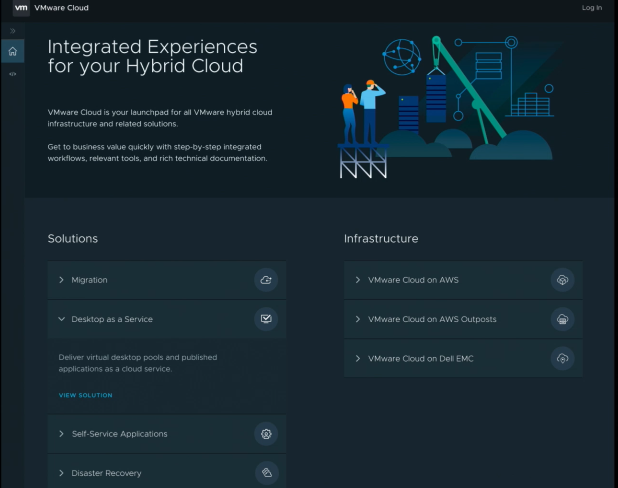
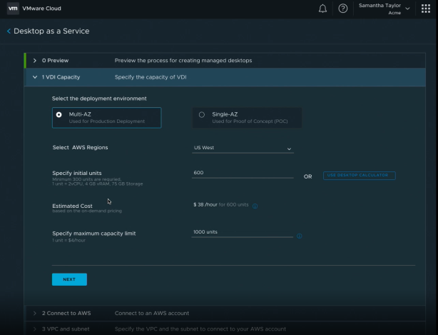
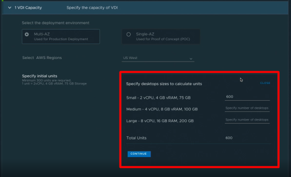
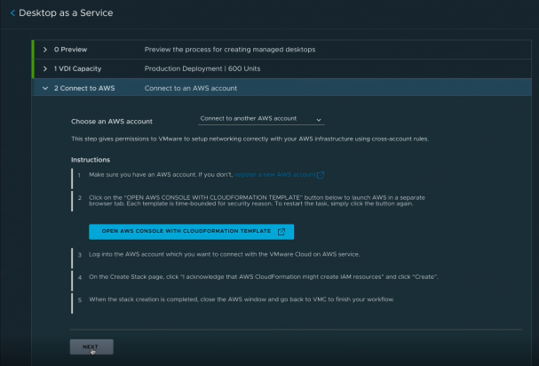
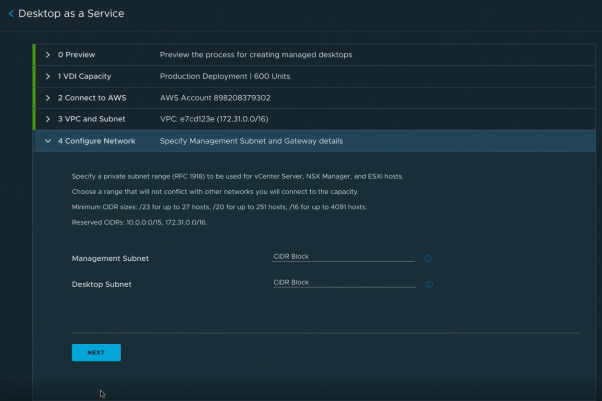
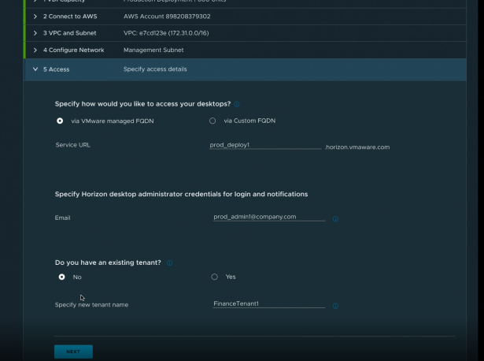
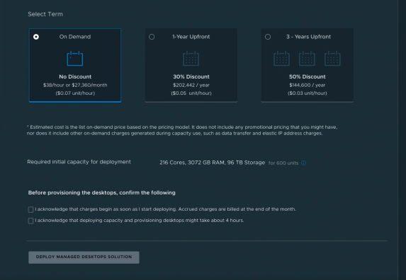
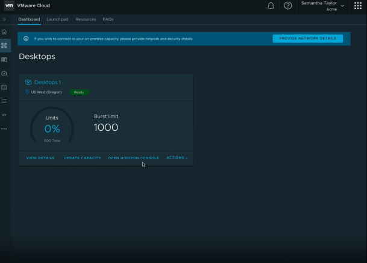
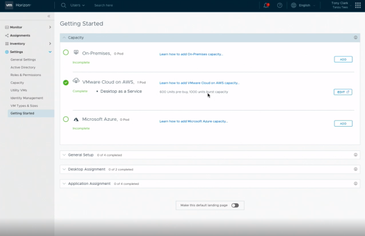
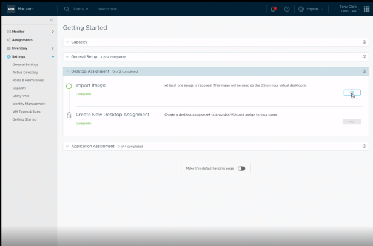

VMworld2019 にて待望のHorizon Cloud on Azure のVMC on AWS 版が発表された。現時点でのアナウンスをまとめる。

### 2019 年8 月現在のHorizon ファミリー

オンプレミスのHorizon、クラウド版のHorizon があるが、クラウド版のHorizon は3 種類に分かれる。

1. Horizon7 on VMC on AWS
2. Horizon Cloud on Azure
3. Horizon Cloud on IBM

1 のHorizon7 on VMC on AWS は、VMC on AWS 上にHorizon7 環境を構築するもので、あくまでもインフラ部分がVMware マネージドになる。したがって、DaaS というよりはむしろオンプレに近く、Connection Server 等のアップデートも顧客自身で実施する必要がある。

2 のHorizon Cloud on Azure に関しては、Azure リソースを活用したDaaS で、1 と異なりHorizon 管理コンポーネント部分もVMware 側でマネージドされる。Horizon 環境のアップデートはコンポーネントが多いとかなり大変なので、ここは相当なメリットと個人的に感じる。

3 は2 のIBM Cloud 版。

VMware Horizon Service は、 1 において、管理コンポーネントもVMware マネージドになる、まさにDaaS である。

### 現時点で分かっていること

[Day2 のGeneral Session](https://www.vmworld.com/en/us/learning/general-sessions.html) とブレークアウトセッションである「[Extend Your Virtual Desktop Infrastructure with Horizon7 on VMware Cloud](https://videos.vmworld.com/global/2019/videoplayer/27657)」をまとめた。

VMC on AWS やCloud Automation Services（CAS）といった、VMware のSaaS 系製品の統合ポータルから、最初の展開を実施する。

マルチAZ 構成かシングルAZ 構成かを決め、リージョン、初期展開ユニット数、最大展開ユニット数を設定する。ユニットとは、デスクトップの単位であり、1 ユニットは2 vCPU、4GB vRAM、75GB Diskを表す。デスクトップのサイズはSmall、Medium、Large から選ぶことができ、Medium の場合は4 vCPU、8GB vRAM、100GB Disk となり、おそらく2 ユニットとなるはずである（ディスク容量は2 倍になっていないが…）。

<figure>

<figcaption>

Small は1、Meduim は2、Large は4 ユニットであろう。

</figcaption>

</figure>

デモ画面を見ると、マルチAZ の場合、600 ユニットで38 $/hour であることかがわかるが、詳細は後述する。最小は300 ユニットらしい。

次に、AWS のアカウントと連携する。ここに関しては、画面を見る限りVMC on AWS と同じ手順であろう。

そのあと、管理コンポーネントとデスクトップ用にそれぞれ VPC 内でサブネットを分割する。Horizon Cloud on Azure でも似たような設定をするが、どうやら現時点ではDMZ 用ネットワークの設定項目はないようだ。

Connection Server （UAG？ELB？）のFQDN を設定し、通知用のメールアドレスも設定する。Tenant Name はよくわからないが、セッションを聴く限り、おそらくHorizon Cloud on Azure やオンプレミスのHorizon をまとめて管理できる [https://cloud.horizon.vmware.com/](https://cloud.horizon.vmware.com/l) のテナントのことを指すと思われる。オンプレもHorizon Cloud on Azure もHorizon Cloud Service もまとめて単一のコンソールで管理できる、みたいな。

最後に、課金体系を選択する。オンデマンド、1 年前払い、3 年前払いから選択する。3 年前払いだと、なんと50% とのこと。ここまで割引されるのであれば、前払いの方が魅力的か。

小さいが、スクリーンショットのコストの記載はこうなっている。

> Estimated cost is the list on-demand price based on the pricing model. It does not include any promotional pricing that you might have.  
> not does it include other on-demand charges generated during capacity use, such as data transfer and elastic IP address charges.

データ通信費やelastic IP の分は価格は別よ、と言っているが、この価格がライセンス+インフラという認識でいいのか、インフラだけなのか、ライセンスだけなのかが分からない。例えば、電源のスケジューリングを駆使して8 時間×20 日の起動時間まで節約すれば、もっと安くなるのか？現時点では不明。

初期設定が完了すると、ユニットの使用割合などが表示される。ただし、重要なのは、現時点ではデスクトップのアサインやイメージのインポートを等をしていないということ。よって、この後に、Horizon Cloud コンソール側（[https://cloud.horizon.vmware.com/](https://cloud.horizon.vmware.com/l) ）からこれらの設定をする。

以上が、現時点で分かっていることになる。ただし、あくまでもGA 前であり、この情報は変わる可能性が大いにある。

### まとめ

オンプレミスのHorizon 環境とクラウドのHorizon を連携させる場合、ハイパーバイザーが異なる点から、Horizon Cloud on Azure との連携は難しかったし、Horizon 7 on VMC on AWS に関しては、Horizon 部分だけでなくVMC on AWS の価格も含むため、コスト的にはかなり大きなものとなる。その間を埋めるソリューションとして、例えばオンプレミスのHorizon 環境のスケール先として、同一のマスターで同じようなユーザビリティを提供できるような、まさに一貫した運用管理ができるという点で、今回のHorizon Cloud Service には期待したい。
