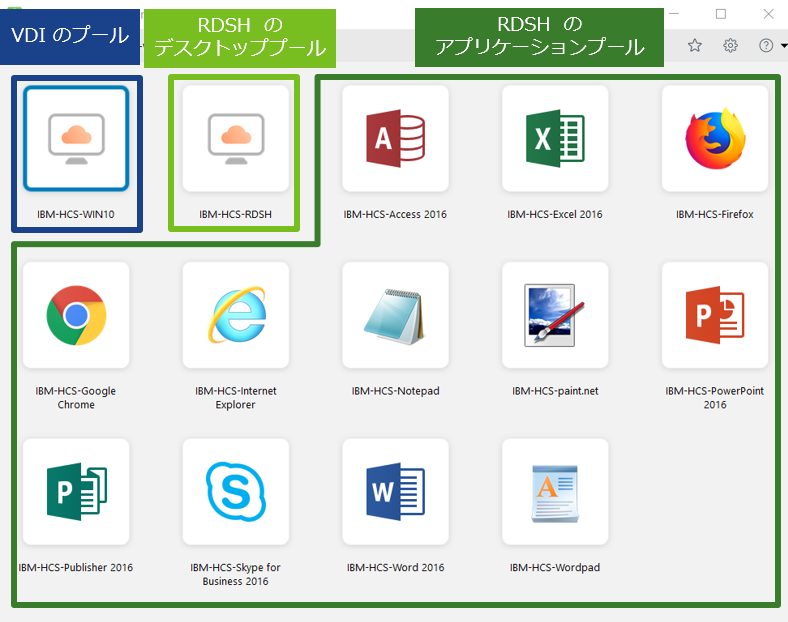

Horizon 用語はとにかくわかりづらいと個人的に思っている。そこで、わかりづらい原因であるCloud-Pod アーキテクチャおよびプール・ファームの関係性について、改めて整理する。また、この記事を読む前に、別タブで下記kb を開いておいてほしい。非常に重要なHorizon Max Config に関するkb である。

[https://kb.vmware.com/s/article/2150348](https://kb.vmware.com/s/article/2150348)

### Cloud-Pod アーキテクチャ

> データセンターをまたいで Horizon を展開する場合に、複製された接続サーバ インスタンスのグループを WAN、MAN (metropolitan area network)、または他の LAN 以外をまたいで使用するには、クラウド ポッド アーキテクチャ 機能を使用する必要があります。
> 
> この機能は、標準の Horizon コンポーネントを使用して、複数のデータセンターにわたる管理、ユーザーとデスクトップ間のグローバルで柔軟なマッピング、高可用性デスクトップ、ディザスタ リカバリなどの機能を提供します。
> 
> [https://docs.vmware.com/jp/VMware-Horizon-7/7.9/horizon-architecture-planning/GUID-6CEB37BC-F98B-4AB0-B2FB-41DD207D9BCC.html](https://docs.vmware.com/jp/VMware-Horizon-7/7.9/horizon-architecture-planning/GUID-6CEB37BC-F98B-4AB0-B2FB-41DD207D9BCC.html)

もうここから既に分かりづらいと思うのだが、要するに、より多くのアクセスを捌けて、かつスケールや高可用性を考慮したHorizon の物理/論理コンポーネントを展開するためのデザインの指針である。ここでいう物理コンポーネントとは、例えばConnection Server やUAG など仮想マシンとして展開されるものを指し、論理コンポーネントとはデスクトッププールやファームといったHorizon 独自の考え方である。

<figure>

<figcaption>

Cloud Pod アーキテクチャの概念図。この図が1 つのPod を表す。

</figcaption>

</figure>

### ポッド

Connection Server の集合体であり、**同時接続数を規定する**。Horizon 7.9 時点で最大7 のConnection Server でポッドを構成できる。最大20000 セッションをサポートしているため、これ以上のセッション数を捌く必要があるのであれば、ポッドを分けたうえで、フェデレーションによりポッド間でデータを共有する。また、単一のポッドには複数のvCenter を含めることが可能だが、7.7 から複数のポッドで単一のvCenter を含めることができるようになったことに注意。

捌きたいセッションの数でポッド、Connection Server 、[UAG の数が決定される。](https://blog.vpantry.net/posts/unified-access-gateway-design/)尤も、よほどの大規模な環境でない限り、もしくはインターネット分離等特別な要件で、エンドユーザーが接続するConnection Server を物理的に分けたい場合を除き、ポッドの数は1 つになるであろう。

### ブロック

ブロックはすなわち**vCenter Server の数**であり、**仮想マシンの数を規定する**。Horizon 7.9 時点で 1 ブロックあたり最大10000 の仮想マシンをサポートする。ただし、kb ではそう記載されているものの、ドキュメント上では2000 VM を目安と記載されている。

> A building block is a logical construct and should not be sized for more than 2,000 Horizon desktops.
> 
> [https://docs.vmware.com/en/VMware-Horizon-7/7.9/horizon-architecture-planning/GUID-3FE970DF-382D-4F2A-B2E6-24B670B6705B.html](https://docs.vmware.com/en/VMware-Horizon-7/7.9/horizon-architecture-planning/GUID-3FE970DF-382D-4F2A-B2E6-24B670B6705B.html)

仮想マシンが増えれば増えるほどvCenter Server のパフォーマンスに影響があるため、基本的には2000 VM程度を目安にvCenter Server、すなわちブロックを分けた方が無難か。

リンククローンやインスタントクローンのマスターとなる仮想マシン（マスターVM）は当然ながらvCenter 間、ブロック間で共有できない。また、vCenter なのでブロック内に複数のクラスタを作成することは可能だが、ブロックをまたがったvMotion は不可。

### クラスタ

Horizon 用語ではなく、vSphere の一般的なそれである。プール作成時にクラスタを登録するように、プールを複数のクラスタで構成することはできない。ただし1 つのクラスタに対して複数のプールを作成することはできる。クラスタはHA やDRS 、vSAN 等の境界になる。

クラスタに含めることのできるESXi ホストの数はHorizon 側で制限されていて、vSAN の場合は24、通常のストレージはクローン方法によって32 だったり64 だったりする。が、ここまでホストの数を含めることもそうそうないだろうし、プールを1 クラスタ上に複数作成できるので、クラスタの数は1 つの方が良いと個人的には思うが、クラスタをわざわざ複数作成するメリットがあれば教えて欲しい（DaaS みたいなことをしたい時とか？）。

### プール

エンドユーザーがHorizon Client からアクセスする、単一のマスターイメージから作成される仮想デスクトップ群。したがって、部署など、用途ごとに分けるのが一般的。1 プール当たりの仮想マシン数はHorizon 7.9 時点で最大4000（推奨2000）だが、L2 セグメントがかなり広くなってしまう点に注意。その場合は同じマスターから構成される複数のプールを用意すればよい。

<figure>

<figcaption>

Horizon Client の画面。ユーザーは管理者が用意した各プールにアクセスする。

</figcaption>

</figure>

### ファーム

RDSH を使用するために必要な論理構成である。RDSH とは、すなわちSBC （Server Based Computing）で、Windows Server OS を使ってライセンスコストやリソースを抑えつつ仮想デスクトップや公開アプリケーションを使用する機能である。ここで、エンドユーザーが仮想デスクトップを使用するためには（デスクトップ）プールが必要であり、プールを作成するために必要なWindows Server 群がファームである。1 つのWindow Server から複数の仮想デスクトップを展開できるため、事前に複数のWindows Server から構成されるファームを用意しておき、それをベースに抽象化されたプールを作成する。

ファームは自動と手動、2 つの作成方法がある。自動作成の場合、リンククローンまたはインスタントクローンを使用してファームを準備する。手動の場合、事前に用意した物理/仮想のサーバーOS を登録する。ファームは複数のサーバーOS から構成されるため、基本的には自動作成を選択することになる。

ココが特に混乱しがちなので強調しておく。

#### VDI の場合

- デスクトップのプールをフルクローン/リンククローン/インスタントクローンで作成する
- ファームは作成しない

#### RDSH の場合

- デスクトップ/アプリケーションのプールをファームから作成する
- ファームをリンククローン/インスタントクローン、もしくはWindows Server を個別登録して作成する

### まとめ

今回は機能というよりは用語の説明に焦点を当てた。Horizon の勉強を始めると結構混乱しがちなところなので、必要に応じて参照してほしい。
