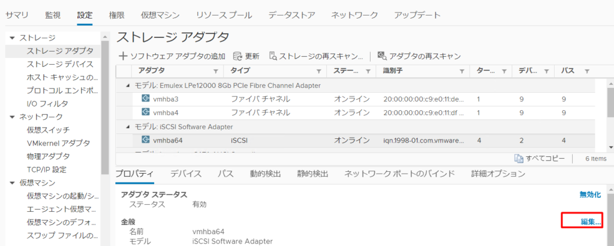
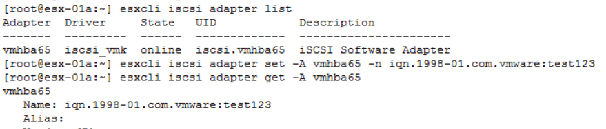

地味だが毎回忘れてしまうので備忘録として残しておく。

よくあるユースケースとしては、ESXi の再インストールなどをしてイニシエータの名前が変更されてしまい、デバイスが見えなくなってしまった場合に、ESXi ホスト側で変更前の名前に変更することで、ストレージ側での操作をせず、デバイスをホストに見せることができる。

対象のホストがvCenter Server に接続されている場合は、GUI より簡単に変更できる。ホストをクリックし、設定→ストレージアダプタ→対象のアダプタを選択→プロパティ→編集で名前を変更可能。

vCenter Server に接続されていない場合は、SSH 接続を行い、CLI より下記コマンドを実行する。

`esxcli iscsi adapter set -A "_Your Adapter Name_" -n "_Your Initiator Name_"`

<figure>

<figcaption>

多くの場合、adapter name はvmhba64 になる

</figcaption>

</figure>
