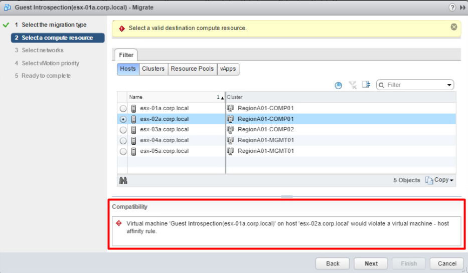

答え：必要ありません。

### 解説

同じ質問をよく受けるので、備忘録として残しておく。Trend Micro 社のDeep Security 連携などで必要なGuest Introspection はホスト毎に1 台建つ仮想マシンであり、そのホストと厳密に紐づく。

> You cannot migrate a Service VM (SVM) using vMotion/SvMotion. SVMs must remain on the host on which they were deployed for correct operation.
> 
> [https://docs.vmware.com/en/VMware-NSX-Data-Center-for-vSphere/6.4/com.vmware.nsx.install.doc/GUID-62B22E0C-ABAC-42D8-93AA-BDFCD0A43FEA.html](https://docs.vmware.com/en/VMware-NSX-Data-Center-for-vSphere/6.4/com.vmware.nsx.install.doc/GUID-62B22E0C-ABAC-42D8-93AA-BDFCD0A43FEA.html)

したがって、Guest Introspection はvMotion することはできないし、DRS で勝手に移動することもない。内部的には、Guest Introspection 作成と同時に裏側で（見えない）アフィニティルールが作成される。試しにvMotion するとエラーが出る。

一方で、Trend Micro 社のサイトにはこのような記載がある。

> SVM の vMotion/ストレージvMotion を防ぐ方法  
> 以下のVMware社のサイトを参考にアフィニティルールを使用することで、SVM が特定のESXiホストで稼働するように設定可能です。
> 
> [https://success.trendmicro.com/jp/solution/1115886](https://success.trendmicro.com/jp/solution/1115886)

誤解を招く表現となっているが、このサイトに記載されているようなアフィニティルールの設定は必要ない。

ちなみに、NSX-T では、そもそもGuest Introspection 自体が仮想マシンではなくカーネル組み込みで実装されているため、このようなことを考慮する必要はない。
