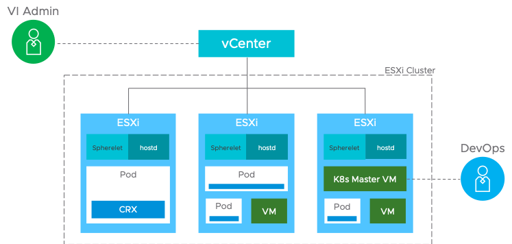

先日のVMworld2019 にてアナウンスされたProject Pacificは、vSphere とkubernetes (k8s) を統合し、vCenter Server からVM もPod も管理できるという。本記事では、各所で発表されている様々な公開情報を基に、Project Pacific について現時点で判明しているアーキテクチャについて、技術的な面からまとめる。ほぼほぼ、この動画をまとめたものになるので、必要に応じて動画を参照してほしい 。  
[https://www.youtube.com/watch?v=pfcfOMikea4](https://www.youtube.com/watch?v=pfcfOMikea4)

### アーキテクチャ

vSphere のESXi サーバーがLinux VM の代わりにWorker Node として機能する。ESXi 上に、Spherelet と呼ばれる、k8s のKubelet に相当する機能を直接稼働させ、k8s Master からの命令に従いPod の操作を行う。このアーキテクチャの違いは下図のように、k8s と比較すると分かりやすい。

<figure>

<figcaption>

[https://mapr.com/blog/kubernetes-kafka-event-sourcing-architecture-patterns-and-use-case-examples/](https://mapr.com/blog/kubernetes-kafka-event-sourcing-architecture-patterns-and-use-case-examples/)

</figcaption>

</figure>

<figure>

<figcaption>

[https://blogs.vmware.com/vsphere/2019/08/project-pacific-technical-overview.html](https://blogs.vmware.com/vsphere/2019/08/project-pacific-technical-overview.html)

</figcaption>

</figure>

Pod はESXi 上にネイティブに実装され、vCenter Server からはVM のように見える。これを実現しているのがCRX と呼ばれるESXi 組み込みのコンテナランタイムであり、Linux Kernel をESXi 上に組み込み、ブートの際の初期化プロセスもないため（これをDirect Boot と呼ぶらしい）、高速にPod が起動する。最初からLinux OS が立ち上がっていると考えると分かりやすいか。したがって、VM のリソース分離とセキュリティのメリットを享受しつつも、コンテナの高速起動を実現している。

パフォーマンスも優れたものになっている。これまでは（ベアメタルでの実装を除き）物理サーバー＞ハイパーバイザー＞Linux VM＞Pod、というレイヤー構造だったのが、物理サーバー＞ハイパーバイザー＞Pod、というよりシンプルなものになるということである。このため従来のVM 上にコンテナをデプロイするモデルよりもスループットが優れたものになっているとの発表がVMworld であった。 また、ベアメタルよりも8% 優れているとの発表もあったが、これはよりNUMA を意識したCPU スケジューリングが可能なことに起因する。コンテナがばらばらにCPU 資源を使うよりも、vCPU というある程度まとまった単位でスケジューリングした方がLocal Memory Access をしやすくなるとのこと。

動画の中でも質問があったが、ESXi の軽量なアーキテクチャにLinux Kernel を組み込むことは反するのではないか、という疑問は尤もだが、これもいわゆるPod を動かす以外の余計な機能を全て削いでいるため、軽量であるとのこと（どのくらいの容量かは説明がなかった）。

なお、CRX のLinux Kernel はPhoton OS を使用している。ただしLinux Distro というよりは、本当に単純なKernel 部分しか使っていない。 このCRX は1 コンテナに1 つ割り当てられる（=1pod 1 Kernel）。

ここで、Master NodeはVM で実装される。これは図のk8s Master VM である。当然ながら冗長化されるであろうが、etcd が組み込みか外出しかどうかはソースが見つからなかった。

一つ注意点として、Pod を作る時は、図にもあるように、k8s Master に接続するため、vSphere からPod を作ったりはしないようである。あくまでも、vSphere Admin とk8s を使うDeveloper の役割を分けているとのこと。

### まとめ

以上が現時点で私が理解しているProject Pacific のアーキテクチャの情報である。 まだ先の話なので情報も少ないし、Tech Preview のため今後実装が変わるかもしれない。しかしながら、これまでk8s の導入がなかなか進まなかった大規模顧客が、Project Pacific でコンテナを導入するきっかけになれば、それは非常に面白い。
