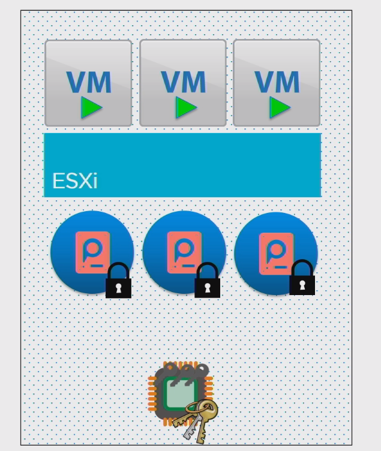
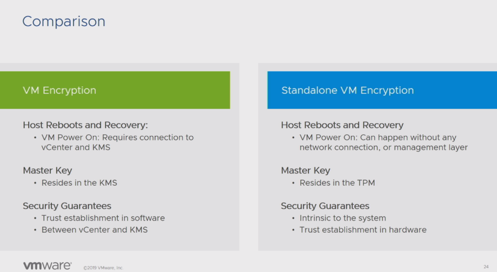

VMworld2019 で興味深いブレークアウトセッションがあったため紹介する。[Encrypting VMs on Standalone Hosts: Tech Preview (HBI1947BU)](https://videos.vmworld.com/global/2019/videoplayer/27622) というタイトルで、Tech Preview だが仮想マシン暗号化に関するアップデートである。あまり使われている印象はないが、ひょっとしたらGDPR の関係で需要が増加するかもしれない？

### 機能概要

現状、仮想マシン暗号化が中々使われない大きな理由の1 つにKMS が高価という点がある。本機能では、ホスト内のTPM 使用してホストごとに個別に暗号化を行うことで、 仮想マシン暗号化をKMS なしにホスト単位で実施する。

### TPM とは？

<figure>

<figcaption>

[https://www.gigabyte.com/Motherboard/GC-TPM20](https://www.gigabyte.com/Motherboard/GC-TPM20)

</figcaption>

</figure>

Trusted Platform Module の略で、現時点ではTPM2.0 が主流である。簡単に言うと暗号化や鍵管理を行うセキュアなハードウェアチップで、マザーボードに標準的に搭載されており、改ざんに強く（耐タンパー性）、TPM それ自体が盗まれても簡単には復号できない。用途としてはWindows 10 におけるBitLocker が有名であろう。

### 従来の仮想マシン暗号化との比較

最も大きな違いはKMS が必要なくなるという点である。従来の仮想マシン暗号化では、KMS からvCenter Server を経由して鍵（KEK : Key Encryption Key）を受け取り、KEKを用いて自身で生成した内部キー （DEK : Data Encryption Key）を暗号化し、暗号化されたDEK を用いて仮想マシンを暗号化する（KMS から受け取ったKEK で直接暗号化していないことに注意）。

KMS から鍵を受け取る処理が入る時に、KMS やvCenter Server を疎通が取れないと、オペレーションは失敗する。例えば、ホストがリブートされKEK を受け取らざるを得ない状況の時にKMS が死んでいると、KEK を受け取れず仮想マシンのパワーオンは失敗する。

新しい暗号化では、ホスト自身で暗号化を実施するので、このようなオペーレションの成功可否を外部に依存する必要がなくなる。

一方で、KMS はある意味鍵を中央管理しているわけで、暗号化がホスト毎になれば、その管理はホスト単位になってしまい、管理が複雑になる。例えば鍵の更新も手間になる。また、esxcli コマンドでこの機能をオンにする仕様とのことだが、 現時点ではユーザー自身でのコーディングがかなり必要なようである。

### まとめ

改めて仮想マシン暗号化を調べてみたが、VM に依存せずハイパーバイザーのレイヤーで暗号化を行うという点で、App Defense と同様のVMware の強みがあると感じた。KMS が必要なくなれば導入も増えていくかもしれないが、ホスト毎となると管理が大変である。いずれvCenter Server から中央管理できるような仕組みが登場してくるかもしれない。登場しない場合は、一部のホストのみ暗号化をするような、暗号化島が流行るかもしれない。
