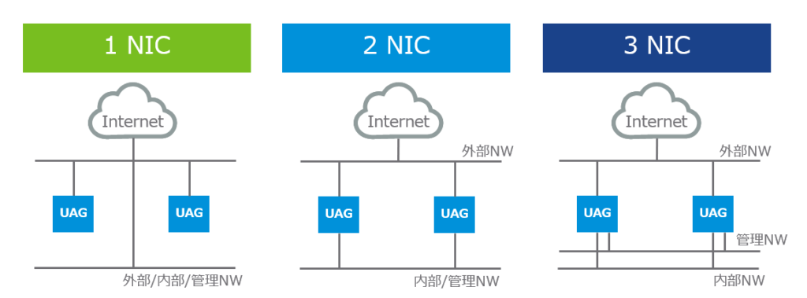
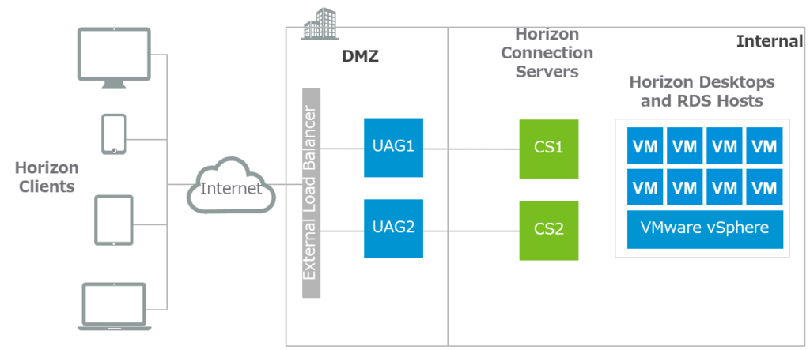
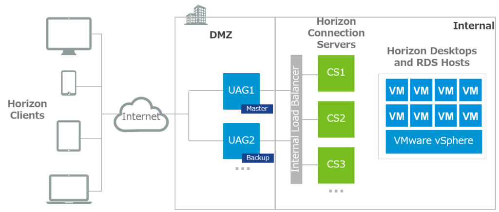
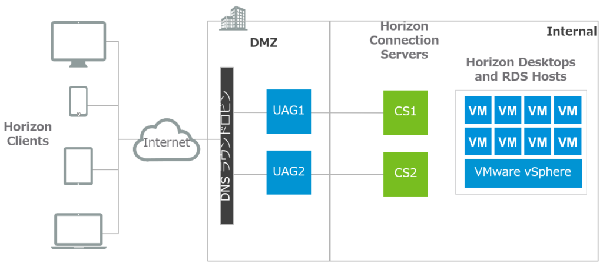
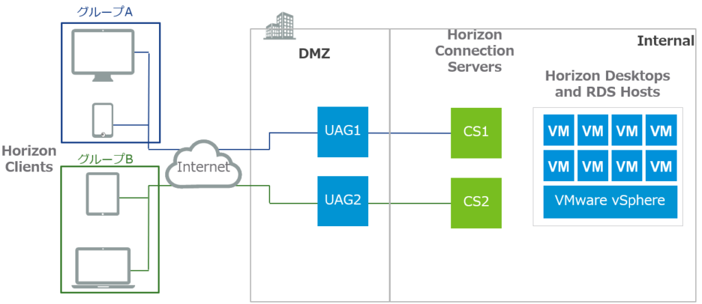

Horizon やWorkspace ONE で何かとお世話になるUAG。色々な方がブログにデプロイ方法を書いているが、いざ実際に使ってみようとすると結構考えることがある。そこで、今回はHorizon 環境におけるUAG のデザインについて検討してみる。

## UAG の基本

UAG とはUnified Access Gateway の略で、昔はAccess Point などと呼ばれていたが、2019年7月28日現在3.6 がリリースされている。Horizon やWorkspace ONEに同梱され、どのライセンスエディションを購入しても無償で使用することができる。

UAG は外部からの接続におけるセキュリティ強化を実現し、Horizon であればいわゆるセキュアゲートウェイ、Workspace ONE であればPer-App VPN（アプリケーション単位のVPN）、または単純なリバースプロキシとしても使用できる。

セキュリティサーバもUAG と似たような機能だが、こちらはデザイン上の制限があり（後述）、Windows Server にインストールする形で提供される。 一方UAG はLinux アプライアンスとして提供され、Windows 版のセキュリティサーバと比較してライセンスコストを削減しつつセキュリティを担保できる。大分前にUAG に力を入れて機能拡張していくとブログか何かでアナウンスされ、セキュリティサーバは将来的に廃止になるのかなと思っているがしぶとく生き残っているのが現状。とはいえ、UAG の方が明らかにバージョンアップが盛んであり、Workspace ONE のContent Gateway や、UAG 3.6 ではSecure Email Gateway もUAG で対応するとのことで、まさにUnified （統合された）なコンポーネントになりつつあることからも、よほどのことがない限りUAG の使用を推奨する。

また、UAG 自体は3.4 までロードバランサー（LB）の機能を持たなかったということもあり、LB と組み合わせて使用するのが一般的である。

さて、ここからはWorkspace ONE ではなく、Horizon に焦点を当てて、デザインについて検討してみる。なお、あくまでも主観のため、ここに書いてあることは参考程度にとどめて欲しい（予防線）。

## UAG のデザイン

### サイズはStandard かLarge か？

デプロイ時にNIC の数を選択する画面で、デプロイのサイズをStandard かLarge か選択できる。ドキュメントには次のように記載されている。

> **Standard:** This configuration is recommended for Horizon deployment supporting up to 2000 Horizon connections, aligned with the Connection Server capacity. It is also recommended for Workspace ONE UEM Deployments (mobile use cases) up to 10,000 concurrent connections.  
> **Large:** This configuration is recommended for Workspace ONE UEM Deployments, where Unified Access Gateway needs to support over 10,000 concurrent connections. This size allows Content Gateway, Per App Tunnel and Proxy, and Reverse Proxy to use the same Unified Access Gateway appliance.  
> **Note:** VM options for Standard and Large deployments:  
> Standard - 2 core and 4GB RAM  
> Large - 4 core and 16 GB RAM
> 
> [https://docs.vmware.com/en/Unified-Access-Gateway/3.6/com.vmware.uag-36-deploy-config.doc/GUID-537BD936-73B4-4902-A15D-5723295BA29E.html](https://docs.vmware.com/en/Unified-Access-Gateway/3.6/com.vmware.uag-36-deploy-config.doc/GUID-537BD936-73B4-4902-A15D-5723295BA29E.html)

ドキュメントを見る限りでは、Standard 構成の場合、1UAG あたり同時接続数を最大2000セッションまでサポートすると記載され、それ以上であればLarge ということになりそうだ。しかしながら、Large の記載を見ると、あくまでもWorkspace ONE UEM の同時接続数のみを対象としており、Horizon に関する記載は一切ない。それもそのはずで、お馴染みHorizon Max Config のkb にはこのように記載されている。

> Active sessions per Connection Server instance with direct connection, RDP, tunnel connection, or PCoIP：4,000 (2,000 recommended)
> 
> Max connections per UAG：2000
> 
> [https://kb.vmware.com/s/article/2150348](https://kb.vmware.com/s/article/2150348)

したがって、Connection Server 側の推奨値である2000セッションと、UAG のサポートされる同時接続数がが同じのため、ドキュメントから判断するに、Horizon 環境においてはLarge にする必要がなく、Standard でよいのである（が、私の方では検証してはいないので、あくまでもドキュメントベースの判断である）。

### カスケードモードか否か？

カスケードモードはUAG をスケールのために並列でデプロイするのではなく、"縦"に2つデプロイするモードで、DMZ を2つ用意しなければならない環境で使用する。よって、カスケードモードを使用する機会はほとんどないだろう。カスケードモードについてはVMware の下記ブログが参考になる。

[https://blogs.vmware.com/euc/2018/12/whats-new-in-vmware-unified-access-gateway-3-4.html](https://blogs.vmware.com/euc/2018/12/whats-new-in-vmware-unified-access-gateway-3-4.html)

### NIC の数は？

UAG デプロイ時にNIC の数を1、2、3 から選択できる。

1NIC の場合、インターネットからの接続と、Connection Server やVDI への通信が同じNIC を使用することになり、セキュアでない。また、NIC がパフォーマンスのボトルネックとなることを避けるというメリットもある。本番環境では2 NIC 以上の構成を推奨する。併せて、こちらのドキュメントも参照してほしい。

[https://docs.vmware.com/jp/Unified-Access-Gateway/3.6/com.vmware.uag-36-deploy-config.doc/GUID-FFC6B49E-07E2-42F0-AA6D-8811E5340BD6.html](https://docs.vmware.com/jp/Unified-Access-Gateway/3.6/com.vmware.uag-36-deploy-config.doc/GUID-FFC6B49E-07E2-42F0-AA6D-8811E5340BD6.html)

注意点としては、UAG の管理UI に入るためには、当然ながら管理ネットワークのIP アドレスを叩く必要がある。2NIC や3NIC 構成の場合、ついついエンドユーザーがアクセスするFQDN+9443 ポートで入ってしまいがちであるが、これが通用するのは1NIC 構成の時だけである。このようなこともあり、検証では1NIC の方が便利だったりする。

### どれくらいデプロイすればよいのか？

私が知る限り、UAG 自体の並列のデプロイ数に関する最大値は記載されていない。とはいえ、Horizon 7.9 において（ポッド当たりの）Connection Server 側の最大数が7 なので、それに合わせる形になる。

サイズのところでも説明したが、UAG/Connection Server それぞれ2000 セッションとすると、 縮退時（N+1）を考慮しつつそのセッション数が余裕をもって捌ける数をデプロイすることになる。例えば、10000 同時アクセスを捌きたい場合、10000/2000 で5台、N+1 を考慮して最低6台UAGとConnection Server が必要になる。ただし、これは負荷分散が適切にできているという前提に基づく。

### UAG の配置は？

先述したように、UAG はLB の機能を持たなかった。持たなかったと言っているのは、実はUAG3.4 から組み込みのLB のような機能（高可用性）が追加されたためである。尤も、出たばかりというのもあり、個人的にはまだ信用していないところではあるが、10000 セッションまでサポートと言っているので、使用しても良いかもしれない。

通常、UAG はLB と組み合わせて使用するため、その配置を考えてみよう。

#### フロント、バックエンド両方にLB を配置

高い信頼性、高性能な負荷分散機能が魅力的だが、LB がフロントエンド/バックエンド両方に必要なこともあり、コストがかかってしまうことが難点。なお、社内のクライアントはバックエンドのLB に相乗りしても良い。

#### フロントエンドのみにLB を配置

バックエンドにLB を置かないため、コストは削減できる。しかしながら、Connection Server 障害時に、LB からどのようにヘルスチェックするかが難しいため、Connection Server 障害にもスムーズに対応したい場合はバックエンドにもLB を置くことを推奨する。

#### バックエンドのみにLB を配置

先述したUAG の高可用性の機能を使用するパターン。もしかしたら今後こちらが主流になるかも？この機能はマスターであるUAG がソースIP を見てラウンドロビンでバックアップとなっている他のUAG にトラフィックを振り分けるため、Connection Server 側を見ていないはずなので、もしバックエンドにもLB を置かない場合、UAG がトラフィックを転送した先のConnection Server が死んでいた場合にアウトである。

#### LB を置かずDNS ラウンドロビンで対応

コスト的にはかなり安上がりになる。が、障害検知や負荷分散など、一般的なDNS ラウンドロビンの問題が付きまとう。

#### LB を置かずマニュアルで対応

ここでいうマニュアルとは、クライアントから接続するUAG をグループごとに分割するということである。このユーザーグループはHorzion Client にてUAG1 経由でVDI に接続、このユーザーグループはUAG2 経由……と事前に割り当てる。最も安上がりで構築も簡単だが、負荷に応じた対応ではないこと、およびConnection Server 障害時に該当のユーザーグループが接続できなくなるため、手動で接続するUAG を変更する必要がある。

## 最後に

自分が思いついた限りのデザインに関連する内容なので、抜け漏れあったら教えてください。UAG の高可用性機能に期待しています。
