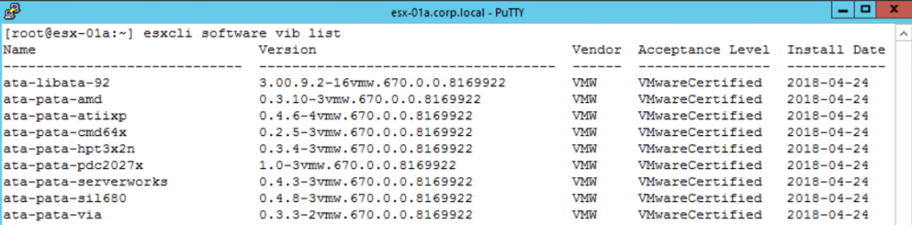
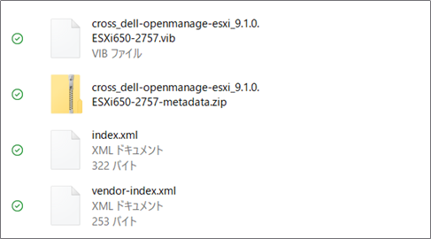
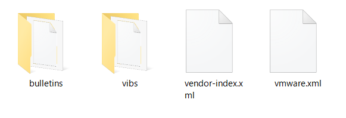
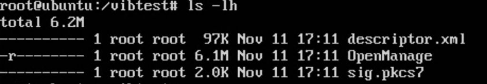
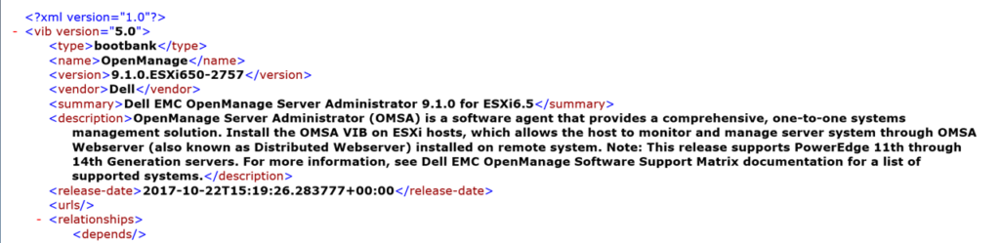
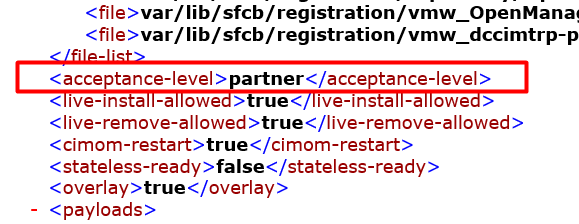
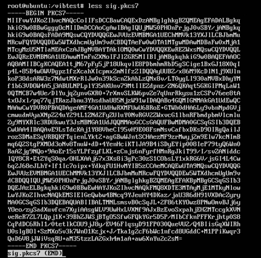
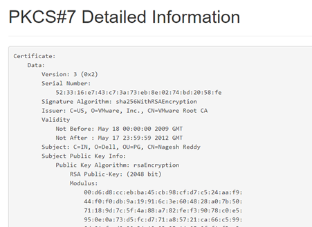
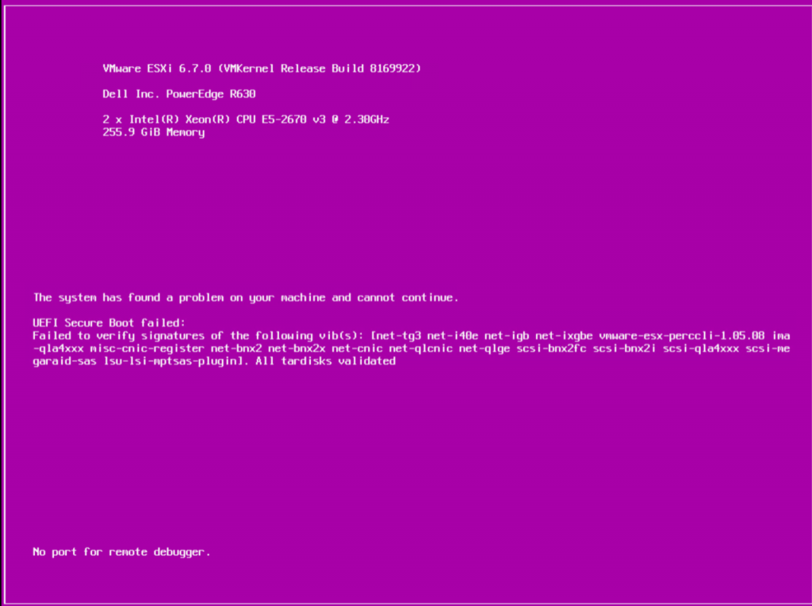

VMware のVIB という概念は中々理解が難しい。一口にVIB と言っても、機能追加なのか、アップデートなのか、ESXi そのものなのか、色々な概念を含むのも、その取っつきづらさの一因であろう。本記事では、VMware に関わる方を対象に、VIB という概念を腹落ちして理解してもらうことを目的とする。なお、本記事の作成で説明はこちらのブログを参考にしたため、必要に応じて確認してほしい。  
[http://www.yellow-bricks.com/2011/11/29/how-to-create-your-own-vib-files/](http://www.yellow-bricks.com/2011/11/29/how-to-create-your-own-vib-files/)

### VIB の概要

VMware Infrastructure Bundle の略で、ESXi に"後から"インストールするソフトウェアである。 そのため、ベースとなるESXi をインストールした後に、VMware や各OEM ベンダーから提供されるVIB をダウンロードして、自分のESXi にそれをインストールする。これによって、例えばDell のVIB であればDell サーバーに特化した新機能を追加することができるし、デバイスドライバも含んでいたりするので、特定の機器を使いたい場合はVIB のインストールの必要に迫られるときもある。

vSphere という製品におけるESXi は非常に軽量であり、軽量なことを一つの価値としているが、このような後付けのVIB という概念は、まさにその軽量さを目的としたアーキテクチャであろう（そのぶん、vCenter Server は肥大化する一方だが……）。

VIB を使用する方法は主に3種類ある。

1. 個別に.vib ファイルをESXi にインストールする
2. オフラインバンドル形式でESXi にインストールする  
    インストールコマンドは esxcli software vib install _xxx_.vib
3. カスタムISO として既にESXi イメージに組み込まれている

1 では、ESXi 上でインストールコマンド `esxcli software vib install -v _xxx_.vib` を入力してインストールする。.vib ファイルはVIB そのものなので、直接VIB をインストールするというわけだ。

2 では、 ESXi 上でインストールコマンド `esxcli software vib install -d _yyy_.zip` を入力してインストールする。このzip ファイルはいわゆるオフラインバンドルというもので、1 つ以上の.vib をzip にパッケージングしたものである。こちらについての詳細は後述する。

3 では、ISO に予めインストールされているため、特にユーザーでインストールする必要はない。 これがいわゆる、カスタムISO というモノである。カスタムISO をOEM ベンダーは自身らで配布することで、ユーザーは特にあとからVIB を自身でインストールする必要はなく、便利である。

### アクセプタンスレベル

VIB にはアクセプタンスレベルというものが存在する。これは要するに、VIB がどれほど信用されているかを表す尺度であり、悪意のあるユーザーが勝手にVIB を作成しユーザーが誤ってインストールすることを防ぐことを目的としている。

アクセプタンスレベルにはVMwareCertified、VMwareAccepted、PartnerSupported、CommunitySupported の4 段階あり、CommunitySupported 以外はキチンとテストされサポートも受け付ける。 VMwareCertified が最も安心できるもので、主にVMware が作成したVIB が該当する。一方でOEM ベンダーが作成したものは大抵PartnerSupported になっている。これは、esxcli software vib list で確認できる。

<figure>

<figcaption>

VMware HOL で確認したため、すべてのVIB のアクセプタンスレベルはVMwareCertified である

</figcaption>

</figure>

CommunitySupported はユーザーが勝手に作成して、テストも行われていない可能性が高いので、何か問題が起こってもVMware はサポートしない。自己責任である。 ただし、そもそもCommunitySupported のVIB はインストールできない場合もある。これは、ESXi 側でインストール可能な最低レベルのアクセプタンスレベルが設定されているためであり、自己責任の下で変更が可能である。

さてここからは、VIB の中身を確認することで、より深く理解することを試みる。

### VIB の中身

今回はDell のOpenManage Server Administrator と呼ばれるVIB を使う。理由は、vib download と検索して一番先に出てきたからだ。

[https://www.dell.com/support/home/jp/ja/jpbsd1/drivers/driversdetails?driverid=w42nc](https://www.dell.com/support/home/jp/ja/jpbsd1/drivers/driversdetails?driverid=w42nc)

まずは「ファイルのダウンロード」から実際にダウンロードすると、zip ファイル形式であることがわかる。これが、オフラインバンドルというものである。このオフラインバンドルを解凍すると、画像のようなファイル群で構成されているはずだ。

このうち最も重要なのは一番上の.vib ファイルで、先ほどのDell のサイトではこのファイルを直接インストールするよう指示があるようだ。また、2 つ目の~~-metadata.zip を解凍すると、下記のようなファイルやフォルダができる。

bulletin （ブリテンと読む）、vibs などのフォルダの中にはxml ファイルが存在しており、要するに metadata.zip の中身は全てxml ファイルなわけだが、xml ファイルにはVIB の名前やid、説明など、やはりメタデータが含まれる。

以上がVIB の中身である……と言いたいところだが、ここではもう少し深堀してみよう。先ほど見た.vib ファイル、実は単にアーカイブファイルとしてまとめられているだけなので、ar コマンドで展開することができる。

その結果、.vib ファイルは3 つのファイルで構成されていることがわかる。OpenManage は名前の通りVIB の本体である。VIB 本体はこれ以上どうすることもできないので、ここでは、descriptor.xml とsig.pkcs7 という謎な2 つのファイルを見ていく。

descriptor.xml を開くと、VIB の名前や説明が記載されており、これもメタデータということになる。

注目してほしいのは、descriptor.xml の下部にある<acceptance-level> だ。

このVIB のアクセプタンスレベルはpartner と記載されている。したがって、冒頭で説明したように、このVIB のアクセプタンスレベルは「PartnerSupported」になるわけだ。

さて、残りは sig.pkcs7 だが、その名の通り中身は証明書である。pkcs はPublic Key Cryptography Standards を表し、sig も（おそらく）signature 、署名ということであろう。

このファイルをweb 上にあるdecoder （例えば [https://redkestrel.co.uk/products/decoder/](https://redkestrel.co.uk/products/decoder/) ）でデコードすると、下記のようになる。

Issuer にVMware が記載されていることがわかる。つまり、VIB の中に含まれる署名ファイルはVMware が発行した証明書が含まれるわけで、逆に言えばVMware によって証明書が発行されない限り、VIB としては成りたたない。より正確に言えば、この署名ファイルを空にすることもできるが、その場合はVIB のインストールをするためには、特殊なオプションが必要である。勘のいい方はお気付きであろうが、それが`esxcli software vib install` コマンドで用いる`--no-sig-check` オプションなのだ。VMware がそのVIB を安全と認めて証明書を発行しない限り、インストールのためには`--no-sig-check` が必須になる。セキュアブートがON の状態だと、ESXi 起動時にPSOD が発生する。不審なVIB がインストールされているので安全のために起動しませんよ、ということだ。

<figure>

<figcaption>

[https://blogs.vmware.com/vsphere/2018/06/prepping-an-esxi-6-7-host-for-secure-boot.html](https://blogs.vmware.com/vsphere/2018/06/prepping-an-esxi-6-7-host-for-secure-boot.html)

</figcaption>

</figure>

### まとめ

ESXi は軽量なハイパーバイザーで、必要な機能をオンデマンドで後からインストールすることができる。それがVIB であり、そのVIB をパッケージングしたものをオフラインバンドル、予めESXi イメージに組み込んだものをカスタムISO と呼ぶ。.vib ファイルにはdescriptor ファイル、署名ファイルが含まれており、ar コマンドを用いることで誰でも確認することができる。また、署名ファイル、アクセプタンスレベル、セキュアブートといった概念や機能でVIB の安全性を確保している。

このVIB という概念が、次のvSphere のメジャーリリースから大きく変わることがVMworld Europe でアナウンスされた。次回はそちらについて解説する。
