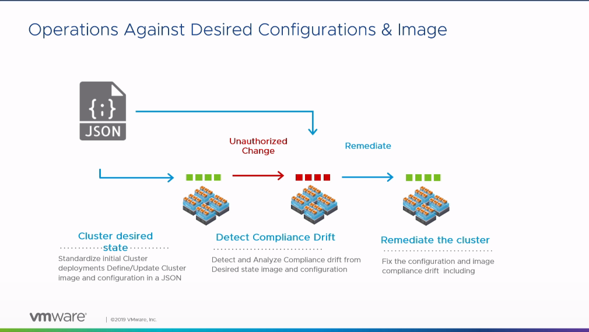
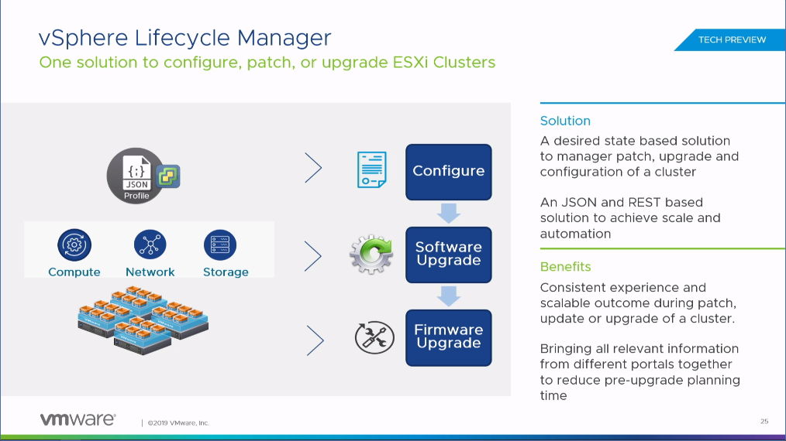
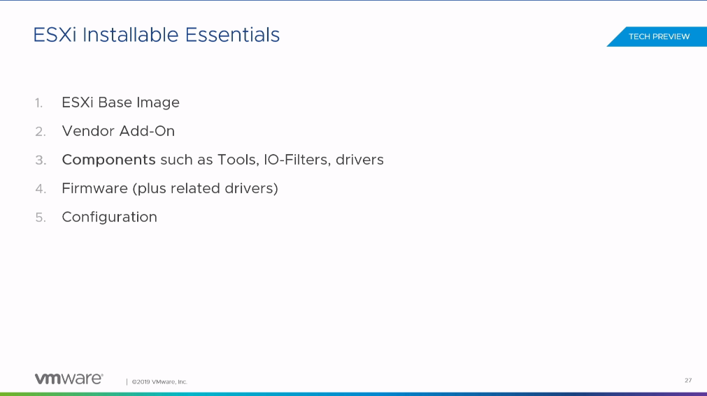
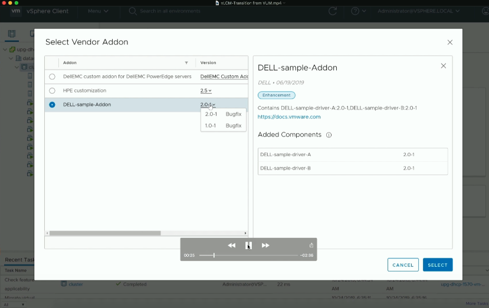
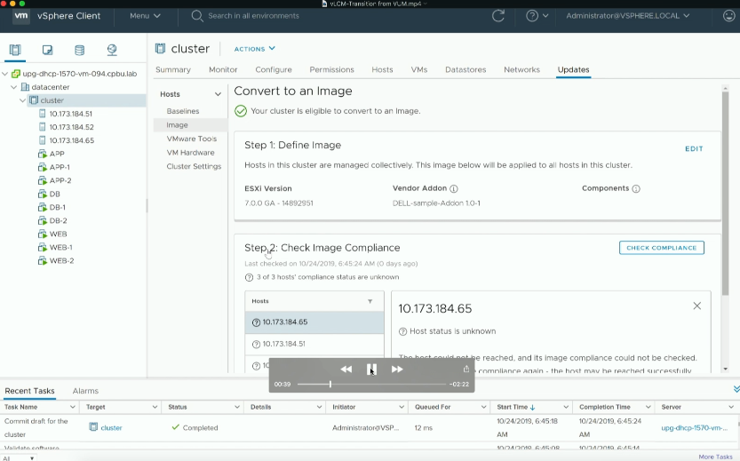
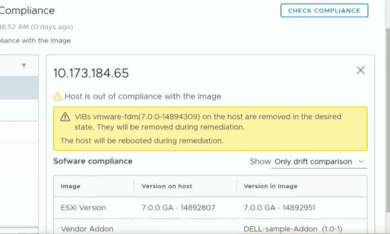
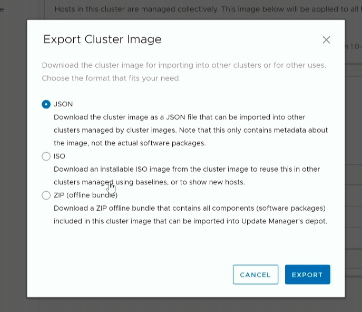
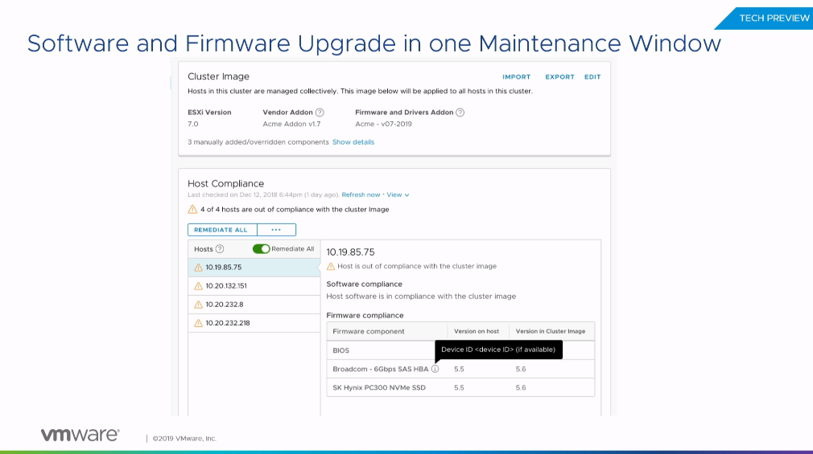
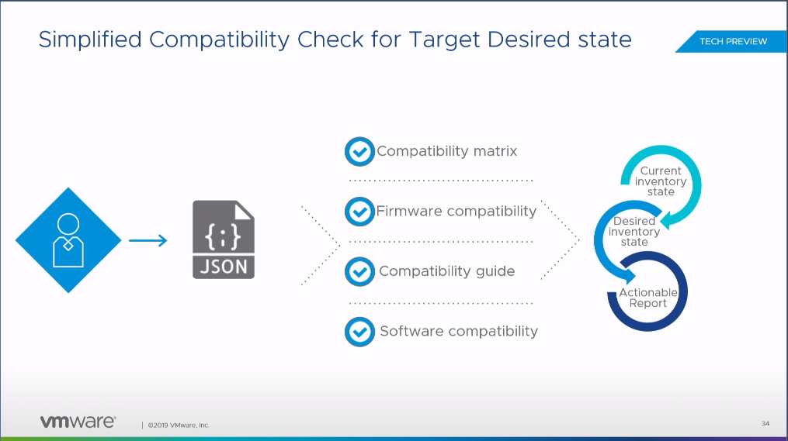

VMworld 2019 Europe でセッションがあったvSphere Lifecycle Manager （vLCM）を紹介する。

[https://videos.vmworld.com/global/2019/videoplayer/29951](https://videos.vmworld.com/global/2019/videoplayer/29951)

vSphere Update Manager （VUM） の後継のような位置づけの機能で、一言で言うと、クラスタに対しあるべき状態を宣言し、その状態と剥離があれば、修正（Remediation）するという、k8s のような最近流行り（？）のアップデートモデルである。クラスタごとに様々なコンポーネントのバージョンがJSON ファイルに記述され、それをクラスタに対しアタッチすることで、ズレがあれば修正する、といった感じ。

重要なのはここからで、現在のカスタムISO の仕組みが変わり、複数の概念の組み合わせに代わるらしい。

ESXi Base Image とは、従来の様にVMware が提供するイメージである。iso であったり、オフラインバンドルといった、VMware 純正の提供形態を指す。ここに、例えばHPE の特定のサーバー用のDriver が入ったりはしない。

Vender Add-On はBase Image に対するOEM ベンダーによるCustomization であり、従来はVIB を組み込んでOEM がカスタムISO としてまるっと顧客提供されていたものが分解され、Add-On として個別に提供される。

Component とは、VIB にとってかわるものである。VIB は管理の面で複雑であり、例えば機能A を使用するために、ユーザーは多くのVIB をインストールする必要がある（オフラインバンドルという形でまるっとインストールも可能）。そこで、機能A を使用するために定義される論理的な境界を設け、これをComponent と呼ぶ。機能A とComponent は結びつくため、ユーザーとしてはVIB よりも直感的に扱えそうである。ただし、オフラインバンドルとの差分がセッションを聴く限りでは不明。

Firmware はその名の通りだが、これもJSON で定義するあるべき状態に含まれる。

Configuration もその名の通りで、従来ではホストプロファイルがおそらく近い概念と思う。

デモ画面を見ると、クラスタで望ましいESXi のバージョンとAdd-on を選択し、そことホストのイメージにズレがあるようであれば、画像の様に警告が出る。その場合、Remediation をすることで、例えばESXiのバージョンを上げることができる。ここの仕組みはVUM と変わっていないようで、いわゆる無停止でのローリングアップデートが可能。

望ましい状態にしたうえで、それをJSON、ISO、ZIP 形式でExport できる。そうすることによって、vCenter やクラスタを跨いだRemediation が可能。複数のクラスタを構成している場合は、この仕組みを用いてすべて共通の状態にすることが可能。インターネットに接続することでイメージを取ってこれるみたいな話もしていたが、vCenter とインターネット接続が必須かどうかは不明。

ここからが面白いところで、将来的に、ファームウェアやドライバもこのvLCM の仕組みに乗せていく。この宣言的モデルを使用するにあたっては、現在の状態とあるべき状態両方を正しく判断する必要があり、現在の状態に関してはESXi 側で良しなにできそうなものの、あるべき状態に関しては、少なくともローカル環境に閉じた状態で定義することはできない。そこで、VMware のCompatibility Guide を用いて、そこを調べるらしい。そうなると色々疑問が出てくるが（例えばDriver のバージョンをOEM がSecurity Issue で上げて、ESXi と互換性があるよ、としても、それをどのようにvCenter に伝えるのか）、まだまだロードマップということで、今後に期待である。しかしながらOEM 各社もこの対応で結構苦労しそうな気もする。
