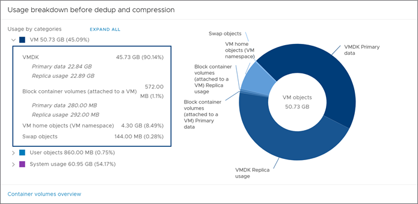
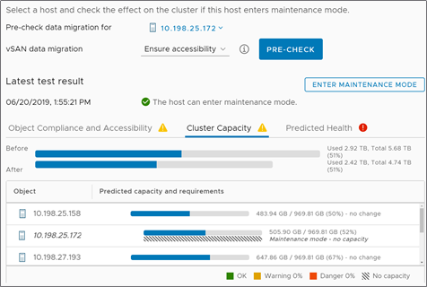
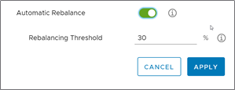
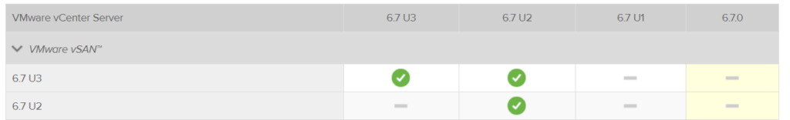

[前回の続き。](https://blog.vpantry.net/posts/vsan-67u3-k8s/)

### キャパシティビューの改善

レプリカのサイズや、コンテナボリュームのサイズも含めたvSAN ディスク使用量を分かりやすい円グラフとして表示できるようになった。こうして見ると、レプリカの方が若干サイズが大きいのが少し気になる。

また、この画像にはないが、同じキャパシティモニタリングの画面で、Usable Capacity Analysis という画面が存在する。ここでは、対象のストレージポリシーに応じて、残り実際にvSAN ストレージとして使用できる量を表示する。例えば、残り100GB のvSAN データストアがあり、vSAN Default Storage Policy を選択すれば、FTT=1 だから、実際は50GB 分しか使えないよ、と言った感じになる。

### 再同期のモニタリングの改善

再同期の計算がより正確になり、どのような理由で再同期によるデータの移行が走っているか、例えばリバランスか？メンテナンスモードにデータの移行ありで入れた場合か？などを確認できるようになった。

### メンテナンスモードのシミュレーション

あるホストをメンテナンスモードにするときに、どのような影響があるのかをシミュレーションする機能が追加された。もともとホストがメンテナンスモードに入る際に、事前にそれが可能かを内部的にチェックしていたが、その機能がGUI で実装された形になる。メンテナンスモードに入れた際、vSAN 容量がどれほど減るのか、オブジェクトのポリシー順守状態はどうなるのかを事前に確認できる。特に、どのオブジェクトがメンテナンスモードの影響を受けるかが簡単にわかるのも嬉しい。

### ディスクフォーマット変換の事前チェック

クラスタで有効化する暗号化や重複排除といった機能を有効化する前に、ディスクフォーマット変換が行われているらしいが、それの事前チェックができるようになった。

### 再同期のサスペンド

再同期中に、コンポーネントの行き先のディスクグループの容量があるしきい値を超えた時に、再同期を一旦止める機能。ディスクグループがフルになることは中々ないかとは思われるが、逆に今までできていなかったのか…。

### 手動リバランス（30％ルール）の自動化

80% を超えると自動的にリバランスが走る機能、ではなく、ディスクの容量差が30% を超えた際にアラートが出て手動でリバランスさせることができる機能があるが、それを自動化でき、かつGUI からその30% というしきい値を調整できる。

### ポリシー変更時の一時的な容量増加抑制

従来ではストレージポリシーを変更した際、先に変更後のストレージポリシーを割り当てたコンポーネントを構成した後、前のコンポーネントを削除するという動作で、ストレージポリシー変更に伴う一時的な容量増加が発生していたが、この動作が変更になった。具体的には、複数回に分けて、徐々にストレージポリシー変更後のコンポーネントを作成しているとのこと。これでスラックスペースの推奨値が緩くなれば嬉しいところ。

### VUM の機能改善

ESXi のバージョンそのままでパッチのみ当てられるようになった。 逆に今までできていなかったのか…。

### vCenter Server との互換性の制限が緩く

従来はvCenter Server とvSAN （ESXi）のバージョンは同一である必要があったが、これが（vSAN 有効化をした）ESXi のバージョンがvCenter Server に先行しても良いことになった。ただし、あくまでも緊急パッチ等の対応で、基本的には同じバージョンの方が良いと思う。

### WSFC ネイティブサポート

SCSI-3 PR 対応により、vSAN 上でWSFC を使用する場合RDM が不要になった。この機能はVMC on AWS で従来から提供されていた機能になる。インパクトはそれなりにある機能と思われるので、検証してみたい。

### iSCSI LUN の無停止での容量変更

そのまま。 逆に今までできていなかったのか…。

### 重複排除有効化時のデステージのスループット向上

重複排除有効時のみのパフォーマンス改善ということに注意。

### 再同期のパフォーマンス向上

Parallel Resync という機能で、再同期を並列で実行できるらしい。今回個人的に一番気になっている機能だが、どの程度パフォーマンスが向上したか、公式で資料等を出してほしいところ。

### vsantop

esxtop のvSAN 版。パフォーマンス統計データの収集を無効化している時でも実施可能。なんか色々見られるはずだが、どうも自分の環境ではいい感じに見ることができない…要確認。

### まとめ

vSAN はソフトウェアであることから、その進化も非常に速い。特に、U2 のアップデートがBug Fix だけだったこともあり、今回のアップデート内容は盛りだくさんであった。vmworld でもどのようなロードマップが出るか気になるところ。
