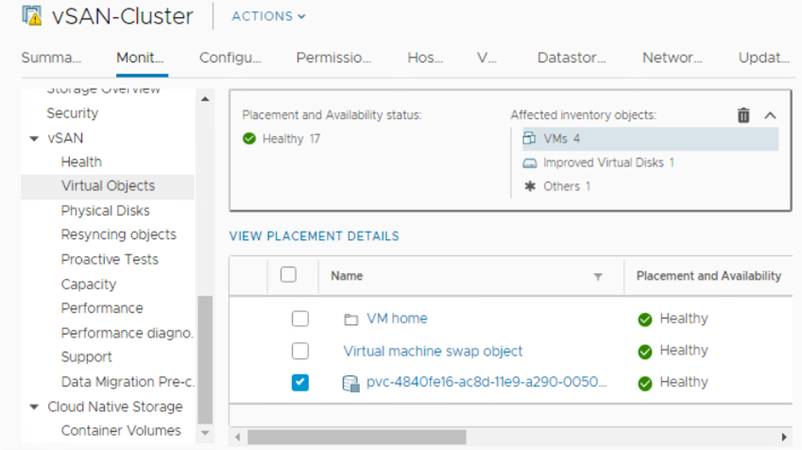
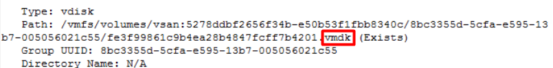
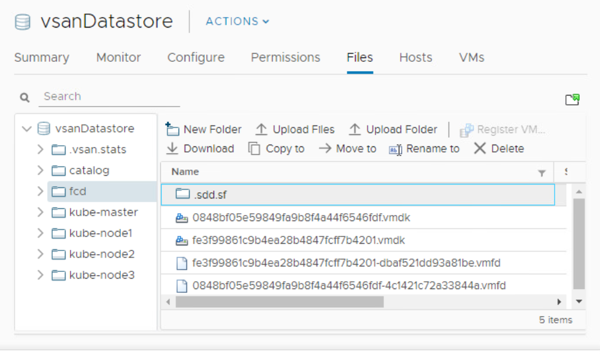

前回に引き続き、[vSAN 6.7U3 とvSAN Ent+ エディションのアナウンス](https://blogs.vmware.com/virtualblocks/2019/08/13/vsan-6-7-u3-enterprise-plus/)があったため、こちらを紹介する。

### vSAN Enterprise Plus エディション

これまで、vSAN にはStandard、Advanced、Enterprise エディションが存在したが、新たに上位エディションであるEnterprise Plus が登場した。これまでのEnterprise の機能に加え、vRealize Operations Advanced が付属するとのこと。vRealize Operations のライセンスについては[コチラ](https://www.vmware.com/jp/products/vrealize-operations.html)を参照。

vSAN Advanced にvRealize Operations の一部画面をvCenter Server から見ることができる機能が付属するが、その上位版にあたるイメージか。最近のvRealize Operations はカスタムダッシュボードが随分使いやすくなったので、Advanced は嬉しいところ。しかしながら、vSAN Enterprise のストレッチクラスタや暗号化の機能はユーザーを選ぶので、vSAN Standard と個別に買った方が良い場合が多いかもしれない。

### k8s 連携

vSphere に Container Storage Interface (CSI)  が組み込まれ、 k8s におけるPV（Persistent Volume）/ PVC（Persistent Volume Claims）と連携できるようになった。

PV/PVC についてはコチラの全体の関係図が分かりやすい。[https://cstoku.dev/posts/2018/k8sdojo-12/](https://cstoku.dev/posts/2018/k8sdojo-12/)

ざっくりいうと、PV とはPod に割り当てるストレージで、このストレージが裏側で何で実現されているか、例えばAWS のEBS であったりAuzre のAzrueFIle であるかは関係なく、それらをCSI という各ベンダーが用意するインターフェースを通して抽象化することで、k8s の永続ボリュームとして提供する機能がPV である。重要なのは、PV を意識するのは管理者側であり、Pod を作成するユーザーは必要な時に必要な分だけストレージを貰えればいいわけで、その要求そのものをk8s ではPVC というリソースで実現する。

コチラがPVC のyaml ファイルの例である。

```
apiVersion: v1
kind: PersistentVolumeClaim
metadata:
  name: myclaim
spec:
  accessModes:
    - ReadWriteOnce
  volumeMode: Filesystem
  resources:
    requests:
      storage: 8Gi
  storageClassName: slow
  selector:
    matchLabels:
      release: "stable"
    matchExpressions:
      - {key: environment, operator: In, values: [dev]}
```

[https://kubernetes.io/docs/concepts/storage/persistent-volumes/#persistentvolumeclaims](https://kubernetes.io/docs/concepts/storage/persistent-volumes/#persistentvolumeclaims)

このようなyaml ファイルを用いて、ユーザーはこの例であれば8GiB のストレージをPod に対し割り当てるわけだ。

ここで注目するべきところは「storageClassName: slow」の部分である。管理者が事前に作成したStorage Class に基づいて、払い出すストレージのサービスレベルを選択する（この例だと管理者が定義したSlow という名前のStorage Class をもつストレージをユーザーはPod にアサインする）。

このStorage Class がvSAN のストレージポリシーと連携することで、Pod を使用するユーザーがPVC を発行し、事前に定義済みのストレージポリシーをアサインしたvSAN ボリュームがアサインされる機能が、今回のアップデート内容である。

ここで疑問なのは、ストレージポリシーを割り当てる対象である。Pod はコンテナなので仮想マシンの中に複数存在しうるわけだが、vSAN のストレージポリシーは仮想マシン（のオブジェクト）に割り当てるため、割り当ての粒度が異なる。Pod にアサインされ、ストレージポリシーが割り当てられるvSAN ボリュームとは何か？

その正体は仮想マシンと独立したvmdk ファイルである。VMware はこれをFCD（First Class Disk）と呼んでいる。

PVC で払い出したボリュームはvSAN のオブジェクトの1 つとして見える。

<figure>



<figcaption>

pvc-xx というのがk8s ボリュームに該当する

</figcaption>

</figure>

_esxcli vsan debug object list_ コマンドでそのオブジェクトを見てみると、途中は省略するが、下図のようにvmdk として見えてくる。



vSAN フォルダを見てみると、fcd というフォルダの中に、該当する仮想ディスクが見える。vmx もなしに！



ちなみに一緒に入っているvmfd というファイル、中身は見られなかったが、調べてみると何らかのメタデータのよう。

### まとめ

[そもそもDocker 自体の普及率が10% を下回っている日本で](https://japan.zdnet.com/article/35139430/)、k8s 連携の機能の需要があるとは到底思えないが、この機能を実現している裏側の仕組みが非常に面白い感じなので、それだけで十分である。k8s 連携だけで結構な分量になってしまったため、次回は残りのアップデートを紹介する。
