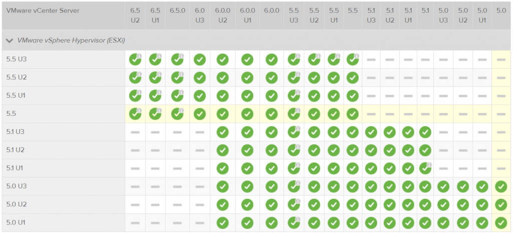
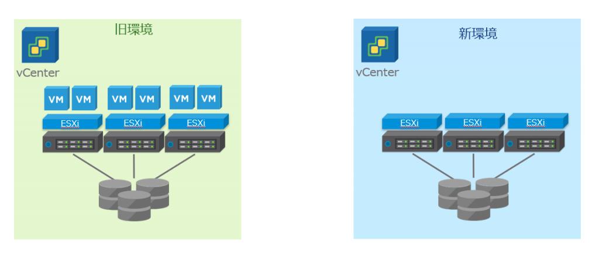
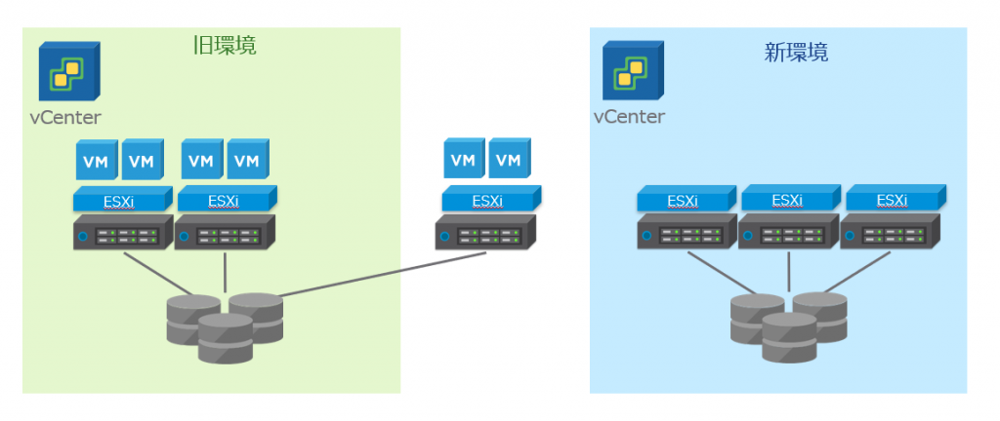
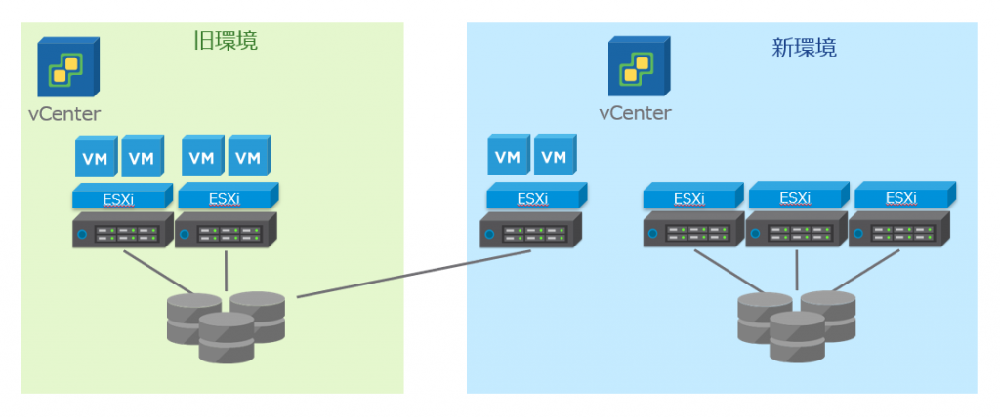
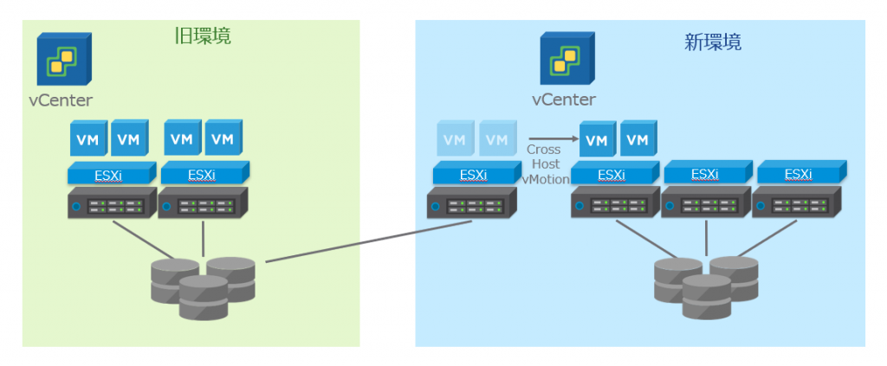
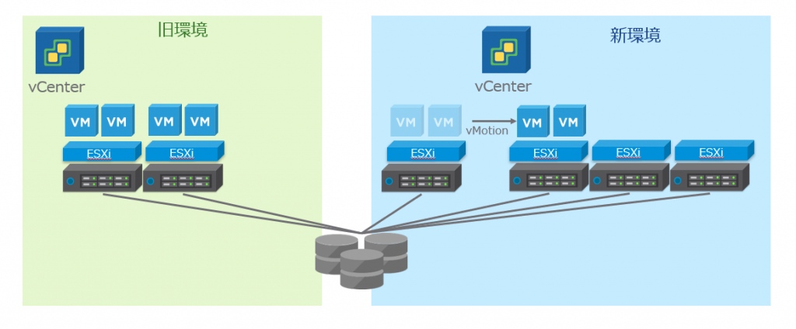

## はじめに

vSphere 5.0/5.1 はTechnical Guidance が、vSphere 5.5 はGeneral Support が、それぞれ2018 年で終了した。このようなサポート終了に伴う5.x 環境からの移行・HW 更改案件は今後ますます増えていくと思われる。

多くの方は、ESXi ホスト上で現在稼働させている仮想マシンに対して、なるべくダウンタイムを最小限にしながら、 可能であれば、無停止で 6.x の環境にアップデートしたいと考えるはずである。

はじめに断っておくが、**必ず無停止を保証するアップデート方法は存在しない**と考えておくべきである（いきなりタイトルと矛盾してしまうが……）。得てして、アップデートは事前の計画通りに実施されない。アクシデントはつきものである。

そのことを理解したうえで、本記事ではvMotion とStorage vMotion の同時実行（以下Cross Host vMotion と呼ぶ）を活用した、 仮想マシンのダウンタイムを最小化する旧環境からの移行の方法を紹介する。私の方で検証も実施しており、実際にエンドユーザー環境での実績も知っているが、私が探す限りでは、VMware の公式ドキュメントには、アップデートの方法としては紹介されていない。ただし、広く知られた方法でもあり、Supportable な方法を組み合わせて実施するため、その点はご安心いただきたい。

**繰り返しになるが、必ず無停止で移行を実施できる保証はしない。本記事に従って実際に無停止で移行できなくても、何ら保証はしないということだけ、先に述べておく。**

## アップデートの基本

アップデートの順番をおさらいする。

1. vCenter Server
2. ESXi
3. VMware Tools
4. 仮想マシンハードウェアバージョン

このうち、3 と4 については必要に応じて実施すればよいため、今回は省略する。また、3 と4 のアップデートに関しては、再起動が伴うことに注意されたい。

**vCenter Server をアップデートする際にまず初めに注意しなければならないのは、ESXi との互換性である。**例えば、vCenter Server 6.7 はESXi 5.5 を接続できない。互換性に注意して、現在のESXi のバージョンに必ず接続可能な最新のバージョンにvCenter Server をアップデートする。これは、VMware 社の[VMware Product Interoperability Matrices](https://www.vmware.com/resources/compatibility/sim/interop_matrix.php#interop) を使用して確認する。

<figure>

<figcaption>

  
[https://www.vmware.com/resources/compatibility/sim/interop\_matrix.php#interop&2=&1=795,620,577,507,1032,796,559,441,253,1033,500,391,251,141](https://www.vmware.com/resources/compatibility/sim/interop_matrix.php#interop&2=&1=795,620,577,507,1032,796,559,441,253,1033,500,391,251,141) （2019/5/12 閲覧）

</figcaption>

</figure>

これによると、ESXi 5.0/5.1 はvCenter Server 6.0.0U2、ESXi 5.5 はvCenter Server 6.5U2 まで1 回でアップデートできることになる。それ以上の、例えばESXi 5.5 から6.7 に上げるためには、一度vCenter Server を6.5U2 に上げて、ESXi を6.5U2 等に上げた後で、6.7 へアップデートするといったように、アップデートが二段階に分かれることに注意する。

なお、vSphere Update Manager やSSO Server の外部デプロイ構成については、対象となる環境が比較的少ないと思われるため、今回は言及しない。詳細はアップグレードガイドを参照してほしい。  
[https://docs.vmware.com/jp/VMware-vSphere/6.5/com.vmware.vsphere.upgrade.doc/GUID-78B9F91E-36BE-4B76-B214-BF8229576C30.html](https://docs.vmware.com/jp/VMware-vSphere/6.5/com.vmware.vsphere.upgrade.doc/GUID-78B9F91E-36BE-4B76-B214-BF8229576C30.html)

## Cross Host vMotion を利用したアップデート方法について

正式名称が安定しないことで有名なCross Host vMotion だが、今回はこちらを利用した環境アップデート（というよりは移行）を紹介する。

これは、簡単に言うと、**新しいvSphere 環境を作成し、そこのvCenter Server に旧環境を接続して、Cross Host vMotion をして無停止で仮想マシンを新環境に移行し、旧環境を空にしたうえでアップデートを行う**、といったものである。vCenter Server を新規インストールするため、アラームや権限等vCenter Server で設定していた情報を引き継ぐことはできないが、Windows 版vCenter Server からアプライアンス版に移行する時や、ハードウェア更改と併せてアップデートを実施したい時に有効な方法である。

まず、新しいvCenter Server （Windows 版は6.7 で廃止されるためアプライアンス版を推奨）をデプロイした、新環境を用意する。新環境のESXi は、特に理由がなければ、アップデートではなく新しいバージョンを新規インストールしておく方が、何かと都合がよいかもしれない。

<figure>

<figcaption>

アップデート前の環境を旧環境、アップデートするバージョンのvSphere 環境を新環境とする

</figcaption>

</figure>

旧環境のESXi の一つを、旧環境のvCenter Server から切断する。

新環境のvCenter Server に旧環境のESXi を接続する。

<figure>

<figcaption>

新環境のvCenter Server では新旧2種類のバージョンのESXi が接続されていることになる

</figcaption>

</figure>

Cross Host vMotion を実行し、コンピュートリソースとストレージリソースを同時に新環境へ移行する。

旧環境の仮想マシンがなくなるまで、これを順次繰り返す。既存のハードウェアをそのまま新環境でも使いたい場合は、新環境に接続したESXi を新しいバージョンに再インストールするなどして、新環境のバージョンに合わせる。移行用のリソースが足りない場合は、Cross Host vMotion → ESXi 新規インストールを繰り返して、徐々に旧環境から移行していく。

既存の共有ストレージを新環境でも使用する場合は、ストレージリソースを移行する必要はないため、Cross Host vMotion ではなくvMotion でよい。移行が早く済む。

以上が、Cross Host vMotion を利用した新環境へのおおまかな移行方法である。手順的にはシンプルであるが、いくつか注意点がある。うっかりすると移行ができない、ということも普通に起こりうるため、事前の確認を推奨する（なお、自分が経験した事象ベースに解説しているため、注意点を全て網羅しているわけではない。そこは勘弁してほしい）。

## 移行時の注意点

#### 旧環境の仮想マシンハードウェアバージョンが7 または8 の場合

> 仮想ハードウェア バージョン 7/8 で構成した仮想マシンを新しい世代の CPU を搭載した ESXi ホストに移行すると次のエラーで失敗する：仮想マシンには、ターゲット ホスト上でサポートされていない、あるいは無効化されているハードウェア機能が必要です (The virtual machine requires hardware features that are unsupported or disabled on the target host) (2109065)  
> [https://kb.vmware.com/s/article/2109065?lang=ja](https://kb.vmware.com/s/article/2109065?lang=ja)

kb の内容を要約すると、仮想マシンハードウェアバージョンが7 または8 の場合、vMotion 時にCPU 世代を厳密に確認するため、CPU 世代が異なる新環境へのvMotion がブロックされてしまうという事象である。解決策としては、次のようにkb では説明されている。

> この問題を解決するには、ソースまたはターゲットのいずれかのホストを EVC 対応クラスタに配置する必要があります。ソースまたはターゲットのホストを EVC 対応クラスタに配置することができない場合は、仮想マシン ハードウェア バージョンをアップグレードすることで、この問題を解決できる可能性があります。

要するに、旧環境または新環境でEVC を有効化するか、ハードウェアバージョンをアップデートしなさいよ、ということだが、旧環境ではそもそもvCenter Server からvMotion 元となるESXi ホストを切断するため、ホストのEVC は無効化される。したがって、**新環境でEVC を有効化しない場合は、（VMware Tools と）仮想マシンハードウェアバージョンをアップデートしなければならず、仮想マシンの再起動が必須になる。ゆえに、無停止での移行が不可となる。**

旧環境が5.x だと大抵引っかかるはずである。旧環境と新環境のCPU 世代が異なる場合、移行前に必ず本kb をチェックしてほしい。

#### 旧環境でEVC を有効化していた場合

先の話にも通ずるところがあるが、旧環境のvSphere クラスタにEVC を設定している場合がある。この場合、vCenter Server からESXi ホストを切断する関係上、EVC クラスタから外れてしまい、EVC が無効化される。

結論から言うと、移行方法については、旧環境でEVC を有効化してようがしてまいが変わらない。しかしながら、それを理解するためには、EVC の基本を理解する必要があるため、念のため解説する。

EVC とは、仮想マシンが使用できるCPU 命令セットをクラスタレベルでマスクする、vSphere の機能である。これにより、EVC クラスタ内で、CPU 世代に関係なく、無停止でのvMotion が可能となる（気軽にvMotion をさせるための機能と理解してもらってよい）。新しい物理サーバーを既存のクラスタに追加する可能性がある場合、クラスタ内で新旧異なる世代のCPU が存在してしまう場合があり、この場合は事前にEVC を有効化しておかなければならない。

**EVC が有効化されるのは、すなわち仮想マシンが使用できるCPU 命令セットが決定されるのは、仮想マシンのパワーオン時である。**

**したがって、仮想マシンがパワーオフされない限り、EVC による命令セットのマスクは実行され続けることに注意する。**

また、**旧世代のEVC ベースラインで設定したホスト上の仮想マシンの、新世代のCPU を持つホストへのvMotion は、その新しいホストがEVC クラスタに存在しない場合でも可能である（新→旧は不可）。**例えばSandy Bridge （旧）でEVC ベースラインが設定されていた場合、その仮想マシンはSandy Bridge の命令セットで稼働している。移行するホストのCPU 世代がIvy Bridge（新）の場合、Sandy Bridge で使用できる命令セットはIvy Bridge でも使用できるため、vMotion が可能となる。IvyBridge からSandy Bridge への移行は、本来仮想マシンとして使えるはずの命令セットが使えなくなる場合があるため、vMotion が不可となるわけである。

これらのEVC の基本をベースに、もう一度Cross Host vMotion での移行を考えてみる。

まず、EVC を有効化したクラスタから、旧環境のESXi ホストが切断される。この時、**ホストとしてはEVC が無効化されるが、仮想マシンとしてはEVC の状態は維持される。**パワーオフ&パワーオンされて初めて、EVC が無効化された状態の、素のホストのCPU 命令セットを使えるようになるのである。

次に、新環境へのCross Host vMotion であるが、これも、新環境の方でCPU 世代が古かったり、古いベースラインで設定されていない限りは、成功する。移行するEVC 状態が有効な仮想マシンが使える命令セットが、新しい環境でもすべて使用できるためである。

以上から、 旧環境でEVC を有効化してようがしてまいが、移行については何ら変わることなく実施できるということになる。

なお、今回ご紹介したEVC の基本は、こちらのkb にかなり詳細にまとまっているため、必ず事前に確認してほしい。  
[https://kb.vmware.com/s/article/1005764?lang=ja](https://kb.vmware.com/s/article/1005764?lang=ja)

また、このような移行を検証する場合、Nested ESXi での検証になる場合が多いが、EVC をNested のvSphere 5.x でテストする場合は、下記ブログのような操作が必要になるため注意。  
[https://www.virtuallyghetto.com/2012/02/how-to-configure-nested-esxi-5-to.html](https://www.virtuallyghetto.com/2012/02/how-to-configure-nested-esxi-5-to.html)

### 仮想マシンが分散スイッチに接続されている場合

旧環境で設定した分散スイッチの情報が新環境では引き継がれないため、標準スイッチに接続する必要がある。その時はネットワークラベル（ポートグループ名）が新旧同じであることを確認する。

## 最後に

**必ず無停止を保証するアップデート方法は存在しない。**本件とは全く無関係の事象が発生してしまうこともある。アップデートにアクシデントはつきものである。

しかしながら、Cross Host vMotion を有効に活用することで、迅速にアップデートを完了することができる場合がある。様々な新機能の追加（例えばvSphere 6.7 ではクラスタではなく仮想マシン単位のEVC が可能）、バグへの対応など、アップデートはリスクはありつつも、リターンも非常に大きいため、定期的に実施することが望ましい。 本記事がアップデートの一助になれば幸いである。
