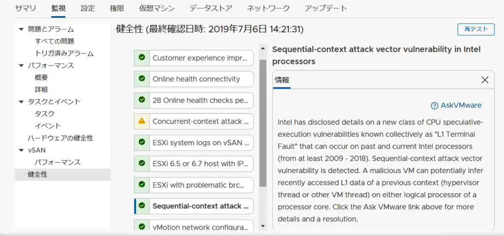

タイトルの通り。昨年にリリースされた6.7 U1 よりvSphere Client HTML5 版でこれまでのFlash 版の機能が全てサポートされたと謳っているが、これは誤り。

_Many of you have been asking when will the vSphere Client become fully featured. We are targeting to deliver to you a fully featured version of the vSphere Client later this year, in Fall 2018._

[https://blogs.vmware.com/vsphere/2018/05/fully-featured-html5-based-vsphere-client-coming-fall-2018.html](https://blogs.vmware.com/vsphere/2018/05/fully-featured-html5-based-vsphere-client-coming-fall-2018.html)

実際、[クイックスタート](https://storagehub.vmware.com/t/vmware-vsan/vsan-6-7-update-1-technical-overview/cluster-quickstart/)やvSAN ヘルスチェック（スクリーンショット参照）など、機能エンハンスがあり、基本的に忌々しきFlash 版を使う必要はない。

<figure>

<figcaption>

HTML5 版で非常に見やすくなったvSAN 健全性チェック。  
AskVMware でアラートがどのような意味かを確認できるkb に飛ぶことができる。

</figcaption>

</figure>

しかしながら、OVF テンプレートデプロイ時は、 Flash 版vSphere Web Client の使用を推奨する。

例えばvSphere Replication 8.1 のドキュメントには下記のような記載がある。

_HTML5 ベースの vSphere Client を使用して OVF 仮想アプライアンスをデプロイする場合、デプロイは成功しますが、 vSphere Replication は起動に失敗します。_

[https://docs.vmware.com/jp/vSphere-Replication/8.1/com.vmware.vsphere.replication-admin.doc/GUID-E654F2D8-7D56-4A81-9568-E85172A7022D.html](https://docs.vmware.com/jp/vSphere-Replication/8.1/com.vmware.vsphere.replication-admin.doc/GUID-E654F2D8-7D56-4A81-9568-E85172A7022D.html)

他にも、自分が確認したものだと、UAG 3.5 のデプロイ時、2NIC 以上の構成ができない。UI として1NIC しか選べないのである。

ということで、HTML5 版vSphere Client を使用する時には注意が必要という情報共有でした。
