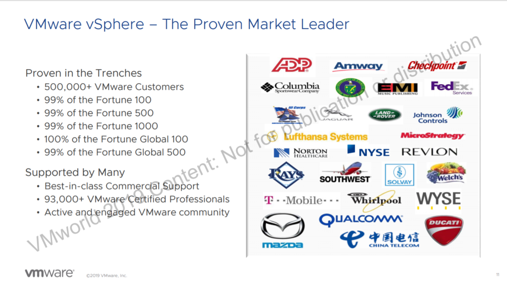
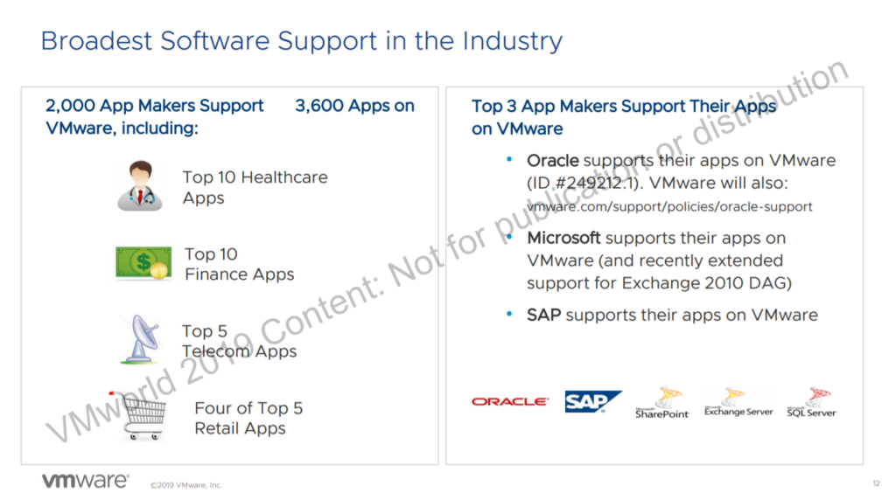

見つけたので共有する。vSAN やNSX は見かけるが、vSphere は地味に最近見なかったので。しかしながら改めて恐ろしい数であると感じた。

引用元はこちら  
[https://cms.vmworldonline.com/event\_data/12/session\_notes/HBI2948BU.pdf](https://cms.vmworldonline.com/event_data/12/session_notes/HBI2948BU.pdf)
