### はじめに

vSphere HA（High Availability）とは、vSphere 環境の可用性を高める機能の一つであり、共有ストレージを使用する大きなメリットでもある。公式ドキュメントやブログ等において、既に多くの解説がなされている機能ではあるものの、日本語で詳細に踏み込んだ記事も少なく、基本的な機能でありながら難しい部分も含むため、本記事を書くことにした。

### 機能概要

vSphere HA は、簡単に言うと、ESXi ホストの障害発生時に、**そのホスト上で稼働していた仮想マシンを別のホスト上に再起動させる機能である。**  
これにより、管理者はESXi ホスト障害の際に、手動でのオペレーションをすることなく、かつ仮想マシンのダウンタイムを最小化することができる。仮想マシンの再起動中は当然ながらサービスは停止するものの、自動かつ最速でサービスを復旧させてくれるので、管理者にとってもユーザーにとってもメリットのある非常に強力な機能である。なお、ライセンスはEssential+ から使用可能である。

vSphere HA はクラスタで有効化する。クラスタとは、ESXi ホストをグルーピングしたもので、ここでvSAN やDRS といった各種機能をオンにすることもできる。

<figure>

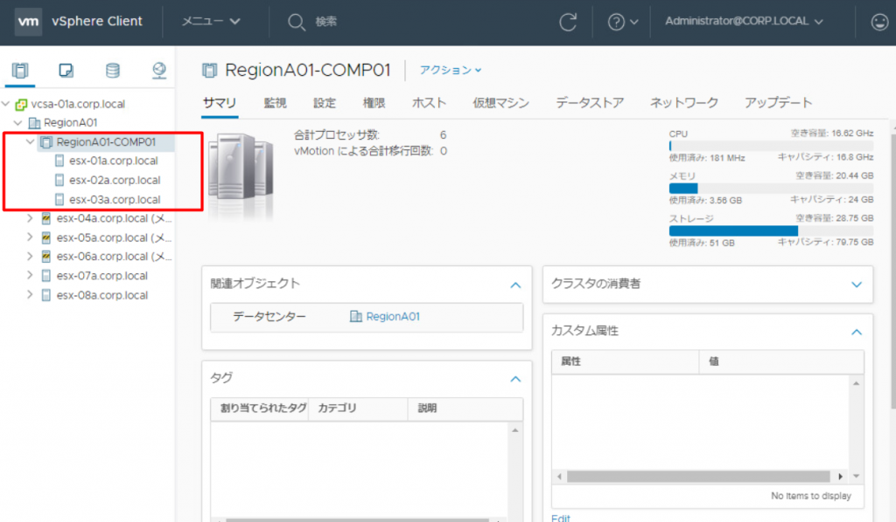

<figcaption>

スクリーンショットでは、クラスタにESXi ホストが3台含まれている

</figcaption>

</figure>

設定自体は、HA を有効化するだけであれば、下記の3 ステップに従うだけなので、非常にシンプルである（なお、UI はvSphere 6.7 をベースにしている）。

1. HA を有効化したいクラスタを選択
2. 設定→vSphere の可用性→編集を選択
3. vSphere HA を有効化し、OK を選択

<figure>

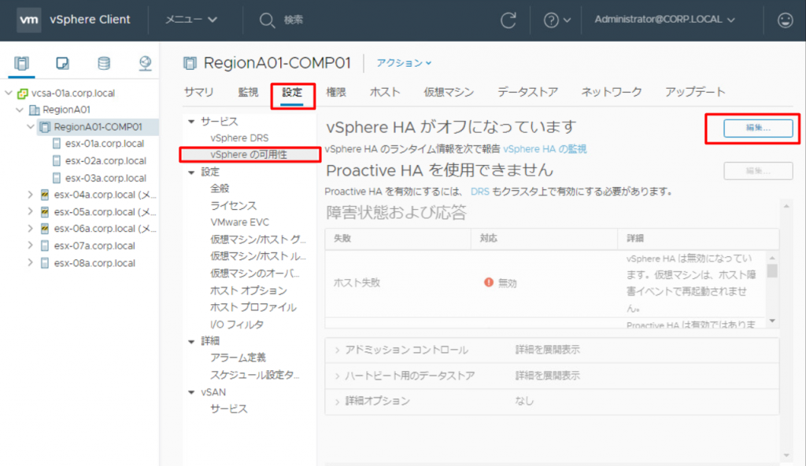

<figcaption>

クラスタを選択し、設定→vSphere の可用性→編集をクリック  

</figcaption>

</figure>

<figure>

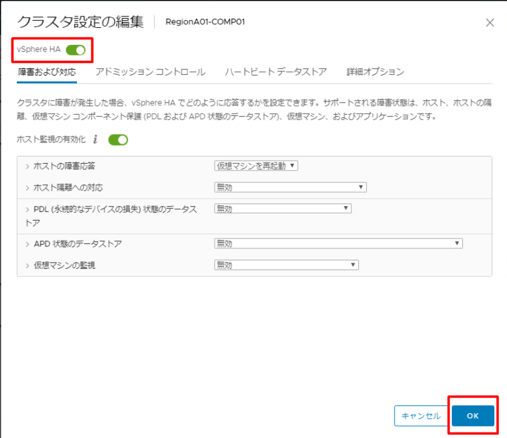

<figcaption>

vSphere HA を緑にチェックし、OKを選択

</figcaption>

</figure>

これで、vSphere HA の設定は（一応）完了。これで、仮想マシンの可用性を簡単に高めることができた。

### 機能詳細

ここからは、HA 設定時の重要項目である「ホスト隔離への対応」「ハートビートデータストア」について説明するが、その前にvSphere HA の詳細アーキテクチャについて解説したい。

#### HA の各コンポーネント

まず、vSphere HA における主要な登場人物は三つ存在する。

1. FDM（Fault Domain Manager ）
2. hostd
3. vCenter Server

<figure>

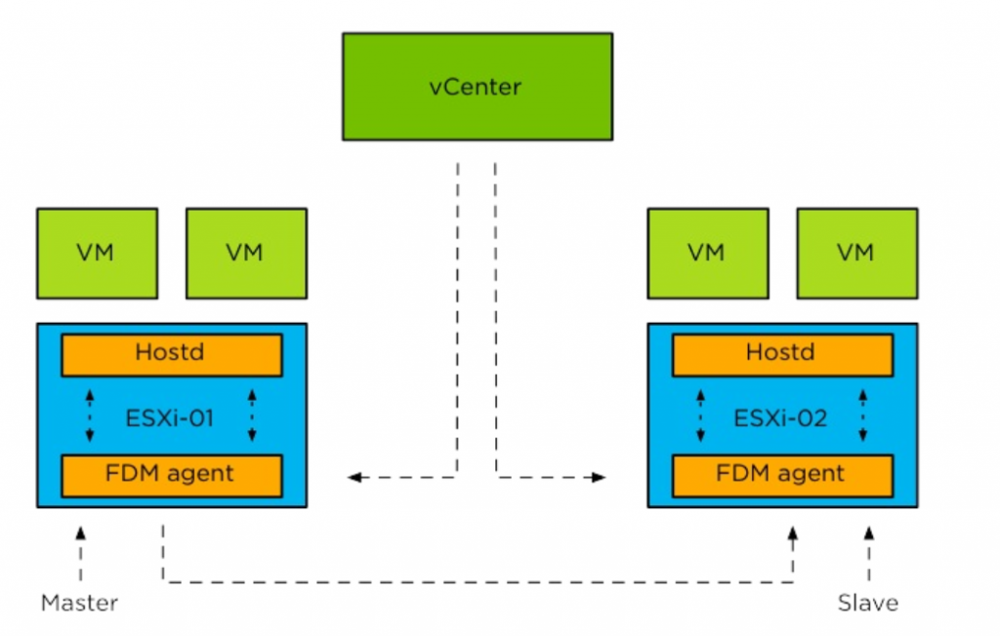

<figcaption>

  
vSphere 6.x HA Deepdive P.13 より引用

</figcaption>

</figure>

このうち、HA において最も重要なのがFDM であり、仮想マシン配置の決定やハートビートといったHA の機能の大部分を管理している。FDM はESXi 上で動くプロセスであるが、たとえFDM が死んでしまったとしても、watchdog プロセスにより監視されており、自動的に再起動がされる仕組みである。

hostd は、もはやお馴染みかもしれないが、実際の仮想マシン操作をするにあたってなくてはならないプロセスである。FDM はhostd のAPI を叩き、HA における各種機能を実現している。興味深いのは、FDM はhostd と通信し、vpxa-vpxd、すなわちvCenter Server を介さないという点である。したがって、**仮にvCenter Server が死んでいたとしても、HA における仮想マシン再起動はvCenter Server のプロセスを使用しないため、HA は動作し続ける。また、vCenter Server が稼働するESXi ホストに障害が起こったとしても、vCenter Server それ自身もHA により別のホストで再起動がされる。**

vCenter Server は、先述したように、実際のHA の動作に関連はしないものの、各ホストへのFDM 配信など、HA の設定を行う。vCenter Server は複数のESXi ホストを管理できる唯一無二の存在のため、ホスト間での調整が必要な全体的な操作（例えば各ホストへのFDM 配信）を実施するのである。このように、設定自体はvCenter Server が必要だが、その機能についてはESXi ホスト単体で動作する仕組みは、HA 以外にも、例えば分散スイッチやvSAN がある。

#### Master/Slave

HA を有効化したクラスタ上の各ESXi ホストには、Master またはSlave という役割を一つ与えられる。クラスタには必ず一つのMaster が存在し、それ以外の残りのホストはSlave になる（二つ以上Master が存在することは"基本的に"ない）。どのホストがMaster かは、GUI から確認できる。

<figure>

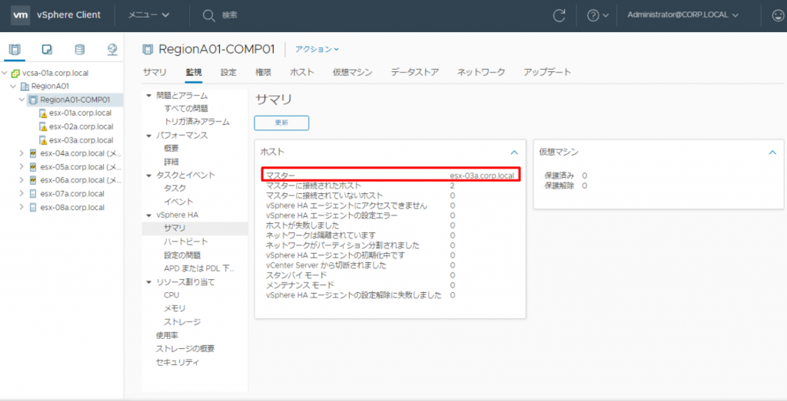

<figcaption>

ホストのサマリからも確認可能

</figcaption>

</figure>

Master の役割はいくつか存在するが、主要なものとして、ハートビートによるSlave ホストの監視や、HA におけるクラスタの健全性などのメタデータを管理する。

一方でSlave は、Master に自身で稼働している仮想マシンの状態を送信する。また、ハートビートがMaster から届かなくなった場合、HA 有効化時と同様に、再びどのホストがMaster になるかを選ぶ。

このように、Master/Slave は互いに互いをハートビートで疎通監視している。つまり、vSphere HA では、Master → Slave とSlave → Master への双方向のハートビートが行われている。

なお、Slave 間での通信は、Master 選出時を除き発生しない。ちなみにMaster 選出の通信は、TCP プロトコルであるネットワークハートビートと異なり、UDP プロトコルとなる。  

#### ハートビート

vSphere HA におけるハートビートには、ネットワークハートビートとデータストアハートビートの2種類が存在する。ネットワークハートビートはこれまで説明してきたように、Master/Slave 間での最も基本的なハートビートであり、各ESXi ホストの障害を検知するために使用される。Master が一定時間Slave からのハートビートを受信できないとき、次にMaster は管理ネットワークを通して、FDM の生死を確認するためにSlave にping を送信する**（これは、隔離アドレスとは関係ないことに注意）**。さらにMaster はSlave の状態をより詳細に判断するために、データストアハートビートを使用する。データストアハートビートは、ホスト毎に作成されるハートビートファイルを更新し、かつその更新時間をチェックすることで実現している。また、パワーオンファイルと呼ばれる、仮想マシンのパワーオン状態が記載されているファイルを用いることで、ネットワークハートビートを使用せずとも、HA に必要な情報、すなわちどの仮想マシンが現在パワーオンで、かつ自身がネットワーク隔離状態にあるかどうかをMaster に伝えることができるのである。

<figure>

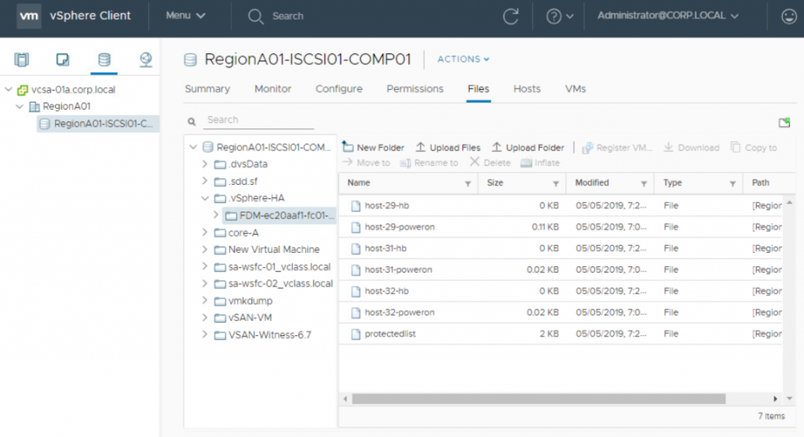

<figcaption>

host-_xx_\-poweron （パワーオンファイル）とhost-_xx_\-hb（ハートビートファイル）  

</figcaption>

</figure>

#### 隔離アドレス

さて、ここまでで、vSphere HA はネットワークハートビートにより基本的な障害状態を確認し、より詳細な状態確認のため、データストアハートビートを使用すると説明した。vSphere HA では、データストアハートビートに加えてもう一つ、隔離アドレスへのping 応答を利用して、ホストの状態を特定するメカニズムが存在する。このメカニズムはシンプルで、ネットワークハートビートが疎通できない場合、隔離アドレスに対してping を送信するというもので、デフォルトでは隔離アドレスは管理ネットワークのデフォルトゲートウェイとなっており、変更したい場合は詳細設定の項目である「das.isolationaddress」で設定できる。

#### 隔離（isolation）と分割（partition）

隔離アドレスを正しく理解するうえで、隔離（isolation）と分割（partition）の違いを説明しなければならない。隔離は、その名の通り、1台のesxi ホストがネットワーク上完全に孤立し、クラスタ上のどのホストともコミュニケーションが取れていない状態のことを指す。分割は、esxi ホストがMaster とは疎通できないものの、他のホストとは疎通できている状態を指す。ネットワークハートビートが切断されたうえで、隔離アドレスに対してping が通らず、かつMaster 選出時の通信が受信できない場合、隔離と判定され、HA 設定時の隔離アドレスの対応に従って仮想マシンを操作する。 逆に、ネットワークハートビートが切断されているが、隔離アドレスに対してping が送信可能で、一つ以上の他のSlave と通信できているのであれば、部分的なネットワーク障害であるとみなされ、分割と判定される。ある一つのesxi ホストが隔離状態にある時、残りの複数のホストは分割状態にあるともいえる。

<figure>

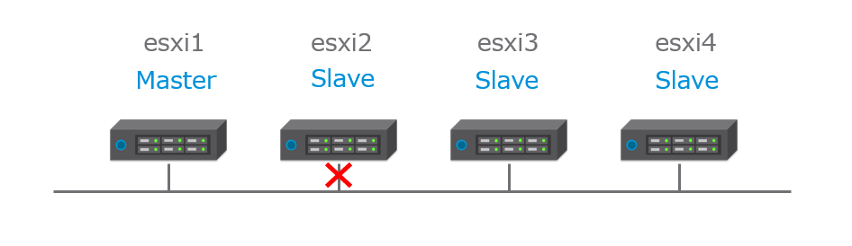

<figcaption>

隔離（isolation）

</figcaption>

</figure>

<figure>

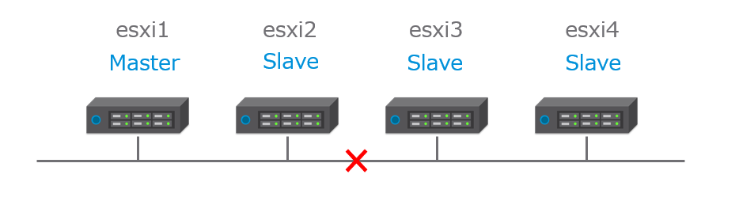

<figcaption>

分割（partition）

</figcaption>

</figure>

繰り返しになるが、あるホストが隔離と判定されるためには、次の三つの条件を満たさなければならない。一つでも満たしていれば、それは隔離ではなく分割なのである。

1. マスターからのネットワークハートビートを受信できない
2. 隔離アドレスに対するping が届かない
3. クラスタ内の他のSlave ホストからMaster 選出のパケットを受信できない

分割時の動作について説明する。分割状態では、クラスタ内にあたかも複数のクラスタが存在するかのように振る舞う（まさに、クラスタが分割されているのである）。したがって、Master も二つ存在する。この時、仮想マシンのフェイルオーバーは発生しない（仮想マシンに対しては何も起こらない）。分割が戻った時、クラスタ内のMaster は再び一つになる。

重要なのは、隔離ではフェイルオーバーが（設定によって）発生し、分割では仮想マシンは稼働し続けるということである。

### 障害のシミュレーション　

ここからは、実際にいくつかのシチュエーションに沿ってvSphere HA の動作を考える。まず、クラスタにホストが4台（esxi1, esxi2, esxi3, esxi4）所属しており、Master をesxi1 とする。また、データストアハートビートと隔離アドレスは設定済とし、 隔離アドレスの対応 は仮想マシン再起動（パワーオフ→パワーオン）とする。

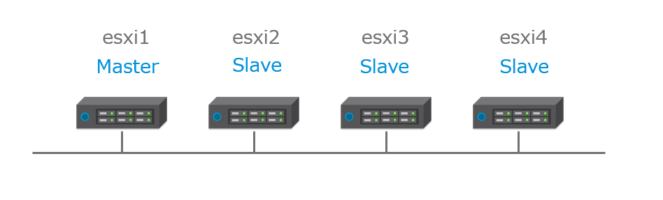

##### ケース1：esxi2 にホスト障害が発生した場合

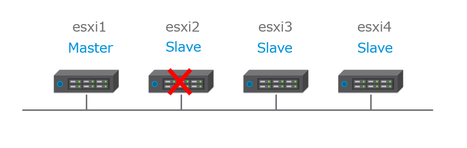

Master であるesxi1 はSlave であるesxi2 からネットワークハートビートを受信できず、管理ネットワークへのping も届かないため、esxi2 に何かが発生したと判定する（この時点ではまだホスト障害なのか、単なるネットワーク分割/隔離なのかは判定していないことに注意）。データストアハートビートをチェックし、 ハートビートファイルが更新されていないため、esxi2 はホスト障害と判定される。結果、仮想マシンは他のホスト上で再起動される。

##### ケース2：esxi2 が隔離状態にある場合

Master であるesxi1 はSlave であるesxi2 からネットワークハートビートを受信できず、 管理ネットワークへのping も届かないため、 esxi2 に何かが発生したと判定する。 esxi2 もMaster であるesxi1 からネットワークハートビートを受信できず、Master 選出プロセスが開始し、自身をMaster とする。その後esxi2 は隔離アドレスにping を送信するが届かず、他のSlave からも選出の通信が届かないことを確認して隔離と判定し、パワーオンファイルを更新する。esxi1がデータストアハートビートをチェックし、ハートビートファイルが更新されているものの、パワーオンファイルを確認し隔離と判定する。結果、仮想マシンは他のホスト上で再起動される。

##### ケース3：esxi1 にホスト障害が発生した場合

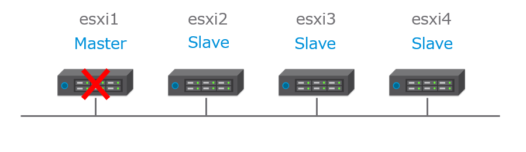

残りのSlave 間で新しいMaster の選出が行われ、その後はケース1と同様である。

##### ケース4：esxi1 が隔離状態にある場合

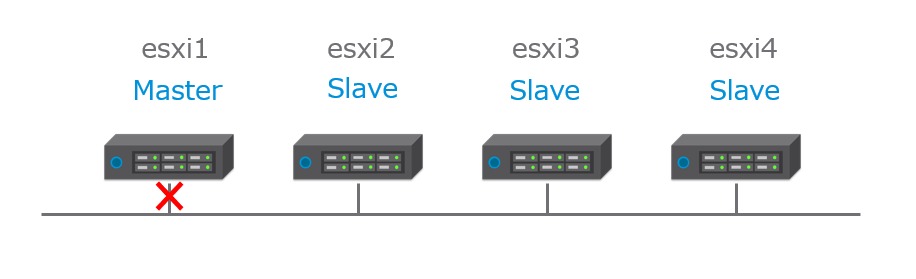

Master であるesxi1 はSlave であるesxi2-4 からネットワークハートビートを受信できず、 管理ネットワークへのping も届かないため、 esxi2-4 に何かが発生したと判定する。 esxi1 は隔離アドレスにping を送信できず、隔離と判定し、パワーオンファイルを更新する。 残りのSlave 間で新しいMaster の選出が行われ、新しいMaster がパワーオンファイルを確認し、esxi1 が隔離と判定する。結果、仮想マシンは他のホスト上で再起動される。

##### ケース5：esxi1-2 とesxi3-4 で分割状態にある場合

<figure>

<figcaption>

  

</figcaption>

</figure>

esxi1 はネットワークハートビートと管理ネットワークへのping により、esxi3-4 に何かが発生したと判定する。esxi1-2 は隔離アドレスにping を送信できるため、隔離でないと判定する。esxi3-4 では、Master であるesxi1 からネットワークハートビートを受信できず、Master 選出を行う。選出後、同様に隔離アドレスへのping を送信できることを確認し、隔離でないと判定する。結果、esxi1-2 とesxi3-4 でHA クラスタが2つ作成され、仮想マシンは稼働し続ける。**すなわち、何も起こらない。**

### vSAN とvSphere HA

vSphere HA では、正常側クラスタと障害側クラスタ（ホスト）で、それぞれが自身の状態を判定し、その状態に応じて仮想マシンのパワーオフとパワーオンが各ホストで実行される。また、互いの状態はハートビートデータストア上のファイルを通して共有される。

ところがvSAN では、すなわち、ハートビートデータストアとしてvSAN データストアを使用できない。他に共有ストレージを持っておらず、ハートビートデータストアを設定していない場合の挙動はどうなるのであろうか？

さて、もう一度ケース2 を考えてみよう。ただし、今回はvSAN 環境で、かつハートビートデータストアを設定していない。 また、vSAN 環境においては、ネットワークハートビートはvSAN ネットワーク上で送受信される。

Master であるesxi1 はSlave であるesxi2 からネットワークハートビートを受信できず、 管理ネットワークへのping も届かないため、 esxi2 に何かが発生したと判定する。 esxi2 もMaster であるesxi1 からネットワークハートビートを受信できず、Master 選出プロセスが開始し、自身をMaster とする。その後esxi2 は隔離アドレスにping を送信するが届かず、他のSlave からも選出の通信が届かないことを確認して隔離と判定するが、パワーオンファイルを使用してMaster へ隔離状態を通知できない。

そこで、esxi1 はesxi2 がホスト障害としか判定できず、**仮想マシンホームオブジェクトの情報に基づいて、** esxi2 上でパワーオンしていた仮想マシンを、esxi1 側でパワーオンする（この時、当然ながらvSAN コンポーネントのvote はesxi1 側が多である）。

また、esxi2 は、 隔離アドレスを確認して自信を隔離と判定し、 隔離時の対応に従う（esxi1 側でのホスト障害判定と異なることに注意）。HA 設定時の「ホスト隔離への対応」を無効にしている場合、esxi2 で稼働していた仮想マシンは コンポーネントの配置によっては稼働し続ける。ただしこの場合、コンポーネントのvote の多数決に負けてしまうため、稼働はしているものの仮想マシンとしてはwrite ができない。さらに悪いことに、同一の仮想マシンネットワーク上に、同じMAC/IP アドレスを持った仮想マシンが二つ存在してしまう。「ホスト隔離への対応」を再起動にしている場合、仮想マシンはパワーオフ（またはシャットダウン）されるので、このような多重起動は発生しない。

<figure>

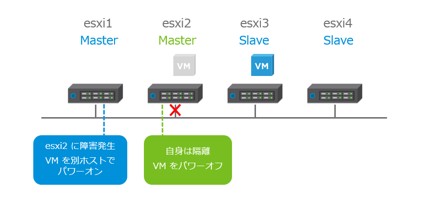

<figcaption>

ホスト隔離への対応を再起動にしている場合。正常クラスタと隔離ホストでパワーオフとパワーオンが正しく連携している。

</figcaption>

</figure>

<figure>

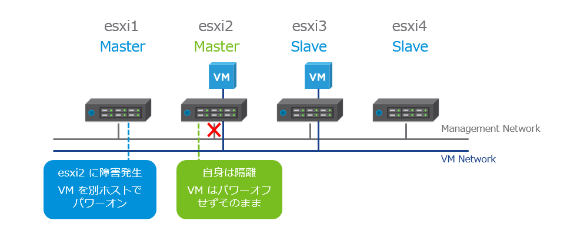

<figcaption>

ホスト隔離への対応を無効にしている場合。正常クラスタと隔離ホストで連携が成功せず、仮想マシンが二重起動してしまう。

</figcaption>

</figure>

前述したが、 FDM はvCenter とコミュニケーションはせず、あくまでhostd に対して仮想マシンのパワーオフ/パワーオンを命令する。したがって、仮想マシンの再起動は、FDM のhostd に対するパワーオフとパワーオン命令がうまくかみ合う必要があり、そうでない場合、再起動が多重起動になってしまう場合がある。vSAN 環境において正しくHA を作動させるために、「ホスト隔離への対応」は必ず再起動にするべきである。さらに、隔離と正しく判定するために、隔離アドレスは必ず管理ネットワークではなく、vSAN ネットワーク上のアドレスを指定する必要がある。

vSAN でハートビートデータストアを設定した場合はどうだろうか？

esxi2 は隔離と正しく正常クラスタへ伝えられるため、ホスト隔離への対応を無効化していても、2重起動されることはない。また、分割に対しても、正常クラスタ側で障害と判定され別ホストで仮想マシンをパワーオンしてしまい、仮想マシンが多重起動されるのを防ぐことができる。もっとも、隔離と比べて、ネットワーク分割自体の頻度は少なく、そもそも物理ネットワーク側で正しく冗長構成をとっていれば、このような問題が発生する確率は低い。

### まとめ

vSphere HA は昔から使われている技術でありながらも実装は複雑であり、今現在でも完ぺきな実装ではない。vSAN とvSphere HA が連携して、コンポーネントのvote をみて常に多数側にHA を発生させ、かつ多重起動は絶対に発生させないような仕組みが理想的ではあるが、vSphere HA とvSAN が独立しており、かつ別々のハートビートの仕組みのため、これは中々難しいと思われる。ただし、このようなHA の仕組みをある程度理解しておくことで、ドキュメントに沿ってただただ設定するのではなく、例えば分割が起こりやすいネットワーク構成なのであれば、vSAN でもハートビートデータストアは設定するなど、障害発生時のリスクを下げることができる場合がある。もちろん、トラブルシューティングにも役に立つはずである。

最後に、トラブルを避けるためにも、必ずvSAN 構成時は下記のHA 設定を忘れずに。

- _das.useDefaultIsolationAddress_ はfalse に！
- _das.isolationAddressX_ はvSAN ネットワーク上のIP を！
- ホスト隔離への対応はパワーオフして再起動！

### 参考文献

・vSphere の可用性について  
[https://docs.vmware.com/jp/VMware-vSphere/6.7/com.vmware.vsphere.avail.doc/GUID-63F459B7-8884-4818-8872-C9753B2E0215.html](https://docs.vmware.com/jp/VMware-vSphere/6.7/com.vmware.vsphere.avail.doc/GUID-63F459B7-8884-4818-8872-C9753B2E0215.html)

・VMware vSphere 6.7 Clustering Deep Dive  
Frank Denneman, Duncan Epping, Niels Hagoort 著

押さえておきたいvSphereの基本-可用性編　vSphere HA/FT  
[https://blogs.vmware.com/jp-cim/2014/02/ha-ft.html](https://blogs.vmware.com/jp-cim/2014/02/ha-ft.html)

・vSphere HA considerations  
[https://storagehub.vmware.com/t/vmware-vsan/vmware-r-vsan-tm-design-and-sizing-guide-2/vsphere-ha-considerations-1/](https://storagehub.vmware.com/t/vmware-vsan/vmware-r-vsan-tm-design-and-sizing-guide-2/vsphere-ha-considerations-1/)
