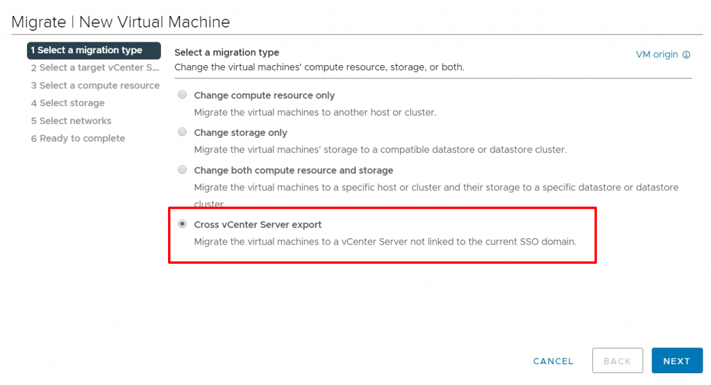

先日vSphere 7.0U1c がリリースされたが、そこで非常に強力なAdvanced Cross vCenter vMotion という機能がサポートされた。

[https://docs.vmware.com/en/VMware-vSphere/7.0/rn/vsphere-vcenter-server-70u1c-release-notes.html](https://docs.vmware.com/en/VMware-vSphere/7.0/rn/vsphere-vcenter-server-70u1c-release-notes.html)

単純に言ってしまえば拡張リンクモードの必要ないCross vCenter vMotion で、vCenter Server 間の仮想マシンの移行を非常に簡単に実行できるようになった。この機能のもう1 つの強みとしてバージョンが異なっていても実行できるため（従来のCross vCenter vMotion でもそうだったが）、古い環境からのホストのマイグレーションなど、さまざまなユースケースが考えられる（と言っても流石に5.x から移行することはできないが）。

理解するには見て触った方が早いということで、さっそく私も試してみた。

https://speakerdeck.com/vkbaba/advenced-cross-vcenter-vmotion

#とりあえず雑にスクショを張り付けただけだが、とにかくシンプルであることは伝えたい。

移行には2 通りあって、移行元がvCenter Server 7.0U1c 以降の場合は仮想マシンを選択して移行できる。

<figure>

<figcaption>

新しく項目が追加されている。

</figcaption>

</figure>

移行元がvCenter Server 7.0U1c のバージョン未満で、Advanced Cross vCenter vMotion をサポートしていない場合、移行先のvCenter Server 7.0U1c 以降のホストを右クリックして、新しく追加されたImport VMs から移行する（上記スライド参照）。

その他、現時点で公開されている情報は下記の通り。細かい要件などに関するドキュメントはまだ公開されていない。

[https://blogs.vmware.com/vsphere/2020/12/advanced-cross-vcenter-server-migration-integrated-in-vsphere-7-u1c.html](https://blogs.vmware.com/vsphere/2020/12/advanced-cross-vcenter-server-migration-integrated-in-vsphere-7-u1c.html)

[https://core.vmware.com/resource/introducing-advanced-cross-vcenter-server-vmotion-capability](https://core.vmware.com/resource/introducing-advanced-cross-vcenter-server-vmotion-capability)

なんにせよ、しれっと追加され、派手さはないものの、今後様々なユースケースで利用されると思われるとても強力な機能である。スゴイ。
