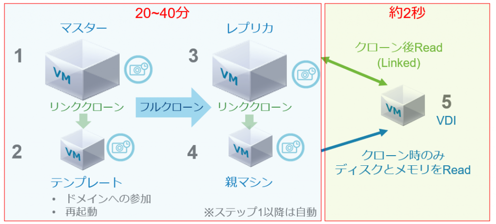

Developer Center という機能をご存じだろうか？vSphere 6.7 U2 からサポートされた機能で、API をよりvSphere Client 上から触れるようにしたり（API Explorer）、vCenter の操作をキャプチャしてコードを吐き出したりと（Code Capture）、開発者向けの機能をより身近に提供することができる。しかしながら、マイナーな機能のせいか、そもそもサポートがよくわからないためか、あまり使われている様子がない。

そこで今回は、実際にDeveloper Center のAPI Explorer という機能を使って、仮想マシンをインスタントクローンしてみることにしよう。

### インスタントクローンとは？

一言で表すと「めっちゃ高速なクローン」である。もう少し丁寧な言い方をすると、ベースとなる仮想マシンのディスクおよびメモリを共有し、パワーオン状態のままクローンすることができる。この機能はもともとVMware Horizon の仮想デスクトップを高速展開するために使われる機能であり、普通はHorizon からしか使わない。

<figure>



<figcaption>

図にすると複雑だが、Horizon でインスタントクローンを使う場合はマスターとなる仮想マシンとそのスナップショットを作成すれば、あとはHorizon 側が自動的にVDI を展開してくれる。

</figcaption>

</figure>

しかしながら、実はこの機能、API 限定だがHorizon だけではなく、vSphere の通常の仮想マシンに対しても適用することができる。詳細な内容は[コチラ](http://www.yellow-bricks.com/2018/05/01/instant-clone-vsphere-67/)などを参照してほしいが、今日はとにかくまずはこの機能をAPI Explorer から使ってみよう。

### インスタントクローンしてみよう！

環境はおなじみVMware HOL を使うことにする。

[https://labs.hol.vmware.com/HOL/catalogs/lab/7807](https://labs.hol.vmware.com/HOL/catalogs/lab/7807)

まずはそもそものDeveloper Center だが、vCenter にログイン後、メニューから選択することができる。が、その前にインスタントクローンの準備をすることにしよう。


今回はapp01a というもともと存在するLinux VM を使ってみる。さっそくWeb Console からログインしよう。ユーザー名はroot、パスワードはVMware1! だ。ログイン後、テキトーにhostname とでも入力しておき、準備は完了である。


Developer Center から、API Explorer を選択し、さまざまなAPI が表示されていることを確認する。


まずは親となるVM の情報を取得してみよう。フィルタにvm と入力し、GET /rest/vcenter/vm を見つける。その後、Try it out をクリックし、Execute をクリックするとcurl コマンドが実行されレスポンスを取得できる。これで、app01a VM のオブジェクト名（≠VM 名）はvm-3002 ということが分かった。


今度は先のフィルタにinstant と入力し、インスタントクローンのAPI を取得する。先と同様Try it out をクリックするが、今度はPOST のため、vCenter に投げるパラメータが必要である。


では何を入力すればよいかだが、細かいAPI 仕様は[コチラ](https://vmware.github.io/vsphere-automation-sdk-rest/vsphere/operations/com/vmware/vcenter/vm.instant_clone-operation.html)にある。しかしながら、とにかくシンプルに、単純にインスタントクローンするだけであれば下記のjson をPOST するだけでOK だ。

```json
{
    "spec" : {
        "name" : "ic-test",
        "source" : "vm-3002"
    }
}
```

"name" は仮想マシン名、source は先に取得したクローンもととなるVM のオブジェクト名だ。


最終的に画像のようなレスポンスが返ってくれば成功だ。インスタントクローンのタスクも実行されていることが分かる。また、仮想マシンも正しく作成されており、先に入力したhostname もそのままの状態で残っている。これはメモリの状態も共有するインスタントクローンならではの特徴だ。


さて、実際はこのままだと使えない。IP が重複しているからである。DHCP を使っていない場合は、ゲストカスタマイズが現在使えず、手動でIP を設定することになる。

### まとめ

スクリーンショットを多めに載せたため記事としては（主にスクロールが）長くなってしまったが、API と言われてもはや身構える必要はなく、API Explorer を使えばインスタントクローン以外にも様々なAPI をvCenter から呼び出すことができる。色々なユースケースがあるだろうから、ぜひ活用してみてほしい。

次回はDeveloper Center の目玉機能であるCode Capture について解説する。
