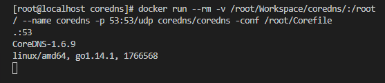
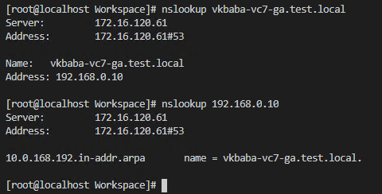
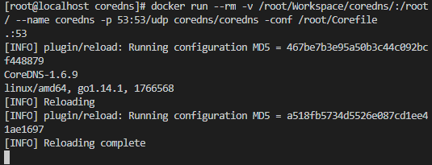

### はじめに

検証用にDNS サーバーが必要になったが、Windows Server は準備が面倒だった。Linux で建てようと思ったが、ひょっとしたらコンテナを使えばもっと楽になるのでは？と思い、色々調べ、自分なりに最も簡単と思われる方法を見つけたので共有する。

### CoreDNS とは

CoreDNS はk8s ユーザーにはおなじみのDNS 用のコンテナである。Dockerfile やgithub を確認すると分かるが、余計なものが入っておらず、軽量である。軽量なので、sh すら使えない。

[https://github.com/coredns/coredns](https://github.com/coredns/coredns)

目指すところは、なるべくシンプルに、例えば192.168.0.10 : vcsa.corp.local のように、逆も含めて名前解決できることで、CoreDNS を使えばこれを実現できる。タイプするコマンドは下記の通りである。

```shell
docker run --rm -v /$YOUR_COREFILE_DIRECTORY/:/root/ --name coredns -p 53:53/udp coredns/coredns -conf /root/Corefile
```

ポイントは-v と -conf オプションだ。-v はコンテナを実行するホストのパスをコンテナ内のパスと繋げるオプションであり、-conf はCoreDNS のEntrypoint、すなわち起動時に呼び出されるcoredns コマンドに対するオプションである（docker コマンドのオプションではない！）。-conf オプションはCoreDNS で読み込むCorefile と呼ばれる設定ファイルのパスを指定し、これによりホストのCorefile をCoreDNS コンテナ内で読み込むというわけだ。

というわけで、Corefile を作成する。こちらは非常に簡単だ。下記に簡単なサンプルを用意した。

```
. {
    hosts {
        192.168.0.10 vkbaba-vc7-ga.test.local
        fallthrough
    }
    forward . 8.8.8.8
    reload
}
```

詳細なフォーマットについては例えば[コチラ](https://coredns.io/2017/07/23/corefile-explained/)を参照していただきたいが、基本的にはベースとなる最初の. {} 以下に、plugin + plugin フォーマットという形式で書いていく。この例で言うと、hosts とforward とreload がplugin であり、fallthrough はhosts plugin で定義されたオプションということになる。ちなみに意味はhosts plugin のエントリにマッチしなかったら他のplugin を参照する、ということ。

forward plugin はなんとなく分かるであろうが、DNS のフォワーダーである。おなじみ8.8.8.8 をここではフォワード先に指定した。

reload plugin はCorefile の編集を動的に反映させることができる。つまり、CoreDNS コンテナを稼働させたままレコードを追加できる。 なお、他のplugin については[コチラ](https://coredns.io/plugins/)を参照してほしい。

このCorefile ファイルをコンテナを実行するホストに配置し、先のdocker コマンドを叩くと、正しくDNS サーバーが稼働していることが分かる。DNS サーバーとして登録するサーバーのアドレスは、コンテナを実行しているホストOS のIP アドレスで良い。これは、-p のポートフォワードオプションで、コンテナが稼働しているホストOS の53 ポートにアクセスすると自動的にコンテナの53 ポートにフォワードしてくれるためだ。また、先ほどのCorefile に一行追加しただけで逆引きも自動的に登録されているのがポイント。

<figure>



<figcaption>

DNS サーバー側。docker run 時に-d オプションでバックグラウンド実行も可能。

</figcaption>

</figure>

<figure>



<figcaption>

クライアント側。逆引きも問題ない。

</figcaption>

</figure>

レコードを追加すると、リロードが自動的に行われる。192.168.0.11 : vkbaba-esx7-ga.test.local を先のCorefile に追加してみたところ、数秒後にリロードが完了し、追加したエントリに対して名前解決ができた。

```
. {
    hosts {
        192.168.0.10 vkbaba-vc7-ga.test.local
        192.168.0.11 vkbaba-esx7-ga.test.local
        fallthrough
    }
    forward . 8.8.8.8
    reload
}
```



### まとめ

以上がCoreDNS を用いたDocker コンテナによるDNS サーバーの建て方である。Corefile の作成と一行のdocker コマンドにより、簡単にDNS サーバーを作成することができる。しかも、Corefile 自体は非常にシンプルであり、編集も苦ではないはずだ。このように、docker をインストールしたLinux OS を1 つ用意しておくと、その上でテスト用に色々便利なアプリケーションを実行できる。インフラエンジニアも今よりももっとコンテナを活用することで、より生産効率を上げることができるだろう。

### Appendix

この記事の意図である「シンプルにDNS サーバーを構築するための情報共有」から外れるため、いくつか重要なことを省いた。Appendix として記載しておくので、参考までに。

#### dnsmasq

そもそもコンテナでなくても、dnsmasq を使えば簡単にDNS サーバーを建てることができる。docker の知識は必要ないし、hosts ファイルにレコードを追加できるという点で、ユーザーにとっては簡単と言える。しかしながら、CoreDNS を用いる方法ではDocker さえ動いていればOS に設定方法が依存しないこと、Corefile へのレコードの追加がhosts ファイルへの追加と同様簡単であること、実行がdocker コマンド一行であることから、dnsmasq よりも簡単と考える。また、docker はもはやLinux に当たり前にインストールするものだし、VM テンプレート化している場合も多いだろう。

ちなみに、CentOS 7.6 で標準でdnsmasq がインストールされていて、53 ポートがListen 状態にある。この状態でCoreDNS を立ち上げようとすると、Error starting userland proxy といったポート番号重複のエラーが出る。自分は /etc/dnsmasq.conf dns=0 にしてdnsmasq を無効化後、プロセスkill した。

#### Corefile の編集についての可否

これを機に自分もCoreDNS を勉強したのだが、色々情報を探っていると、Corefile ではfile plugin の使用例が多いようだ（もちろんhosts plugin でホストOS 内のhosts ファイルを直接参照させても良い）。

[https://coredns.io/plugins/file/](https://coredns.io/plugins/file/)

自分はこのfile plugin のためにゾーンファイルを作成するのは手間であるし、上記の公式ページにも

> The _file_ plugin is used for an “old-style” DNS server

と明確に記載されているので、hosts で良いと思う。シンプルが一番だ。
