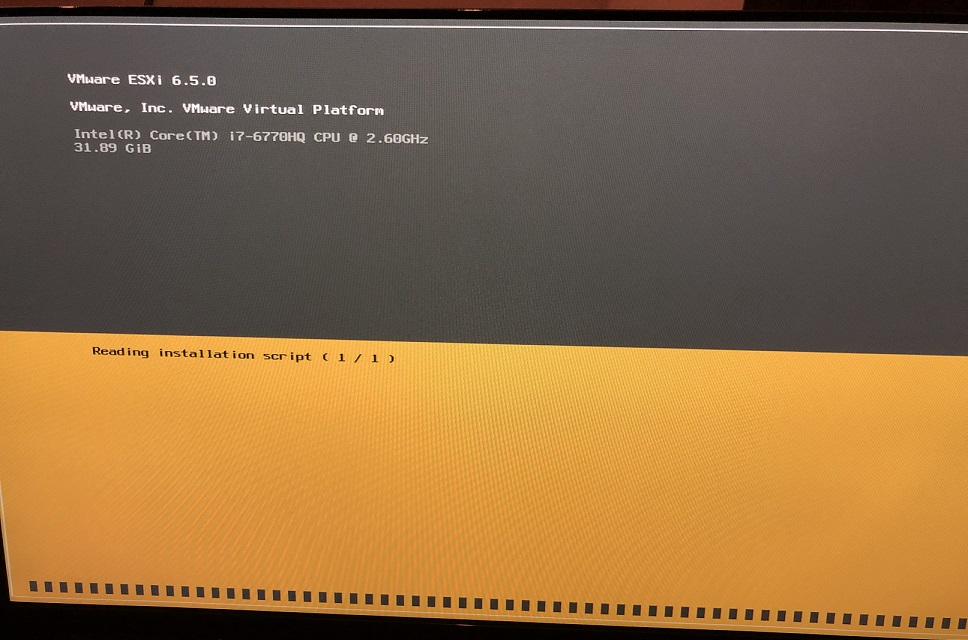

### はじめに

新しいバージョンを試してみたい時や、検証用に特定のバージョンが必要になった時など、本番用環境以外でESXi を物理サーバーにインストールする機会は意外とある。ESXi のインストールそれ自体は（正直Hyper-V よりも格段に）楽であるが、数が増えてくると面倒である。本番用環境の構築用途として、VMware では、Enterprise Plus エディションから使用できる[Auto Deploy](https://docs.vmware.com/jp/VMware-vSphere/6.7/com.vmware.esxi.install.doc/GUID-CAB84194-3D8E-45F0-ABF9-0277710C8F98.html) という機能を用意しているものの、あくまでも本番用途で使うもので、DHCP サーバーの用意など、環境の構築が自動化の恩恵よりも手間であり、正直気軽に使用するものではない。他には、VMware Cloud Foundation の[SDDC Manager](https://docs.vmware.com/jp/VMware-Cloud-Foundation/3.5/com.vmware.vcf.admin.doc_35/GUID-D143F07A-B3FA-4A14-8D03-BFD2C1810D2E.html) があるが、これも検証用環境構築には向かない。理由としては、必要なvSphere 以外の製品がManagement/Workload Domain として作成されるうえに、バージョンが決め打ちで固定されているためである（そもそも検証用にvCF とはいくらなんでも豪華すぎる）。

ということで、もっと簡単に、気軽にESXi をインストールする方法を、みんな大好きWilliam Lam 先生が「[Automated ESXi Installation to USB using Kickstart](https://www.virtuallyghetto.com/2019/07/automated-esxi-installation-to-usb-using-kickstart.html)」にて紹介されていたため、さっそく試してみた。

### 1\. USB インストールメディアの用意

今回は物理サーバーにみんな大好きIntel NUC、インストールメディア作成に[Rufus](https://rufus.ie/) を使用した。

Rufus でインストールメディアを作成する場合の注意点として、上記ブログのコメント欄にもあるが、パーティション構成をGPT ではなくMBR とするとうまくいく。

### 2\. BOOT.CFG ファイルの編集

_kernelopt=cdromBoot runweasel_ を  
_kernelopt=ks=usb:/KS.CFG_  
に書き換える。この後作成するKS.CFG スクリプトをインストール時に使用するためである。

```
bootstate=0
title=Loading ESXi installer
timeout=5
prefix=
kernel=/b.b00
kernelopt=ks=usb:/KS.CFG
```

### 3\. KS.CFG ファイルの作成

KS.CFG ファイルをUSB メモリのroot 配下に作成する。以下は最低限の設定であり、IP アドレス等は適宜入れ替えて使用する。[ドキュメント](https://docs.vmware.com/en/VMware-vSphere/6.7/com.vmware.esxi.install.doc/GUID-9040F0B2-31B5-406C-9000-B02E8DA785D4.html)や[https://www.virtuallyghetto.com/vmware-kickstart](https://www.virtuallyghetto.com/vmware-kickstart) が参考になる。下記に、自分用にカスタマイズしたサンプルスクリプトを載せておく。

```
vmaccepteula
install --firstdisk=usb --overwritevmfs --novmfsondisk
reboot
 
network --bootproto=static --ip=172.16.10.21 --netmask=255.255.255.0 --vlanid=10 --gateway=172.16.10.254 --hostname=esxi-1.test.local --nameserver=172.16.10.10 --addvmportgroup=1
rootpw VMware1!
 
%firstboot --interpreter=busybox
 
 
# enable & start SSH
vim-cmd hostsvc/enable_ssh
vim-cmd hostsvc/start_ssh
 
# enable & start ESXi Shell
vim-cmd hostsvc/enable_esx_shell
vim-cmd hostsvc/start_esx_shell
 
# Suppress ESXi Shell warning
esxcli system settings advanced set -o /UserVars/SuppressShellWarning -i 1
```

### 4\. インストール

これで、USB メモリをサーバーに刺して電源をON するだけで、最低限の設定が完了した状態でESXi が立ち上がる。

<figure>



<figcaption>

スクリプトが読み込まれていることがわかる。

</figcaption>

</figure>

### まとめ

本手法では正直なところ自動化できる部分はそこまで多くはない（そもそもESXi 自体のインストールが簡単なためである）。一方で、起動してからのキーボード操作が必要なくなるため、スクリプトの中のIP アドレスの変更以外何も考えなくて済むのは大きい。簡単に試すことができるので、是非チャレンジしてみてはいかがだろうか。
