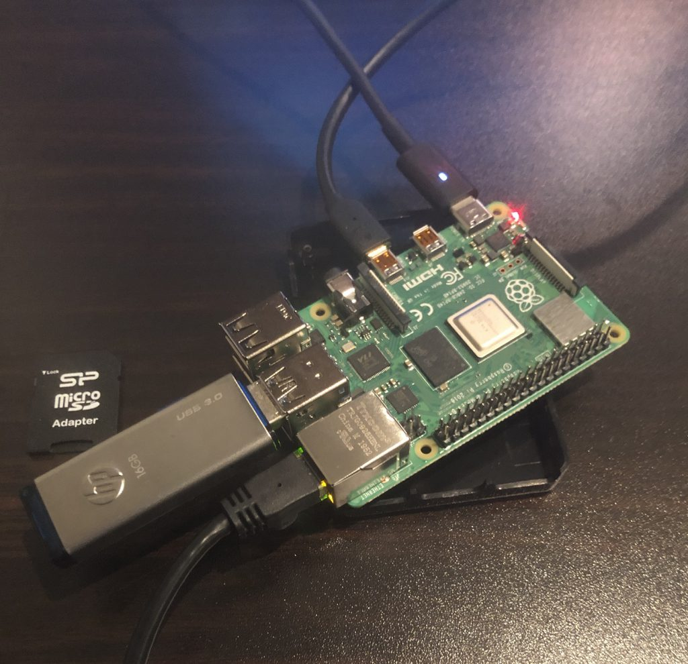
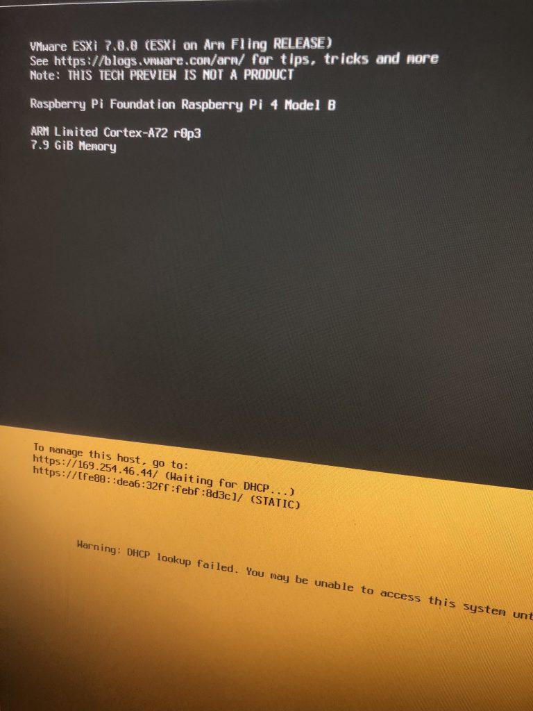
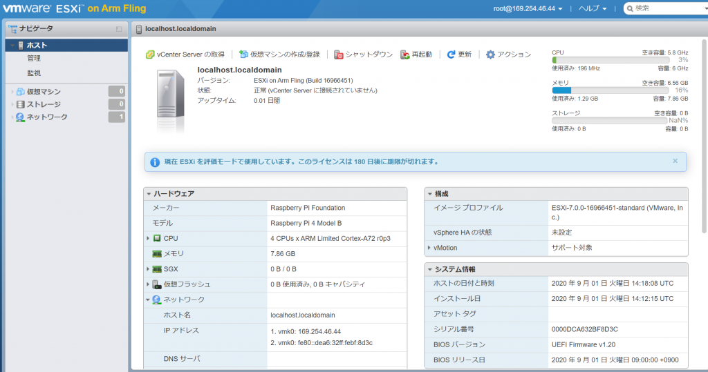

Flings でアナウンスされたESXi Arm Edition をさっそく試してみた。

[https://flings.vmware.com/esxi-arm-edition](https://flings.vmware.com/esxi-arm-edition)

[https://blogs.vmware.com/vsphere/2020/10/announcing-the-esxi-arm-fling.html](https://blogs.vmware.com/vsphere/2020/10/announcing-the-esxi-arm-fling.html)

### インストール方法

Flings からダウンロードできるドキュメントを参照するか、もしくは下記の日本語のブログが一番まとまっていて良かった。USB メモリがブート用とインストール先のディスク用に最低2 つ必要なことに注意。

https://zokibayashi.hatenablog.com/entry/2020/10/08/023240

### 所感

インストールは非常に簡単で、ドキュメント読みながらも大体1 時間くらいで終わった。USB メモリにインストールするので、時間がかかるかなと思ったら10分程度で終わり拍子抜け。Raspberry Pi 3 だとだめっぽいので、4 を別途購入する必要があるのだが、これが中々（物理的に）熱い。とりあえずメルカリで最低限のものだけ買ったのだが、真面目にやろうとすると少なくともファンは必須だろう。

色々面白い使い方ができそうだが、ブログで紹介されていた一例としてはvSAN Witness 置き場で、物理的に離れたところに、このような小型のWitness 稼働用サーバーを稼働させておくのは面白いかもしれない。

<figure>

<figcaption>

とりあえず最低限の装備で挑んだものの、あまりの熱さにスクショ後即パワーオフしてしまった。

</figcaption>

</figure>

<figure>

<figcaption>

ESXi 側からの見え方

</figcaption>

</figure>

<figure>

<figcaption>

（クリックで拡大可能）コンソールからの見え方

</figcaption>

</figure>
