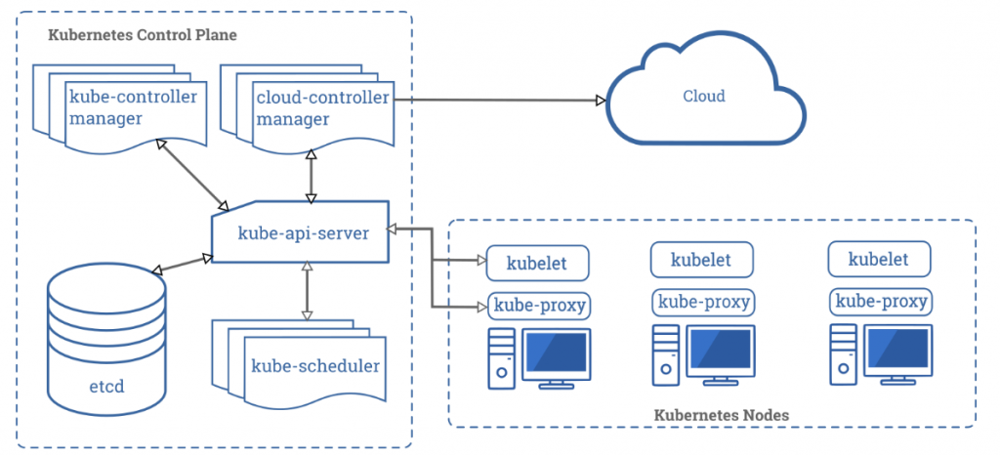

### はじめに

Kubernetes は抽象化の嵐である。 腹落ちして理解するためには、ある時にふと立ち止まって、処理の裏側では実際にどのようなことが起こっているのか定期的に調べることが重要だ。

本記事では、CRD/CR の作成を通して、Kubernetes における抽象化を肌で感じていただく。また、その抽象化の正体をいくつかのツールによって紐解いていこう。

### CRD/CR とは

Custom Resources/Custom Resources Definitions の略で、Kuberentes のリソースを独自に拡張するための仕組みである。

vSphere7 の[vSphere with Kubernetes](https://blogs.vmware.com/vsphere/2020/03/vsphere-with-kubernetes-101.html) （Project Pacific）の機能もCRD/CR を使っており、そのような意味からもCRD/CR をある程度知っておくことは重要と考える。また、自由にKubernetes を拡張できるというのは、なにより面白そうだ（自分がk8s にハマったきっかけの1 つがCRD だったりする）。

CRD とCR の関係は、CRD がリソースを定義するための型紙で、CR が実際のリソースと思うと良い。我々はPod を作成する時にyaml を書くが、yaml の書き方にはルールがある。例えば、yaml にはコンテナイメージ名が必須であるし、そのイメージ名を数字のみで宣言することは禁止されている。CRD も同じで、CR オブジェクトを作成するためにyaml を書くわけだが、そのyaml のルールをCRD では定義する。

ごちゃごちゃ言っても仕方がない。作ってみればわかる。作るのはとても簡単で、しかも、一度作ると色々Kubernetes のしきたりのようなものが見えて面白いので、是非Katacoda 等で試してほしい。

### CRD/CR を作ってみよう

まずはCRD/CR のyaml を見ていただいた方が早いであろう。

```css
apiVersion: apiextensions.k8s.io/v1
kind: CustomResourceDefinition
metadata:
  name: sample-crds.vkbaba.test.local
spec:
  group: vkbaba.test.local
  versions: 
    - name: v1alpha
      served: true
      storage: true
      schema:
        openAPIV3Schema:
          type: object
          properties:
            spec:
              type: object
              properties:
                sample-prop:
                  type: integer
                image:
                  type: string
                replicas:
                  type: integer
                messages:
                  type: string
              required:
                - image
                - replicas
      additionalPrinterColumns:
        - name: AGE
          type: date
          jsonPath: .metadata.creationTimestamp
        - name: test
          type: string
          jsonPath: .spec.image
  scope: Namespaced
  names:
    kind: Sample-crd
    plural: sample-crds
    singular: sample-crd
    shortNames: ["scrd"]

```

```css
apiVersion: vkbaba.test.local/v1alpha
kind: Sample-crd
metadata:
  name: sample-cr
spec:
  image: test
  replicas: 1
  messages: "aa"
```

大体、[ココ](https://kubernetes.io/docs/concepts/extend-kubernetes/api-extension/custom-resources/)に載っているものをコピペするだけでよい。CRD をapply した状態で、CR をapply するとオブジェクトが作成されるというわけだ。

```
[root@localhost crd]# kubectl apply -f sample-cr.yaml 
sample-crd.vkbaba.test.local/sample-cr created
```

ここからはポイントを絞って、yaml の解説に入る。

まずは両yaml のkind に注目してほしい。CRD はCustomResourceDefinition であり、すなわちCRD というリソースが既にk8s で定義されているため、このような書き方になる。一方でCR はこれから我々が作り上げる独自のリソースであり、我々がCRD の中で自由に設定することができる。CR のリソース名はこの場合Sample-crd であり、CRD の中のspec.names.kind で定義していることがわかるであろう。

次に、CR のapiVersion についてだが、apiVersion はそのリソースが属するAPI グループ/バージョンで構成される。ちなみにPod などの場合はv1 とバージョンのみで指定される場合があるが、これはcore グループという特殊なグループに属するため、省略されている。これも同様にCRD のspec 以下で宣言されていることがわかる。

次に、CR のspec だが、これはCRD のspec.versions.scheme.openAPIV3Schema 以下で表現される。端的に言うと、これらはCR のyaml でspec 以下に書くことができるパラメータであり、CR のyaml で定義されているimages、replicas、messages が定義されていることが分かるであろう。required は必須パラメータを表し、これがないとデプロイに失敗する。また、型通りでないと、例えばimages に数字を宣言した場合も、同様にデプロイに失敗する。

```
[root@localhost crd]# kubectl apply -f sample-cr.yaml 
The Sample-crd "sample-cr" is invalid: spec.image: Invalid value: "integer": spec.image in body must be of type string: "integer"
```

最後に、additionalPrinterColumns だが、これはkubectl get した時のoutput される内容を追加することができる。この場合、CR の中で宣言されているmessages の内容をそのまま出力している。

```
[root@localhost auger]# kubectl get sample-crds
NAME        AGE   TEST
sample-cr   18h   test
```

以上が、CRD/CR の解説である。CRD が型紙で、型紙のルールに沿ってCR のyaml を書いていく、という流れを理解していただけたであろうか。

最後に、最も重要なことを付け加えておく。このCR は、**実際には何もしていない。**Pod ができるわけでもなければ、何か設定を変更しているわけでもなく、本当に何もしていない。意味がないのである。

これを意味あるものとするためには、Controller が必要だ。[こちらの記事](https://blog.vpantry.net/posts/k8s-4/)で、k8s は宣言的設定と言ったが、マニフェストで宣言した内容に現在の状態を持っていく仕事はk8s Controller が担う。Controller を作成しない限り、CRD/CR は意味をなさないのだ。

先にCRD/CR は作成が簡単だ、と言ったが、実は半分嘘で、マニフェストとしてCRD/CR を作成することは簡単だが、実際の挙動を定義するためには作りこみが必要である。Custom Controller についてはまた別の記事で紹介するとして、今回はちょっとここで立ち止まり、CRD/CR について考えてみよう。

### CR オブジェクトはどこにあるのか？

<figure>



<figcaption>

[https://kubernetes.io/docs/concepts/overview/components/](https://kubernetes.io/docs/concepts/overview/components/)

</figcaption>

</figure>

先のマニフェストをapply することにより、確かにCR オブジェクトは作成できたし、kubectl get もできる。ただ、そもそもPod ではないし、例えばMaster/ Worker Node において、愚直にfind / -name \*sample-cr\* などとしても、出力されないはずである。

こうなれば答えは1 つしかない。etcd である。etcd データベースの中にsample-cr があるはずなのだ。etcd はkubeadm でシンプルにMaster 1 台構成で組んでいるのであれば、Pod として構成されている。これを覗いてみよう。

etcd にアクセスするためにはetcdctl というコマンドを使用する。バージョンによって結構コマンドが変わっており、k8s v1.16 でkubeadm での構成では、下記コマンドでetcd にアクセスできる。これはMaster Node で実行する必要はない。

```
kubectl exec etcd-vkbaba-master -n kube-system -- sh -c "ETCDCTL_API=3 etcdctl \
 --endpoints https://$Master_Node_IP:2379  \
 --cacert /etc/kubernetes/pki/etcd/ca.crt \
--key /etc/kubernetes/pki/etcd/server.key \
--cert /etc/kubernetes/pki/etcd/server.crt \
 get \"\" --prefix=true --keys-only" 
```

これを実行すると、etcd の中でどういったディレクトリが存在するか一覧を出力できる（ちなみにetcd v3 ではls は存在しない）。この中に、/registry/vkbaba.test.local/sample-crds/default/sample-cr というオブジェクトの実体が格納されていることが分かる。

```
[root@localhost crd]#  kubectl exec etcd-vkbaba-master -n kube-system -- sh -c "ETCDCTL_API=3 etcdctl \
 --endpoints https://172.16.120.62:2379  \
 --cacert /etc/kubernetes/pki/etcd/ca.crt \
--key /etc/kubernetes/pki/etcd/server.key \
--cert /etc/kubernetes/pki/etcd/server.crt \
 get \"\" --prefix=true --keys-only" | grep sample-cr
/registry/apiextensions.k8s.io/customresourcedefinitions/sample-crds.vkbaba.test.local
/registry/vkbaba.test.local/sample-crds/default/sample-cr
```

中身を見てみよう。

```
[root@localhost crd]#  kubectl exec etcd-vkbaba-master -n kube-system -- sh -c "ETCDCTL_API=3 etcdctl \
 --endpoints https://172.16.120.62:2379  \
 --cacert /etc/kubernetes/pki/etcd/ca.crt \
--key /etc/kubernetes/pki/etcd/server.key \
--cert /etc/kubernetes/pki/etcd/server.crt \
 get /registry/apiextensions.k8s.io/customresourcedefinitions/sample-crds.vkbaba.test.local"
/registry/apiextensions.k8s.io/customresourcedefinitions/sample-crds.vkbaba.test.local
{"kind":"CustomResourceDefinition","apiVersion":"apiextensions.k8s.io/v1beta1","metadata":{"name":"sample-crds.vkbaba.test.local","uid":"e866e904-f0cb-4f65-9359-724f3ddbcfdb","generation":9,"creationTimestamp":"2020-03-20T13:41:51Z","annotations":{"kubectl.kubernetes.io/last-applied-configuration":"{\"apiVersion\":\"apiextensions.k8s.io/v1\",\"kind\":\"CustomResourceDefinition\",\"metadata\":{\"annotations\":{},\"name\":\"sample-crds.vkbaba.test.local\"},\"spec\":{\"group\":\"vkbaba.test.local\",\"names\":{\"kind\":\"Sample-crd\",\"plural\":\"sample-crds\",\"shortNames\":[\"scrd\"],\"singular\":\"sample-crd\"},\"scope\":\"Namespaced\",\"versions\":[{\"additionalPrinterColumns\":[{\"jsonPath\":\".metadata.creationTimestamp\",\"name\":\"AGE\",\"type\":\"date\"},{\"jsonPath\":\".spec.image\",\"name\":\"test\",\"type\":\"string\"}],\"name\":\"v1alpha\",\"schema\":{\"openAPIV3Schema\":{\"properties\":{\"spec\":{\"properties\":{\"image\":{\"type\":\"string\"},\"messages\":{\"type\":\"string\"},\"replicas\":{\"type\":\"integer\"},\"sample-prop\":{\"type\":\"integer\"}},\"required\":[\"image\",\"replicas\"],\"type\":\"object\"}},\"type\":\"object\"}},\"served\":true,\"storage\":true}]}}\n"}},"spec":{"group":"vkbaba.test.local","version":"v1alpha","names":{"plural":"sample-crds","singular":"sample-crd","shortNames":["scrd"],"kind":"Sample-crd","listKind":"Sample-crdList"},"scope":"Namespaced","validation":{"openAPIV3Schema":{"type":"object","properties":{"spec":{"type":"object","required":["image","replicas"],"properties":{"image":{"type":"string"},"messages":{"type":"string"},"replicas":{"type":"integer"},"sample-prop":{"type":"integer"}}}}}},"versions":[{"name":"v1alpha","served":true,"storage":true}],"additionalPrinterColumns":[{"name":"AGE","type":"date","JSONPath":".metadata.creationTimestamp"},{"name":"test","type":"string","JSONPath":".spec.image"}],"conversion":{"strategy":"None"},"preserveUnknownFields":false},"status":{"conditions":[{"type":"NamesAccepted","status":"True","lastTransitionTime":"2020-03-20T13:41:51Z","reason":"NoConflicts","message":"no conflicts found"},{"type":"Established","status":"True","lastTransitionTime":"2020-03-20T13:41:51Z","reason":"InitialNamesAccepted","message":"the initial names have been accepted"}],"acceptedNames":{"plural":"sample-crds","singular":"sample-crd","shortNames":["scrd"],"kind":"Sample-crd","listKind":"Sample-crdList"},"storedVersions":["v1alpha"]}}
```

なお、sample-cr オブジェクトを削除した場合、ディレクトリも削除される。

```
[root@localhost crd]# kubectl delete -f sample-cr.yaml 
sample-crd.vkbaba.test.local "sample-cr" deleted
[root@localhost crd]#  kubectl exec etcd-vkbaba-master -n kube-system -- sh -c "ETCDCTL_API=3 etcdctl \
 --endpoints https://172.16.120.62:2379  \
 --cacert /etc/kubernetes/pki/etcd/ca.crt \
--key /etc/kubernetes/pki/etcd/server.key \
--cert /etc/kubernetes/pki/etcd/server.crt \
 get \"\" --prefix=true --keys-only" | grep sample-cr
/registry/apiextensions.k8s.io/customresourcedefinitions/sample-crds.vkbaba.test.local
```

以上より、オブジェクトの実体はetcd データベースに格納されていることが分かる。

### auger の紹介

さて、最後にもう1 つetcd を除くうえで有効なツールを紹介する。auger だ。

[https://github.com/jpbetz/auger](https://github.com/jpbetz/auger)

etcdctl で遊んでいると、もしくはトラブルシューティング時に、etcdctl だけではそのままデータを参照できないことが多々ある。こんな感じで、バグるのだ。

```
ReplicaSetsample-deployment-78dd7b5b68"$fa31631a-e865-43a7-9660-b8238b65ce12*apps/v108z�
1
default-token-v77nz2
default-token-v77nz��
nginx
     nginx:latest*BJJ
default-token-v77nz-/var/run/secrets/kubernetes.io/serviceaccount"2j/dev/termination-logrAlways����FileAlways 2
                                                                                                               ClusterFirstBdefaultJdefaultRkbaba-worker-2X`hr���default-scheduler�6
node.kubernetes.io/not-readyExists"     NoExecute(��8
node.kubernetes.io/unreachableExists"   NoExecute(�����
Running#

InitializedTru����*2
ReadyTru����*2'
ContainersReadyTru����*2$

172.16.120.642192.168.231.20����B�
nginx


���� (2
       nginx:latest:_docker-pullable://nginx@sha256:2539d4344dd18e1df02be842ffc435f8e1f699cfc55516e2cf2cb16b7a9aea0bBIdocker://d0dd2237b7e016f145dfd7e2ba999c4546239c4b98da480ed767655c6e62a653HJ
BestEffortZb
192.168.231.200"
```

auger のReadme を読むと分かるが、k8s v1.6 以降では一部オブジェクトを取得するためにデコードが必要なようだ。そこで、auger を使って、etcdctl をより使いやすくすることができる。インストール方法はシンプルで、git clone した後にmake するだけだ。詳細はreadme ファイルを参照してほしい。使い方に関しても、デコードだけであれば、パイプでauger decode を繋ぐだけだ。

```
[root@localhost auger]#  kubectl exec etcd-vkbaba-master -n kube-system -- sh -c "ETCDCTL_API=3 etcdctl \
 --endpoints https://172.16.120.62:2379  \
 --cacert /etc/kubernetes/pki/etcd/ca.crt \
--key /etc/kubernetes/pki/etcd/server.key \
--cert /etc/kubernetes/pki/etcd/server.crt \
 get /registry/pods/default/sample-deployment-78dd7b5b68-28wsx" | build/auger decode
apiVersion: v1
kind: Pod
metadata:
  annotations:
    cni.projectcalico.org/podIP: 192.168.231.200/32
  creationTimestamp: 2020-03-18T10:04:24Z
  generateName: sample-deployment-78dd7b5b68-
  labels:
    app: web
    pod-template-hash: 78dd7b5b68
  name: sample-deployment-78dd7b5b68-28wsx
  namespace: default
  ownerReferences:
  - apiVersion: apps/v1
    blockOwnerDeletion: true
    controller: true
    kind: ReplicaSet
    name: sample-deployment-78dd7b5b68
    uid: fa31631a-e865-43a7-9660-b8238b65ce12
  uid: 8beddcf8-66e4-4e23-a6f6-491d40a9d6cb
spec:
  containers:
  - image: nginx:latest
    imagePullPolicy: Always
    name: nginx
    resources: {}
    terminationMessagePath: /dev/termination-log
    terminationMessagePolicy: File
    volumeMounts:
    - mountPath: /var/run/secrets/kubernetes.io/serviceaccount
      name: default-token-v77nz
      readOnly: true
  dnsPolicy: ClusterFirst
  nodeName: kbaba-worker-2
  priority: 0
  restartPolicy: Always
  schedulerName: default-scheduler
  securityContext: {}
  serviceAccount: default
  serviceAccountName: default
  terminationGracePeriodSeconds: 30
  tolerations:
  - effect: NoExecute
    key: node.kubernetes.io/not-ready
    operator: Exists
    tolerationSeconds: 300
  - effect: NoExecute
    key: node.kubernetes.io/unreachable
    operator: Exists
    tolerationSeconds: 300
  volumes:
  - name: default-token-v77nz
    secret:
      defaultMode: 420
      secretName: default-token-v77nz
status:
  conditions:
  - lastProbeTime: null
    lastTransitionTime: 2020-03-18T10:05:17Z
    status: "True"
    type: Initialized
  - lastProbeTime: null
    lastTransitionTime: 2020-03-18T10:05:32Z
    status: "True"
    type: Ready
  - lastProbeTime: null
    lastTransitionTime: 2020-03-18T10:05:32Z
    status: "True"
    type: ContainersReady
  - lastProbeTime: null
    lastTransitionTime: 2020-03-18T10:04:25Z
    status: "True"
    type: PodScheduled
  containerStatuses:
  - containerID: docker://d0dd2237b7e016f145dfd7e2ba999c4546239c4b98da480ed767655c6e62a653
    image: nginx:latest
    imageID: docker-pullable://nginx@sha256:2539d4344dd18e1df02be842ffc435f8e1f699cfc55516e2cf2cb16b7a9aea0b
    lastState: {}
    name: nginx
    ready: true
    restartCount: 0
    state:
      running:
        startedAt: 2020-03-18T10:05:31Z
  hostIP: 172.16.120.64
  phase: Running
  podIP: 192.168.231.200
  qosClass: BestEffort
  startTime: 2020-03-18T10:05:17Z
```

なお、etcdctl と同様、auger もMaster Node でインストール/実行する必要はない。

### まとめ

CRD/CR はKubernetes におけるAPI 拡張方法であり、Custom Controller と組み合わせて独自にリソースを作成することができる。また、オブジェクトはetcd に格納され、etcdctl とauger を使うことで確認できる。また、これらのツールはトラブルシューティング時にも大きく役に立つだろう。
