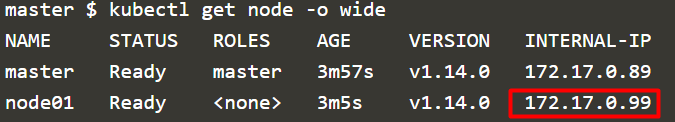

## はじめに

[Harbor](https://goharbor.io/) とはVMware によって開発されたプライベートコンテナイメージレポジトリで、プライベートの名の通りRBAC やイメージスキャンなど、セキュリティを高める機能が充実している。Harbor のデプロイのために[Helm](https://helm.sh/) と呼ばれるツールを使うが、これはHarbor とHelm を両方一度に勉強できる良い機会にほかならない。また、Helm のメジャーバージョンアップにHarbor 側の情報が追い付いておらず、特に私が確認した限りではQiita の記事はいずれも古かった。そこで、今回はHelm を使ったHarbor のデプロイを試すことで、Kubernetes におけるプライベートレポジトリとパッケージ管理ツールの両方を学びながら、 2020/02/03 現在における最新のHarbor インストール方法をご紹介する。なお、初めに断っておくが、**とても簡単である。**

## Harbor とは

コンテナイメージを管理するためのプライベートなレポジトリである、と言ってしまえば終わりであるが、もう少し具体的に表現すると、docker run でnginx やbusybox などをデプロイする時、当然ながらそのイメージをどこからか取ってこなければならない。このイメージの取得先がレポジトリであり、デフォルトでは[dockerhub](https://hub.docker.com/) になっている。

ただし、こちらはパブリックなレポジトリであり、多くのユーザーが自身で作成した非公式のイメージをアップロードしている。いわゆる「野良イメージ」を何も考えずpull するのはセキュリティ的に勇気がいるものだ。また、企業内で作成したコンテナイメージをパブリックなレポジトリにアップロードしたくない、という要件も少なくないであろう。

Harbor はdockerhub とは異なりプライベートなレポジトリで、閉じた環境の中で使用されることを前提としている。そのため、自身でレポジトリをデプロイする必要があるが、Web サーバーやデータベース、イメージスキャン機能など、サービス単位で分離された多くのコンテナ群で構成されるため、そのデプロイを簡素化する仕組みとして、Helm が利用される。

## Helm とは

Kubernetes におけるパッケージ管理ツールであるが、要するに複数のpod で構成されるサービスをよしなにデプロイしてくれるための自動化の仕組みを提供する。誰かがKubernetes はLinux みたいなものだと言っていたが、Helm はLinux におけるyum やapt-get と同じようなものと考えればよいであろう。インストールする単位がバイナリやライブラリからPod になっただけである。

Helm は実体を見てみると理解が深まる。

<figure>


<figcaption>

[https://github.com/helm/charts/tree/master/stable/wordpress](https://github.com/helm/charts/tree/master/stable/wordpress) （2020/02/03 参照）

</figcaption>

</figure>

Helm でWordpress をデプロイする場合のチャートである。チャートとは海図を意味し、要は自動的にPod 群をデプロイするための構成ファイル群である（ちなみにHelm は舵を意味する）。チャートには下記が含まれる。

1. templates
    - デプロイするk8s オブジェクトのマニフェスト
2. Chart.yaml
    - パッケージのmetadata
3. requirements.lock/requirements.yaml
    - 依存関係
4. values.yaml
    - デフォルトの設定値

templates ディレクトリを見てみると、お馴染みのk8s マニフェストが揃っている。よりイメージが沸いただろうか。


## Harbor のインストール

それでは本題である。インストールは下記の流れに沿って実施する。

1. Helm の準備
2. Harbor の準備
3. （オプション）イメージのプッシュ

Kubernetes の環境は自前で用意しても良いが、今回はおなじみKatacoda のPlayground を利用する。下記にアクセスした後、指示通りlaunch.sh を叩こう。

[https://www.katacoda.com/courses/kubernetes/playground](https://www.katacoda.com/courses/kubernetes/playground)

<figure>


<figcaption>

赤枠部をクリックすると自動的にコマンドが入力される。

</figcaption>

</figure>

### 1\. Helm の準備

今回の環境は既にHelm がインストールしてあるが、バージョンが古いため、最新版をインストールする。下記のドキュメントではいくつか方法が載っているが、次の方法でインストールしてみよう。

[https://helm.sh/docs/intro/install/](https://helm.sh/docs/intro/install/)

```
curl -fsSL -o get_helm.sh https://raw.githubusercontent.com/helm/helm/master/scripts/get-helm-3
chmod 700 get_helm.sh
./get_helm.sh
```


注意点として、昨年後半に実施されたv3 へのメジャーバージョンアップデートでtiller が廃止された。 ようするに、kubectl を叩くクライアント端末にて上記URL の方法を使えば一発でHelm がインストールできるようになったため、特にk8s クラスタに対して何かする必要はなく、インストールが非常にシンプルになった（なおkatacoda ではMaster とWorker が1 台ずつのため、必然的にMaster での操作になる）。

### 2\. Harbor の準備

まずは チャートを引っ張ってくる先であるレポジトリを追加する。

```
helm repo add harbor https://helm.goharbor.io
```

また、事前にHarbor のPod がデプロイされるNamespace を作成しておく。

```
kubectl create namespace harbor-system
```


次に、実際にHarbor をインストールするが、基本的にはhelm install コマンドを叩くだけである。ただし、values.yaml に記載されているデフォルトの設定値を--set オプションで変更する必要がある。今回は、Persistent Volume もIngress も使わず、Nodeport を使った一時的なテスト用の環境を作成する。Nodeport とは、Kubernetes クラスタの中のネットワーク体系の異なるPod に対して外部から接続するための手段を提供するための機能の1 つで、Worker Node のIP の特定のポートにアクセスしてきた時にDNAT させる仕組みである。ただし、当然ながらWorker Node のIP に直接アクセスする必要があり、実際にはNodeport を抽象化するLoadbalancer やIngress をフロントに配置することが多い。

細かいオプションの解説やデフォルト値については[コチラ](https://github.com/goharbor/harbor-helm)を参照していただきたいが、テスト用の環境としては、下記のようなオプションでのインストールが最も簡単であろう。

```
helm install harbor --namespace harbor-system harbor/harbor \
  --set expose.type=nodePort \
  --set expose.tls.enabled=false \
  --set persistence.enabled=false \
  --set externalURL=http://$Worker_IP:30002 \
  --set harborAdminPassword=VMware1!
```

v3 で--name オプションが必要なくなったため注意。また、Workernode のIP アドレスは下記にて取得する。

```
kubectl get node -o wide
```

<figure>



<figcaption>

（ユーザーによって異なるが）この場合はWorker Node 1 の172.17.0.99 の特定のポート（30002）に対してアクセスさせる。

</figcaption>

</figure>

さて、Helm のinstall コマンドを実行すると、harbor-system Namespace 内に多くのPod がデプロイされる。これらすべてがReady になるまでおおよそ1-2 分程度かかるため、気長に待とう。


以上でHarbor のインストールは終了であるが、Katacoda の中のNodeport、すなわち裏側で実行されているインスタンスのIP（172.17.0.99）に対し、どのようにアクセスすればよいのだろうか？

なんとKatacoda では外部からのアクセスにも対応している。Teminal Host 1 の横に+ ボタンがあるが、そこをクリックするとなんとホストの特定のポート（すなわちNodeport）にアクセスすることができるのだ。

<figure>


<figcaption>

ここではHost 2 にアクセスする。

</figcaption>

</figure>

別タブで開かれた新しいページにて、先ほど指定した30002 ポートを入力する。なお、指定したポート毎にURL が変化していることに注意する（アクセスするポート自体は443 のままである）。


<figure>


<figcaption>

VMware チックな Harbor のログイン画面。

</figcaption>

</figure>

上記のようなログイン画面が出れば成功である。admin/VMware1!（パスワードはhelm install 時に指定した）でログインしてみよう。


### 3\. イメージのプッシュ

最後に、実際にイメージをプッシュしてみる。が、その前に最近流行りのwebhook を試してみよう。webhook とは発行されたイベントをトリガーに外部サービスにHTTP で通知する仕組みである。slack 連携が有名だろうか。

Projects->library->Webhooks で連携するサービスのURL を入力する。今回はテスト用に下記サイトを使う。 このサイトで自分用のURL を発行できたら、そのURL をHarbor 側に入力する。これで準備は完了だ。

[https://webhook.site/](https://webhook.site/)


さて、いよいよイメージのpush を行う。まずはdocker login コマンドでpush するレポジトリにログインする。username/password は先ほどHarbor にログインしたものと同じだ。なお、ここで注意してほしい点が2 つある。1 つ目は、login 時に指定するURL にNode のIP を入力しないこと、2 つ目にFQDN:30002 とポート番号を指定しないことである。いずれもKatacoda 特有の注意点だが、1 つ目の理由はNodeport のURL に直接アクセスするとhttps ではなくhttp アクセスになり、push のためにdocker 側の設定を少し変更する必要がある。2 つ目の理由は単純にポート毎にURL が変更されるため、ポートを指定する必要がないからだ（URL に注目してほしい。30002 という番号が入っていることがわかる）。


push するイメージは何でもよいが、今回は既にダウンロード済のruby を使うことにする。library というのはデフォルトで作成されるHabor のプロジェクトであり、この配下にイメージを配置する。タグは何でもよい（今回は安易に"test" とした）。docker tag では、レポジトリ名とタグだけを変更した別のイメージを作成する（ただしイメージの参照先は同じ）。

```
docker tag ruby:2.5-alpine3.7 $Harbor_FQDN/library/ruby:test
```

このイメージをpush する。

```
docker push $Harbor_FQDN/library/ruby
```


すると、Harbor 側でもイメージが登録され、イメージのpush に対してwebhook も実行されていることがわかる。


最後に、デプロイされたPod 群をhelm uninstall で削除して完了だ。

```
helm uninstall harbor -n harbor-system
```

## まとめ

解説やスクリーンショットを多めにしたためかなり長くなってしまったが、要するに2020/02/03 現在のHarbor のインストール方法は下記の通りである。

Helm のインストール

```
curl -fsSL -o get_helm.sh https://raw.githubusercontent.com/helm/helm/master/scripts/get-helm-3
chmod 700 get_helm.sh
./get_helm.sh
```

レポジトリの追加

```
helm repo add harbor https://helm.goharbor.io
```

Namespace の追加

```
kubectl create namespace harbor-system
```

Harbor のインストール

```
helm install harbor --namespace harbor-system harbor/harbor \
  --set expose.type=nodePort \
  --set expose.tls.enabled=false \
  --set persistence.enabled=false \
  --set externalURL=http://$Worker_IP:30002 \
  --set harborAdminPassword=VMware1!
```

\--set オプションは必要に応じて変更してほしい。なお、今回ご紹介した方法もまた変更があるかもしれないので、可能な限り最新のドキュメントを追っていく必要がある。

また、今回は[Katacoda](https://www.katacoda.com/) と[webhook.site](https://webhook.site/) を利用した。色々応用が利くと思うのでこちらも併せて参考にしてほしい。
