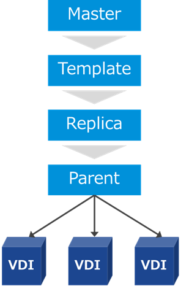
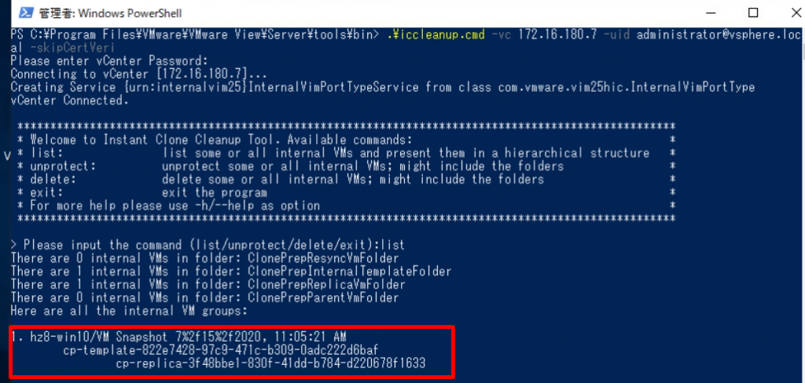
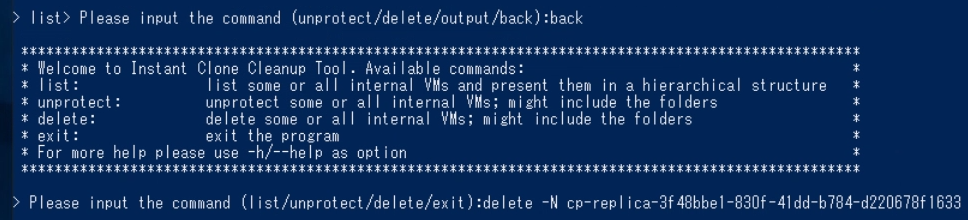

[Horizon 8 (2006) がGA された。](https://techzone.vmware.com/blog/whats-new-vmware-horizon-8-2006-cart-app-volumes-and-dynamic-environment-manager)今後はリンククローンが廃止され、インスタントクローンとフルクローンのみをサポートする方針に向かうようだ。私もインスタントクローンを検証しているが、さっそく問題が発生し、解決方法を探すのに手間取ったため、備忘録として残しておく。なお、本番環境で実際に実行する場合は、それなりにリスクのある操作のため、VMware サポートの指示を仰ぐべきである。

インスタントクローンでは図のようにMaster となるVM を作成し、スナップショットを作成後デスクトッププールを作成する。Template 以降は自動で作成され、管理者は操作しない。

<figure>



<figcaption>

Horizon 2006 の場合Parent (親) VMはリソース節約のために作成されない場合がある

</figcaption>

</figure>

このTemplate やReplica は本来デスクトッププールの削除とともにESXi ホスト上からは削除されるはずなのだが、たまにこれらが削除されない場合があった。vCenter からは削除操作ができないため、この場合Horizon Connection Server からInstant-Clone Maintenance Utilities のiccleanup.cmd というスクリプトを使って削除することになる。

[https://docs.vmware.com/en/VMware-Horizon/2006/virtual-desktops/GUID-6025D684-2E05-4857-9C24-18F16DDC38FD.html](https://docs.vmware.com/en/VMware-Horizon/2006/virtual-desktops/GUID-6025D684-2E05-4857-9C24-18F16DDC38FD.html)

スクリプトはConnection Server 上のC:\\Program Files\\VMware\\VMware View\\Server\\tools\\bin\\ にある。ドキュメントの通り下記コマンドのようにvCenter に接続する。

```
.\iccleanup.cmd -vc $VC_IP -uid $VC_ADMIN -skipCertVeri
```

指示通りlist で削除したいテンプレートやレプリカが表示されることを確認する。



back で一旦戻った後（重要）、対象のレプリカや親VM の名前を引数に、delete を実行してvCenter 上から削除されることを確認して完了である。

```
delete -N $VM_NAME
```



最後に注意点として、あくまでこれは最後の手段であり、基本的にはまず第一にHorizon 管理コンソールからプールを削除する。それでも削除されなかった場合、上記手順を実行する。

なお、本記事は、上記操作を推奨しているわけではないことは付け加えておく。
