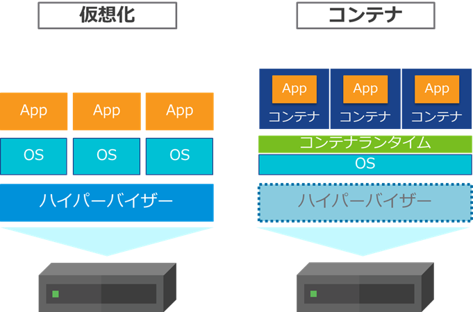
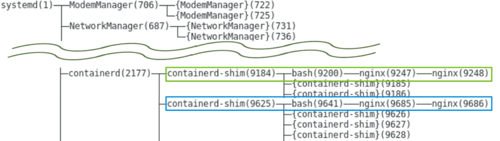
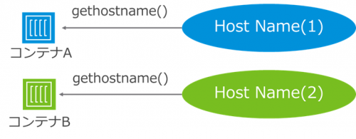

- [](https://blog.vpantry.net/posts/k8s-1)[はじめに - VMware ユーザーが Kubernetes を勉強する 1](https://blog.vpantry.net/posts/k8s-1)
- [](https://blog.vpantry.net/posts/k8s-2)[コンテナの基礎 - VMware ユーザーが Kubernetes を勉強する 2](https://blog.vpantry.net/posts/k8s-2)
- [](https://blog.vpantry.net/posts/k8s-3)[Docker の学習を効率化するTips – VMware ユーザーがKubernetes を勉強する 3](https://blog.vpantry.net/posts/2020/01/k8s-3/)
- [](https://blog.vpantry.net/posts/k8s-4)[Kubernetes の概要 – VMware ユーザーがKubernetes を勉強する 4](https://blog.vpantry.net/posts/2020/03/k8s-4/)
- [](https://blog.vpantry.net/posts/k8s-5)[Kubernetes アーキテクチャの基本– VMware ユーザーがKubernetes を勉強する 5](https://blog.vpantry.net/posts/2020/05/k8s-5/)
- [](https://blog.vpantry.net/posts/k8s-6)[Kubernetes のネットワーク 前編 – VMware ユーザーがKubernetes を勉強する 6](https://blog.vpantry.net/posts/2020/05/k8s-6-1)
- [](https://blog.vpantry.net/posts/k8s-7)[Kubernetes のネットワーク 後編 – VMware ユーザーがKubernetes を勉強する 7](https://blog.vpantry.net/posts/2020/07/k8s-7/)

前回に引き続き、「VMware ユーザーが Kubernetes を勉強する」シリーズの第2 回は、コンテナの基礎をテーマとする。Kubernetes でいくらコンテナランタイムが抽象化されているとはいえ、コンテナ技術を理解していないと歯が立たない。とはいえ、本気で理解しようとすると仮想マシンのほうがよっぽど難しいので、VMware ユーザーであれば比較的簡単にキャッチアップできるはずである。

### コンテナとは？

リソース・名前空間が隔離されたプロセスである。プロセスなので、HW 初期化などのブートの一連の流れがなく、起動が高速である。コンテナはホストOS の上でcgroup やnamespace といったLinux の機能を使って、独立性をホストOS の上で実現している。

<figure>



<figcaption>

コンテナをデプロイするOS は仮想マシンであることが多い。ハイパーバイザーの役割でいうところのリソース配分はホストOS 側の仕事にはなるものの、ホストOS に対するスケール性やポータビリティ、 コンテナをホストしていない他の仮想マシンも考えると、ハイパーバイザーはやはり大きなメリットである。

</figcaption>

</figure>

コンテナはプロセスなので、 systemd からfork されるプロセスツリーとして、ホストOS からはコンテナは当然のこと、コンテナの中で起動しているプロセスも見える。

<figure>



<figcaption>

2 つのnginx コンテナを作成し、コンテナの外であるホストOS からpstree を実行した例。  
2 つのコンテナの中で起動するbash やnginx プロセスが見える。

</figcaption>

</figure>

この観点は、 ハイパーバイザーからは仮想マシンが見えないという絶対のルールに慣れ親しんだ我々からするといささか奇妙にも思えるが、この点は仮想マシンとコンテナの大きな違いである。それがゆえに、コンテナのセキュリティというのはどうしても仮想マシンと比較すると弱い。カーネルの特権をコンテナから奪われてしまうと、その影響は大きい。

この特権奪取に関しては、最近だと[CVE-2019-14271](https://unit42.paloaltonetworks.jp/docker-patched-the-most-severe-copy-vulnerability-to-date-with-cve-2019-14271/) が記憶に新しい。docker cp でホスト-コンテナ間のデータのコピーをする際、コンテナ側のライブラリを読み込んでしまい、仮に不正なコンテナイメージを使用していた場合、最悪そのコンテナが稼働するホスト内の他のすべてのコンテナのルート権限を取得されてしまうという恐ろしい脆弱性だ。

カーネルごと分離する仮想マシンよりもセキュリティリスクは大きいといえるが、軽量でカスタマイズ済みの環境をいち早く手に入れられるというメリットは、開発者にとっては非常にありがたい（vSphere ユーザーとしては軽量な仮想アプライアンスを高速にデプロイできる、と考えれば分かりやすいかもしれない）。

いずれにせよ、仮想マシンとコンテナには各々のメリットがあり、用途に応じて使い分けていく必要があるが、今回のテーマはコンテナ「技術」のため、もう少し詳細な技術説明をするとしよう。

### コンテナにおける独立性のトリック

コンテナを理解するうえで重要な感覚は、「データの参照先が全く異なる」という点だけである。ここさえ理解すればコンテナ完全に理解した、と言っても過言ではない（と個人的に思っている）。

例えば、ターミナル上で_hostname_ と入力した時は、自身のホスト名が表示されることはご存知の方も多いと思う。

```
[root@localhost /]# hostname
localhost.localdomain
```

裏側では、システムコールgethostname(2) が呼ばれ、ホスト名を取得している。

コンテナでは、コンテナごとに （本来OS が1 つだけ持つはずの） ホスト名を変更することができるが、このトリックは参照先が全く異なるという非常に単純な実装である。

<figure>



<figcaption>

コンテナごとに取得するリソースが全く異なるので、コンテナは独立性をもつ

</figcaption>

</figure>

コンテナがそれぞれ独立したディレクトリ構造を持つのも、独立したプロセスID を持つのも、それはコンテナが参照するリソースが異なるというだけである。

では、リソースの参照先を変えるために、裏側で何が起こっているのかをもう少し深堀してみよう。まずはgethostname の実装を見てみる。

[kernel](https://elixir.bootlin.com/linux/latest/source/kernel)/[sys.c](https://elixir.bootlin.com/linux/latest/source/kernel/sys.c)

```
 SYSCALL_DEFINE2(gethostname, char __user *, name, int, len)
 {
	~~~   
     u = utsname();
	~~~
 }
```

分かりやすいように簡略しているが、要するにgethostname() を実行するとutsname を取得する、ということだけ理解していただければよい。では、utsname とは何か？

[include](https://elixir.bootlin.com/linux/latest/source/include)/[linux](https://elixir.bootlin.com/linux/latest/source/include/linux)/[utsname.h](https://elixir.bootlin.com/linux/latest/source/include/linux/utsname.h)

```
 static inline struct new_utsname *utsname(void)
 {
     return &current->nsproxy->uts_ns->name;
 }
```

今回お伝えしたいことがこのコードにすべて詰まっている。&current とは現在のプロセスの情報を持つ構造体であるが、その中のnsproxy を呼び、さらにその中のuts\_ns、name と参照していることがわかる（アロー演算子-> は〇〇の××と、左から順に読んでいけばよい）。つまり、コンテナは全く意識せず、nsproxy と呼ばれる謎のデータを勝手に参照している。これは（おそらく）Namespace Proxy の略で、名前空間の参照先を振り替えている正体に他ならない。

[include](https://elixir.bootlin.com/linux/latest/source/include)/[linux](https://elixir.bootlin.com/linux/latest/source/include/linux)/[nsproxy.h](https://elixir.bootlin.com/linux/latest/source/include/linux/nsproxy.h)

```
 struct nsproxy {
 	~~~
     struct uts_namespace *uts_ns;
	~~~
 };
```

ついでにnsproxy を見てみると、\*uts\_ns を参照していることになるが、ここで自身のプロセスが所属する名前空間（ここではUTS 名前空間）を参照させている。

つまり、あらゆるプロセスがホスト名を取得するためにシステムコールgethostname() を発行すると、裏側ではnsproxy により名前空間を振り分けられている。その名前空間の中でホスト名は個別に持っているため、名前空間が異なるプロセスはホスト名の参照先が異なる。言い換えると、**コンテナは名前空間を個別に持たせることで、システムコールの参照先を変更し、独立性を確保している。**なお、あらゆるgethostname() はnsproxy を介するため、コンテナを実行するホストOS それ自身も、実はnsproxy により自動的に自分の名前空間のホスト名を参照させられている。

nsproxy によりデータの参照先を自動的に変更する、これがコンテナの肝である。

なお、ホスト名以外にも名前空間は存在し、同様に異なる名前空間のリソースを使用することで、独立性を維持している（この独立性が崩れた時、それがコンテナのセキュリティ問題に繋がることは容易に想像がつくはずだ）。今回紹介したホスト名はUTS 名前空間に所属する。詳細は下記リンク先を参照してほしい。  
[https://linuxjm.osdn.jp/html/LDP\_man-pages/man7/namespaces.7.html](https://linuxjm.osdn.jp/html/LDP_man-pages/man7/namespaces.7.html)

### まとめ

乱暴な言い方をすれば、コンテナは配列のようなものである。データの参照先がことなるだけなので、仮想マシンのように複雑な、仮想ハードウェア、仮想BIOS、 VMM/VMXなどは存在せず、その実装は非常にシンプルだ。つまり、仮想マシンの方がよっぽど難しいのである。コンテナ自体は比較的新しい概念ではあるものの、もっともっと難しい仮想マシンを扱うことができるvSphere ユーザーであれば、恐るるに足らない。また、Linux OS 1 つあれば（Windows でもOK だが）簡単に検証できるのも嬉しいところだ。得てして物事の仕組みは実際に触って初めて腹落ちして理解できるものだ。

本記事がコンテナの理解に少しでも役立てば幸いである。
