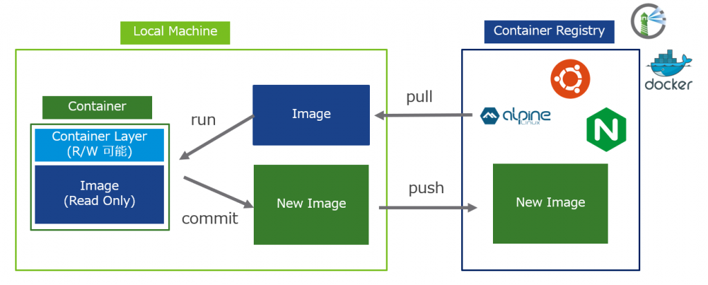
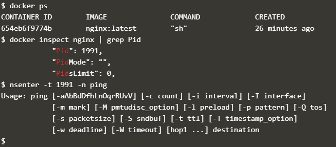
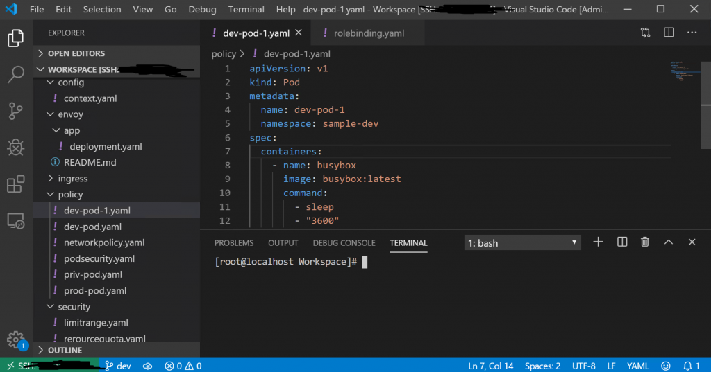

- [](https://blog.vpantry.net/posts/k8s-1)[はじめに - VMware ユーザーが Kubernetes を勉強する 1](https://blog.vpantry.net/posts/k8s-1)
- [](https://blog.vpantry.net/posts/k8s-2)[コンテナの基礎 - VMware ユーザーが Kubernetes を勉強する 2](https://blog.vpantry.net/posts/k8s-2)
- [](https://blog.vpantry.net/posts/k8s-3)[Docker の学習を効率化するTips – VMware ユーザーがKubernetes を勉強する 3](https://blog.vpantry.net/posts/2020/01/k8s-3/)
- [](https://blog.vpantry.net/posts/k8s-4)[Kubernetes の概要 – VMware ユーザーがKubernetes を勉強する 4](https://blog.vpantry.net/posts/2020/03/k8s-4/)
- [](https://blog.vpantry.net/posts/k8s-5)[Kubernetes アーキテクチャの基本– VMware ユーザーがKubernetes を勉強する 5](https://blog.vpantry.net/posts/2020/05/k8s-5/)
- [](https://blog.vpantry.net/posts/k8s-6)[Kubernetes のネットワーク 前編 – VMware ユーザーがKubernetes を勉強する 6](https://blog.vpantry.net/posts/2020/05/k8s-6-1)
- [](https://blog.vpantry.net/posts/k8s-7)[Kubernetes のネットワーク 後編 – VMware ユーザーがKubernetes を勉強する 7](https://blog.vpantry.net/posts/2020/07/k8s-7/)

今回は趣向を変えて、コンテナランタイムの1 つであるDocker の学習を効率化させるTips を紹介する。Docker については既に沢山の情報源があるが、やはり触って初めて理解が深まるものだ。ただし、これは自分の経験に基づくが、Docker の学習を始めるためにLinux 環境を用意したはよいものの、コマンドも多く、概念もこれまでのvSphere とは大きく異なるため、中々うまくいかない。また、そもそも自分で触れる仮想環境がない場合も多い。

そこで、いわゆるベーシックな情報については他の情報ソースにお任せするとして、本記事ではDocker の勉強をするにあたって、予め押さえておくことで学習のモチベーションを継続させるTips をご紹介する。

### Docker を利用する方法

Docker を利用する方法として（多分）大きく3 種類ある。

1. 仮想マシンをvSphere やAWS 上にデプロイ
2. 自身のローカルの端末
3. Docker がインストールされている環境を使用

1 ではAWS でもよいが、私のようにEC2 の無料期間が切れているのであれば、是非vSphere を使おう。vSphere 環境を用意できる場合、まずはテンプレートとなる仮想マシンを用意する。既に自前で用意している場合は省略しても構わないが、そうでなければこの際作ってしまおう。ポイントは、なるべく無駄なものを入れず、適宜スナップショットを取りつつ環境を作成していく。テンプレートVM を作成するTips をまとめたので参考にしてほしい。

- firewall の無効化
    - 例えば：  
        [https://software.fujitsu.com/jp/manual/manualfiles/m140026/j2x17799/06z200/j7799-00-04-07-00.html](https://software.fujitsu.com/jp/manual/manualfiles/m140026/j2x17799/06z200/j7799-00-04-07-00.html)
- SELINUX の無効化
    - 例えば：  
        [https://access.redhat.com/documentation/ja-jp/red\_hat\_enterprise\_linux/6/html/security-enhanced\_linux/sect-security-enhanced\_linux-enabling\_and\_disabling\_selinux-disabling\_selinux](https://access.redhat.com/documentation/ja-jp/red_hat_enterprise_linux/6/html/security-enhanced_linux/sect-security-enhanced_linux-enabling_and_disabling_selinux-disabling_selinux)
- スクリーンセーバーの無効化
    - 例えば：  
        [https://freebsd.sing.ne.jp/linux/03/03/02/02.html](https://freebsd.sing.ne.jp/linux/03/03/02/02.html)
- root での自動ログイン
    - 例えば：  
        [https://www.daimongu.com/2018/01/09/linux-auto-login-with-root-account/](https://www.daimongu.com/2018/01/09/linux-auto-login-with-root-account/)

これ以外にも色々あるが（利用しない仮想HW の削除など）、まずはとにかくセキュリティの考えを捨て、トラシュのポイントを減らすことが重要である（とはいえ、あくまでも検証環境の準備の話であることに注意されたい）。また、作成した仮想マシンをテンプレート化し、Docker やk8s インストール時に気軽に仮想マシンを削除・再作成できるよう準備しておくことが望ましい。

次に2 について。私はWindows ユーザーなのでDocker for Windows を使う場合だが、個人的にはローカル環境を汚してしまうためお勧めしない。VMware Workstation と競合してしまうのも難点。とはいえ便利なものは便利なので、そういったデメリットを許容できるのであれば、 選択肢にはなるだろう。お勧めはしないが。

最後に3 について。こんな環境あるのか？という話だが、ある。例えばVMware のハンズオンラボは、アカウント登録をしていれば誰でもDocker Ready な仮想マシンを使用できる。

[https://labs.hol.vmware.com/HOL/catalogs/enrollments/lab/NEE-4757151\_\_1829939](https://labs.hol.vmware.com/HOL/catalogs/enrollments/lab/NEE-4757151__1829939)

ただし、パフォーマンスに難があるため、[Katacoda](https://www.katacoda.com/) を個人的に推奨する。下記リンク先のplayground では、自由にdocker を触ることができる。その他にも様々なシナリオやDocker 以外のコンテンツも充実しているため、非常にお勧めだ。

[https://www.katacoda.com/courses/docker](https://www.katacoda.com/courses/docker)

### Docker でよく使うコマンド

```
docker run -it $Image_Name sh
```

最初はこのコマンドにお世話になるであろう。何はともあれdocker run だが、裏側ではイメージのpull も行われている。例えば、"docker run -it nginx sh" はnginx というweb サーバーのイメージを（端末にない場合は）レポジトリから取得し、それを基にコンテナを起動して中でシェルを起動し、ホストのターミナルと繋げるという一連の流れを実行している。



他にも図のようにcommit やpush など様々なコマンドはあるが、まずは色々なコンテナをrun してみて遊んでみるのが一番である。

参考までに、学習の始めに自分がよく使った他のコマンドをまとめた。

<table><tbody><tr><td><strong>コマンド</strong></td><td><strong>説明</strong></td></tr><tr><td>docker start</td><td>停止しているコンテナを起動します。</td></tr><tr><td>docker exec</td><td>既に起動しているコンテナの中に入ります。</td></tr><tr><td>docker ps</td><td>起動中のコンテナをリストします。<br>停止したコンテナも含める場合は–a を追加します。</td></tr><tr><td>docker images</td><td>ローカルにPullしたコンテナイメージをリストします。</td></tr><tr><td>docker cp</td><td>ホスト – コンテナ間のファイルのやり取りができます。</td></tr></tbody></table>

### コンテナのトラブルシューティング

コンテナを作ったはいいが、中でping やvi ができず途方に暮れるのはありがちなことだ。素直にコンテナの中で機能をインストールしてもよいが、ここでは[nsenter](http://man7.org/linux/man-pages/man1/nsenter.1.html) を紹介する。

nsenter はその名の通り、コンテナの名前空間（namespace）に入る（enter）コマンドである。コンテナの独立性は、リソースの参照先が異なっているだけ、ということを思い出してほしい。独立していることでコマンドが使えないのであれば、その独立性の原因である、リソースの参照先（＝名前空間）が異なるというその点のみを捻じ曲げればよい。ようするに、部分的にコンテナとホストOS の名前空間を都合よく繋げてあげるのだ。こうすることで、例えばほとんどホストなのだけれども、NW 名前空間だけコンテナのものを使用することで、コンテナのルーティングテーブルやNW インターフェースを利用して、あたかもコンテナからping を実行しているかのように振る舞うことができる。

最近はnsenter はOS に標準で入っているが、使う上でコンテナのプロセスID を確認する必要がある。下記のスクリーンショットの通りに実行すればよい。



コンテナの中を汚さずに済むので、是非利用してほしい。

### エディタ

Dockerfile やk8s でのyaml を書く際に、どうしても良い感じのエディタが欲しくなる。エディタやIDE は多くの場合論争のきっかけになるため、ここでは私が使っているオススメのエディタを1 つだけ紹介するに留めたい。

[VSCode](https://code.visualstudio.com/) である。

導入も簡単で、 Windows も対応しており、 SSH 接続した先の端末でエディタとして使用可能だ。また、Docker for Windows ユーザーには特にありがたいが、コンテナに対して直接接続が可能だ。コンテナの中にまともなエディタが入っていない場合でも、VSCode のメリットを活用できる。

機能詳細は他の情報源を参考にしていただきたいが、是非活用してみて欲しい（自分はCloud9 から乗り換えた）。

<figure>



<figcaption>

UI イメージ。SSH で作成した仮想マシンにログインしている。ターミナルも当然利用できる。

</figcaption>

</figure>

### まとめ

本記事で覚えていただきたいのは下記の3 つだけである。

1. [Katacoda](https://www.katacoda.com/)
2. [nsenter](http://man7.org/linux/man-pages/man1/nsenter.1.html)
3. [VSCode](https://code.visualstudio.com/)

是非ともこれらを活用し、コンテナやk8s の学習を進めてみて欲しい。
