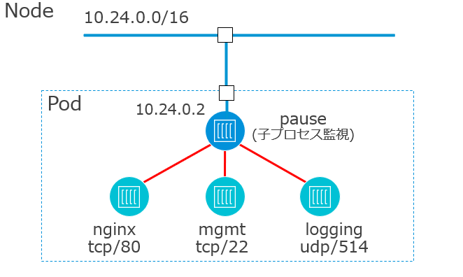

- [](https://blog.vpantry.net/posts/k8s-1)[はじめに - VMware ユーザーが Kubernetes を勉強する 1](https://blog.vpantry.net/posts/k8s-1)
- [](https://blog.vpantry.net/posts/k8s-2)[コンテナの基礎 - VMware ユーザーが Kubernetes を勉強する 2](https://blog.vpantry.net/posts/k8s-2)
- [](https://blog.vpantry.net/posts/k8s-3)[Docker の学習を効率化するTips – VMware ユーザーがKubernetes を勉強する 3](https://blog.vpantry.net/posts/2020/01/k8s-3/)
- [](https://blog.vpantry.net/posts/k8s-4)[Kubernetes の概要 – VMware ユーザーがKubernetes を勉強する 4](https://blog.vpantry.net/posts/2020/03/k8s-4/)
- [](https://blog.vpantry.net/posts/k8s-5)[Kubernetes アーキテクチャの基本– VMware ユーザーがKubernetes を勉強する 5](https://blog.vpantry.net/posts/2020/05/k8s-5/)
- [](https://blog.vpantry.net/posts/k8s-6)[Kubernetes のネットワーク 前編 – VMware ユーザーがKubernetes を勉強する 6](https://blog.vpantry.net/posts/2020/05/k8s-6-1)
- [](https://blog.vpantry.net/posts/k8s-7)[Kubernetes のネットワーク 後編 – VMware ユーザーがKubernetes を勉強する 7](https://blog.vpantry.net/posts/2020/07/k8s-7/)

### はじめに

シリーズ4 回目である今回は、Kubernetes（k8s）において、最低限知っておかなければならないであろう概要の部分をまとめる。実際、オープンソースであり情報がそこら中に落ちていること、また情報が「ナマモノ」であるため、ググって最新の情報を調べた方が良いと思っているので、正直なところ概要は簡潔に書こうと思う。今後記事作成予定のネットワークの部分は、まだまだ日本語の情報も少ないため厚めにする予定である。

### Kubernetes とは

先に紹介したDocker 等のコンテナランタイム（コンテナを使うためのソフトウェア）を制御する最も一般的なオーケストレーションツールである。コンテナ単品で扱うよりも、主に以下の点でメリットがある。

1. 増加するコンテナの管理
    - コンテナが100台～というレベルになってくると、docker コマンドだけだと単体で管理するのは骨が折れる。
2. コンテナの可用性
    - OS の上でプロセスとしてコンテナは稼働するため、プロセス停止時もダウンタイムを最小限に復旧してほしい。
3. ホストが2 台3 台と増えた場合のネットワーク
    - Docker のネットワークは172.17.0.0/16 をホスト内に閉じた形で提供するため、このセグメントはホスト （コンテナを動かす仮想マシン） 間で被る。ホストが増えた場合、ホスト間で連携したコンテナネットワークを用意する仕組みが必要である。

誰かが世の中分散と集中を繰り返す、と言っていたが、これはまさにその通りで、コンテナという分散するシステムをk8s というレイヤーを1 枚挟み集中管理しているというわけだ。

k8s には大きく2 つの特徴的な概念がある。それが**宣言的設定**と**セルフヒーリング**だ。それらを説明する前に、まずはPod について説明せねばなるまい。

### Pod とは

k8s においてはコンテナは直接扱わず、それを抽象化したPod という粒度で管理する（またまた抽象化である）。Pod は複数のコンテナを含み、一部Namespace 、具体的にはUTS、IPC、Network の3つのNamespace をコンテナ間で共有する。設定によってはストレージを共有することもできる。とはいえ基本的にコンテナと1:1 対応するので、Pod = コンテナと思っていただければ十分である。

<figure>



<figcaption>

Pod 内のコンテナはNetwork Namespace を共有するためIP アドレスやルーティングテーブルが同じであり、同一Pod 内のコンテナはlocalhost で通信するためPort 番号の重複は不可。

</figcaption>

</figure>

Pod = コンテナであれば、なぜわざわざ無駄に1 枚抽象化レイヤを挟むのだろうか？それは、複数のコンテナをまとめて一緒に管理した方が都合がよい場合があるからである。

一番のユースケースは、サイドカーと呼ばれる、コンテナインジェクションだろう。コンテナの中で機能をインストールするのではなく、その機能を持ったコンテナをコンテナという単位でPod の中に追加し、Namespace を共有するのである。例えば、前回ご紹介したように、Nginx Web サーバーのトラブルシューティング時に、Nginx 自身にyum などで機能をインストールするのではなく、Busybox コンテナをNginx と同じPod に追加し、トラシュ用の機能を後付けするようなイメージだ（あまりすることはないだろうが ）。もっと乱暴に言うと、仕事と同じで、一人で何でも頑張るのではなく、それぞれのスキルに長けた人をアサインしチームとしてプロジェクトを完遂する、そんな感じだろうか（逆に分かりづらくなっている気がする）。

要するにPod は、コンテナの中をなるべく汚さない、という美学に沿った使い方を実現可能であり、極めて合理的な発想なのである。

コンテナを抽象化するのがPod と説明したが、そのPod をさらに抽象化して管理するのが一般的だ。それがDeployment、Daemonset、Statefulset である。最も重要なのがDeployment であり、通常はPod ではなくDeployment という単位でk8s 環境にデプロイする。これは、セルフヒーリングの機能やスケールアウト、ローリングアップデートが実行できるためだ。

### 宣言的設定とセルフヒーリング

マニフェストを宣言することで、マニフェスト通りにコンテナを作成したり削除したりすることができる。k8s の世界では、マニフェストが全てであり、現実と異なりマニフェストを可能な限り順守するのだ。

分かりづらい概念だと思うので、コンテナを作成するマニフェストsample-pod.yaml の例で考えてみよう。

```
apiVersion: v1
kind: Pod
metadata:
  name: sample-pod
spec:
  containers:
    - name: nginx
      image: nginx:latest
```

これが、Pod を作成するマニフェストだ。マニフェストはyaml 形式で書かれ、ユーザーはyaml を書いてPod を運用する。

まず、この**yaml がk8s において一番の障壁となる**。A wall of YAML とも言われ、 日本だけではなく、万国共通、取っつきづらさの大きな原因だ。

このyaml の壁を取り除くような動きは当然ながらあるものの、とはいえ基本中の基本であり、初歩的なもの、例えば先のPod のyaml ぐらいはコピペではなくソラで書けるようになるまで練習することを推奨する。

1. apiVersion（リソースが属するapi のグループとバージョン）
2. kind（リソース名）
3. metadata（オブジェクトを一意に特定する情報）
4. spec（オブジェクトのパラメータ）

yaml はこの4 つで構成される。まずはこれを暗記するのがk8s における最初の一歩である。

さて、このyaml 形式のマニフェストをkubectl apply コマンドでk8s クラスタに対して適用すると、Nginx Pod が立ち上がるというわけだ。立ち上げたPod の中には当然入ることもできる。

```
[root@localhost Workspace]# kubectl apply -f sample-pod.yaml 
 pod/sample-pod created
[root@localhost Workspace]# kubectl get pod
 NAME         READY   STATUS    RESTARTS   AGE
 sample-pod   1/1     Running   0          13s
[root@localhost Workspace]# kubectl exec -it sample-pod -- sh
# hostname
sample-pod
# ls
bin  boot  dev  etc  home  lib  lib64  media  mnt  opt  proc  root  run  sbin  srv  sys  tmp  usr  var
```

さて、今度は先述した一般的なPod の管理形態であるDeployment を作成してみよう。細かいyaml の記述方法は覚えなくてよい。重要なのは、template 以下に先ほどのPod のmetadata とspec を記載するが、metadata にlabel （オブジェクトを特定するためのKey&Value、ここではapp : web）を設定し、そのLabel が設定されたPod をDeployment で管理する、という点だけだ。

```
apiVersion: apps/v1
kind: Deployment
metadata:
  name: sample-deployment
spec:
  strategy:
    type: Recreate
  replicas: 1
  selector:
    matchLabels:
      app: web
  template:
    metadata:
      name: sample-pod
      labels:
        app: web
    spec:
      containers:
        - name: nginx
          image: nginx:latest
```

同様にapply すると、Deployment およびそれに管理されるPod が出来上がる。

```
[root@localhost Workspace]# kubectl apply -f sample-deployment.yaml 
deployment.apps/sample-deployment created
[root@localhost Workspace]# kubectl get deployment 
NAME                READY   UP-TO-DATE   AVAILABLE   AGE
sample-deployment   1/1     1            1           7s
[root@localhost Workspace]# kubectl get pod
NAME                                 READY   STATUS    RESTARTS   AGE
sample-deployment-78dd7b5b68-pwv4l   1/1     Running   0          18s
```

ところで先ほどのマニフェスト、単にDeployment やPod を作成するためにあるわけではない。マニフェストはそれを順守させるために定義される。どういうことだろうか。

ここで、Pod を削除してみよう。削除はkubectl delete コマンドで可能だ。

```
[root@localhost Workspace]# kubectl delete pod sample-deployment-78dd7b5b68-pwv4l 
pod "sample-deployment-78dd7b5b68-pwv4l" deleted
[root@localhost Workspace]# kubectl get pod
NAME                                 READY   STATUS    RESTARTS   AGE
sample-deployment-78dd7b5b68-qmlqx   1/1     Running   0          16s
```

Pod の名前の末尾が若干変わり、AGE、すなわちPod が作成されてからの時間が若くなっていることに注目してほしい。つまり、Deployment がPod の削除を検知して、 自動的にPod を再作成しているのである。マニフェストにはreplicas: 1 とあるように、Pod を必ず1 つ作成することがDeployment としての義務であり、順守しなければならない約束事なのだ。Pod が削除された場合は、replicas: 0 となり、マニフェストとのずれが生じてしまうため、マニフェストとの整合性を取るために、Pod を再作成する。これがセルフヒーリングだ。

Pod がデプロイされている仮想マシンに障害が起こった場合も同様に、それを検知して別の仮想マシン上にコンテナを再デプロイする。vSphere HA のようなものだ。worker-2 上で作成されたPod がworker-1 で再作成されていることが、下記の出力から分かる。

```
[root@localhost Workspace]# kubectl get pod -o wide --watch
NAME                                 READY   STATUS    RESTARTS   AGE     IP                NODE             NOMINATED NODE   READINESS GATES
sample-deployment-78dd7b5b68-qmlqx   1/1     Running   0          5m57s   192.168.231.195   worker-2   <none>           <none>
sample-deployment-78dd7b5b68-qmlqx   0/1     Error     0          6m34s   <none>            worker-2   <none>           <none>
sample-deployment-78dd7b5b68-qmlqx   0/1     Terminating   0          12m     <none>            worker-2   <none>           <none>
sample-deployment-78dd7b5b68-llh97   0/1     Pending       0          0s      <none>            <none>           <none>           <none>
sample-deployment-78dd7b5b68-llh97   0/1     Pending       0          0s      <none>            worker-1   <none>           <none>
sample-deployment-78dd7b5b68-llh97   0/1     ContainerCreating   0          0s      <none>            worker-1   <none>           <none>
sample-deployment-78dd7b5b68-llh97   0/1     ContainerCreating   0          2s      <none>            worker-1   <none>           <none>
sample-deployment-78dd7b5b68-llh97   1/1     Running             0          11s     192.168.56.227    worker-1   <none>           <none>
```

### まとめ

今回は、Kubernetes の概要ということで、以下を説明した。

- Kubernetes はコンテナオーケストレーションツールのデファクト
    - コンテナの管理を"よしなに" 実行してくれる
- Kubernetes ではPod と呼ばれる単位でコンテナを扱う
    - Pod はDeployment という単位で管理されることが多い
    - Pod の粒度で扱うよりもメリットがある
- マニフェストと呼ばれるyaml ファイルでPod などを操作する
    - マニフェストからの逸脱を検知し自動的に修復

次回はKuberentes のアーキテクチャを説明する。
