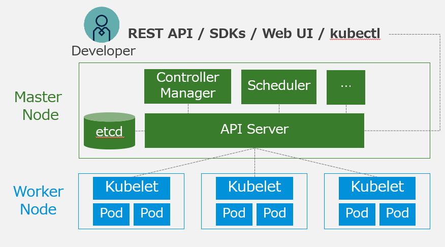
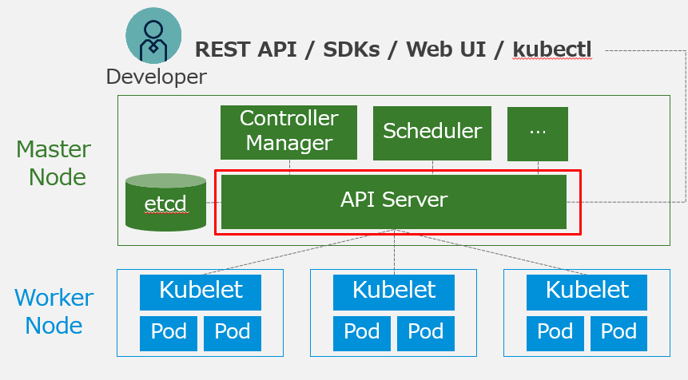
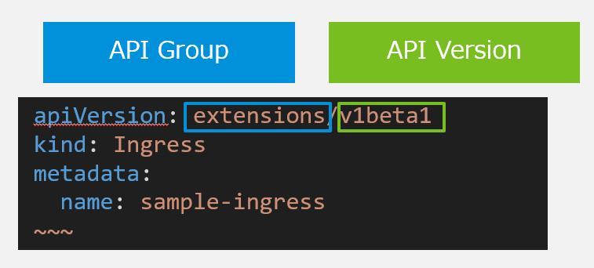
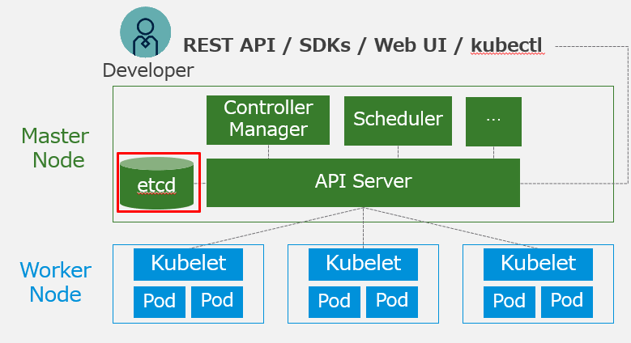
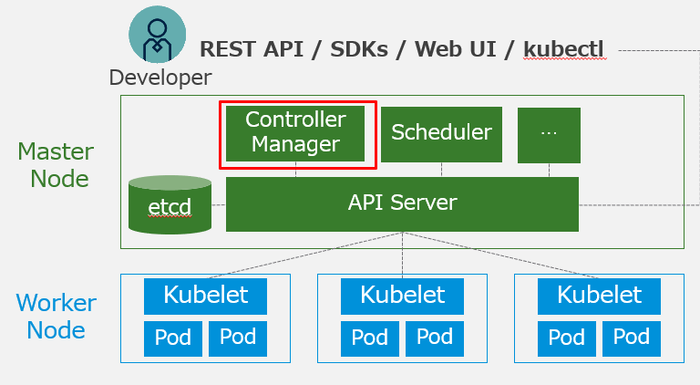
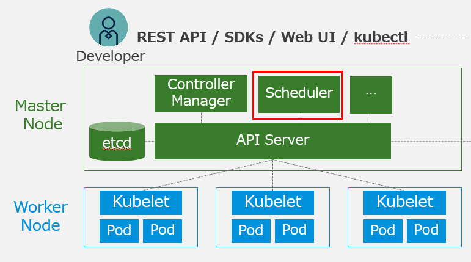
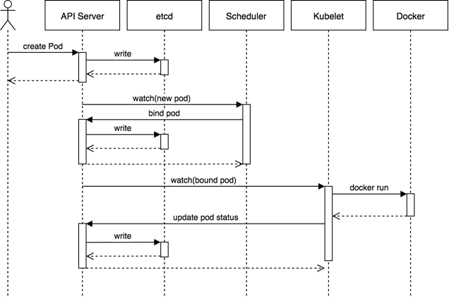

- [](https://blog.vpantry.net/posts/k8s-1)[はじめに - VMware ユーザーが Kubernetes を勉強する 1](https://blog.vpantry.net/posts/k8s-1)
- [](https://blog.vpantry.net/posts/k8s-2)[コンテナの基礎 - VMware ユーザーが Kubernetes を勉強する 2](https://blog.vpantry.net/posts/k8s-2)
- [](https://blog.vpantry.net/posts/k8s-3)[Docker の学習を効率化するTips – VMware ユーザーがKubernetes を勉強する 3](https://blog.vpantry.net/posts/2020/01/k8s-3/)
- [](https://blog.vpantry.net/posts/k8s-4)[Kubernetes の概要 – VMware ユーザーがKubernetes を勉強する 4](https://blog.vpantry.net/posts/2020/03/k8s-4/)
- [](https://blog.vpantry.net/posts/k8s-5)[Kubernetes アーキテクチャの基本– VMware ユーザーがKubernetes を勉強する 5](https://blog.vpantry.net/posts/2020/05/k8s-5/)
- [](https://blog.vpantry.net/posts/k8s-6)[Kubernetes のネットワーク 前編 – VMware ユーザーがKubernetes を勉強する 6](https://blog.vpantry.net/posts/2020/05/k8s-6-1)
- [](https://blog.vpantry.net/posts/k8s-7)[Kubernetes のネットワーク 後編 – VMware ユーザーがKubernetes を勉強する 7](https://blog.vpantry.net/posts/2020/07/k8s-7/)
- 
### はじめに

シリーズ5 回目である今回は、Kubernetes（k8s）において、アーキテクチャの基本を中心にまとめる。 特にk8s を勉強するにあたり最初に悩むのはコンポーネントの多さだろう。似たような名前も多く、どういう役割なのか、実態は何なのか、触ってみないと掴みづらい。 本記事では、その中でも特に重要な部分に焦点を当てて解説する。

### アーキテクチャ概要



k8s は複数のMaster Node と複数のWorker Node で構成される。Master Node やWorker Node は多くの場合Linux のVM であるが、最近はWindows Server も登場してきた。基本的には、Master Node はk8s クラスタの管理系コンポーネント群で構成され、ユーザーはWorker Node に対してPod をデプロイする。

Master Node は本番環境であれば基本的に3 台（多くても5 台）、Worker Node の数は環境次第だが、v1.18 では最大5000 Worker Node で150000 Pod まで作成できるらしい。とはいえ、現実的には可用性やパフォーマンスの観点から、k8s クラスタそのものを分けることも多い。kubeadm やCluster API の発展によるデプロイの迅速化、k8s クラスタの管理ツール（VMware であればTanzu Mission Control が該当する）の登場により、今後k8s を本番環境で使うのであれば、 マルチクラスタの考え方は必須になると個人的には考える。

さてここからは、各Node における超重要なコンポーネントを解説する。

### Master Node

#### API Server



Master Node に存在するPod であり、ユーザーや各コンポーネントが通信をする際のハブとなる。また、後述するetcd （k8s クラスタのデータベース）と唯一コミュニケーションすることができる。その名の通りREST API で各コンポーネントとコミュニケーションをするのだが（etcd とはgRPC）、重要なのは「ハブになる」という点で、ユーザーがkubectl コマンドでマニフェストをapply する場合、そのマニフェストの投げ先はAPI Server である。具体的には、Network Namespace をMaster Node と共有していてポート6443 で待ち受けている API Server のPod である。

API にはバージョンが存在する。

- Stable (GA)：通常使用可能な機能
- α :デフォルト無効、本番環境では非推奨
- β：デフォルト有効、テスト済みだが機能細部は変更の可能性アリ

API が（etcd を除く）全てのコミュニケーション手段ということを注意する。つまり、マニフェストを宣言し、Worker Node にPod が作成するそのMaster - Worker Node 間のコミュニケーションはREST API だ。だから、k8s でオブジェクトを作成することは、すなわちそのオブジェクトを作成するAPI を叩くことに他ならないため、マニフェストには、展開するリソース（kind）と、そのリソースが所属するAPI グループ/バージョン（apiVersion） が必要になる。

<figure>



<figcaption>

Ingress（L7 ロードバランサー）を定義するマニフェスト

</figcaption>

</figure>

どのAPI がどのグループやバージョンに属するかはk8s のバージョンに依存しており、例えばPod をデプロイする一般的な単位であるDeployment は、1.15 以前はβ だったが、1.16 以降はGA となった。そのため、1.15 の時に使えたマニフェストが1.16 では使えない、ということもある。なお、リソースが所属するAPI グループおよびバージョンはkubectl explain コマンドやkubectl api-resources / kubectl api-versions コマンドで確認できる。

```
master $ kubectl explain ingress
KIND:     Ingress
VERSION:  extensions/v1beta1

DESCRIPTION:
     Ingress is a collection of rules that allow inbound connections to reach
     the endpoints defined by a backend. An Ingress can be configured to give
     services externally-reachable urls, load balance traffic, terminate SSL,
     offer name based virtual hosting etc. DEPRECATED - This group version of
     Ingress is deprecated by networking.k8s.io/v1beta1 Ingress. See the release
     notes for more information.
```

#### etcd



etcd はk8s のデータベースであり、Master Node の特定のディレクトリがそのままマウントされたステートフルなPod である。etcd 自体はk8s 専用というわけではなく、ただの分散型のKey-value データストアだ（とはいえユースケースはk8s がほとんどだろう）。Linux の（主に）設定ファイルが格納される/etc ディレクトリにdistributed の頭文字をつけてetcd というらしい。

etcd はk8s クラスタの全てのメタデータ、例えばkubectl get で取ってこれるような全ての情報を保存する、非常に重要なコンポーネントだ。 実際に中身をどう見るかは[以前ブログに書いたが、](https://blog.vpantry.net/2020/03/etcdctl-auger/)とにかく重要なので、本番環境では必ず冗長性やバックアップを考える。また、Master Node の中にデプロイするのではなく、vCenter のPSC のように外に出して複数構築することもできる（PSC の外出しは7.0 で廃止されたが…）。このetcd の冗長性を確保するために、Master Node が3 台（以上）必要になる。

3 台というのはVMware ユーザーであれば馴染みがあるだろうが、クラスタリングの仕組み上、奇数台が必須になる。一応2 台とかでもデプロイはできるようだが、1 台の時と耐障害性は同一のため、3 台に増やすか1 台にする。ちなみにクラスタリングの仕組みであるRaft に興味がある人は[コチラ](http://thesecretlivesofdata.com/raft/)を参照してほしい。アニメーションにもなっていて分散の仕組みが直感的に分かる。

データの整合性を保つためにすべてのノードに同じデータを複製するので、当然ながらetcd ノードを増やすとパフォーマンスに影響がある。5 台に増やすと2 台までの障害に耐えられ、7 台にすると3 台までの障害に耐えられるものの、リーダーの選出に時間がかかる、ノード間でデータを複製することからWrite I/O のレイテンシに影響が出るなどデメリットもあり、Heptio (VMware が買収したk8s のコンサル会社) の人曰く多くても5 台がほとんど、とのことらしい。

#### Controller Manager



その名の通り、Controller を管理するPod である。Controller は、マニフェストでk8s クラスタに展開されたDeployment などの状態をAPI Server に問合わせ、マニフェストで定義されたあるべき状態と差分が生じているのであれば修正する、Control Loop をデーモンとして実行している。Controller Manager で有効なController はドキュメントや、kubectl exec でController Manager の中でコマンドを発行することで確認ができる。以下はドキュメントからの抜粋である。

> All controllers: attachdetach, bootstrapsigner, cloud-node-lifecycle, clusterrole-aggregation, cronjob, csrapproving, csrcleaner, csrsigning, daemonset, deployment, disruption, endpoint, endpointslice, garbagecollector, horizontalpodautoscaling, job, namespace, nodeipam, nodelifecycle, persistentvolume-binder, persistentvolume-expander, podgc, pv-protection, pvc-protection, replicaset, replicationcontroller, resourcequota, root-ca-cert-publisher, route, service, serviceaccount, serviceaccount-token, statefulset, tokencleaner, ttl, ttl-after-finished
> 
> Disabled-by-default controllers: bootstrapsigner, tokencleaner
> 
> [https://kubernetes.io/docs/reference/command-line-tools-reference/kube-controller-manager/](https://kubernetes.io/docs/reference/command-line-tools-reference/kube-controller-manager/)

Controller については、別途カスタムコントローラーの記事で詳細に解説する予定だ（私自身キャッチアップがまだ出来ていないので大分先になりそうだが…）。

#### Scheduler



Pod をどのWorker Node に配置するかを決定するためのPod である。vSphere DRS の初期配置みたいなことをしていて、Pod が要求するリソースを満たすかどうか、NodeSelector での指定ノードかどうか（vSphere のアフィニティルールのようなもの）など、そもそもデプロイできるのかどうかというフィルタリングをした後、リソースの余りなどから計算されたスコアリングのプロセスを経て、最適なWorker Node に対してPod をデプロイする。ちなみにMaster Node にPod がデプロイされないのは、Scheduler がフィルタしているからだ。

なお、Scheduler は自前で実装することもできるらしい。が正直実装するコストとメリットが見合わない、気もする。

ちなみに、vSphere7 のvSphere with Kubernetes （Project Pacific）では、このScheduler Pod の中に、vCenter Server とやり取りするためのExtender と呼ばれるコンテナを内包させ、フィルタリングをScheduler に、スコアリングをvSphere DRS で行っている。

### Worker Node

#### Kubelet


コンテナのデプロイや更新、削除といったライフサイクルからヘルスチェック、Worker Node の設定など、Worker Node に対する何らかの操作を担う、エージェントである（Pod ではない！）。例えば、Pod の作成のマニフェストをapply した時に、実際に手を動かしているのはkubelet なわけだが、必ずAPI Server を経由していることに注意する。ユーザーが直接Worker Node とコミュニケーションすることはない。また、当然ながらAPI Sever を経由して作成されていないコンテナは管理しない。例えばWorker Node 上でdocker run したところで、それをk8s で管理することはできない。

以上がk8s における各コンポーネントの概要である。他にも、例えばDNS やkube-proxy などがあるが、事前にネットワークを理解する必要があるため、今回は割愛する。

### Pod が作成されるまで

最後に、それぞれのコンポーネントがどのように相互作用しているかを、単純なPod の作成を例に見てみることにしよう。



kubectl apply -f コマンドでPod をデプロイするマニフェストをapply するとしよう。そのマニフェストは検証され、問題なければetcd に書き込みされる。etcd に書き込まれたマニフェストの内容はまだ実現されていないが、定期的にk8s の中ではwatch されており、したがってそのタイミングで宣言された状態と差分があることに気づく。そこでAPI Server はScheduler にそれを伝え、Scheduler はPod の配置場所をフィルタリング/スコアリングにより決定する（これをBinding と呼ぶ）。配置が決定したらetcd に書き込む。定期的なwatch イベントがbinding されたことに気づき、APi Server はKubelet に対しPod を作成するようAPI を発行する。その結果、Kubelet は裏側で（CRI がDocker なら）docker コマンドを実行し、コンテナを作成しAPI Sevrer に結果を伝え、問題なければetcd に書き込む。これで、マニフェストで定義した状態が問題なく実現されていることになり、Pod 作成の一連の流れは完了ということになる。

長々と説明したが、ポイントはwatch の存在とetcd との状態比較によるControl Loop である。ただし、ここがk8s の肝であるはずなのだが、正直なところ、自分自身、まだここの実装をよく理解していない（例えばwatch がどれくらいの頻度で行われているのか、など）。それもあってCustom Controller などを勉強しているというのもあるが、まだまだ奥が深く、勉強が必要だ。

### まとめ

Kubernetes は管理系コンポーネントを含むMaster Node と、ユーザーがPod をデプロイするWorker Node をで構成される。Master Node にはAPI Server やetcd が含まれるが、すべての通信はAPI Server を介して行われるため、ユーザーがPod をデプロイするために直接Worker Node のKubelet にアクセスすることはない。また、etcd はk8s クラスタの非常に重要なデータベースであるため、本番環境では可用性やバックアップを意識する。
