- [](https://blog.vpantry.net/posts/k8s-1)[はじめに - VMware ユーザーが Kubernetes を勉強する 1](https://blog.vpantry.net/posts/k8s-1)
- [](https://blog.vpantry.net/posts/k8s-2)[コンテナの基礎 - VMware ユーザーが Kubernetes を勉強する 2](https://blog.vpantry.net/posts/k8s-2)
- [](https://blog.vpantry.net/posts/k8s-3)[Docker の学習を効率化するTips – VMware ユーザーがKubernetes を勉強する 3](https://blog.vpantry.net/posts/2020/01/k8s-3/)
- [](https://blog.vpantry.net/posts/k8s-4)[Kubernetes の概要 – VMware ユーザーがKubernetes を勉強する 4](https://blog.vpantry.net/posts/2020/03/k8s-4/)
- [](https://blog.vpantry.net/posts/k8s-5)[Kubernetes アーキテクチャの基本– VMware ユーザーがKubernetes を勉強する 5](https://blog.vpantry.net/posts/2020/05/k8s-5/)
- [](https://blog.vpantry.net/posts/k8s-6)[Kubernetes のネットワーク 前編 – VMware ユーザーがKubernetes を勉強する 6](https://blog.vpantry.net/posts/2020/05/k8s-6-1)
- [](https://blog.vpantry.net/posts/k8s-7)[Kubernetes のネットワーク 後編 – VMware ユーザーがKubernetes を勉強する 7](https://blog.vpantry.net/posts/2020/07/k8s-7/)

### はじめに

Kubernetes のネットワークは、非常に重要である。基本を知らないと、Kubernetes の会話についていくことができない。ServiceリソースやCNI、サービスメッシュなど、色々な概念を理解するうえで土台となるため、必ず通らなくてはならない道である。

本記事では、Docker のネットワークから解説し、実際のパケットフローを見ながら、コンテナ/Pod がどのように通信しているかを確認する。

### Docker のネットワーク

<figure>

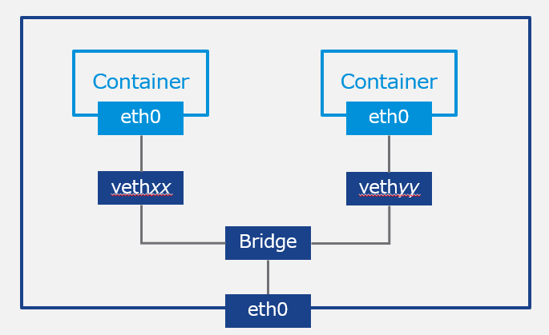

<figcaption>

単一のホスト上にコンテナを2 つ実行している状態

</figcaption>

</figure>

Docker ではホスト上に図のようなネットワークが構成される。コンテナはBridge インターフェースであるDocker0 を作成し、そこのL2 ネットワーク上に作成される仮想インターフェースveth にコンテナが接続される。つまり、ホスト内のDocker コンテナはL2 の接続性を持ち、デフォルトで172.17.0.0/16 の範囲でIP アドレスが振られる。Docker0 はコンテナのでデフォルトゲートウェイとなり、IP アドレスはデフォルトで172.17.0.1 となる。

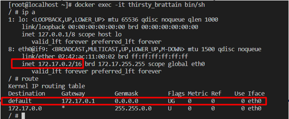

<figure>

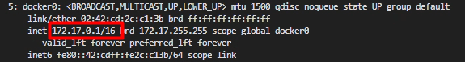

<figcaption>

コンテナの中でのIP アドレスとルーティングテーブル。確かに172.17.0.0/16 でコンテナはIP アドレスを持ち、デフォルトゲートウェイはDocker0 （172.17.0.1）となっている。

</figcaption>

</figure>

コンテナごとにネットワーク名前空間が独立しており（コンテナの名前空間については [コンテナの基礎 - VMware ユーザーが Kubernetes を勉強する 2](https://blog.vpantry.net/k8s-2) を参照）、要するに各コンテナは独自のIP アドレスやルーティングテーブルを持つ。

**コンテナが外の世界のネットワークと通信する時は、コンテナのIP アドレスはホストのIP アドレスにSNAT される。**要するに、コンテナと通信している外部のなんらかのサービスは、コンテナではなくあくまでもホストと通信しているよう、戻りのパケットを送信することになる。

逆に、**コンテナに対して外から通信したい場合はホストのIP アドレスでDNAT される。**docker run 時に、外からそのコンテナにアクセスしたい場合は-p オプションを追加するが、これはDocker コンテナの中で待ち受けているポート番号に対しホストで待ち受けるポートを紐づけることを意味し、これはまさにIP マスカレードそのものだ。

```
docker run --name nginx -p 8080:80 nginx
```

例えば上記コマンドはWeb サーバーであるNginx をデプロイするコマンドだが、そのままでは172.17.0.0/16 のアドレスと通信できないため、ホストIP : 8080 ポートで待ち受けてもらい、そこにアクセスされたら宛先IP アドレスをコンテナのIP アドレス:80 ポートに変換し、実際にコンテナの中で80 ポートで待ち受けているWeb サーバーにアクセスできるというわけだ。

どのようにSNAT/DNAT されているかは後述するが、ここで最も重要なところは、基本的にコンテナと通信するためには「ホストのIP アドレスを用いたNAT」 が行われている点である。この基本はk8s でも変わらないことを留意しておこう。

<figure>

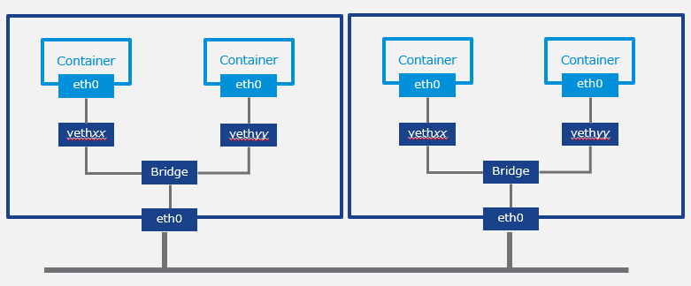

<figcaption>

2 つのホスト上にコンテナが実行されている状態

</figcaption>

</figure>

先ほどとは異なり、ホスト、すなわちコンテナが実行されているゲストOS が異なる場合、こちらは少し厄介なことになる。というのも、Docker 同士、互いのホストのネットワーク情報を知るよしもないので、同じ172.17.0.0/16 のアドレスが振られる可能性がある。また、コンテナの中と外の通信に関しては、ホストのIP アドレスが異なるので問題ないが、コンテナ同士の通信となると話は別である。先ほど、同一のホスト内で実行されるコンテナはL2 ネットワークに接続されると述べたが、異なるホストの場合、ネットワーク体系が異なる外のネットワークを挟む以上、単純にL2 で通信できない。

このコンテナ同士の通信に関しては、オーバーレイネットワークの構築を基本とした色々なアプローチがあるが、Docker 社のコンテナオーケストレーションツールであるSwarm （k8s みたいなもの）では、 NSX ユーザー的にはおなじみのVXLAN を採用している。

さて、ここまで説明したように、コンテナネットワーキングにおいては大きく2 つのことを考える必要がある。North-South （コンテナと外の通信）、およびEast-West （コンテナ間の通信）だ（k8s においてはコンテナはPod 単位での扱いになるため、考えるべきことはPod の外との通信、およびPod 間の通信ということになる）。

### Kuberentes のネットワーク

#### ネットワークインターフェース

<figure>

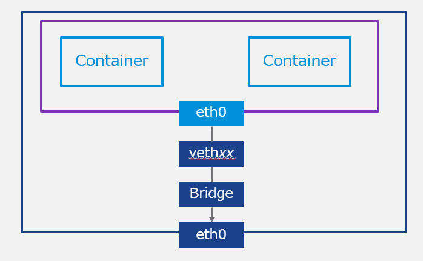

<figcaption>

1 つのPod の中で2つのコンテナが実行されている場合

</figcaption>

</figure>

先述したように、k8s ではコンテナではなくPod を扱うわけだが、Pod はコンテナを複数含みうる。したがって、仮想インターフェースveth はコンテナごとではなくPod ごとに作成され、つまりPod の中のコンテナは共通したIP アドレスやルーティングテーブルを持つ（＝ネットワーク名前空間を共有する）。

多くの場合k8s でもDocker は使うが、Docker 側のネットワーク実装をk8s 側から変えることはない。ちなみに、このようなコンテナ間でネットワーク名前空間を共有する方法は当然Docker でも可能であり、docker run --net オプションで実現できる。

ここで注意するのは、Pod 内のコンテナはIP アドレスが同じなため、 それらの間の通信はlocalhost で通信し、ポートの重複は許されない。コンテナの中で80 ポートで待ち受けるNginx を同じPod に含めることはできないというわけだ。

さて、ここからは Pod と外の通信、およびPod間の通信を解説する。先に Pod間の通信を解説しよう。

#### Pod 間の通信

Kubernetes を実際にインストールしたことがある方は分かるだろうが、Kubernetes 単体ではPod 間の通信はそもそも不可能だ。なぜならば、先に解説したVXLAN などのオーバーレイネットワーク技術がk8s 本体に含まれていないためである。ではどうするかというと、CNI （Container Network Interface）プラグインと呼ばれるプラグインを別途インストールする必要があり、これをインストールしないとそもそもPod をデプロイすることはできない。

CNI はKubernetes のネットワーク仕様であり、要するに「このように実装してくれればk8s のPod が通信できますよ」を決めているのだが、そのCNI に基づくCNI プラグインは実はめちゃめちゃ多い。多いのだけれど、flannel の様に、かつて人気があったものが更新されなくなる、など、CNI からもKubernetes 界隈の移り変わりの速さを感じ取れる。

<figure>

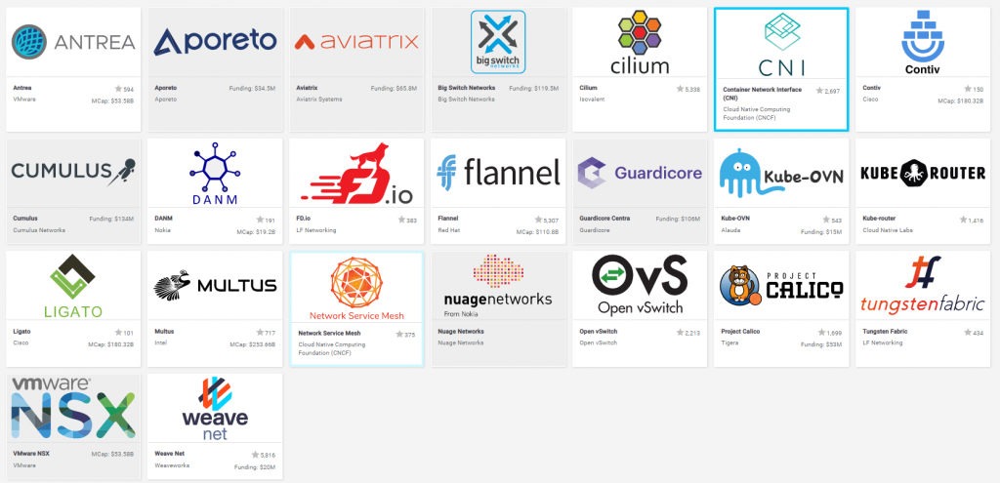

<figcaption>

[https://landscape.cncf.io/category=cloud-native-network&format=card-mode&grouping=category](https://landscape.cncf.io/category=cloud-native-network&format=card-mode&grouping=category)

</figcaption>

</figure>

この中で、おそらく現在非常に人気のあるCNI プラグインの1 つは[Calico](https://www.projectcalico.org/) であり、VMware のTanzu Kubernetes Grid にも採用されている。Calico を簡単に解説しよう（ 今年1月の知識であり、実装が変わっていたら申し訳ない）。

Calico の最も特徴的なところは「Pod のIP アドレスが/32 で振られる」点だろう。最初は自分も全く意味が分からなかったが、例えばPod A は192.168.0.11、Pod B は192.168.0.12 のIP アドレスが振られ、それぞれは異なるL2 セグメントに所属する。Pod A がPod B と通信するためにはデフォルトゲートウェイを介する必要があるわけだ。

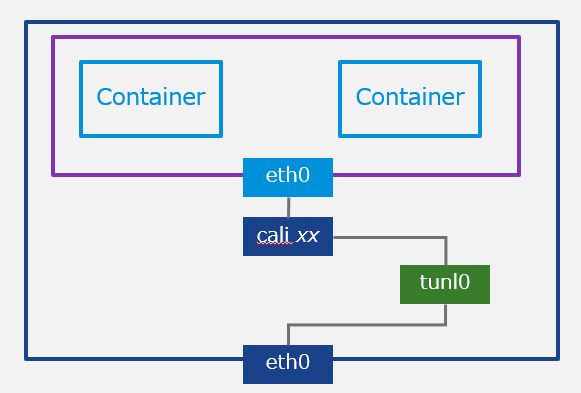

Calico では図のようにホスト内にインターフェースが作成されるが、デフォルトゲートウェイはこの図のどれだろうか？そもそも、/32の世界でデフォルトゲートウェイとは不思議なものである。192.168.0.0/24 であれば、192.168.0.1 ないし192.168.0.254 が通常デフォルトゲートウェイのIP アドレスになるが、/32 ではゲートウェイのIP アドレスがPod のアドレスと重複してしまう。

とりあえず、デフォルトゲートウェイがPod の中で実際にどうなっているかをkubectl exec で確かめてみよう。

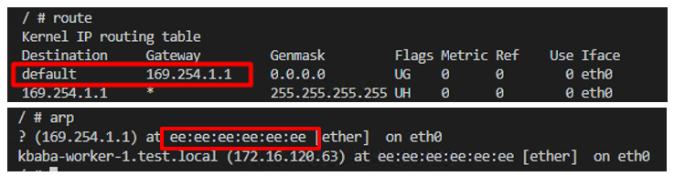

デフォルトゲートウェイのIP アドレスは169.254.1.1 となっており、ARP テーブルを確認すると、169.254.1.1 のIP アドレスを持つインターフェースのMAC アドレスはee:ee:ee:ee:ee:ee となる。これは、cali _xx_というホスト上に作成される仮想インターフェースのMAC アドレスになる。

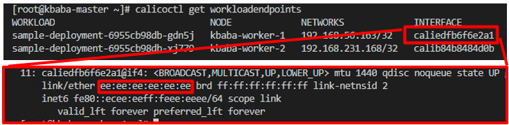

Calico の面白いところはこの点で、**Pod はデフォルトゲートウェイ169.254.1.1 （そしてこれは全てのPod で共通） が設定されているが、169.254.1.1 に対するMAC アドレスをARP で解決しようとしたとき、実際に応答するのは 169.254.1.1 などというIP は持たない cali _xx_** であり、Pod のARP テーブルのMAC アドレスをee:ee:ee:ee:ee:ee と教え込む。これをProxy ARP と呼ぶ。L2 セグメントを跨ぐときにとりあえずパケットを投げる先がデフォルトゲートウェイになるわけだが、投げ先を指示しているのは、L3 であるデフォルトゲートウェイのIP アドレスではなく、L2 であるデフォルトゲートウェイのMAC アドレスであり、この場合、 169.254.1.1 は全く無意味で（パケットには送信先Pod のIP アドレスが入るから）、ee:ee:ee:ee:ee:ee 宛にパケットを投げていることになる。要するに、**Calico におけるデフォルトゲートウェイの”役割”は、 Proxy ARP を用いて仮想インターフェースcali _xx_ が疑似的に引き受けている**ことになる。オレオレ詐欺みたいな感じだ。

では、肝心のPod 間の通信はどうだろうか。前述したように、これには基本的にVXLAN のようなオーバーレイ技術が用いられるが、Calico の場合はIPIP が用いられる。これは単純にパケットを別のIP/MAC アドレスでカプセル化するだけであり、VXLAN よりもずっと単純だ。ではどのIP/MAC アドレスでカプセル化されるかというと、Pod を実行するホストであるKubernetes のWorker Node になる。 Calico では、Pod 間の通信をIPIP カプセル化によりWorker Node 間の通信に見せかけている、ということだ。

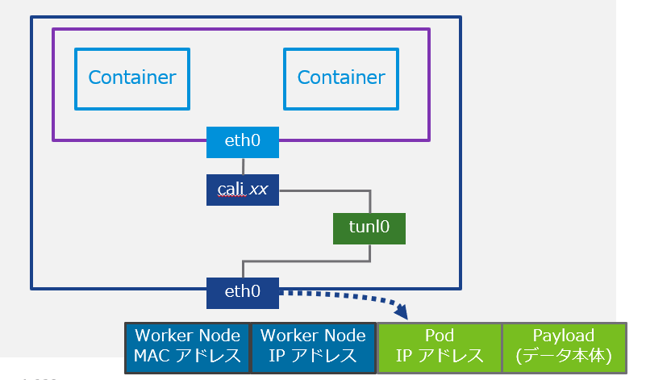

<figure>

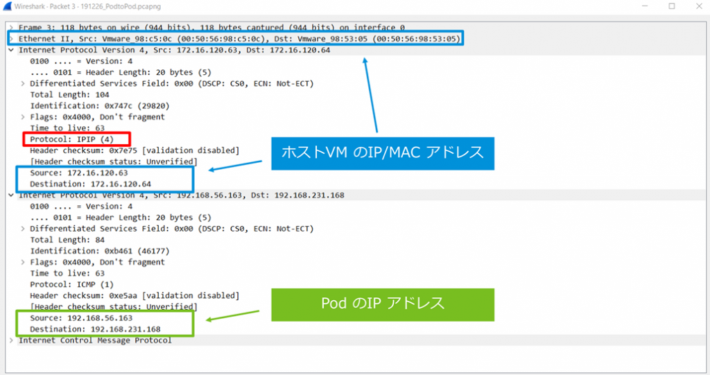

<figcaption>

パケットキャプチャからもIPIP のカプセル化の様子は分かる。本来のSource/Destination であるPod のIP アドレスをホストのVM のIP /MAC でカプセル化している。

</figcaption>

</figure>

一方で、Calico にはカプセル化をしないnon-IPIP (BGP)モードがある。カプセル化をしない分、CPU サイクルを消費せず、パフォーマンス的に優れているため、こちらを推奨とのことだが、デフォルトではIPIP モードになっている。これは、IPIP モードではコンテナネットワークを外に見せないため、AWS などのクラウド側でのネットワークポリシー、すなわち仮想マシンの中で構成されるクラウド側で把握できないネットワーク通信をブロックする対象に入らない、といった大きなメリットのためだろう。

ここまで、Kubernetes におけるPod 間の通信について解説したが、次はPod と外の通信の仕組みを解説する。が、さすがに分量が多くなってしまったため、後編に持ち越すとしよう。
