- [](https://blog.vpantry.net/posts/k8s-1)[はじめに - VMware ユーザーが Kubernetes を勉強する 1](https://blog.vpantry.net/posts/k8s-1)
- [](https://blog.vpantry.net/posts/k8s-2)[コンテナの基礎 - VMware ユーザーが Kubernetes を勉強する 2](https://blog.vpantry.net/posts/k8s-2)
- [](https://blog.vpantry.net/posts/k8s-3)[Docker の学習を効率化するTips – VMware ユーザーがKubernetes を勉強する 3](https://blog.vpantry.net/posts/2020/01/k8s-3/)
- [](https://blog.vpantry.net/posts/k8s-4)[Kubernetes の概要 – VMware ユーザーがKubernetes を勉強する 4](https://blog.vpantry.net/posts/2020/03/k8s-4/)
- [](https://blog.vpantry.net/posts/k8s-5)[Kubernetes アーキテクチャの基本– VMware ユーザーがKubernetes を勉強する 5](https://blog.vpantry.net/posts/2020/05/k8s-5/)
- [](https://blog.vpantry.net/posts/k8s-6)[Kubernetes のネットワーク 前編 – VMware ユーザーがKubernetes を勉強する 6](https://blog.vpantry.net/posts/2020/05/k8s-6-1)
- [](https://blog.vpantry.net/posts/k8s-7)[Kubernetes のネットワーク 後編 – VMware ユーザーがKubernetes を勉強する 7](https://blog.vpantry.net/posts/2020/07/k8s-7/)

[前編](https://blog.vpantry.net/2020/05/k8s-6-1/)では、Kubernetes のネットワークにおいて、Docker のネットワークから始め、Pod 間の通信を中心に解説した。今回は、後編ということで、Kubernetes クラスタの内と外の通信について理解するために、Service（ClusterIP、NodePort、LoadBalancer）、およびIngress について解説する。特に、Kubernetes のネットワークを理解するうえで最も重要な概念はNodePort であると私は考えており、NodePort の理解を本記事の目的とする。

### Service

Service という名前は文脈によっては誤解を招きうる表現だが、Kubernetes におけるService とは、Pod に接続するためのエンドポイントであり、k8s においては、基本的にPod AとPod B を接続する場合、直接Pod を指定するのではなく、Service を指定する。理由は明確で、Pod のIP は変わる上に、Deployment やStatefulset などで同一のPod が複数デプロイされうるからである。要するにロードバランサーみたいなものであり、Service はVirtual IP を提供することで、そのような不安定なPod のアクセス先を統一する。ゆえに、k8s のマニフェストでは、Deployment などのPod 関連のリソース+Service リソース、とペアで記載されることも多い。そのPod へのアクセスのために必要だからだ。

Service はいくつかに分類され、その中ではClusterIP、NodePort、LoadBalancer が重要である。ただし一般的にNodePort は明確な課題があるため使われることは少ないが、先述したように、NodePort は非常に重要な概念であり、本記事でも重点的に解説する。

が、その前にそれらを理解するうえで必要な前提知識が1 つある。それが[iptables](https://linuxjm.osdn.jp/html/iptables/man8/iptables.8.html) だ。

### iptables

聞いたことがある人も多いだろうが、iptables はLinux において主にファイアウォールの設定をするときに使用する。iptables コマンドを実行すると様々なテーブルが出力され、条件にヒットするとパケットをDROP したりするルールが多数含まれる。

```
$ iptables -nL
Chain INPUT (policy ACCEPT)
target     prot opt source               destination

Chain FORWARD (policy ACCEPT)
target     prot opt source               destination
DOCKER-USER  all  -- 0.0.0.0/0            0.0.0.0/0
DOCKER-ISOLATION-STAGE-1  all  -- 0.0.0.0/0            0.0.0.0/0
ACCEPT     all  -- 0.0.0.0/0            0.0.0.0/0            ctstate RELATED,ESTABLISHED
DOCKER     all  -- 0.0.0.0/0            0.0.0.0/0
ACCEPT     all  -- 0.0.0.0/0            0.0.0.0/0
ACCEPT     all  -- 0.0.0.0/0            0.0.0.0/0
```

ただし実はiptables の役割はそれだけではなく、実はファイアウォールの前後にDNAT とSNAT がiptables に基づき実行される。

<figure>

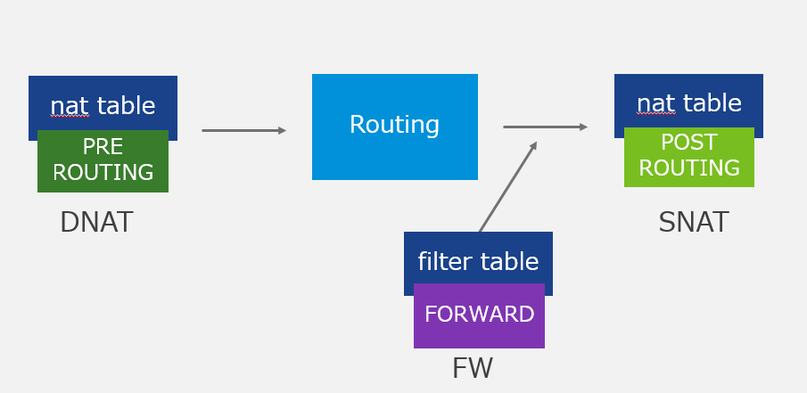

<figcaption>

DNAT で宛先IP アドレスが変換されたパケットを対象にファイアウォールによるフィルタリングを実行し、その後SNAT される。

</figcaption>

</figure>

iptables の仕組みは調べてみると大変奥が深いのでここでは詳細は割愛するが、重要なのは**iptables でNAT ができる** ことである。

### ClusterIP

```yaml
apiVersion: v1
kind: Service
metadata:
  name: sample-service
spec:
  type: ClusterIP
  ports:
    - name: "http"
      protocol: "TCP"
      port: 8080
      targetPort: 80
  selector:
    app: web
#Sample manifest
```

ClusterIP はクラスタからのみアクセス可能なIP を持つService であり、最も典型的なService である。要するにPod と同じようなIP アドレスが振られるので、外部からClusterIP のIP アドレスにはアクセスできない。クラスタ内からClusterIP にアクセスすると、ClusterIP がそれらのバックにあるPod へアクセスを振り分ける。

ClusterIP の実態は何だろうか？Pod ではない。kubectl get service では取得できるオブジェクトだが、kubectl get pod を実行しても出てこないはずである。

実はClusterIP の実態は先述したiptables のルール（チェイン）である。ClusterIP が定義されると、iptables のルールがDaemonSet であるkubeproxy によって追加される。ClusterIP 自体はインターフェースを持たず、すなわちIP アドレスを持たないが、ClusterIP で定義されたIP アドレスにアクセスすると、iptables によってアクセス先がバックにあるPod に振り分けられるのだ。

ではどのように振り分けているかというと、ここがとても面白いところで、実は**一定の確率でDNAT** している。つまり、ClusterIP のバックにPod A、Pod B があれば、50% の確率でPod Aにiptables のルールに基づきDNAT し、50％ の確率でPod B にDNAT する。

<figure>

[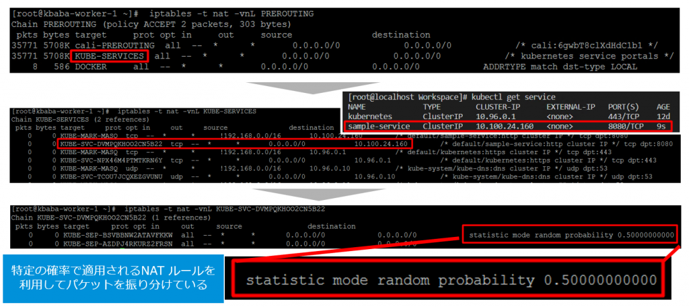](images/image-2-1024x456.png)

<figcaption>

なんと文字通り0.5 の確率でヒットするDNAT ルールがClusterIP の正体なのだ

</figcaption>

</figure>

自分もまさかiptables がこれほど直感的な表現をしていることに驚いたが、事実そうなのだ。

また、kubeproxy はproxy と名前が入っているため、こいつがアクセスを振り分けているように見えるが、実際は異なり、kubeproxy はあくまでもiptables の書き換えを行うだけであり、アクセスの振り分けはiptables というOS 側の仕組みで実行する。

### NodePort

```
apiVersion: v1
kind: Service
metadata:
  name: sample-service
spec:
  type: NodePort
  ports:
    - name: "http"
      protocol: "TCP"
      port: 8080
      targetPort: 80
      nodePort: 31000
  selector:
    app: web
#Sample manifest
```

NodePort はKubernetes クラスタの外部と内部をつなぐ、非常に重要なリソースである。どのようにつないでいるかというと、Worker Node のIP アドレスに対して特定のポートにアクセスしたときに、Pod のIP へDNAT する。クラスタの外からはk8s のPod のIP アドレスは分からないため、仮想マシンであるWorker Node がその橋渡しをする。これがNodePort である。

デフォルトでは30000~32767 のポートで待つため、例えば上記のサンプルのマニフェストであれば、Worker Node のIP アドレスが仮に172.16.0.11 の場合、172.16.0.11:31000 でアクセスすれば、NodePort のバックにあるPod に対してtargerPort である80 ポートでアクセスすることができる。

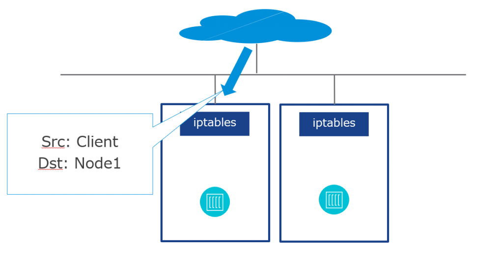

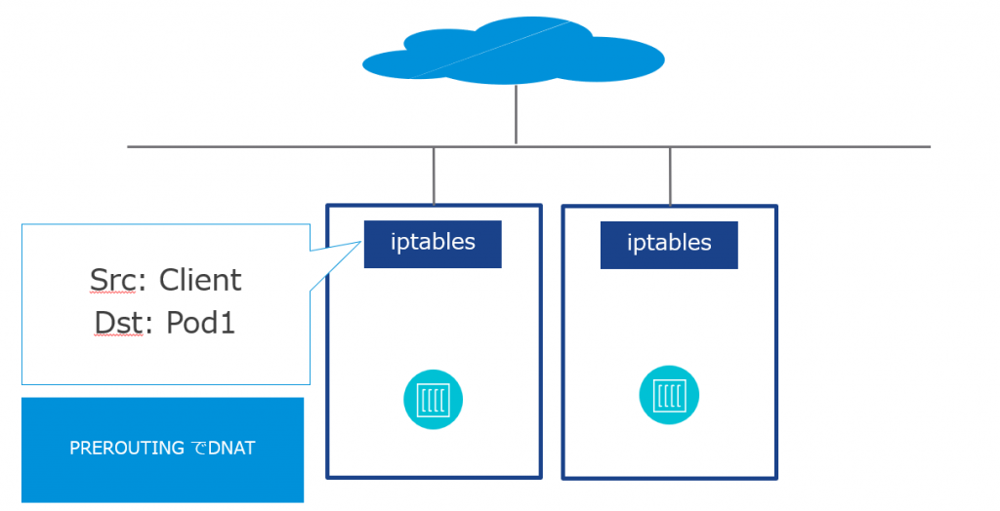

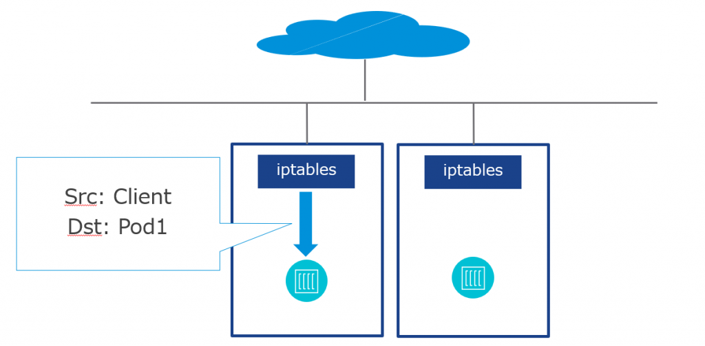


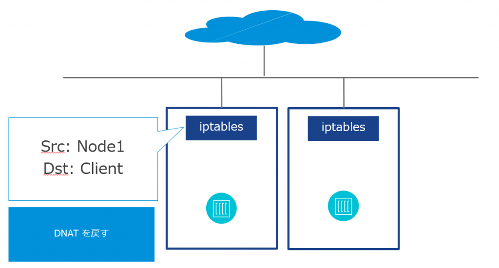

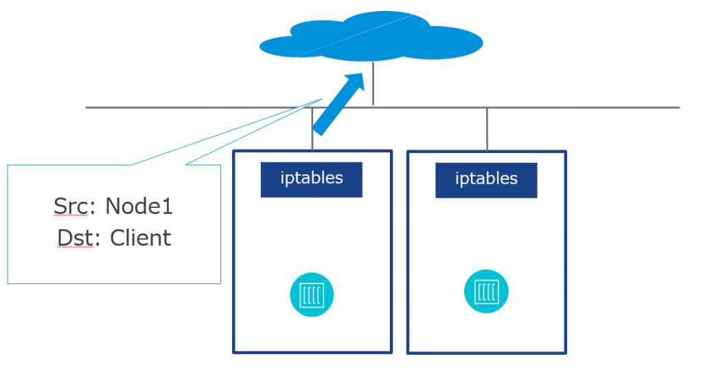

仮にアクセスするWorker Node 上にPod がなかったとしても問題はない。別のWorker Node に対してパケットが振り分けられるためだ。例えばCalico の場合、Worker Node 1にアクセスし、DNAT したPod が別のWorker Node 2にある場合は、（デフォルトで）Worker Node 1 → Worker Node 2 の通信に見せかけるようIPIP でカプセル化され、Worker 2 のPod にパケットが転送される。

<figure>

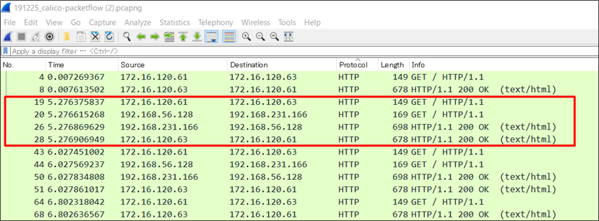

<figcaption>

Client (172.16.120.61) からWorker Node 1 (172.16.120.63) NodePort を経由し  
tunl0 インターフェース（192.168.56.128）でSNAT されNginx Pod (192.168.231.166)にアクセスしている。クライアント側としてはアクセス先のWorker Node 1から正しく応答が返っているようにしか見えておらず、Worker Node 2 (172.16.120.64) は関わっていないことに注意。

</figcaption>

</figure>

<figure>

[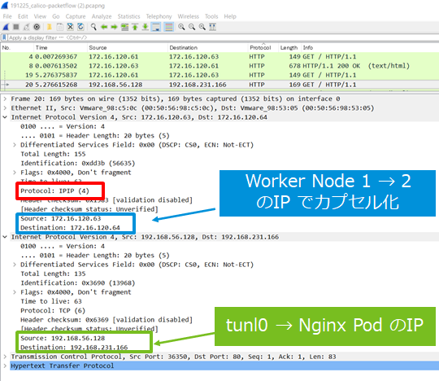](images/image-10.png)

<figcaption>

行きの通信

</figcaption>

</figure>

<figure>

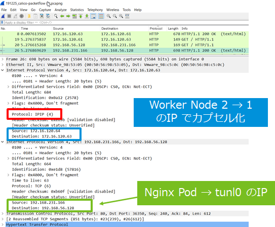

<figcaption>

戻りの通信  
結局クライアントからはWorker Node 1 とのやり取りとしか見えず、Pod からはtunl0 とのやり取りしか見えない。

</figcaption>

</figure>

NodePort もClusterIP と同様iptables によるNAT を全力で使っているため、実際のところその実装はかなり複雑である。興味がある方は以下の画像も参照してほしい。

<figure>

[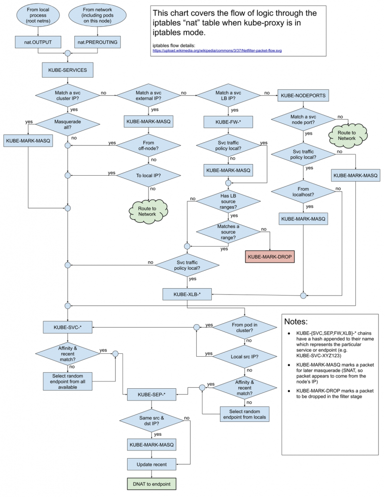](images/image-19-793x1024.png)

<figcaption>

iptables の複雑な処理 by [https://twitter.com/thockin/status/1191766983735296000](https://twitter.com/thockin/status/1191766983735296000)

</figcaption>

</figure>

要するに、クラスタの内と外をつなぐために、NodePort は仮想マシンであるWorker Node を仲介していることを理解すればよい。この後紹介するLoadBalancer も裏側ではNodePort を使っているし、Ingress もLoadBalancer を使いLoadBalancer はNodePort を使うため、クラスタ外部と内部の接続において、NodePort は最も根幹的な概念であるので、時間をかけてでもしっかり理解したい。

### LoadBalancer

```yaml
apiVersion: v1
kind: Service
metadata:
  name: sample-lb
spec:
  type: LoadBalancer
  ports:
    - name: "http"
      protocol: "TCP"
      port: 8080
      targetPort: 80
      nodePort: 31000
  selector:
    app: web
＃Sample manifest
```

最も根幹的といっておきながらNodePort が本番環境で使われることは少ない。理由は明確で、単一障害点を持つからだ。つまり、Nodeport では特定のWorker Node のIP アドレスを指定するため、障害などでそのWorker Node にアクセスできなかった場合、当然Pod にもアクセスできない。

そこで、そのような課題を解決するのがLoadBalancer である。LoadBalancer はNodePort を抽象化したもので、先に述べたアクセス先のWorker Node が単一障害点になることを防ぐことができる。

NodePort の抽象化は、クラスタ外にWorker Node とは別のエンドポイントを持たせることで実現している。つまり、直接Worker Node のNodePort にアクセスさせるのではなく、その前に一度冗長化された仮想マシンなどでクライアントからのアクセスを受け、そのあとにNodePort に渡すのだ。もちろんその裏側ではiptables が頑張ってアクセスを振り分けている。

<figure>

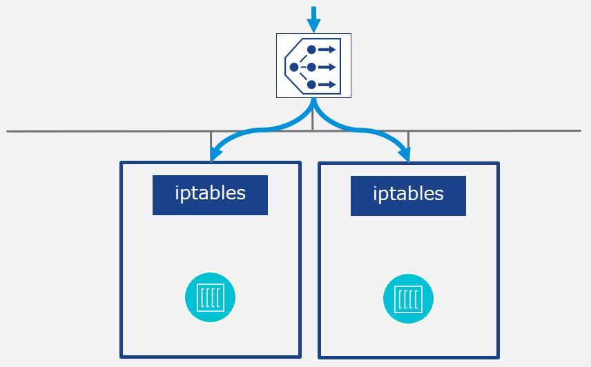

<figcaption>

LoadBalancer のバックにあるのはNodePort である

</figcaption>

</figure>

ではLoadBalancer などの実態はどのように用意するかというと、それはクラウドプロバイダーまたはユーザー自身で準備することになる。ユーザー自身で準備する場合はMetalLB などが有名か。準備されていない場合は、LoadBalancer をデプロイしようとすると、Pending になりデプロイができない。したがって、このようなLoadBalancer の準備という一手間がかかるために、テスト環境ではNodePort やkubectl port-forward が使われることも多い。

いずれにせよ、クラスタの内と外をつなぐのはNodePort でありWorker Node という意識を持つことが重要だ。

### Ingress

```yaml
apiVersion: extensions/v1beta1
kind: Ingress
metadata:
  name: sample-ingress
  annotations:
    ingress.kubernetes.io/rewrite-target: /
spec:
  rules:
  - http:
      paths:
        - path: /butterscotch
          backend:
            serviceName: butterscotch-service
            servicePort: 5678
        - path: /cinnamon
          backend:
            serviceName: cinnamon-service
            servicePort: 5678
#Sample manifest
```

最後にIngress を紹介しよう。Ingress は厳密にはService リソースではなく、kind: Ingress と独自に設定してあるが、Ingress はLoadBalancer の拡張で、L7 レベルでのロードバランサーを提供する。L7 というと取っつきづらさがあるかもしれないが、要するにURL であったり、Cookie、ブラウザの情報などをもとにアクセス先を振り分けることができる。例えば、ユーザーがあるWeb サービスにログインすると、そのログイン情報はCookie として持つが、特定のユーザーがもつCookie を見て、Beta バージョンのWeb サービスに振り分ける、などができる。

実際にデプロイして確かめるとよい。代表的なIngress はContour であり、さっそくkatacoda でデプロイしてみよう。

```
#Contour リポジトリのクローン
git clone https://github.com/projectcontour/contour.git
#type: LoadBalancer をtype: NodePort に書き換える
vi contour/examples/contour/02-service-envoy.yaml
#Contour のデプロイ
kubectl apply -f contour/examples/contour/
#サンプルアプリケーションのデプロイ
git clone https://github.com/vkbaba/demo-ingress.git
kubectl apply -f demo-ingress/
```

サンプルアプリケーションは、特定の文字列をそのまま返すだけのアプリケーションであり、ここではcinnamon とbutterscotch、2 つのPod （Deployment）が実行されている。

```
master $ kubectl get deployments.apps
NAME                      READY   UP-TO-DATE   AVAILABLE   AGE
butterscotch-deployment   1/1     1            1           21m
cinnamon-deployment       1/1     1            1           21m
```

cinnamon Pod にアクセスすればcinnamon と表示され、butterscotch Pod にアクセスすればbutterscotch と表示されるため、ここではURL 末尾がcinnamon の場合にcinnamon Pod にアクセスさせ、URL 末尾がbutterscotch の場合にbutterscotch Pod にアクセスさせてみる。

アクセスするためのNodePort はprojectcontour Namespace に定義されている。

```
master $ kubectl get service -n projectcontour
NAME      TYPE        CLUSTER-IP      EXTERNAL-IP   PORT(S)         AGE
contour   ClusterIP   10.99.83.37     <none>        8001/TCP         27m
envoy     NodePort    10.96.131.130   <none>        80:32023/TCP,443:30370/TCP   27m
master $ kubectl get node -o wide
NAME           STATUS   ROLES    AGE   VERSION   INTERNAL-IP   EXTERNAL-IP   OS-IMAGE             KERNEL-VERSION       CONTAINER-RUNTIME
controlplane   Ready    master   33m   v1.18.0   172.17.0.61   <none>     Ubuntu 18.04.4 LTS   4.15.0-101-generic   docker://19.3.6
node01         Ready    <none>   33m   v1.18.0   172.17.0.62   <none>     Ubuntu 18.04.4 LTS   4.15.0-101-generic   docker://19.3.6
```

この場合、Worker Node のIP アドレスは172.17.0.62 であり、NodePort は32023 のため、http://172.17.0.62:32023 でバックエンドのPod にアクセスできることが分かる。試してみよう。

```
master $ curl -k http://172.17.0.62:32023/cinnamon
cinnamon-app
master $ curl -k http://172.17.0.62:32023/butterscotch
butterscotch-app
```

同じIPアドレス&ポート番号でアクセスしているのにもかかわらず、URL 末尾でアクセス先が振り分けられていることが分かる。これがL7 ロードバランサーである。図に落とすと下記のようなイメージだ。

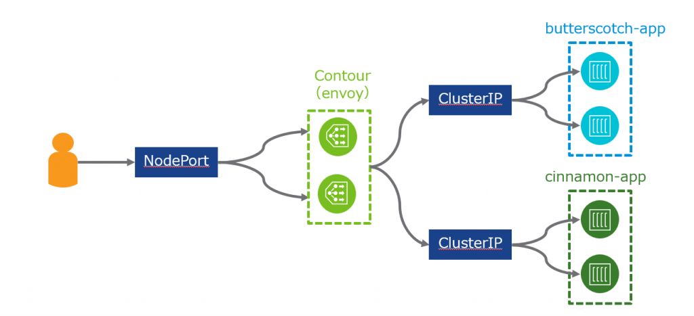

Contour のプロキシの役割を果たしているのはenvoy なのだが、それもPod であり、クラスタ内の世界に存在するため、NodePort を前段に置くことでクラスタの内と外をつなぐ（もちろんLoadBalancer でもよい）。その後envoy は各Pod のIP アドレスを抽象化するService であるClusterIP に対してアクセスを振り分ける。k8s においては、基本的にPod 同士を接続する場合、直接Pod を指定するのではなく、Service を指定することを忘れないように。

### まとめ

前編と後編に分けてKubernetes のネットワークを解説したが、いずれもかなりボリュームが増えてしまった。尤も、これは基本的な話であり、この次にサービスメッシュというまたまたボリューミーな概念をキャッチアップせねばならないのだが、とにもかくにもCNI やService、特にNodePort の概念は非常に重要であり、今後様々な場面で登場する。少し時間がかかってもよいので、私のようにiptables を眺めたりパケットキャプチャをしたりするなどして、腰を据えて確実にキャッチアップしておこう。
