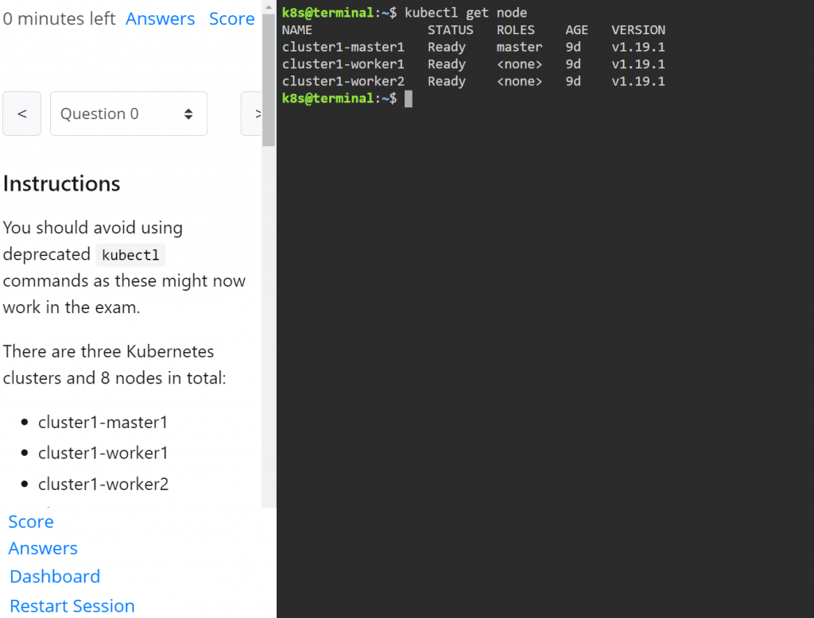

**(2021/7/3 追記) Kubernetes の試験が値上げされ、その代わり？にKiller Shell がバウチャーに含まれるようになった。**

[https://training.linuxfoundation.org/announcements/linux-foundation-kubernetes-certifications-now-include-exam-simulator/](https://training.linuxfoundation.org/announcements/linux-foundation-kubernetes-certifications-now-include-exam-simulator/)

今更ながらCKA/CKAD/CKS の取得を目指して勉強を始めた。勉強の上で最も知りたかったのはやはり練習問題であり、最近業務でKubernetes に触れることがあまりなかったので、リハビリのためにも練習問題をひたすら解きたかった。

色々探すと、Killer Shell なるサイトを見つけた。

[https://killer.sh/](https://killer.sh/)

名前からいかにも怪しそうな感じがするが、Killer Shell とは、Katacoda のように好きに触れるKubernetes クラスタをいくつか展開し、多数用意された練習問題を解いていけるというサイトだ。有償でしかもそこそこなお値段がするので、どれほどのものか実際に人柱となってみた。

### 概要

先に説明した通り、Killer Shell ではCKA/CKAD/CKS の練習問題を実際のKubernetes クラスタを使って解いていくことができる。問題をそのまま転載することはできないが、画面は↓のような感じで、左に問題、右にTerminal があり、まさにKatacoda のようにTerminal と戯れながら問題を解いていく。

<figure>

<figcaption>

実際のKiller Shell の画面。ブラウザ上のTerminal を使って左ペインの問題を解いていく。

</figcaption>

</figure>

有償であり、価格はCKA/CKAD/CKS いずれも29.99€（約4000 円）。**（2021/2/27 追記）**クーポンコードを入力すれば20％割引で24.99€ になる（[https://twitter.com/\_killer\_shell/status/1290319465092194306](https://twitter.com/_killer_shell/status/1290319465092194306)）。料金をPaypal やクレカで支払うと、2 回のシミュレーション環境のアクティベート権を2 回分もらうことができ、アクティベートすると36時間使えるKubernetes クラスタが何個か払い出され、それをベースに問題を解いていく。アクティベート中の36 時間はブラウザを閉じても自動的にサスペンドされ、いつでも中断したところから再開できるが、サスペンド中も環境の有効期間は消費されるため、1-2 日かけて集中的に取り組まないといけない。

練習問題はCKA/CKAD/CKS ごとに用意されており、CKA では、練習問題25 問+エクストラ問題5 問+プレビュー問題3問（購入前に挑戦できるお試し問題）の合計33 問が用意されている。

なお、ここからは実際に私が試してみた所感を記載するが、所感は所感なので参考程度にとどめてほしい。

### 良い点

- 問題と解説のクオリティが高い
    - FAQ でも書いているが、問題は実際の試験問題よりも難しい。実際私も挑戦したときは10% しかスコアが取れなかった（これは採点の方法にも問題はあるが…）。ただし、1 問から色々なことを学ぶことができ、その解説も丁寧で色々な発見があったので、学習効果は高かった。
- 時間制限付きなので集中して取り組むことができる
    - 土日など休日を利用してメリハリをつけながらがっつり学ぶことができる。
- Kubernetes 1.19 と最新の環境を利用できる
    - ただ、これは別に1.19 が利用できることを評価しているのではなく、この界隈情報のアップデートが非常に早く、そこへの追従をしようとしている姿勢が見て取れるので色々と信頼できた。

### イマイチな点

- 問題数が少ない
    - CKA の範囲全てをカバーできていない。
    - 2回のアクティベート権では問題は共通なので、やはり違う問題を解きたかった。
    - とはいえ問題は面白いし解説は丁寧。
- 価格が高い
    - あくまでも個人の意見であるが、4000円は少し高いように思える。
    - トラシュの問題もあるので難しい部分はあるだろうが、Kubernetes 環境はこちらで用意するので、練習問題と解説だけで売ってほしい。
- 問題によってはLinux の知識がかなり必要
    - VSCode に慣れすぎてvim が全然分からない…  
        **（2021/2/27 追記）**実際の試験でもvim を使いまくったので、Killer Shell の問題というわけではなかった。
    - エディタ以外にも様々な場面で（Kubernetes というよりは）Linux の知識が要求されたので、それはどうなんだろうと思った。  
        **（2021/2/27 追記）**問題が一部修正され、Linux の知識がそこまで要求されなくなった。

### まとめ

Killer Shell のおかげで、年末年始の時間がつぶせ、Kubernetes と思う存分戯れることができている。買って後悔はしていないし、実際多くのことを学ぶことができたが、しかしながら今後CKAD/CKS のためにさらに4000円×2 を支払うとなると、ちょっと手が止まってしまう（自分が貧乏なだけだが）。もう少し安くなれば、万人に勧められるサイトだと感じた。

**（2021/2/27 追記）**無事CKA/CKAD に合格できました。Killer Shell さんありがとう。
