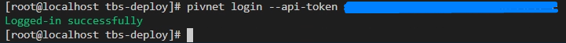
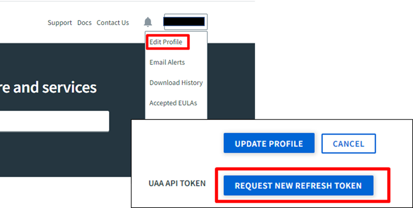
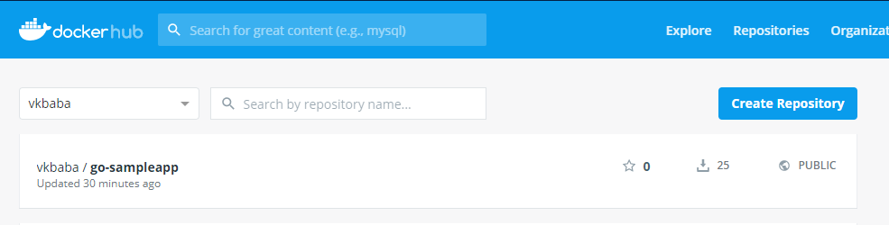
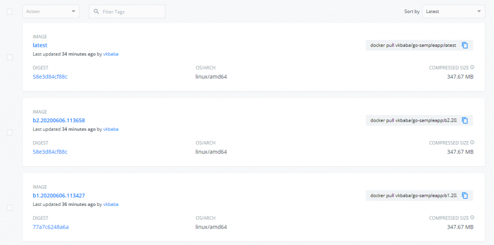
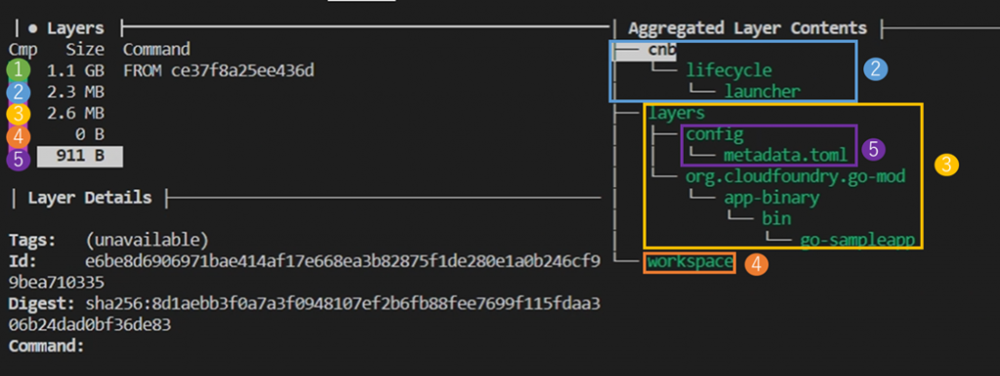

### はじめに

VMware は去年、モダンアプリケーションにフォーカスを当てた Tanzu というビジョンを掲げた。Tanzu はBuild, Run, Manage と細分化され、例えばRun であればアプリケーションの実行を支援するソフトウェアスタック、vSphere with Kubernetes やTanzu Kubernetes Grid が該当する。

インフラエンジニアとしては、アプリケーションなんて知ったこっちゃない、というのが正直なところだが、最近はインフラ側とアプリ側の境目がKubernetes で曖昧になってきて、インフラエンジニアだとしてもアプリのキャッチアップをすることが重要となってきている。

本記事では、まだ記事執筆時点ではBeta ではあるが、Tanzu のBuild に該当する[Tanzu Build Service](https://tanzu.vmware.com/build-service) v0.1 を実際に触ってみたので、その紹介をする。アプリのビルドを支援するとはどういうことか、手を動かして確認してみよう。

### Tanzu Build Service の概要

略してTBS。どこぞのテレビ局みたいな名前だが、名前の通りTBS を使うとアプリのビルドが楽になる。アプリのビルドというと、ソースコードを書いて、コンパイルし、その結果をリンクして実行可能形式にすることを基本的に指すわけだが、コンテナの世界ではコンテナイメージを作らなくてはならず、そのために作成した実行ファイルをコンテナイメージに内包するか、もしくはコンテナの中でビルドしてイメージを作り上げる作業が入る。最後に、作成したイメージをコンテナレジストリにプッシュすることで、チームなどで共有する。

このソースコードを書いてからコンテナイメージを作り上げてレジストリにプッシュする一連の流れを、TBS は自動化することができる。開発者が実行することはソースコードを書くだけであり、コードを書く以外の面倒な部分を考えずに済むというメリットがある。面倒なDockerfile の作成も必要ない。

### Tanzu Build Service のインストール

実際に動かしてみよう。基本的なインストールの流れは下記を参考してほしい。

[https://tanzu.vmware.com/content/practitioners-blog/getting-started-with-vmware-tanzu-build-service-for-local-development](https://tanzu.vmware.com/content/practitioners-blog/getting-started-with-vmware-tanzu-build-service-for-local-development)

ちなみに、公式のドキュメントは下記となる。

[https://docs.pivotal.io/build-service/0-1-0/installing.html](https://docs.pivotal.io/build-service/0-1-0/installing.html)

繰り返しになるが、現時点ではBeta であり、インストール方法は変わる可能性がある。実際Duffle を使ったインストールは結構手間だったりする。

その前提の下で、Docker の入ったクライアントマシンから、用意したKubernetes 環境に対してTBS 用のNamespace やPod などを作成していくことになる。なお、Kubernetes のクラスタは、Katacoda ではなく自前で用意することを推奨する。理由はAPI token などが記載されたプライベートな設定ファイルを配置することになるためだ。また、永続ボリュームを作成できることが必須なのと、どうもWorker Node が2 台以上ないとビルドがうまくいかないことがあるようで、そのあたりも注意する。

事前準備として、テスト用に事前にDocker Hub やgithub のアカウントを用意しておき、上記ブログの指示に従いkubectl / pivnet / duffle の実行ファイルをダウンロードしPATH を通しておく。chmod x でのパーミッション変更を忘れずに。

kubectl : [https://kubernetes.io/docs/tasks/tools/install-kubectl/](https://kubernetes.io/docs/tasks/tools/install-kubectl/)

pivnet : [https://github.com/pivotal-cf/pivnet-cli](https://github.com/pivotal-cf/pivnet-cli)

duffle : [https://github.com/cnabio/duffle](https://github.com/cnabio/duffle)

指示通り設定ファイルをダウンロードし、pivnet コマンドでTBS のバイナリをダウンロードする。この時、pivnet login --api-token xxx でログインしておく。



api-token の取得だが、 [https://network.pivotal.io/](https://network.pivotal.io/) から行う。旧Pivotal のサイトであり、My VMware とは統合されていないのが面倒なのだが、とりあえず登録してAPI token をEdit Profile から取得しよう。



ついでに、[github](https://help.github.com/en/github/authenticating-to-github/creating-a-personal-access-token-for-the-command-line) および[Docker Hub](https://docs.docker.com/docker-hub/access-tokens/) のAPI token も取得しておく。

API token の取得とpivnet のlogin が済んだら、TBS のバイナリをダウンロードする。

```
pivnet download-product-files --product-slug='build-service' --release-version='0.1.0' --product-file-id=648378
```

ダウンロード後のクレデンシャル変更について、微妙にわかりづらいので補足しておく。source はクライアントのkubeconfig ファイルのディレクトリを指す。 destination はduffle でのインストール時に**クライアント上で一時的に実行されるコンテナ上に配置される**kubeconfig のディレクトリを指す。つまり、destination は変更しなくてよいし、source とdestination は下記のように同じ場合もあることに注意。また、TBS インストール時にk8s クラスタに接続できない場合、クライアント-k8s ではなく、クライアント上のコンテナ-k8s の疎通問題を疑う必要がある。

```
name: build-service-credentials
credentials:
- name: kube_config
  source:
    path: "/root/.kube/config"
  destination:
    path: "/root/.kube/config"
```

その後、ブログの指示に従い duffle relocate コマンドでpivotal リポジトリから自身のDocker Hub にイメージ群を移す。その後、duffle install コマンドでTBS をインストールする。

```
duffle install tbs-deploy-demo -c ./tbs-creds/credentials.yml  \
--set kubernetes_env=docker-desktop \
--set docker_registry=index.docker.io \
--set docker_repository=“index.docker.io/$USER/” \
--set registry_username=“yyyyyyyyyyyyyyyyyyyyyyyyyyy” \
--set registry_password=“$DOCKERHUB_API_TOKEN” \
 --set custom_builder_image=“index.docker.io/$USER/cf-build-service-dev-219913-invocation-image-d370867b6d9f765a72bc7ad10367ca5f:0.1.0-rc.14” \
-f ./build-service-0.1.0.tgz \
-m ./relocated.json
```

なお、インストールに失敗し、アンインストールする場合は下記コマンドになる。

```
duffle uninstall tbs-deploy-demo -c ./tbs-creds/credentials.yml -m ./relocated.json
```

このコマンドで失敗した場合、直接k8s で展開されたTBS のNamsepace ごとオブジェクトを削除し、~/.duffle/claims にあるjson フォーマットの設定ファイルを削除する。

pivnet コマンドでpb cli をインストールし、下記のような出力を得られたら、インストールは完了したことになる。

```
pb builder list
Cluster Builders
----------------
default
```

### Tanzu Build Service を使ってみよう

今回は、イメージの更新をわかりやすくするために、ブログのnode-todo アプリではなく、私がテキトーに作ったgo のhelloworld アプリを使うことにする。

[https://github.com/vkbaba/go-sampleapp](https://github.com/vkbaba/go-sampleapp)

まずは、下準備としてプロジェクトを作成し設定ファイルをapply する。

```
[root@localhost tbs-deploy]# pb project create go-sampleapp
Successfully created project 'go-sampleapp'
[root@localhost tbs-deploy]# pb project target go-sampleapp
Successfully set 'go-sampleapp' as target. Subsequent commands will assume you are targeting 'go-sampleapp'.
[root@localhost tbs-deploy]# pb secrets git apply -f secrets/github-config.yml
Successfully created git secret for 'github.com/vkbaba/' in project 'go-sampleapp'
[root@localhost tbs-deploy]# pb secrets registry apply -f secrets/dockerhub-config.yml
Successfully created registry secret for 'https://index.docker.io/v1/' in project 'go-sampleapp'
[root@localhost tbs-deploy]# pb project list
Projects
--------
go-sampleapp
```

dockerhub-config.yml :

```
project: go-sampleapp
registry: https://index.docker.io/v1/
username: vkbaba
password: xxx
```

github-config.yml:

```
project: go-sampleapp
repository: github.com/vkbaba/
username: vkbaba
password: yyy
```

その次にイメージをbuild するわけだが、その前に永続ボリュームの設定をする。この設定、地味にブログにもドキュメントにも書いておらず、実施しないとbuild 用のPod が立ち上がらないのだが、k8s クラスタにStorage Class オブジェクトを作成し、それをDefault Storage Class として設定する。vSpphere CSI を使っている場合は、事前にストレージクラスをタグベースで作成しておき、それと紐づけるようStorage Class マニフェストを作成する。

```yaml
kind: StorageClass
apiVersion: storage.k8s.io/v1
metadata:
  name: fast
provisioner: csi.vsphere.vmware.com
parameters:
    storagePolicyName: tkg-policy
```

kubectl apply 後、[コチラ](https://kubernetes.io/docs/tasks/administer-cluster/change-default-storage-class/)を参考に、Default Storage Class の設定をする。ちなみに、vSphere with Kubernetes のTanzu Kubernetes Cluster で実行しようとすると、現在のissue のためか、デフォルトを示すアノテーションが自動的に削除されてしまう。回避方法は不明。

```
kubectl patch storageclass fast -p '{"metadata": {"annotations":{"storageclass.kubernetes.io/is-default-class":"true"}}}'
```

```
[root@localhost tbs-deploy]# kubectl get sc
NAME             PROVISIONER              RECLAIMPOLICY   VOLUMEBINDINGMODE   ALLOWVOLUMEEXPANSION   AGE
fast (default)   csi.vsphere.vmware.com   Delete          Immediate           false                  10d
```

準備ができたら、いよいよイメージを作成する。

```
pb image apply -f images/go-sampleapp
```

イメージを作成している間、裏側でk8s 上にビルド用のPod が立ち上がる。完了すると、次のような出力を得ることができる。また、Docker Hub にもTBS によって作成されたイメージが自動的にpush されている。

```
[root@localhost tbs-deploy]# pb image builds index.docker.io/vkbaba/go-sampleapp
Build    Status      Started Time           Finished Time          Reason    Digest
----- ------ ------------ ------------- ------ ------
    1    SUCCESS     2020-06-06 20:34:27    2020-06-06 20:35:58    CONFIG    77a7c6248a6a283978c9724ddb653571963d42dff532ebb905606bc83c7c6afd
```



この後、ソースコードに変更を加える。 "Hello World! v2" などと変更し、commit するとソースコードの変更を検知し、自動的にビルドが走る。

```
[root@localhost tbs-deploy]# pb image builds index.docker.io/vkbaba/go-sampleapp
Build    Status      Started Time           Finished Time          Reason    Digest
----- ------ ------------ ------------- ------ ------
    1    SUCCESS     2020-06-06 20:34:27    2020-06-06 20:35:58    CONFIG    77a7c6248a6a283978c9724ddb653571963d42dff532ebb905606bc83c7c6afd
    2    BUILDING    2020-06-06 20:36:58    -- COMMIT    --


[root@localhost tbs-deploy]# pb image builds index.docker.io/vkbaba/go-sampleapp
Build    Status     Started Time           Finished Time          Reason    Digest
----- ------ ------------ ------------- ------ ------
    1    SUCCESS    2020-06-06 20:34:27    2020-06-06 20:35:58    CONFIG    77a7c6248a6a283978c9724ddb653571963d42dff532ebb905606bc83c7c6afd
    2    SUCCESS    2020-06-06 20:36:58    2020-06-06 20:38:01    COMMIT    58e3d84cf88cffd142d361247c35bedd9cff7abf22a639fe306fb7bd15d68155
```



とまあこんな感じで、自動的にビルドしてくれるのだが、重要な点として、今回は**go build も実行していないし、Dokerfile を作成していない**。それなのにイメージができているのが不思議なのであるが、それは言語を自動判定する仕組みと[Cloud Native Buildpacks](https://buildpacks.io/) というイメージ作成のためのOSS のおかげなのである。

### イメージを深堀してみよう

さて、ここまで実行すると色々疑問がわいてくる。例えばDockerfile なしでどのようにイメージを作成しているのか？そもそもどのようにgo と判断してビルドしているのか？など。自分の場合は、とりわけどのようにイメージが構成されているかは気になった。

そこで、今回は docker history よりも詳細にイメージのレイヤ構造を調べることができる dive というツールを使う。

[https://github.com/wagoodman/dive](https://github.com/wagoodman/dive)

先ほど作製したイメージをさっそく解析してみよう。



イメージは5 つのレイヤで構成される。1 つ目のレイヤはベースイメージで、buildpack ではどうやらubuntu を使うようだ。

```
[root@localhost Workspace]# docker run --rm -it vkbaba/go-sampleapp sh
$ cat /etc/lsb-release
DISTRIB_ID=Ubuntu
DISTRIB_RELEASE=18.04
DISTRIB_CODENAME=bionic
DISTRIB_DESCRIPTION="Ubuntu 18.04.4 LTS"
```

レイヤ3 を作るときにビルドされた実行ファイルが格納されるようだ。注目するのは最後のレイヤで配置される5 のmetadata.toml ファイルである。

```
$ cat /layers/config/metadata.toml
[[processes]]
  type = "web"
  command = "/layers/org.cloudfoundry.go-mod/app-binary/bin/go-sampleapp"
  direct = false

[[buildpacks]]
  id = "org.cloudfoundry.go-compiler"
  version = "0.0.99"

[[buildpacks]]
  id = "org.cloudfoundry.go-mod"
  version = "0.0.86"

[[bom]]
  name = "go"
  version = "1.13.8"
  [bom.metadata]
    licenses = []
    name = "Go"
    sha256 = "40558d2781509e3619d9cbf37f0d9430ce1fa50684196f66612cc3a48cbe87b6"
    stacks = ["org.cloudfoundry.stacks.cflinuxfs3"]
    uri = "https://buildpacks.cloudfoundry.org/dependencies/go/go1.13.8.linux-amd64-cflinuxfs3-40558d27.tgz"
  [bom.buildpack]
    id = "org.cloudfoundry.go-compiler"
    version = "0.0.99"

[[bom]]
  name = ""
  version = ""
  [bom.buildpack]
    id = "org.cloudfoundry.go-compiler"
    version = "0.0.99"

[[bom]]
  name = ""
  version = ""
  [bom.buildpack]
    id = "org.cloudfoundry.go-mod"
    version = "0.0.86"
```

注目するのは `stacks = ["org.cloudfoundry.stacks.cflinuxfs3"]` の部分で、buildpack におけるstack とはアプリケーションのビルドと実行環境を提供するベースのイメージであり、ここでは org.cloudfoundry.stacks.cflinuxfs3 を使っており、詳細はこちらに記載されている。

[https://hub.docker.com/r/cloudfoundry/cnb](https://hub.docker.com/r/cloudfoundry/cnb)

要するに、TBS（というかBuildpack）でイメージを作成するときは、Builder と呼ばれるアプリケーションのビルドに必要な環境がベースイメージとして使用され、そこでビルドしたアプリケーションの実行ファイルを格納し、いくつかのメタデータを付け加えられるということになる。つまりキモはBuilder であり、Builder イメージが含むBuildpack だ。

今回のgo のアプリケーションの場合、Buildpack は下記にある。

[https://github.com/cloudfoundry/go-buildpack/releases/tag/v1.9.13](https://github.com/cloudfoundry/go-buildpack/releases/tag/v1.9.13)

そして「どのようにソースコードをgo と判断しているか」の答えは下記にある。

[https://github.com/cloudfoundry/go-buildpack/blob/master/bin/detect](https://github.com/cloudfoundry/go-buildpack/blob/master/bin/detect)

スクリプトを使って、go っぽいリポジトリ構成ならgo と判断しているというなんとも単純なものだった。

### まとめ

Tanzu Build Service を利用することで、Docker Image を作り上げるまでの面倒なプロセスの多くを自動化することができ、開発者はソースコードを書くことに集中できる。個人的には、この仕組みはBuildpack がすべてなので、Buildpack を作ることに負担がかかると元も子もないと感じた。標準化の仕組みを整えているようだが、このようなDockerfile を使わないビルドの仕組みが市民権を得られるかどうかは注目したい。
