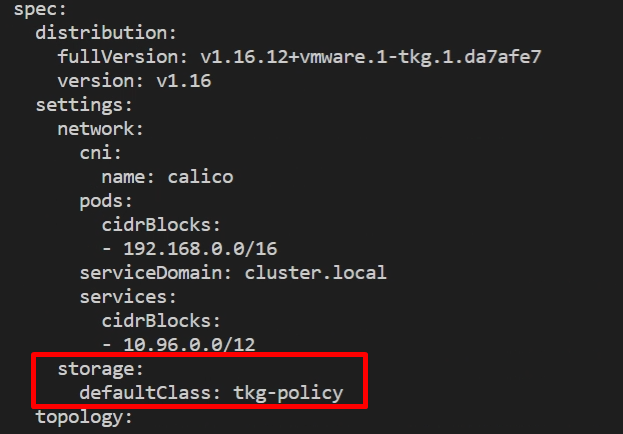
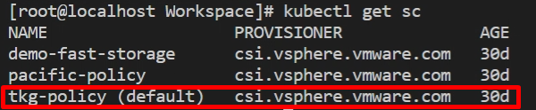

最近のTanzu 系製品ではDefault StorageClass が必要になることがあるが、これをvSphere with Tanzu のTanzu Kubernetes Cluster (TKC, Kubernetes クラスタを仮想マシンで自動的に払い出す機能) で設定するのにコツがいる。非常にマイナーなトピックではあるものの、結構ハマりどころというか、知らないとどうしようもないので、備忘録の意味も込めて記事として残しておく。

### Default StorageClass とは

PVC 作成時、StorageClass を指定しない場合に使用されるデフォルトの StorageClassのこと。k8s クラスタに永続ボリュームを使用するベンダー独自のCustom Controller をインストールするときに、ベンダーは当然クラスタ側のStorageClass の名前を知らないため、Default StorageClass を使用する場合がある。

### 一般的なDefault StorageClass の設定

アノテーションをkubectl patch コマンドで追加する。

[https://kubernetes.io/docs/tasks/administer-cluster/change-default-storage-class/](https://kubernetes.io/docs/tasks/administer-cluster/change-default-storage-class/)

```
kubectl patch storageclass gold -p '{"metadata": {"annotations":{"storageclass.kubernetes.io/is-default-class":"true"}}}'
```

### TKC のDefault StorageClass

**k8s クラスタ自体がk8s のリソースのため、アノテーションを追加すると修正ループが働き自動的にアノテーションが削除される。**回避方法はTKC の中でアノテーションを設定するのではなく、TKC オブジェクトそのものを変更すればよい。

TKC がデプロイされているNamespace にContext を移動させ（TKC そのもののContext ではないことに注意）、 下記コマンドでTKC のオブジェクトのマニフェストを編集する。

```
kubectl edit tanzukubernetescluster <tkg-cluster-name>
```

spec.settings 部分に画像の通り以下を追記する。

```yaml
storage: 
  defaultClass: <storageclass-name> 
```



これでTKC に接続すると、Default StorageClass の設定がされていることが分かる。



なお、これはvSphere7.0 時点での手順であり、U1 以降で修正されるかどうかは不明。

### おまけ：力技での回避方法

修正ループで修正される前にインストールを完了すればよい。従って、インストールの最中にkubectl patch コマンドを連打しておけば、案外何とかなったりする。
