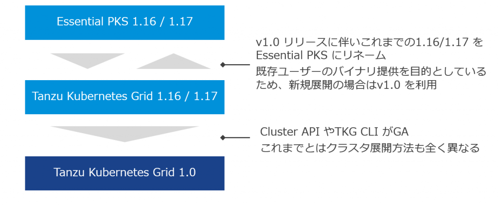
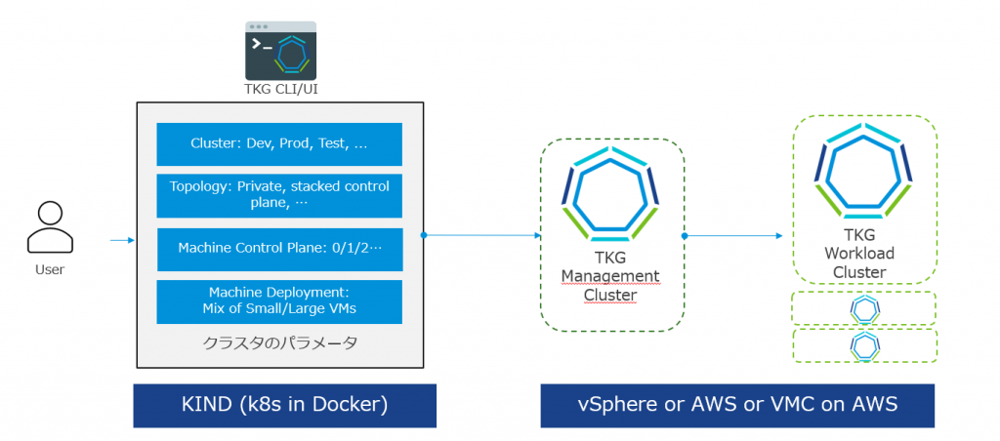

- 2020/10/31 Version 1.2 リリースに伴い更新
- 2020/12/30 サポートに関するQ を追加

Tanzu Kubernetes Grid (TKG) というVMware のKubernetes ディストリビューションがある。相次ぐリブランドによって現在のTanzu 系製品は混とんとしているが、TKG はその中でもトップクラスにカオスである。本記事では趣向を少し変え、FAQ 形式でTKG の混乱を紐解くことにしよう。

### TKG FAQ 概要編

**Q. TKG とは何ですか？**

VMware が提供するKubernetes ディストリビューションです。

**Q. TKG の特徴は何ですか？**

Cluster API によるKubernetes Cluster の自動展開機能、および一部OSS のサポートを含みます。

**Q. TKG はどのように提供されますか？**

仮想アプライアンス+コマンドライン（tkg cli）+サポート対象のOSS 展開用ファイルとして提供されます。

**Q. TKG+ とは何でしょうか？**

TKG にOSS のサポートを拡充したものになります。また、VMC on AWS 上でのデプロイもサポートします。詳細は下記kb を参照してください。

[https://kb.vmware.com/s/article/78173](https://kb.vmware.com/s/article/78173)

**Q. Tanzu Kubernetes Grid Integrated Edition (TKGi) とTKG は異なりますか？**

はい、明確に異なります。TKGi は旧Pivotal Container Service (PKS) がリブランドされたものであり、NSX-T やBOSH などを含むため、全く別物です。

**Q. Essential PKS はなくなったのでしょうか？**

リブランドによりEssential PKS はTKG となり一時期消滅しましたが、Cluster API によるクラスタ自動展開がまだプレビュー段階であったTKG v1.16-1.17 の古いバイナリを継続して顧客に提供するために、 TKG v1.16-1.17 を再度Essential PKS と"リ"リネームしました。現在はv1.0/1.1 と新しくバージョン定義し、 機能が拡充されたそちらをTKG と呼んでいます。そのためEssential PKS を今後新規展開することはなく、忘れていただいて構いません。

<figure>

<figcaption>

[https://my.vmware.com/web/vmware/info/slug/infrastructure\_operations\_management/vmware\_essential\_pks/1\_17](https://my.vmware.com/web/vmware/info/slug/infrastructure_operations_management/vmware_essential_pks/1_17)  
[https://my.vmware.com/web/vmware/info/slug/infrastructure\_operations\_management/vmware\_tanzu\_kubernetes\_grid/1\_x](https://my.vmware.com/web/vmware/info/slug/infrastructure_operations_management/vmware_tanzu_kubernetes_grid/1_x)

</figcaption>

</figure>

**Q. TKC とは何でしょうか？** （2020/10/31 追加）

Tanzu Kubernetes Cluster の略で、vSphere/VCF with Tanzu (旧称 vSphere with Kubernetes) で仮想マシンで払い出すKubernetes クラスタを指します。

**Q. TKGs とは何でしょうか？**（2020/10/31 追加）

Tanzu Kubernetes Grid Service の略で、TKC と同じものを指します。

**Q. TKGm とは何でしょうか？**（2020/10/31 追加）

TKG multi-cloud の略で、vSphere/VCF with Tanzu の機能を使用しないスタンドアロンのTKG です。

**Q. なぜこれほどややこしいのでしょうか？**（2020/10/31 追加）

[https://www.vmware.com/forms/customer\_feedback.html](https://www.vmware.com/forms/customer_feedback.html)

### TKG FAQ テクニカル編

**Q. TKG のデプロイ方法を教えてください。**

vSphere 上にデプロイする場合は、TKG コンポーネントが内包されたova をインポートして、それをテンプレート化し、そこからk8s クラスタを自動構築します。自動構築の仕組みは、Cluster API というk8s でk8s クラスタを作る技術を利用しており、IaaS 側のAPI を叩くことで、k8s のノードとなる仮想マシンを作っていきます。

vSphere 6.7U3 上では、ローカルの端末にk8s クラスタをKIND（Docker で作る簡単なk8s クラスタ）で展開し、そこからCluster API によって管理クラスタを展開します。その後、管理クラスタから、ワークロードクラスタを必要に応じて作成します。

また、vSphere with Kubernetes 上にデプロイする場合は、管理クラスタとしてSupervisor Cluster 上のAPI Server を登録して利用します。TKG で提供されるtkg cli を使ってワークロードクラスタをデプロイすることもできますし、 Tanzu Kubernetes Cluster としてyaml を使ってデプロイすることもできます。いずれも中身は同じです。

**Q. 本当に中身は同じですか？**

同じです。tkg cli を使う場合もkubectl apply する場合もコンテンツライブラリに登録した同じova から展開します。

**Q. vSphere 6.7U3 上でデプロイされるTKG とvSphere7 with Kubernetes 上にデプロイされるTKG は同じですか？**

同じです…と言いたいところですが、若干異なります。クラスタ作成の仕組みやバイナリは同じなのですが、Master Node に展開される管理Pod が一部異なります。が、気にすることはないと思います。

**Q. vSphere7 with Kubernetes を使わず、vSphere7 上にTKG はデプロイできますか？**（2020/10/31 更新）

できますが、サポート対象外になります。

> If you have vSphere 7.0 and the vSphere with Kubernetes feature is not enabled, it is possible to deploy a management cluster to vSphere 7.0 and use the Tanzu Kubernetes Grid CLI to deploy Tanzu Kubernetes clusters, in the same way as for vSphere 6.7u3. However, this configuration is not supported.
> 
> [https://docs.vmware.com/en/VMware-Tanzu-Kubernetes-Grid/1.1/vmware-tanzu-kubernetes-grid-11/GUID-install-tkg-index.html](https://docs.vmware.com/en/VMware-Tanzu-Kubernetes-Grid/1.1/vmware-tanzu-kubernetes-grid-11/GUID-install-tkg-index.html)

ドキュメントでは「サポート外」から「推奨しない」という表記に変更されていました。

> If the vSphere with Tanzu feature is not enabled in vSphere 7, you can still deploy a Tanzu Kubernetes Grid management cluster, but it is not recommended.
> 
> [https://docs.vmware.com/en/VMware-Tanzu-Kubernetes-Grid/1.2/vmware-tanzu-kubernetes-grid-12/GUID-mgmt-clusters-vsphere.html#mc-vsphere7](https://docs.vmware.com/en/VMware-Tanzu-Kubernetes-Grid/1.2/vmware-tanzu-kubernetes-grid-12/GUID-mgmt-clusters-vsphere.html#mc-vsphere7)

**Q. なぜサポート外なのですか？**（2020/10/31 更新）

わかりません。テクニカルには可能とドキュメントには書いているので、マーケティング的な理由でしょうか。

ドキュメントでは「サポート外」から「推奨しない」という表記に変更されていました。

> If the vSphere with Tanzu feature is not enabled in vSphere 7, you can still deploy a Tanzu Kubernetes Grid management cluster, but it is not recommended.
> 
> [https://docs.vmware.com/en/VMware-Tanzu-Kubernetes-Grid/1.2/vmware-tanzu-kubernetes-grid-12/GUID-mgmt-clusters-vsphere.html#mc-vsphere7](https://docs.vmware.com/en/VMware-Tanzu-Kubernetes-Grid/1.2/vmware-tanzu-kubernetes-grid-12/GUID-mgmt-clusters-vsphere.html#mc-vsphere7)

**Q. NSX-T は必須ですか？**（#2020/10/31 更新）

TKG のCNI は現在Calico を使っており、(TKG1.2 はデフォルトAntrea を使用しています)NSX ではありません。ですので、vSphere 6.7U3 やAWS上に建てる場合は必要ありません。ただし、vSphere 7 with Kubernetes の場合、NSX-T は必須となります。これは、TKG の仮想マシンがNSX-T のオーバーレイネットワークに接続されるためです。

ただし、NSX-T と連携することで、セキュリティ強化や、特にLoadbalancer リソースを自由に使える点でメリットがあります。

**Q. NSX-T がないとLoadbalancer リソースは使えませんか？**

NSX-T がないと、というよりは、vSphere 6.7 U3 上でデプロイする場合は、NSX-T とTKG の組み合わせをサポートしていないため、MetalLBなど、自前でLoadbalancer リソースを用意する必要があります。AWS はELB が使えます。

**Q. TKG デプロイ時にHAProxy も展開しますが、これはLoadbalancer ではないのですか？**（2020/10/31 更新）

HAProxy はMaster Node のためのLB であり、k8s におけるLoadbalancer リソースとして使用することはできません。

TKG1.2 ではMaster Node のためのLB としてHAProxy を使用しなくなり、代わりに[kube-vip](https://kube-vip.io/) を使用するようになりました。

**Q. HAproxy は冗長化できますか？**（2020/10/31 更新）

v1.1 現在はできません。

v1.2 ではkube-vip により単一障害点の問題は解決されています。

**Q. HAProxy 障害時にどのようなことが発生しますか？**（2020/10/31 更新）

kubeconfig の参照先がHAProxy のためクラスタに接続できなくなります。

v1.2 ではkube-vip により単一障害点の問題は解決されています。

**Q. Master Node は冗長化できますか？**

可能です。

**Q. 永続ボリュームは使えますか？**

はい、vSphere CSI と連携することで、仮想ディスクをPV として使用できます。手組でvSphere CSI をインストールしようとするとかなり手間なので、個人的にはここは良い点と思います。

**Q. ReadWriteMany は対応していますか？**（2020/10/31 更新）

現在非対応です。TKG というよりは、vSphere CSI の制限になります。

vSAN ならいけるようです。

[https://vsphere-csi-driver.sigs.k8s.io/supported\_features\_matrix.html](https://vsphere-csi-driver.sigs.k8s.io/supported_features_matrix.html)

**Q. TKG でサポートされるOSS は何がありますか？**

[https://kb.vmware.com/s/article/78173](https://kb.vmware.com/s/article/78173)

**Q. vSphere with Tanzu のTKGs でも上記kb は対象となりますか？（2020/12/31 更新）**

上記kb で対象としているのはスタンドアロンのTKGm だけのようで、TKGs は対象とならない可能性がありますが、詳細は確認中です。

**Q. サポートされるOSS の中にContour があります。Contour を調べると、実装にenvoy を使用しているようですが、サービスメッシュ機能はありますか？**

envoy はNorth-South のプロキシとして利用しており、Contour にはEast-West のサービスメッシュ機能はありません。

**Q. Helm はサポートしますか？**（2020/10/31 更新）

kb に記載がないためされないようです。また、サポートされるOSS のインストール方法もドキュメントに記載されていますが、そこではHelm は使いません。

一応Harbor のインストールについてドキュメントに追記されており、そこでは微妙にHelm を使ったインストール方法について記載があります。ただし、先のkb にHelm の記載はないことから、Helm 自体をサポートするようではないです。

[https://docs.vmware.com/en/VMware-Tanzu-Kubernetes-Grid/1.2/vmware-tanzu-kubernetes-grid-12/GUID-extensions-harbor-registry.html](https://docs.vmware.com/en/VMware-Tanzu-Kubernetes-Grid/1.2/vmware-tanzu-kubernetes-grid-12/GUID-extensions-harbor-registry.html)

### TKG FAQ その他

**Q. Cluster API のマスコットはなぜ亀なのですか？**

k8s でk8s を作るという思想は無限を彷彿させますが、亀は無限を暗示する生物であり、また、k8s に関連するコンポーネントは海関連の名前がつくことが多いため、無限を暗示する海の生物だからだと思われます（ソースはありません）。

[https://en.wikipedia.org/wiki/Turtles\_all\_the\_way\_down](https://en.wikipedia.org/wiki/Turtles_all_the_way_down)

