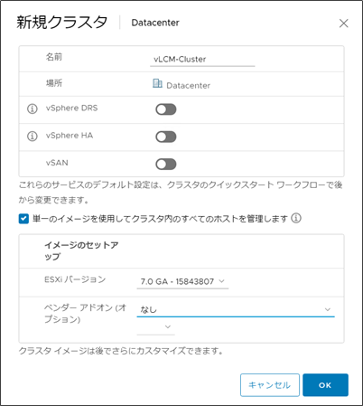
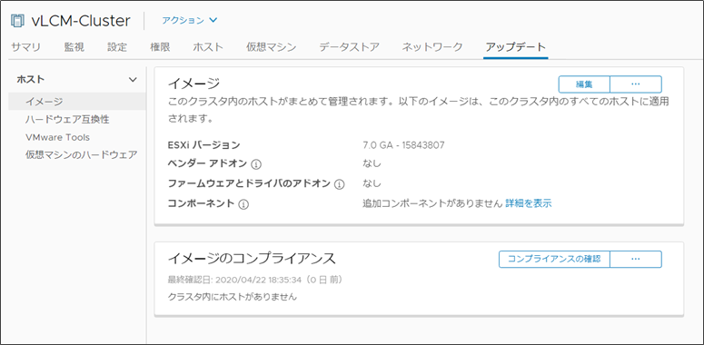
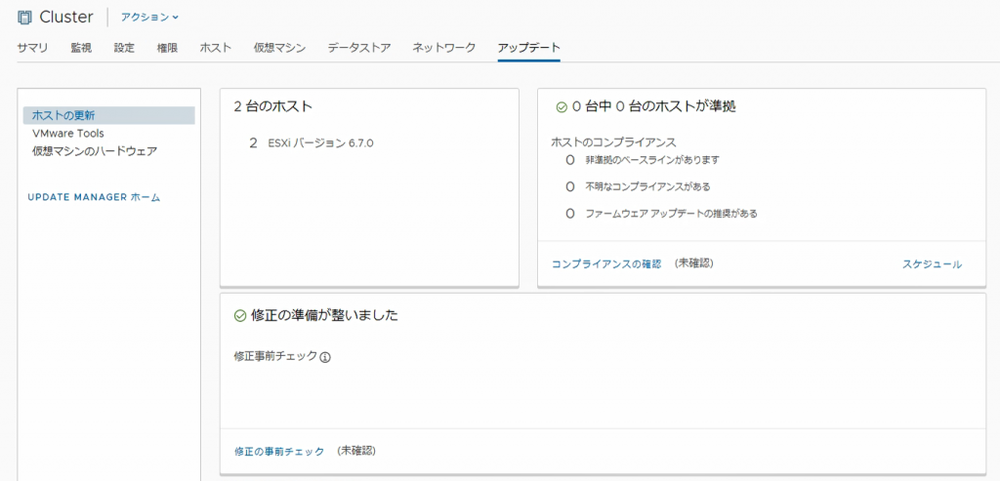
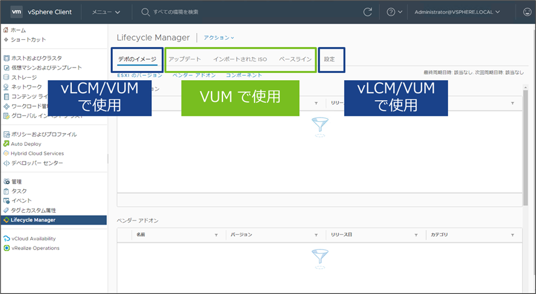

2023/4/12 にvLCM をテーマにした記事を再作成しました。今後はコチラも参照してください。

https://blog.vpantry.net/posts/vlcm-3/

### はじめに

先日リリースされたvSphere7 だが、細かい機能含め相当なアップデートがあった。本記事では、その中でも大きなアップデートであるvSphere Lifecycle Manager (vLCM)について解説する。

### vSphere Lifecycle Manager とは

vLCM はvSphere Update Manager (VUM) の後継にあたり、宣言されたDesired Image に対してクラスタの現在の状態を比較し、差分があれば修正する、というvSphere クラスタを対象としたアップグレードの機能である。

VUM との大きな違いは、設定の単位がクラスタ単位になること、ESXi ホストのバージョンに留まらない一貫性を提供、そしてAddon やComponent といった新しい概念だ。

なお、似たような概念で、VMware Cloud Foundation のSDDC Manager があるが、違いとしては、アチラはクラスタよりももっと広い、VMware の製品同士の組み合わせに一貫性を持たせる。また、似たような名前でvRealize Suite Lifecycle Manager (vRSLCM)があるが、vRealize Automation などのvRealize Suite 製品群を対象としている点で全く違う。

#### クラスタ単位の設定

従来のVUM ではホスト単位でもアップグレードができるが、vLCM ではクラスタ全体に対してアップグレートが適用される。具体的に言うと、クラスタ作成時にVUM のベースラインにあたる「イメージ」を定義する。

<figure>

<figcaption>

クラスタ作成時にvLCM を有効化することができる（デフォルト無効）

</figcaption>

</figure>

クラスタ作成時に、「単一のイメージを使用してクラスタ内のすべてのホストを管理します」にチェックを入れると、vLCM が有効化される。ただし、事前にイメージの大前提となるBase Image をインポートしなければならない。詳細は後述するが、要するにESXi そのものであり、Base Image のバージョンに合致するよう、クラスタ内のホストがアップグレードされる。vLCM を有効化したどのクラスタもBase Image は含まなければならないが、これはvLCM の宣言的モデル、すなわちDesired Image に合わせてクラスタをあるべき状態にする、という考えから当然だろう（Base Image がない＝ESXi がインストールされていない、ということになる）。

vLCM を有効化してクラスタを作成すると、クラスタ→アップデートがこれまでのVUM と若干異なった画面になっていることに気づく。

<figure>

<figcaption>

vSphere7.0 のvLCM

</figcaption>

</figure>

<figure>

<figcaption>

vSphere6.7 のVUM

</figcaption>

</figure>

繰り返しになるが、vLCM のイメージはVUM のベースラインにあたる。ベースラインは、ESXi のISO やパッチ、VIB で構成される。一方、vLCM のイメージはBase Image、Addon、Component で構成される（詳細は後述）。これらを任意に組み合わせてクラスタのあるべき状態であるイメージを作成し、VUM と同様修正を掛けるわけだ。

#### クラスタにさらなる一貫性を提供

vLCM の主要な目的は、クラスタ単位での一貫性を持たせることにある。一貫性とは、単なるESXi のバージョンだけではなく、ESXi 上にインストールされたVIB（厳密にはComponent、詳細は後述）、ハードウェア、ファームウェアを含む。さらには将来的には、ホストプロファイルのような、ESXi ホストの設定をvLCM に含むというロードマップがある。

ファームウェアは2020/4/25 現在Dell とHPE が対応しており、Hardware Support Manager (HSM) とよばれるベンダー提供の外部アプライアンスをデプロイし、そこを経由してファームウェアをアップデートする。

ちなみにハードウェアの一貫性は、「vLCM を有効化するクラスタの中の全てのホストは同一ベンダーであること」という、機能ではなく要件で縛っている。vLCM を使うにあたり、現時点ではAuto Deploy やNSX が使えないなど、追加でいくつか制限があるため、注意してほしい。

[https://docs.vmware.com/en/VMware-vSphere/7.0/com.vmware.vsphere-lifecycle-manager.doc/GUID-0295A915-3963-47AD-AA79-C275226B866F.html](ttps://docs.vmware.com/en/VMware-vSphere/7.0/com.vmware.vsphere-lifecycle-manager.doc/GUID-0295A915-3963-47AD-AA79-C275226B866F.html)

#### Base Image / Addon / Component

vSphere 7 から登場した新しい概念である。vLCM を使う前に、ドキュメントと併せて確認してほしい。

[https://docs.vmware.com/en/VMware-vSphere/7.0/com.vmware.vsphere-lifecycle-manager.doc/GUID-32BD1915-01BF-4C10-A6C3-655B35F95F24.html](https://docs.vmware.com/en/VMware-vSphere/7.0/com.vmware.vsphere-lifecycle-manager.doc/GUID-32BD1915-01BF-4C10-A6C3-655B35F95F24.html)

- **Base Image**
    - 従来より提供されている、ESXi のオフラインバンドル（ISO ではない）
    - VMware のみが提供するESXi のバイナリ
    - 常に完全でブート可能な、Pure なESXi
- **Addon**
    - Component をグルーピングしたもの
    - VMware は提供せず、カスタムイメージを作成するOEM ベンダーが提供
    - カスタムイメージは、Base Image にAddon の組み合わせであり、したがってAddon はカスタムイメージとBase Image の差分を表す
    - 差分なので、Base Image を含まず、単体でブートはできない
- **Component**
    - VIB をグルーピングしたもの（VIB については[コチラ](https://blog.vpantry.net/posts/vib/)を参照してほしい）
    - vSphere 7 以降は、OEM ベンダーが提供する最小のソフトウェアパッケージは、VIB ではなくComponent

vLCM で扱う最小単位はComponent であり、VIB ではないことに注意する。インストールされたVIB は、vLCM としては宣言したイメージとズレがある、としか思わず、そのVIB を削除する。もっとも、7.0 以降、基本的に提供されるのはComponent のはずであるし、アップグレード時も（今は色々問題があるが）Component に切り替わる（というかアップグレードのカスタムイメージに含まれるのがそもそもAddon でありComponent である）。

以上がvSphere Lifecycle Manager の概要である。用語が分かれば、設定項目も少なく、VUM よりもシンプルで扱いやすいと感じる。が、実は色々ハマりどころというか、注意点があるため、最後に、実際に私が触ってみたり、ドキュメントを読んで注意しなければならないと感じたところをまとめる。

## vLCM の注意点

#### 一度vLCM を有効化した場合、VUM に戻すことはできない

クラスタ作成時にvLCM の使用にチェックを入れて有効化するが、無効化はできない。つまり、そのクラスタでVUM を使うことはできない。チェックを入れず、VUM を有効化したクラスタはvLCM に切り替えることができる。

#### VUM からvLCM への切り替え時

NSX-T は使えない。したがって、NSX-T 環境をvSphere7 にアップグレードした場合、そのクラスタでvLCM を有効化することはできない。

ちなみにNSX-v は2020/4/25 現在vSphere7 と互換性はない。

[https://www.vmware.com/resources/compatibility/sim/interop\_matrix.php#interop&2=3496&93=](https://www.vmware.com/resources/compatibility/sim/interop_matrix.php#interop&2=3496&93=)

#### VUM とvLCM が混在している

VUM という名前が消え去ってしまい、中身はVUM だが、vSphere Lifecycle Manager 表記になってしまっていて、非常に混乱するので要注意。

例えば、メニュー→vSphere Lifecycle Manager を選択した先に飛ぶ画面は、**vSphere Update Manager を含む。**

<figure>

<figcaption>

デポのイメージは、実はVUM のパッチインポート時にも使う。zip ファイルをインポートする際に使用すると理解するとよいかも。

</figcaption>

</figure>

また、ドキュメントもマーケティングの理由からか、vSphere7 におけるUpdate Manager のドキュメントは存在せず、すべてvSphere Lifecycle Manager のドキュメントに一本化されている。

判断のポイントとしては、「Baseline」「ベースライン」という用語を使う場合は、VUM であり、同じような文脈で「Image」「イメージ」という用語を使っているのであれば、それはvLCM である。 また、Base Image やAddon、Component という用語もvLCM 独自であるから、判断の基準にしてほしい。加えて、**vLCM ではISO を扱わない**ことに留意する。vLCM の「イメージ」（ベースラインではない）に設定するのは、すべてzip ファイルである。

#### ドキュメントは英語版を参照する

情報がかなりアップデートされており、日本語が追い付いていないので、英語での確認を忘れずに。 また、vLCM の制限に関するドキュメントは、必ず、必ず事前にチェックすること。

[https://docs.vmware.com/en/VMware-vSphere/7.0/com.vmware.vsphere-lifecycle-manager.doc/GUID-0295A915-3963-47AD-AA79-C275226B866F.html](https://docs.vmware.com/en/VMware-vSphere/7.0/com.vmware.vsphere-lifecycle-manager.doc/GUID-0295A915-3963-47AD-AA79-C275226B866F.html)

### まとめ

vSphere Lifecycle Manager はvSphere 7 で登場した、クラスタに対してソフトウェアからファームウェアまで、一貫したアップグレード体験を提供する新機能である。クラスタに対して望ましい状態を定義したイメージを割り当て、現在の状態とイメージに差分が出たら、イメージに沿うよう修正する、といったような宣言型のアップグレードモデルである。VUM よりもシンプルで扱いやすい一方で、vLCM を使う上で理解しなければならないBase Image/Addon/Component といった新しい概念や、NSX が使えないなどの制限事項がある。GA 直後であり、現時点ではそもそもアップグレード先がないため、使用するユーザーも少ないとは思うが、使用する場合は必ず事前にドキュメントを読む必要がある。
