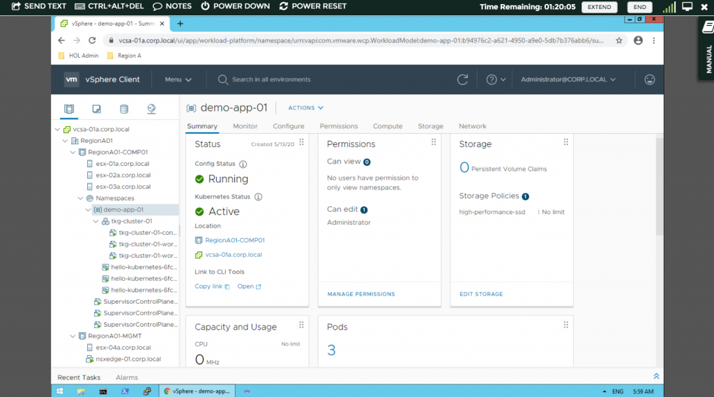

従来の紙芝居ではなく、ハンズオンラボでPod やTanzu Kubernetes Cluster が作れる！太っ腹！さすがに有効化の手順は体験することはできないが、こちらは紙芝居方式でその流れをつかむことができるので、非常にオススメのラボである。

[https://labs.hol.vmware.com/HOL/catalogs/lab/7811](https://labs.hol.vmware.com/HOL/catalogs/lab/7811)

もう一つ個人的にオススメなラボはTanzu Mission Control （TMC）である。

[https://labs.hol.vmware.com/HOL/catalogs/lab/6965](https://labs.hol.vmware.com/HOL/catalogs/lab/6965)

このラボの太っ腹ぷりは半端なく、TMC のSaaS のアカウントを払い出せるうえに、なんとTMC からAWS 上にTanzu Kubernetes Grid を展開できる。スゴイ。存分に使ってしまおう。
