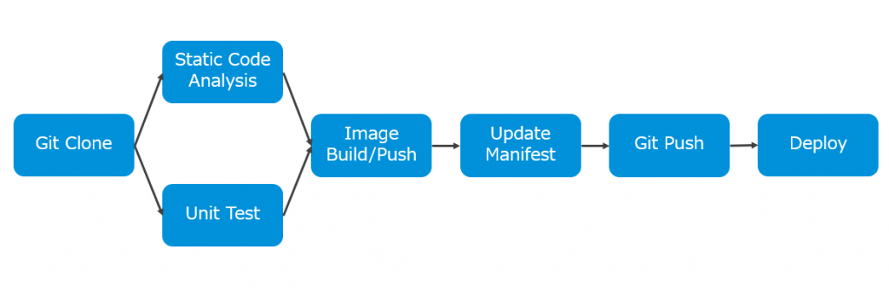
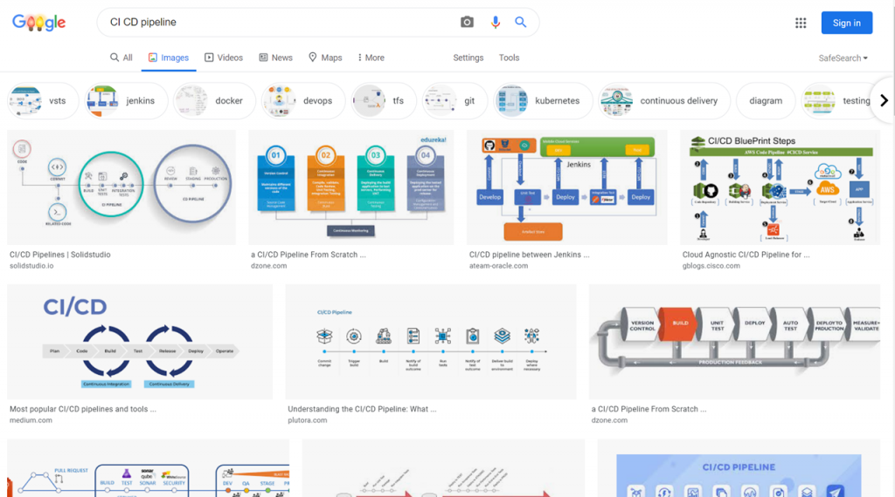
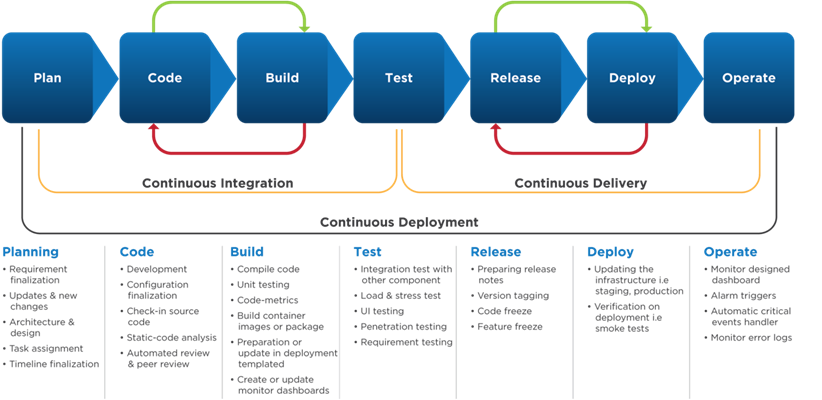
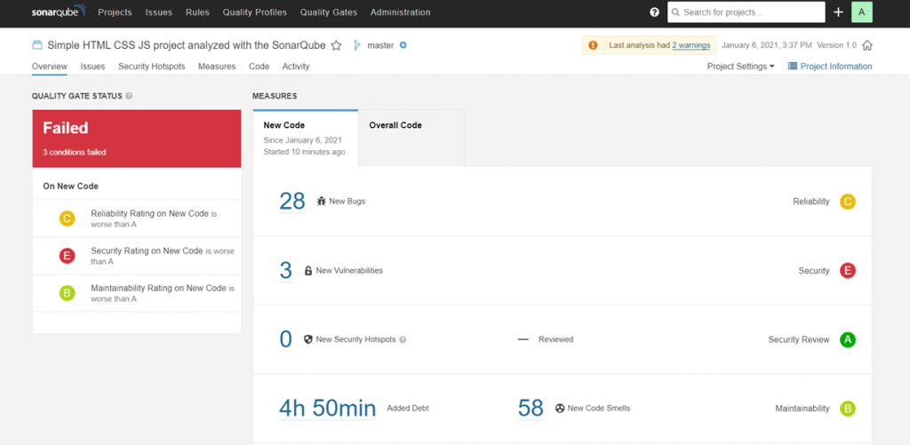
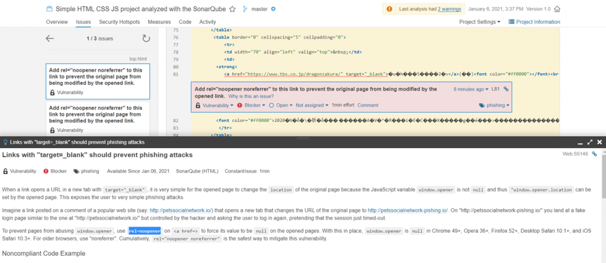

- [](https://blog.vpantry.net/posts/cicd-1/)[インフラエンジニアのためのCI/CD 入門 1](https://blog.vpantry.net/posts/cicd-1/)
- [](https://blog.vpantry.net/posts/cicd-2/)[インフラエンジニアのためのCI/CD 入門 2](https://blog.vpantry.net/posts/cicd-2/)
- [](https://blog.vpantry.net/posts/cicd-3/)[インフラエンジニアのためのCI/CD 入門 3](https://blog.vpantry.net/posts/cicd-3/)

Kubernetes にアプリケーションをデプロイするにあたって、CI/CD の考え方は非常に重要だ。アプリケーションのビルドやデリバリを高速化することがコンテナやKubernetes を使う主要な目的だが、CI/CD による自動化の仕組みが整っていなければ、その恩恵を受けられないばかりか、インフラの複雑性ばかり増してしまい、逆にインフラ担当者や開発者の負荷になってしまう可能性がある。**Kubernetes が複雑というのは多くの人が同意するところであろうが、その複雑性に真っ向から立ち向かうのではなく、自動化の仕組みを適切に整えることでKubernetes の魅力を最大限引き出すことができ、そうして初めてKubernetes を使う意味があると考える。**

一方で、従来のインフラ担当者が、Kubernetes だけではなく、CI/CD をキャッチアップすることは非常にタフであると感じた。理由は、キャッチアップに必要な前提知識の不足、および学習時の納得感を得るのが難しいからである。つまり、Kubernetes に関していえば、高度なインフラストラクチャと考えれば例えば従来のストレージやネットワークの知識が活用できるが、インフラ担当者にとってCI/CD はスコープの外であり、そのメリットも享受することが難しいため、なぜこのような実装になっているのかなどを考えながら学習することが中々難しい。

そこで、実際にインフラしか携わったことのない私がCI/CD を本気でキャッチアップし、その要点をまとめ、インフラ担当者がCI/CD をより効率的に学ぶために本記事の活用してもらうことを目指し、CI/CD に関する内容を数回に分けて記載することにした。

なお、最終的に以下のようなCI/CD パイプラインの構築を目標として記事を書いていくことにする。



### CI/CD とは

**C**ontinuous **I**ntegration/**C**ontinuous **D**elivery の略である。Continuous Integration とは開発者が自分のコード変更をセントラルリポジトリにマージし、その度に自動化されたテストとビルドを実行する仕組みであり、Continuous Delivery とはソフトウェアリリースプロセス全体、すなわちアプリの展開やインフラのプロビジョニングまでを自動化する仕組みを指す。この時点で何を言っているかが分からなくなるが、用語の意味合いはそれほど重要ではなく、要するに**CI/CD は開発者がコードに集中してもらうために、アプリの作成やテスト、デプロイの一連の流れを自動化する仕組み**と理解すればよい。それらの自動化される一連の流れをパイプラインと呼ぶ。

ここで、Integration の意味は「統合」であり、CI は書いた通り自分のコード変更をリポジトリに統合することを意味するが、これを理解するためにはバージョン管理システムを知らねばなるまい。主要なものはgit であるが、git だけでもかなりのボリュームとなり、また様々な資料が存在するため解説は省くが、とにもかくにも触って覚えることが重要である。以前から何回か紹介しているKatacoda では、git のシナリオもあり、是非触ってみてほしい。

[https://www.katacoda.com/courses/git](https://www.katacoda.com/courses/git)

では、CI/CD で自動化するタスクは何だろうか？アプリの作成やテスト、デプロイとは具体的に何をするのだろうか？それを理解するためにググると、実に非常に多くのパイプラインが見られる。

[](images/image-1024x570.png)

タスクが抽象的に記載されているものも多く、この中から理解するうえでいい感じのものを見つけるのは難しいが、その中でも個人的に最も具体化されていると感じたものが以下である。

<figure>

[](images/image-1.png)

<figcaption>

[https://dzone.com/articles/secure-and-scalable-cicd-pipeline-with-aws](https://dzone.com/articles/secure-and-scalable-cicd-pipeline-with-aws) より引用

</figcaption>

</figure>

この図の中で、とりわけ他のパイプラインでも多くみられるタスクであり、今回作成するパイプラインの中に組み込むUnit Test（単体テスト）、およびStatic Code Analysis （静的コード解析）を解説する。

### Unit Test（単体テスト）

関数のような小さなコンポーネントにおけるテストであり、書いたコードが正しく振舞うかどうかを確認する。依存関係がある場合（例えば関数A が関数B を呼び出す）、関数A だけをテストするために、関数B の戻り値を仮に与えて（モック）テストする場合もある。

以下のようなGolang のコードがあるとする。言語自体はなんでもいいのだが、このコード自体は引数として与えられた2つのa, b を単純に足すだけの単純な関数である。

```go
package math
func Add(a, b int) int {
    return a + b
}
```

[https://github.com/](https://github.com/vkbaba/go-sampleapp/blob/master/math/math.go)[vkbaba](https://github.com/vkbaba/go-sampleapp/blob/master/math/math.go)[/go-sampleapp/blob/master/math/math.go](https://github.com/vkbaba/go-sampleapp/blob/master/math/math.go)

Golang のテストのフレームワークを用いた時に、これをテストするコードの例が以下である。

```go
package math
import "testing"
func TestAdd(t *testing.T) {
    sum := Add(3, 4)
    if sum != 7 {
        t.Errorf("Wanted 7 but received %d", sum)
    }
}
```

[https://github.com/vkbaba/go-sampleapp/blob/master/math/math\_test.go](https://github.com/vkbaba/go-sampleapp/blob/master/math/math_test.go)

Golang ではこのようにテストコードをパッケージ名\_test.go のようにするのだが、それは重要ではない。ポイントは、3 + 4 = 7 になることが確認できるコードを自分で書いたことで、これでもってもとの Add 関数の確からしさをテストするということだ。テストされるコードによっては、例えば0 を入れたとき、負の数を入れた時、巨大な数を入れた時、などテストシナリオは増えていくが、とにもかくにもこれがシンプルなUnit Test の例である。

Add 関数内で、例えばb = 0 など意図的なバグを仕込むと、3 + 0 = 3 と期待した7 ではなくなり、Unit Test に失敗する。

```shell
PS C:\Users\vkbaba\Workspace\go\math> go test
--- FAIL: TestAdd (0.00s)
    math_test.go:8: Wanted 7 but received 3
FAIL
exit status 1
FAIL    _/C_/Users/vkbaba/Workspace/go/math      0.085s
```

CI/CD パイプラインに組み込むときは、自動化の流れの中のあるタイミングでgo test コマンドを叩き、失敗したらパイプラインを停止し通知などをすることになる。

### Static Code Analysis （静的コード解析）

コードの解析の名の通り、ソースコードそのものの品質を確かめるテストであり、**ビルドをせずに**、バグのチェックやセキュリティ脆弱性コーディング規約違反などを確かめる。OSS の静的コード解析ツールであるSonarQube は様々な言語に対応しており、今回は単純なHTML ファイルを解析してみる。サンプルとして、今回は以下の超有名サイトを用いた。

[http://abehiroshi.la.coocan.jp/](http://abehiroshi.la.coocan.jp/)

結果は以下の通りである。

<figure>

[](images/image-3-1024x501.png)

<figcaption>

HTML5 に対応していないのもあってHTML の書き方が古かったり脆弱性が見つかっている

</figcaption>

</figure>

<figure>

[](images/image-5-1024x446.png)

<figcaption>

なぜ警告されているのかもわかるのがよい

</figcaption>

</figure>

例えばスクリーンショット2 枚目では、ドラゴン桜の紹介ページへのリンク部分に、rel="noopener noreferrer" が追加されていないと警告されている。スクリーンショット下部の下部に解説があるが、要するにリンクをクリックし、新しいタブを開いて飛んだ時に元ページが改変されることを防ぐことができる。

CI/CD パイプラインの中では、Unit Test と同様に、このようなSonarQube のタスクを組み込み、例えばテストに Fail した場合パイプラインを停止し通知などをすることになる。

なお、SonarQube はKatacoda で触ることができる。

[https://www.katacoda.com/courses/cicd/sonarqube](https://www.katacoda.com/courses/cicd/sonarqube)

しかしながら、Java を知らないと何をしているかが理解しづらいので、今回のような単純なHTML ファイルを静的コード解析するチュートリアルを作成したので、必要に応じて参考にしてほしい。環境はKatacoda を使うので、Kubernetes クラスタを用意する必要はない。

[https://github.com/vkbaba/sonarqube-tutorial](https://github.com/vkbaba/sonarqube-tutorial)

### 今回のまとめ

CI/CD と聞いて身構える必要はなく、要するに単なる自動化にすぎない。ただ、インフラエンジニアにとってCI/CD で自動化するタスクにあまりなじみがない場合が多く、今回は最低限のコードを用いてUnit Test とStatic Code Analysis を解説した。

ではどのように自動化しているか、という、CI/CD を学ぶ上では比較的取っつきやすく面白い（個人的には）部分に関してはTekton を例に紹介するが、その前にGitops の考えを整理する必要があると思うので、次回はGitops について簡単に紹介する。
