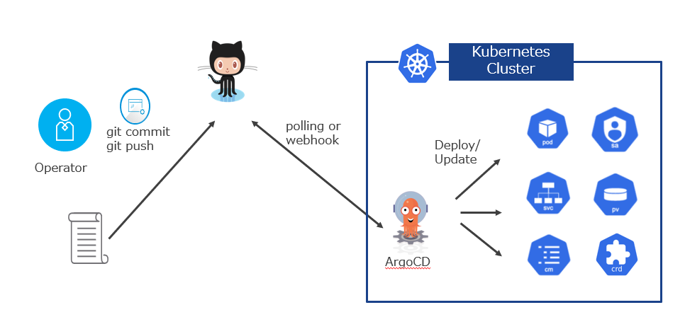
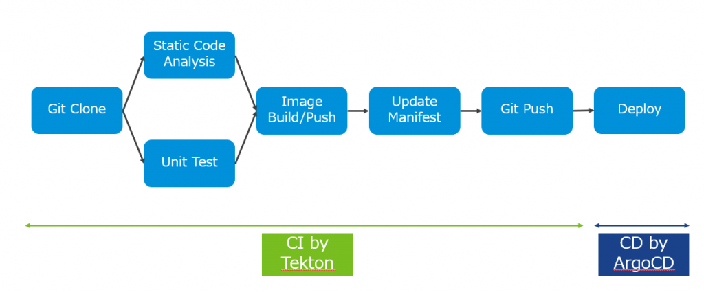

- [](https://blog.vpantry.net/posts/cicd-1/)[インフラエンジニアのためのCI/CD 入門 1](https://blog.vpantry.net/posts/cicd-1/)
- [](https://blog.vpantry.net/posts/cicd-2/)[インフラエンジニアのためのCI/CD 入門 2](https://blog.vpantry.net/posts/cicd-2/)
- [](https://blog.vpantry.net/posts/cicd-3/)[インフラエンジニアのためのCI/CD 入門 3](https://blog.vpantry.net/posts/cicd-3/)

前回は、CI/CD の全体像の解説と、Unit Test、SonarQube によるStatic Code Analysis を実例で紹介した。今回は、GitOps の考え方に触れ、CI/CD パイプラインの構成の仕方と、前回解説できなかった構築予定のパイプラインの残りのタスクについて整理する。



### GitOps とは

Gitops とは、Git のようなバージョン管理システムを唯一の信頼源として使用し、アプリケーションの変更を追跡、承認するプロセスである。例えば、Kubernetes ではPod をデプロイするにあたって、kubectl apply -f  であったり、kubectl run であったりとさまざまな方法があるわけだが、kubectl コマンドはKubernetes を直接操作していることにほかならない。GitOps の考え方をすれば、開発者が操作するのはKubernetes ではなくGit であり、Git リポジトリのファイルに変更を加えることで、今回紹介するArgoCD のような自動化の仕組みによってPod がデプロイされる。

GitOps のメリットとしては、例えばインフラの再現性があるだろう。インフラがコードベースになり、繰り返しの作業の手間を減らすことができたり、Git のバージョン管理の特性を生かして以前の構成に簡単にロールバックすることができる。また、自動化されたデプロイのプロセスにより、手動でのミスをなくすことができる。

特に、Kubernetes のような宣言的インフラストラクチャにおいては、GitOps の考え方を採用すると、今Kubernetes 上でどのアプリケーションがどれほど実行されるべきなのかというパラメータシートそのものがリポジトリ中にファイルとして保存される。このような宣言的構成でない場合、たとえパラメータシートを使ってインフラを構成したとしても、そこに設定ミスが含まれていないとは言いきれない。単にIP アドレスの入力を1つ間違えたというだけのミスで何時間も時間を無駄にすることもある。そのようなパラメータの入力を自動化の仕組みに押し付けることで、そういった設定ミスを限りなく減らすことができるし、また、例え自動化の仕組みの意図しない動作やエラー、悪意のあるユーザーによるイメージの改変などによって、あるべき状態とのずれが生じたとしても、その状態とリポジトリのマニフェストを比較検証することによって、今の環境の正しさの検証を簡単に実行することができる。ほかにも、例えばディザスタリカバリでは、リポジトリのマニフェストを別環境にApply するだけという簡単な手順になるというのは大きなメリットだろう。

今回構成するパイプラインは、このGitOps を前提に組む。具体的には、CI 、すなわちアプリケーションのデプロイまでのプロセスをTekton で実装し、CD をArgoCD で実装する。Tekton によるCI では、前回紹介したテストの後に、イメージのコンテナ化を行い、Harbor にイメージをプッシュする（**Image Push/Build**）。GitOps では最終的な成果はGit リポジトリに反映されなければならないので、リポジトリ中のKuberntes マニフェストを作成したイメージで更新して（**Update Manifest**）リポジトリにプッシュする（**Git Push**）。その変更を検知したArgoCD が、マニフェストをKubernetes クラスタに自動的にApply することで（**Deploy**）、一連のCI/CD のプロセスは完了となる。本記事では、これらのタスクを簡単に解説する。



### Image Build/Push

その名の通り、作成したアプリケーションをコンテナ化し、コンテナレジストリにPush するタスクである。コンテナ化する方法としては、Cloud Native Build Pack のようにDockerfile を使わない方法もあるが、今回はDockerfile を使う。

イメージのプッシュはHarbor を用いた。Harbor については[こちらの記事](https://blog.vpantry.net/2020/02/harbor-helm-install/)を参照してほしい。Dockerhub を使うと検証は簡単であるが、実際には自前で用意したレジストリもしくはマネージドなレジストリを使用することがほとんどだろうから、今回はインストールも手軽で豊富な機能も持つHarbor を使っている。

このタスクをCI/CD パイプラインに組み込む場合は、docker build とdocker push コマンドを使うが、注意点として、次の記事で解説するが、これらの**パイプラインのタスクはコンテナの中で行われる**。従って、 コンテナの中でdocker コマンドを叩く必要があり、それには特権コンテナを使う必要がある。「特権コンテナはコンテナにあらず」なので、 可能な限り避けるべきだし、そもそもクラスタのセキュリティポリシー上デプロイできない場合もある。そこで、今回はkaniko と呼ばれる、Docker デーモンに依存することなくDocker コマンドを叩くことができるツールを利用している。

[https://github.com/GoogleContainerTools/kaniko](https://github.com/GoogleContainerTools/kaniko)

### Update Manifest

その名の通りsed コマンドなどでマニフェストを更新するのだが、更新する場所はコンテナのイメージタグである。

```
  apiVersion: v1
kind: Pod
metadata:
  name: go-sampleapp
spec:
  containers:
  - name: go-sampleapp
    image: 172.16.194.68/demo-ns/go-sampleapp:88596e50334b134042d141dda7b2b04a2e0e1bd3
  imagePullSecrets:
  - name: registry-secret
```

上記のマニフェストでいうと、172.16.194.68/demo-ns/go-sampleapp がコンテナリポジトリのIP/プロジェクト名/アプリケーション名 となり、「:」 の後がイメージタグとなる。バージョン番号を記載することが多く、デフォルトではlatest となるが、この例ではGit のコミットハッシュをタグに設定することで、イメージとそのイメージが変更されたコミットを紐づけている。

### Git Push

その名の通りgit add + git commit + git push コマンドを叩き、Update Manifest タスクにおけるマニフェストの変更をコミットし、リモートリポジトリにその変更をアップロードする。

### Deploy

最後にデプロイだが、これはArgoCD を使う。

[https://argoproj.github.io/argo-cd/](https://argoproj.github.io/argo-cd/)

ArgoCD はKubernetes にPod として展開される。ArgoCD がGit リポジトリを定期的にポーリングすることで、その変更を検知し、手動もしくは自動的に対象のKubernetes クラスタにマニフェストをApply することができる。

もちろんArgoCD を使わず、Update Manifest タスク の後にそのままDeploy タスクを実行することもできるのだが、Tekton のようなCI ツールがKubernetes API Server と接続しなければならないこと（CI ツールがSaaS の場合、それは大きなセキュリティホールとなりうる）、そして最も重要なことだが、Git リポジトリを単一の信頼源としていないため、GitOps とは言えない（CIOps と呼ぶ）。一度git push するのがミソだ。

したがって、本パイプラインではCI ツール（Tekton）とCD ツール（ArgoCD）の領域を明確に分けており、CI ではイメージをプッシュしGit リポジトリ中のマニフェストの更新までを実行し、CD ツールはマニフェストの変更を検知してk8s クラスタにデプロイすることだけを実行するようパイプラインを組んでいる。

### 今回のまとめ

今回はパイプラインを構成するにあたり重要な考え方であるGitOps を紹介した。GitOps では、Git のようなバージョン管理システムのリポジトリを単一の信頼源とするが、Kubernetes のような宣言的なインフラストラクチャと相性が良い。また、CI/CD パイプラインにGitOps の考え方を反映するために、コンテナイメージのビルドの後に、Kubernetes マニフェストを更新し、ArgoCD のようなCD ツールを用いてKubernetes クラスタにデプロイするという方法を紹介した。

次回は、記事中でも何度か出てきたTekton を簡単に紹介する。非常によくできたツールであり取っつきやすくもあるが、一からパイプラインを構成するのはなかなかタフなので、実際のパイプライン構築は次々回に回すことにする。
