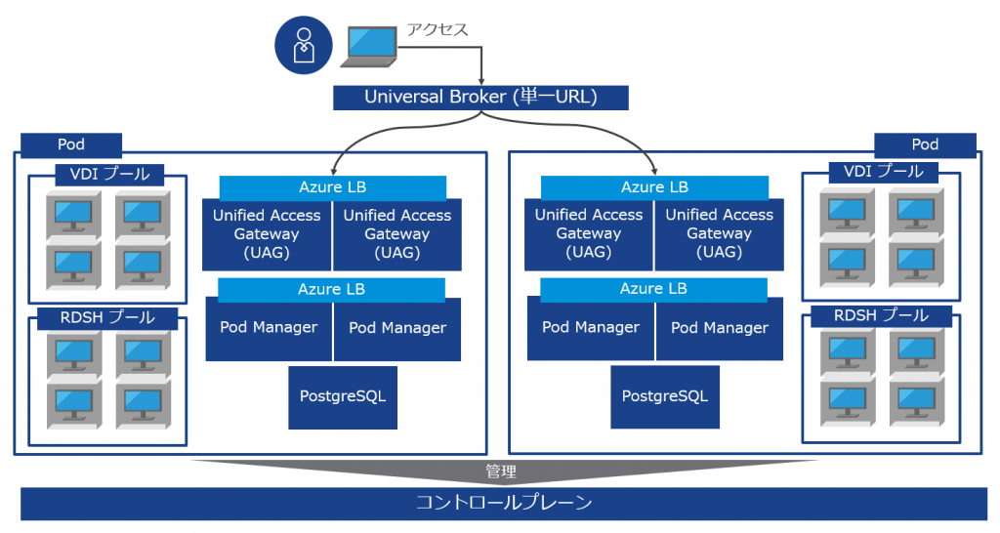

ここ最近Horizon Cloud on Azure 関連の対応を業務でしていて、需要があるかは分からないが、せっかくなのでよくある質問と回答をまとめておくことにする。余力があれば随時更新予定。

- 2021/5/7 初版作成
- 2021/11/15 一部追記&修正

#### リンククローンやインスタントクローンは使えますか？

使えない。フルクローン、公開デスクトップ（サーバーOS共有でデスクトップ配信、いわゆるRDSH）、公開アプリケーション（サーバーOS共有でアプリのみ配信）、WVD に対応している。

#### Horizon Cloud on Azure のコントロールプレーンはどこにありますか？

下記を参照。機能ごとに分かれていて、コントロールプレーンは「Horizon Cloud Control Plane Instances in Microsoft Azure」 を参照する。日本にあるので安心してほしい。

[https://www.vmware.com/global-infrastructure.html](https://www.vmware.com/global-infrastructure.html)

#### 管理コンポーネントの可用性について教えてください。

Pod Manager およびUAG は2つ展開され冗長性が確保される。これらは可用性ゾーンではなく可用性セットに従うため、同一データセンター内での別ラックでのVM 配置になる。Azure Load Balancer (SKU: Standard)やPostgreSQL (Azure SQL Database) はAzure のSLA に従う。

[https://docs.vmware.com/en/VMware-Horizon-Cloud-Service/services/hzncloudmsazure.admin15/GUID-1DAA5671-5928-47C0-BDAE-E3353A90115D.html](https://docs.vmware.com/en/VMware-Horizon-Cloud-Service/services/hzncloudmsazure.admin15/GUID-1DAA5671-5928-47C0-BDAE-E3353A90115D.html)

#### PostgreSQL に含まれる情報を教えてください。

Pod Manager の可用性を維持するためのメタデータが含まれる。詳細は公開していない。

> The VNET that you configure for Horizon Cloud on Microsoft Azure must be setup to allow for the Microsoft.SQL service endpoint. That service endpoint allows the Horizon Cloud on Microsoft Azure Pod Manager VM to use the Microsoft Azure Database for PostgreSQL Service to backup and restore critical system data in the Pod Manager VM. It is also leveraged for the HA feature.
> 
> [https://techzone.vmware.com/quick-start-tutorial-vmware-horizon-cloud-service-microsoft-azure](https://techzone.vmware.com/quick-start-tutorial-vmware-horizon-cloud-service-microsoft-azure)

#### 障害やメンテナンス情報の通知はどこで確認できますか？

下記を参照。

[https://status.horizon.vmware.com/](https://status.horizon.vmware.com/)

#### SLA に関する資料はありますか？

下記を参照。

[https://www.vmware.com/content/dam/digitalmarketing/vmware/en/pdf/downloads/eula/vmw-euc-consolidated-service-level-agreement.pdf](https://www.vmware.com/content/dam/digitalmarketing/vmware/en/pdf/downloads/eula/vmw-euc-consolidated-service-level-agreement.pdf)

#### Pod Manager などの管理コンポーネントの障害時にメール等で通知することはできますか？

現時点においてはできないが、Horizon Infrastructure Monitoring という機能で、本機能の提供を限定的に開始しているようだ。詳細については下記を参照。

[https://docs.vmware.com/en/VMware-Horizon-Cloud-Service/services/hzncloudmsazure.admin15/GUID-9BBEFC8E-0443-4E1D-AC49-BFB2918A9CDA.html](https://docs.vmware.com/en/VMware-Horizon-Cloud-Service/services/hzncloudmsazure.admin15/GUID-9BBEFC8E-0443-4E1D-AC49-BFB2918A9CDA.html)

#### オンプレミスのVDI イメージをHorizon Cloud on Azure で使用することはできますか？

できない。ハイパーバイザーがそもそも異なるため、ディスクフォーマットの変換が必要になってくる。

#### Horizon Cloud on Azure のPod 間でマスターイメージを共有することはできますか？

マスターイメージを共有する機能はImage Management Service と呼ばれるが、Horizon Cloud on Azure のPod への対応を限定的に開始している。現時点においてはできないと考えるべきだが、詳細については下記を参照。

[https://docs.vmware.com/en/VMware-Horizon-Cloud-Service/services/rn/horizon-service-relnotes.html](https://docs.vmware.com/en/VMware-Horizon-Cloud-Service/services/rn/horizon-service-relnotes.html)

#### 何台までVDI をデプロイできますか？

1Pod あたり2000セッション、 1 サブスクリプションあたり2000デスクトップの制約がある。Pod やサブスクリプションが分かれても、単一のコントロールプレーンからサブスクリプションやPod の管理は可能だが、Pod が分かれると当然Pod Manager やUAG なども分かれるため、別途デプロイされることに注意。

[https://docs.vmware.com/en/VMware-Horizon-Cloud-Service/services/hzncloudmsazure.getstarted15/GUID-EE21156D-974D-4C37-820D-1A40CED6346E.html](https://docs.vmware.com/en/VMware-Horizon-Cloud-Service/services/hzncloudmsazure.getstarted15/GUID-EE21156D-974D-4C37-820D-1A40CED6346E.html)

#### AD 設計に関するガイドみたいなものはありますか？

下記を参照。オンプレAD と連携する場合はレプリカをAzure に作成する構成が典型的か。

[https://www.vmware.com/content/dam/digitalmarketing/vmware/en/pdf/products/horizon/vmw-wp-networking-ad-horizon-cloud-azure-uslet-20171201.pdf](https://www.vmware.com/content/dam/digitalmarketing/vmware/en/pdf/products/horizon/vmw-wp-networking-ad-horizon-cloud-azure-uslet-20171201.pdf)

#### API で操作できますか？

現時点でユーザー向けのAPI は公開していない。

#### ダブルホップ（Nested Mode）に対応していますか？

制約はあるが対応している。詳細は以下kb を参照。

[https://kb.vmware.com/s/article/80509](https://kb.vmware.com/s/article/80509)

#### Azure Dedicated Host は使用できますか？

使用できない。

#### Horizon Cloud on Azure のVDI に対するウイルス対策ソフトについて、VMware は何か提供していますか？

Carbon Black Cloud が対応している。エージェントをマスターイメージにインストールする形になる。

#### Universal Broker 使用時の注意事項を教えてください。

現時点における制限は下記を参照。

[https://docs.vmware.com/en/VMware-Horizon-Cloud-Service/services/hzncloudmsazure.admin15/GUID-26FA255F-D0A3-48B4-8B4B-C8B9F9852A05.html](https://docs.vmware.com/en/VMware-Horizon-Cloud-Service/services/hzncloudmsazure.admin15/GUID-26FA255F-D0A3-48B4-8B4B-C8B9F9852A05.html)

Workspace ONE Access と連携する際に必ずWorkspace ONE UEM のライセンスが必要になる点には要注意。Universal Broker を使用する/使用しないで連携の方法が異なり、使用する場合はHub Service というUEM のライセンスが必要な機能を有効化する必要がある。Universal Broker を使用しない場合はHub Service を使う必要はない。

[https://docs.vmware.com/en/VMware-Horizon-Cloud-Service/services/hzncloudmsazure.admin15/GUID-F36B79F8-90D3-46EA-B826-247641E463E6.html](https://docs.vmware.com/en/VMware-Horizon-Cloud-Service/services/hzncloudmsazure.admin15/GUID-F36B79F8-90D3-46EA-B826-247641E463E6.html)

→ 確認中(2021/11/5)。→ Hub Service を利用するためにUEM を使用する必要はないためUEM ライセンスは必要ない(2022/2/9)

#### 多要素認証はサポートしていますか？

Horizon Cloud on Azure ではRADIUS をサポートしているため、3rd Party ベンダーでRADIUS 対応のソフトウェア（例えばCisco Duo）を使用する。

[https://docs.vmware.com/en/VMware-Horizon-Cloud-Service/services/hzncloudmsazure.admin15/GUID-9AA8835A-DFFD-415D-AF3E-69BE6B0C8C79.html](https://docs.vmware.com/en/VMware-Horizon-Cloud-Service/services/hzncloudmsazure.admin15/GUID-9AA8835A-DFFD-415D-AF3E-69BE6B0C8C79.html)

また、より幅広い認証方式（例えばクライアント証明書など）を採用したい場合は、Workspace ONE Access と連携し、認証の仕組みをAccess 側にオフロードする形になる。

#### Workspace ONE と組み合わせた時のメリットを教えてください。

Workspace ONE はWorkspace ONE UEM というEMM と、Workspace ONE Access という認証認可のためのサービスで構成されている。Workspace ONE UEM を使用する場合は、VDI に接続するためのデバイスに対する利便性やセキュリティの確保を実現できる。Workspace ONE Access を使用する場合は、より幅広く便利でセキュアな認証方式を利用することができる。

#### Workspace ONE Access 使用時のVDI へのアクセスイメージを教えてください。

アプリケーションのカタログにアクセスし、その後カタログからVDI にアクセスする形になる。アクセスする際は（設定次第で）自動的にHorizon Client が立ち上がる。カタログにアクセスするタイミングとVDI にアクセスするタイミングにおいて認証が走るが、True SSO という機能を有効化していればVDI アクセス時の認証を省略できる。

[https://docs.vmware.com/en/VMware-Horizon-Cloud-Service/services/hzncloudmsazure.admin15/GUID-451AF252-931C-418C-BD7F-288AE170F5A4.html](https://docs.vmware.com/en/VMware-Horizon-Cloud-Service/services/hzncloudmsazure.admin15/GUID-451AF252-931C-418C-BD7F-288AE170F5A4.html)

カタログにアクセスせず、直接Horizon Client を立ち上げた場合でも、設定次第でカタログにリダイレクトさせることもできる。

#### Horizon Cloud on Azure を触ってみたいのですが、簡単に試せる環境はありますか？

VMware Test Drive からコントロールプレーン、VDI いずれも無償で触ることができる。

[https://portal.vmtestdrive.com/](https://portal.vmtestdrive.com/)
