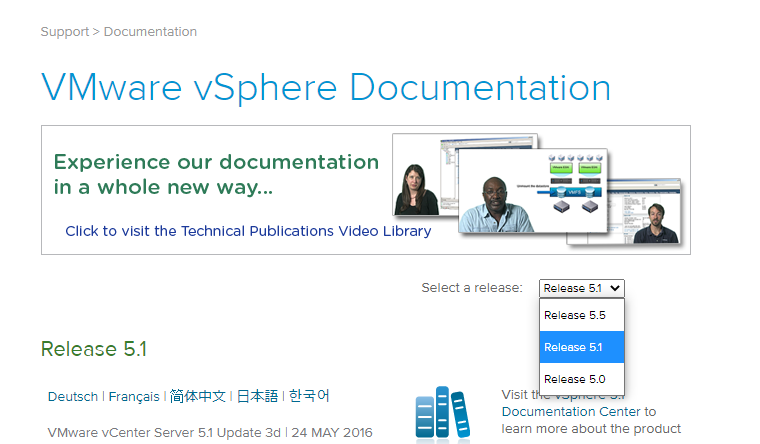
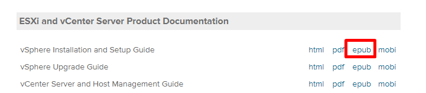

サポートが切れているので当然と言えば当然なのだが、2021/7/3 時点でvSphere 5.5 までしか遡ってドキュメントを見ることができない。

[https://docs.vmware.com/en/VMware-vSphere/index.html](https://docs.vmware.com/en/VMware-vSphere/index.html)

たまに、これよりも古いバージョン、例えばvSphere 5.0 に関して調べたい場合がある。そんな時、VMware として正式に公開しているページにたどり着くのに工夫がいるため、一応まとめておく。

## vSphere 4

以下のページのDownload リンクからドキュメントを取得できる。個別のドキュメントリンクだとリダイレクトされてしまうことに注意。

> [Download](https://www.vmware.com/support/vsphere4/doc/vsp_esxi40_i_vc40_book_bundle.zip) PDF versions of all books in the main documentation det

[https://www.vmware.com/support/pubs/vs\_pages/vsp\_pubs\_esxi40\_i\_vc40.html](https://www.vmware.com/support/pubs/vs_pages/vsp_pubs_esxi40_i_vc40.html)

## vSphere 4.1

以下のページのDownload リンクからドキュメントを取得できる。個別のドキュメントリンクだとリダイレクトされてしまうことに注意。

> [Download](https://www.vmware.com/support/vsphere4/doc/vsp_esx41_vc41_book_bundle.zip) PDF versions of all books in the main documentation set

[https://www.vmware.com/support/pubs/vs\_pages/vsp\_pubs\_esx41\_vc41.html](https://www.vmware.com/support/pubs/vs_pages/vsp_pubs_esx41_vc41.html)

## vSphere 5.0/5.1

以下のページで、Release を5.0 または5.1 に変更する。

[https://www.vmware.com/support/pubs/vsphere-esxi-vcenter-server-pubs.html](https://www.vmware.com/support/pubs/vsphere-esxi-vcenter-server-pubs.html)

その後、参照したいドキュメントをepub 形式でダウンロードし、必要に応じてpdf に変換して確認する。html やpdf 、zip のアーカイブはすべてリダイレクトされてしまうことに注意。

……かなりトリッキーなのでいずれ塞がれるかもしれない。
