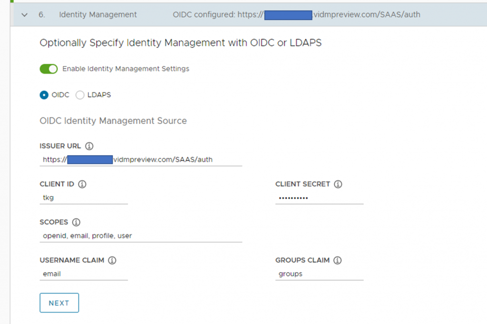

Tanzu Kubernetes Grid におけるアクセスコントロールの仕組みとして[Pinniped](https://pinniped.dev/) が提供されている。Pinniped ではOIDC による外部IDP との連携がサポートされているが、ドキュメントにはOkta の例しか挙げられていないため、本記事ではVMware のWorkspace ONE Access との連携方法を説明する。

### Kubernetes における認証の基本

Kubernetes においては、2つのユーザータイプが存在する。Service Account と呼ばれるKubernetes のリソースと、通常のユーザーアカウントである。Service Account はKubernetes のPod が使用するアカウントであり、Pod にアタッチすることで、Pod が誰なのかを示し、利用できるKubernetes API を制限する。一方でユーザーアカウントは我々人間が使用するアカウントであり、我々がKubernetes クラスタにアクセスする際に使用される。これはKubernetes リソースではないため、外部のアカウントサービスと何らかの形で連携する必要がある（[使うサービスによっては初めから連携されている](https://cloud.google.com/kubernetes-engine/docs/how-to/api-server-authentication)）。

### Tanzu Kubernetes Grid とは

TKG とはVMware のKubernetes ディストリビューションである。TKG はvSphere with Tanzu の機能としてもデプロイできるが（=TKGS, TKG Service）、若干の機能が異なるため、今回はスタンドアロンのTKG multi-cloud を前提とする（TKGm とも略されるが、今回はTKG = TKGm とする）。

なお、TKG に関する詳細やデプロイ方法については、Tanzu Kubernetes Grid 101 というタイトルで私が過去に話したので、そちらを参照してほしい。

https://vmware-juku.jp/partnerdocs/empower2021-app-modernization201/

2021/8/22 現時点での最新バージョンであるTKG 1.3.1 より、Pinniped と連携しやすくなっているため、本記事ではTKG 1.3.1 を前提とする。

### Pinniped とは

一言でいえば、Kubernetes クラスタと外部IdP を繋ぎ、Kubernetes クラスタへの認証を実現するOSS である。細かい説明は以下を参照してほしい。

[https://event.cloudnativedays.jp/cndo2021/talks/221](https://event.cloudnativedays.jp/cndo2021/talks/221)

LDAP またはOIDC をサポートしており、今回はモダンなOIDC による認証を試す。

### Workspace ONE Access とは

VMware が提供するWorkspace ONE シリーズの中のIdP の役割をするSaaS である。Workspace ONE Access の強みは、他のWorkspace ONE シリーズとの連携であり、例えばWorkspace ONE UEM と呼ばれるEMM サービスと連携し、デバイスの現在の状態（デバイスコンプライアンス）と認証を組み合わせることができる。

Workspace ONE Access はOIDC プロバイダとして利用できるため、今回はコチラを使ってKubernetes への認証をよりシンプルかつセキュアに実現してみよう。

なお、VMware のパートナーであれば、[Testdrive](https://portal.vmtestdrive.com/) のSandbox 環境を使うことで、Workspace ONE Access/UEM を自由に触ることができる。

### TKG とWorkspace ONE Access の連携

おおまかな流れとしては、1. Management Cluster デプロイとOIDC の有効化、2. Workspace ONE Access の設定、 3. Workload Cluster をデプロイしてRoleBinding を作成 となる。

#### 1\. Management Cluster デプロイとOIDC の有効化

Management Cluster の基本的なデプロイ方法については上記の動画や下記ドキュメントを参照してほしい。

[https://docs.vmware.com/en/VMware-Tanzu-Kubernetes-Grid/1.3/vmware-tanzu-kubernetes-grid-13/GUID-mgmt-clusters-deploy-management-clusters.html](https://docs.vmware.com/en/VMware-Tanzu-Kubernetes-Grid/1.3/vmware-tanzu-kubernetes-grid-13/GUID-mgmt-clusters-deploy-management-clusters.html)

とにもかくにも、最も重要な設定は、インストーラーUI ステップ6 のIdentity Management である。

[](images/Picture1-1024x682.png)

- Issuer URL : Workspace ONE Access のURL を入力する。**必ず末尾に/SAAS/auth と追記すること。**
- Client ID : なんでもよい。あとでWorkspace ONE 側と紐づけるために使用する。
- Client Secret : なんでもよい。あとでWorkspace ONE 側と紐づけるために使用する。ここではtkg-secret と入力した。
- Scopes : openid, email, profile, user と入力する。Pinniped にアクセスさせるユーザーの情報であり、ぶっちゃけemail だけでも良い気がする。
- Username Clime : ここではemail とする。認証に使用するユーザー名 (JWT トークンに入れ込む) になる。
- Group Claim : groups と入力する（たぶん）。JWT トークンに入れ込むグループ名になる。

デプロイ完了後、Pinniped が正しく構成されているかを以下ドキュメントの手順で確認する。

[https://docs.vmware.com/en/VMware-Tanzu-Kubernetes-Grid/1.3/vmware-tanzu-kubernetes-grid-13/GUID-mgmt-clusters-configure-id-mgmt.html](https://docs.vmware.com/en/VMware-Tanzu-Kubernetes-Grid/1.3/vmware-tanzu-kubernetes-grid-13/GUID-mgmt-clusters-configure-id-mgmt.html)

特に、Pinniped 用の外部URI がロードバランサーリソースとして正しく払い出されていること、およびpinniped-post-deploy-job がerror にならず完了していることは必ず確認する。

#### **2\. Workspace ONE Access の設定**

カタログ→Web アプリケーション→新規 から、Workspace ONE Access のアプリケーションカタログに追加するように、TKG 用のOIDC プロバイダの設定をする。ポイントはステップ2 の構成である。

[](images/Picture2-1024x610.png)

- 認証タイプ : OpenID 接続
- ターゲットURL : なんでもよい。ユーザーのポータルには見せないため、ターゲットURL にユーザーがアクセスすることはない。
- リダイレクトURL : TKG の展開先によって異なる。vSphere の場合は https://<API-ENDPOINT-IP>:31234/callback 、AWS/Azure の場合はhttps://<EXTERNAL-IP>/callback となる。**callback のあとにスラッシュを付けないこと！callback/ とすると認証時にリダイレクトエラーが発生する。**  
    [https://docs.vmware.com/en/VMware-Tanzu-Kubernetes-Grid/1.3/vmware-tanzu-kubernetes-grid-13/GUID-mgmt-clusters-configure-id-mgmt.html](https://docs.vmware.com/en/VMware-Tanzu-Kubernetes-Grid/1.3/vmware-tanzu-kubernetes-grid-13/GUID-mgmt-clusters-configure-id-mgmt.html)
- クライアントID : 先に入力したものを使う。
- クライアントシークレット : 先に入力したものを使う。
- Workspace ONE Web で開く：いいえにする。セキュアブラウザの設定はここでは関係ない。
- ユーザーポータルに表示：いいえにする。ほかのアプリと異なり、ユーザーはアプリのカタログにアクセスしてTKG にアクセスするわけではないため、ポータルに表示する必要はない。
- アクセスポリシー : デフォルトポリシー（default\_access\_pollicy\_set）を使う。TKG 固有で、例えばコンディショナルアクセス等の設定をしたい場合は、別途ポリシーを作成し割り当てる。

次に、カタログ→設定→リモートアプリアクセス から、作成したクライアントID を選択し、範囲（Scope）を編集し、TKG Management Cluster デプロイ時に入力したScope と一致させるよう、Eメール、プロファイル、ユーザー、OpenID にチェックを入れる。

[](images/image-3-1024x515.png)

[](images/Picture4-1024x364.png)

必要に応じてWorkspace ONE Access でユーザーを作成する。開発者用のアカウントを作成する場合は、ID とアクセス管理→ディレクトリ→ディレクトリを追加→ローカルユーザーディレクトリ でディレクトリを作成し、ユーザーとグループ→ユーザーを追加 から作成したディレクトリと紐づける。その後ID プロバイダを作成または既存のものを使い、ユーザーが使用可能な認証方式と紐づける。

ここまでできたら、さっそくManagement Cluster で認証を試してみよう。

```
C:\Users\kbaba\Workspace\tanzu> tanzu management-cluster kubeconfig get --export-file .\oidc_config
You can now access the cluster by running 'kubectl config use-context tanzu-cli-tkg-mgmt@tkg-mgmt' under path '.\oidc_config'
C:\Users\kbaba\Workspace\tanzu> kubectl get pods -A --kubeconfig .\oidc_config
Error from server (Forbidden): pods is forbidden: User "tkguser1@tkg.test" cannot list resource "pods" in API group "" at the cluster scope
```

[](images/InkedGMT20210822-124741_Recording_1920x1200_Trim-5.gif)

なお、アクセスしようとしているtkguser1@tkg.test には、Management Cluster で触ることができるリソースをRole Binding で割り当てていないため、kubectl get pod が失敗するのは期待通りである。

#### 3\. Workload Cluster をデプロイしてRoleBinding を作成

最後にWorkload Cluster をデプロイし、実際にユーザーにクラスタやNamespace を割り当てる。Management Cluster 作成時に出力された設定ファイルではOIDC の設定が入っているため、クラスタ名やノード数などを適宜変更するだけでよい。

Workload Cluster のデプロイが完了したら、下記ドキュメントを参考に、今度は管理者権限のkubeconfig を取得して、ClusterRoleBinding またはRoleBinding で、ログインしたいユーザーに対しRole を割り当てる。

[https://docs.vmware.com/en/VMware-Tanzu-Kubernetes-Grid/1.3/vmware-tanzu-kubernetes-grid-13/GUID-mgmt-clusters-configure-id-mgmt.html](https://docs.vmware.com/en/VMware-Tanzu-Kubernetes-Grid/1.3/vmware-tanzu-kubernetes-grid-13/GUID-mgmt-clusters-configure-id-mgmt.html)

デフォルトで用意されているClusterRole （cluster-admin, admin, edit, view）があるので、開発者にWorkload Cluster 全体をそのまま渡したい、参照させたい場合は、ClusterRole　をClusterRoleBinding でユーザーに割り当てることでクラスタに対して権限を割り当てる。特定のNamespace のみを渡す場合は、RoleBinding を特定のNamespace で作成する。

```
//admin のkubeconfig 取得
C:\Users\kbaba\Workspace\tanzu> tanzu cluster kubeconfig get tkg-workload --admin
Credentials of cluster 'tkg-workload' have been saved 
You can now access the cluster by running 'kubectl config use-context tkg-workload-admin@tkg-workload'
C:\Users\kbaba\Workspace\tanzu> kubectl config use-context tkg-workload-admin@tkg-workload
Switched to context "tkg-workload-admin@tkg-workload".
//ClusterRole "edit" をClusterRoleBinding "edit-crb" でクラスタに紐づける。これによりユーザーtkguser1@tkg.test はクラスタのedit 権限を持つ。
C:\Users\kbaba\Workspace\tanzu> kubectl create clusterrolebinding edit-crb --clusterrole edit --user tkguser1@tkg.test
clusterrolebinding.rbac.authorization.k8s.io/edit-crb created
//Management Cluster と同様特定のユーザー用のkubeconfig を取得
C:\Users\kbaba\Workspace\tanzu> tanzu cluster kubeconfig get tkg-workload --export-file .\oidc_config_workload
ℹ  You can now access the cluster by running 'kubectl config use-context tanzu-cli-tkg-workload@tkg-workload' under path '.\oidc_config_workload' 
//ブラウザが開きWorkspace ONE Access で認証し、kubectl get pod すると、クラスタのedit 権限が与えられているためクラスタ内のPod が全て見える。
C:\Users\kbaba\Workspace\tanzu> kubectl get pods -A --kubeconfig .\oidc_config_workload
NAMESPACE             NAME                                                       READY   STATUS      RESTARTS   AGE 
kube-system           antrea-agent-h4svl                                         2/2     Running     0          5h2m
kube-system           antrea-agent-l28gr                                         2/2     Running     0          5h2m
kube-system           antrea-agent-m2rkd                                         2/2     Running     0          5h2m
kube-system           antrea-agent-rnxtb                                         2/2     Running     0          5h2m
kube-system           antrea-controller-6b6498bb89-vssfn                         1/1     Running     0          5h2m
kube-system           coredns-68d49685bd-4snr9                                   1/1     Running     0          5h4m
kube-system           coredns-68d49685bd-x2g9k                                   1/1     Running     0          5h4m
kube-system           etcd-tkg-workload-control-plane-krkcm                      1/1     Running     0          5h5m
kube-system           kube-apiserver-tkg-workload-control-plane-krkcm            1/1     Running     0          5h5m
kube-system           kube-controller-manager-tkg-workload-control-plane-krkcm   1/1     Running     0          5h5m
kube-system           kube-proxy-4688h                                           1/1     Running     0          5h3m
kube-system           kube-proxy-g8vbx                                           1/1     Running     0          5h3m
kube-system           kube-proxy-lrh6g                                           1/1     Running     0          5h4m
kube-system           kube-proxy-mdw85                                           1/1     Running     0          5h3m
kube-system           kube-scheduler-tkg-workload-control-plane-krkcm            1/1     Running     0          5h5m
kube-system           metrics-server-67dc9c87f9-qtm8x                            1/1     Running     0          5h3m
pinniped-concierge    pinniped-concierge-6c67d46b44-j6x95                        1/1     Running     0          5h3m
pinniped-concierge    pinniped-concierge-6c67d46b44-rd94r                        1/1     Running     0          5h3m
pinniped-concierge    pinniped-concierge-kube-cert-agent-acc715eb                1/1     Running     0          5h1m
pinniped-supervisor   pinniped-post-deploy-job-r722h                             0/1     Completed   0          5h3m
tkg-system            kapp-controller-5b86c76f7f-x5dsx                           1/1     Running     0          5h4m
```

以上でPinniped とWorkspace ONE Access の連携はすべて完了である。今回は単純なユーザー名/パスワードによる認証を試したが、実際のユースケースとしては、Workspace ONE UEM でクライアント証明書を配布し、そのクライアント証明書を使ったパスワードレスの認証や、Touch ID、Windows Hello （FIDO2）での多要素認証などが考えられる。認証の仕組みを外部にオフロードすることで、よりセキュアかつ便利にKubernetes クラスタにおける認証を実現することができるということだ。

### Tips

#### Pinniped のログアウト

Pinniped でのログアウトは現在実装されていない。認証のテスト時に結構困るのだが、回避方法として、~/.tanzu/pinniped/sessions.yaml にセッション情報が格納されているため、ログアウトしたい場合はsessions.yaml を削除すればよい。

#### Workspace ONE Access でログインできなくなった場合

デフォルトポリシーの設定にミスがあるとテナントにアクセスできなくなる場合がある。下記のようにテナントURL の末尾に/SAAS/login/0 とつけることで、強制的にシステムディレクトリのローカルユーザーとパスワードでテナントにアクセスすることができる。

https://<テナント>/SAAS/login/0
