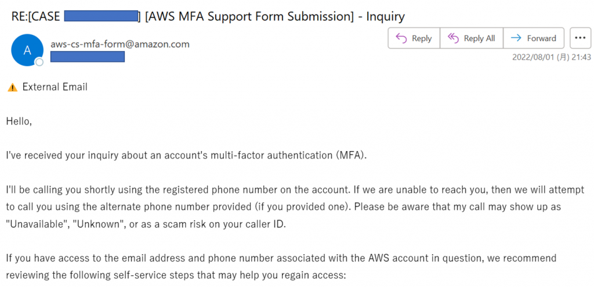
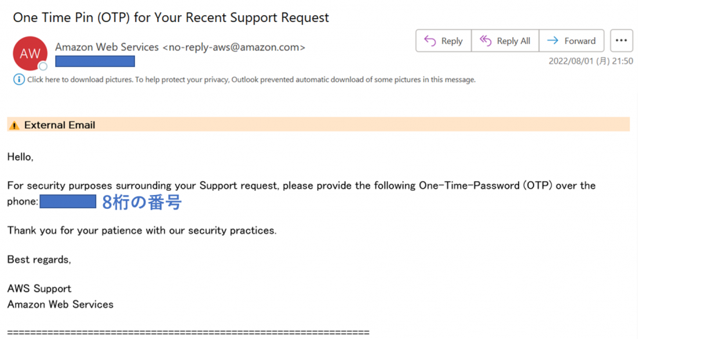

とてもゆるーい記事ですが、備忘録として残しておきます。

このブログはAWS のLightsail で動かしています。社用携帯にGoogle Authenticator アプリを入れて、このブログ、およびAWS に二要素認証を設定していたのですが、社用携帯の交換に伴いGoogle Authenticator の引継ぎを忘れるという大失態を犯してしまい、しばらくログインができませんでした。AWS にさえ入ることができれば、あとはWordpress 側の二要素認証プラグインを無効にするだけなのですが、肝心のAWS に入れません。[デバイス紛失時のMFA を一時的に無効化する手順をAWS は公開しておりますが](https://docs.aws.amazon.com/ja_jp/IAM/latest/UserGuide/id_credentials_mfa_lost-or-broken.html)、「電話の完了がうまくいきませんでした。」と表示されどうもうまくいきません（登録した電話番号に+81 をつけていなかったから、らしいです）。

https://www.sunnycloud.jp/column/20210408/

このセルフサービスでの復旧ができない人向けに、下記のサポート窓口が用意されています。

[https://support.aws.amazon.com/#/contacts/aws-mfa-support](https://support.aws.amazon.com/#/contacts/aws-mfa-support)

窓口は英語または日本語対応が可能なのですが、**日本語を選択した場合は平日9:00-18:00 の対応**となります。私はせっかちですので英語対応を選んだのですが、これがとてもすばらしく、ケースを開いてからわずか10分ほどでメールが届き、電話をかけてもらい、問い合わせてから計20分ほどで解決して感動しました。

ただ、その時の応対してくれた方のインド英語がとても激しく、指示は単純なのですが聞き取るのに苦労しました。もし私と同様英語が苦手なのにもかかわらず、急ぎの復旧のために英語対応を選びたい人向けに（いるかどうかわかりませんが）、一応どんなやり取りだったかメモを残しておきます。

## サポート窓口からケースを開く

サポート窓口にアクセスし、「I'm still having problems and would like to contact AWS Support. 」を選択し、入力欄を埋めていきます。メールアドレスと名前の入力だけで十分ですが、もし登録時とは別の電話番号を使いたい場合はそれも入力します。+81 はつけなくてもよかったです。「Support language」 はEnglish を選びましょう。

## 問い合わせに関するメールが届く

ケースを開いてから10分ほどで下記のようなメールが届きます。要するに、セルフサービスの案内をしつつも、すぐに電話するから待っててね、とのことです。

## 電話対応

私が当たった人がたまたまThe インド英語 だったのかは不明ですが、今まで会話した中でも感動を覚えるくらい最高にインド英語って感じの人でした。ただ、気を使ってゆっくり話してくれるので、それで何とか対応できたのですが、どんなやり取りだったか一応残しておきます。

1. メールアドレスの確認
    - 「お前に今からメール送るけど今やり取りしてるメールでOK？」的な感じで聞かれます。メールアドレスを伝えれば大丈夫です。
2. メールアドレス宛にOTP （One Time Pin） が届く
    - 下記のようなメールが届きます。

1. OTP を口頭で伝えて、相手に二要素認証を無効化してもらう
    - MFA 解除のためにこのOTP が必要なようで、これを先方に伝えます。The OTP is, one, two, three... みたいな感じで伝えればOK です。
2. AWS のアカウントに二要素認証なしでログインできることを確認
    - MFA 解除したから確認してくれ、と言われますので、AWS コンソールにログインできることが確認出来たら完了です。

事前にこの流れを理解していれば、英語が苦手だとしても何とかなると思います。

ログインが完了した後は、再度MFA を設定し、次に同じようなことが発生しないよう、登録電話番号に+81 をつけて更新しましょう。

以上、AWS のサポートのあまりの速さにとても感動した話でした。
