Horizon Universal Subscription はVMware Horizon のサブスクリプションライセンスの1 つの形態で、オンプレミスHorizon もクラウドのHorizon も同じライセンスの範疇で扱うことができます。例えば100 CCU （同時接続） の場合、オンプレミスVDI を50CCU、Horizon Cloud on Azure 50CCU 、といった使い方ができます。

Horizon サブスクリプションライセンスはHorizon Universal Subscription 以外にも、Horizon Standard Subscription, Horizon Enterprise Subscription, Horizon Apps Universal Subscription などがあり、それぞれで使える機能は異なります。詳細は下記ライセンスガイドを参照してください。Horizon Universal Subscription はHorizon のすべての機能を利用することができますので、今回はコチラを取り上げます。

[https://www.vmware.com/content/dam/digitalmarketing/vmware/en/pdf/products/horizon/vmw-horizon-subscription-feature-comparison.pdf](https://www.vmware.com/content/dam/digitalmarketing/vmware/en/pdf/products/horizon/vmw-horizon-subscription-feature-comparison.pdf)

さて、これまでオンプレミスのPerpetual （永久）ライセンスは廃止となり、ユーザーはTerm （期間利用）ライセンスまたはサブスクリプションライセンスのどちらかに移行しなければなりません。どちらも使用期間が決められたライセンスですが、価格的、機能的なメリットはサブスクリプションに分があるため、VMware 社としてもなるべくサブスクリプションに移行してもらいたい思いがあるようです（他人事）。しかしながら、サブスクリプション ライセンスの一番のネックは「Cloud Connector を介して環境をインターネットに繋げなければならない」ことでしょう。ライセンスの管理がCustomer Connect （旧My VMware）およびHorizon Universal Console （[https://cloud-jp.horizon.vmware.com/](https://cloud-jp.horizon.vmware.com/) ：日本リージョンの場合) で実行されるためです（先のCCU の例で言えば、オンプレミスで今どれほどのCCU ライセンスを消費しているかを調べるためにインターネット接続が必要になる、ということです）。したがって、たとえプロキシ経由だとしてもインターネットに接続できない環境は必然的にTerm ライセンスを選択することになります。

<figure>

[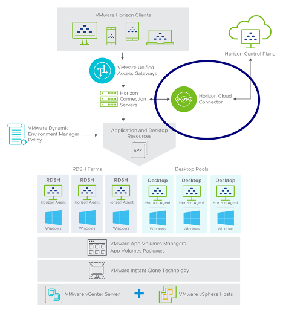](images/image-3.png)

<figcaption>

[https://blogs.vmware.com/euc/2020/11/onboarding-horizon-cloud-connector.html](https://blogs.vmware.com/euc/2020/11/onboarding-horizon-cloud-connector.html)

</figcaption>

</figure>

とはいえ、先述の通りサブスクリプションライセンスのメリットは大きいため、可能であればサブスクリプションを選択したいところですが、このようにライセンス管理の仕組みが大きく異なり、さらに検証ライセンスの発行もこれまでとは異なり難しい部分があるため、本記事ではその導入ハードルを下げるべく、Cloud Connector を中心に、Horizon Subscription における新しい考え方をまとめます。

## ライセンス管理形態の変更

ライセンスはCustomer Connect アカウント、およびCloud Connector 接続後のHorizon Universal コンソールに紐づきます。重要な点として**ライセンスコードがありません**。これまではConnection Server をデプロイして、Horizon 管理コンソールにログインし、ライセンスコードを入力していましたが、Horizon Subscription ではクラウド上での自動的なライセンス管理になります。

ここで困ることとして、従来は何らかの形でライセンスコードを手に入れることができれば、それでHorizon を試すことができました。例えば、vExpert のライセンスや、VMware パートナーが利用できる評価ライセンスなどです。ところがサブスクになったためにライセンス管理が厳密になり、このような手段を取ることが難しくなります。実際、私が把握している限り、2022/6/4 時点でHorizon Universal Subscription を評価するためには下記キャンペーンへの申請が唯一の方法となります。

[https://www.vmware.com/content/microsites/learn/ja/horizoncloud-freetrial.html](https://www.vmware.com/content/microsites/learn/ja/horizoncloud-freetrial.html)

なお、Term ライセンスではライセンスコードが発行され、これまで通り管理コンソールから入力します。

また、ややこしい点として、Horizon Universal にはvSphere （やvSAN など）のライセンスが含まれますが、こちらはPerpetual ライセンスになります。Horizon Universal 購入時に有効化のメールが届くのですが、それと一緒にライセンスコードが発行されメールが届くので、それを直接vSphere 環境に入力します。

> The subscription license for VMware Horizon is managed by VMware only after you deploy the Horizon Cloud Connector virtual appliance. You will not receive the license key for VMware VMware Horizon with this subscription license. However, you will receive license keys for vSphere, vCenter Server, vSAN, App Volumes, and Dynamic Environment Manager with this subscription license. You will receive these keys in an email with the following subject: Welcome to VMware Horizon On-Premises Subscription.
> 
> [https://docs.vmware.com/en/VMware-Horizon/2103/horizon-installation/GUID-660BFF69-095B-40C2-9EA3-DB37D8828254.html](https://docs.vmware.com/en/VMware-Horizon/2103/horizon-installation/GUID-660BFF69-095B-40C2-9EA3-DB37D8828254.html)

## Horizon Universal Console

Universal Console はマルチクラウドのHorizon 環境を一元的に運用/管理するためのポータルです。

[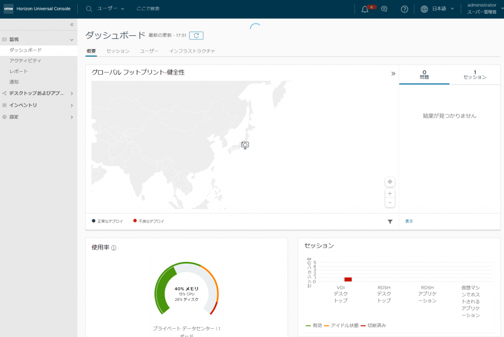](images/image-1-1024x686.png)

Horizon Subscription を購入したCustomer Connect のアカウントでログインできます。その後、AD と紐づけ、Customer Connect のアカウントでの認証＋AD ユーザーでの2 回の認証をするよう設定をします。

ここで基本的な監視や、[IMS : Image Management Service](https://docs.vmware.com/en/VMware-Horizon-Cloud-Service/services/manage-images-from-cloud/GUID-3473F188-7029-43F8-A375-91C1216F9BA0.html) （複数のHorizon Pod でマスターイメージを共有）、[Universal Broker](https://docs.vmware.com/en/VMware-Horizon-Cloud-Service/services/hzncloudmsazure.admin15/GUID-BE0F7AEA-A4F5-4580-A461-8793FAA61264.html) （GSLB なしでマルチサイトでの可用性を高めた運用が可能）などの機能を利用することができます。

評価ライセンスの場合こんな感じでコンソールからは見えます。この画面では今どれくらいのライセンスを消費しているのかが分からないため、別途監視ダッシュボード（↑のスクショ画面）から見る必要がありそうです（改善してほしい）。

[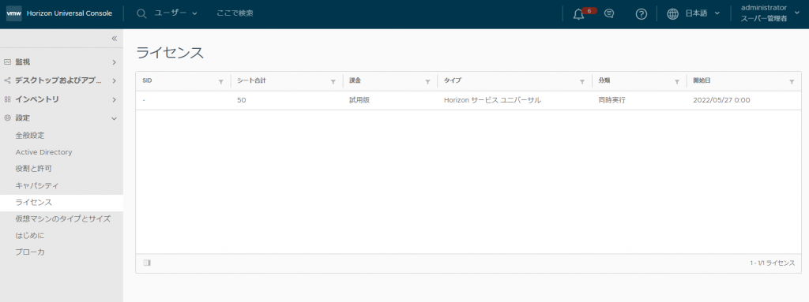](images/image-2-1024x383.png)

オンプレ側の見え方はこんな感じ。

[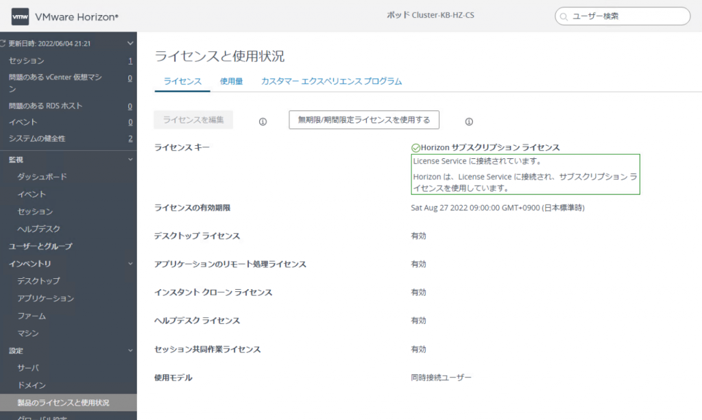](images/image-18-1024x613.png)

## Horizon Cloud Connector

Horizon Cloud Connector はオンプレミスHorizon Pod またはVMC on AWS などのvSphere 環境にデプロイされたHorizon Pod をクラウドと同期させるためのコンポーネントになり、実態は仮想アプライアンスです。なお、Horizon Cloud on Azure ではデプロイの必要はありません。先述した通りライセンス管理をクラウドで行うため、オンプレミス環境のHorizon の使用状況を伝える役割を持ちます。

Cloud Connector はCusomer Connect からダウンロードできます。ただし、ログインするアカウントでサブスクリプションライセンスが有効になっていなければなりません。

[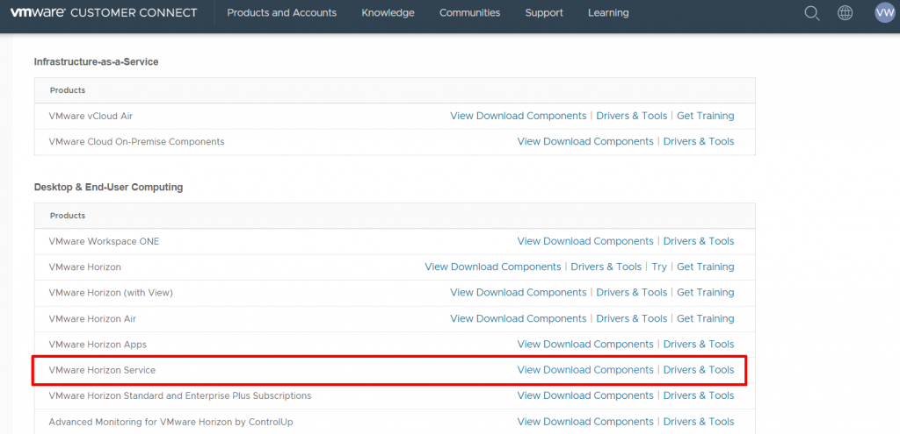](images/image-5-1024x495.png)

[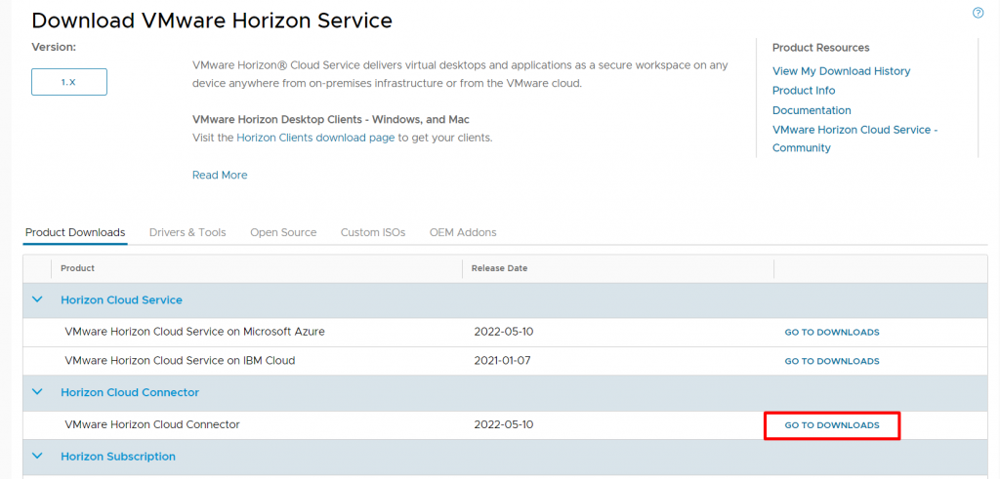](images/image-6-1024x491.png)

[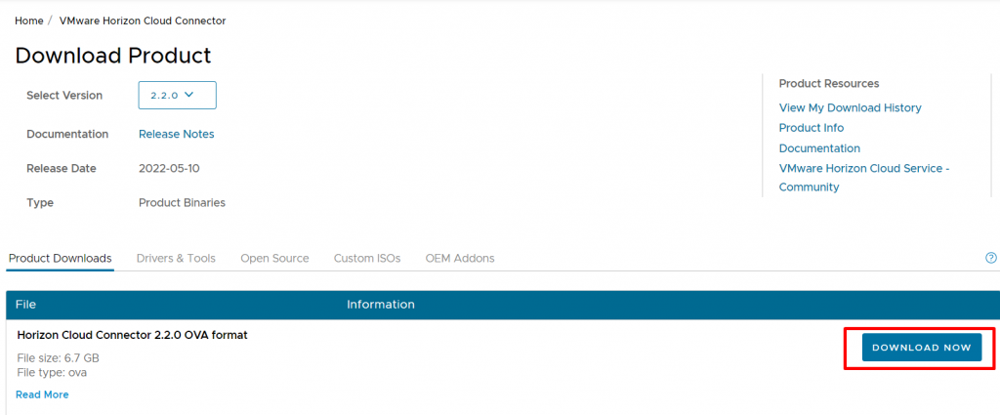](images/image-7-1024x425.png)

Cloud Connector をダウンロードした後は、vSphere 環境にそのOVA をデプロイします。なお、OVA ファイルのサイズがバージョン2.2.0 時点で6.7 GB もあるので注意です。

[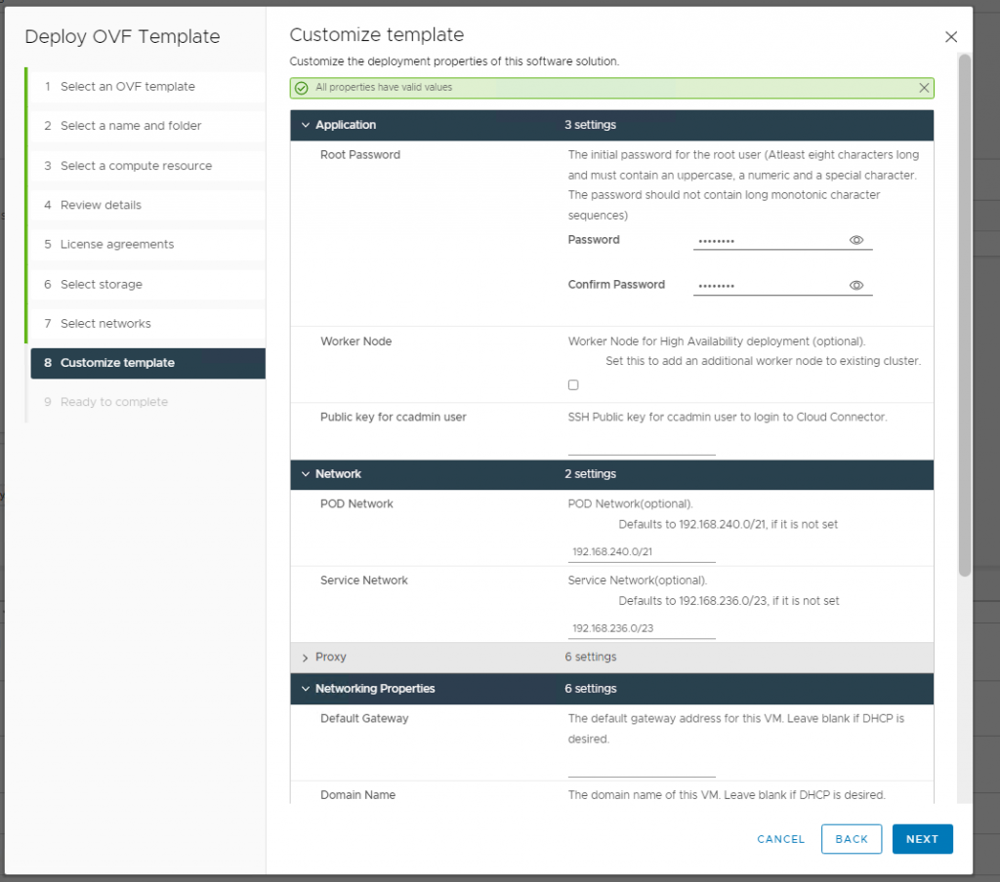](images/image-8-1024x904.png)

基本的なパラメータは他のOVA と変わらないため省略しますが、特に注意点が2つあり、1つはパスワードを自分で入力する場合、特殊文字を1つ以上入れる必要があります。入れなくても現時点ではデプロイできてしまうですが、ログインできなくなるので必ず入れてください。

2つ目の注意点として、このOVA はKubernetes クラスタになります。高可用性のためのワーカーノードのデプロイにチェックを入れない場合（デフォルト）、コントロールプレーンのみのシングルK8s クラスタになります。

<figure>

[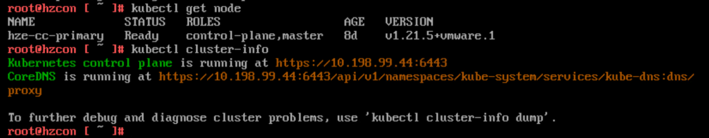](images/image-9-1024x200.png)

<figcaption>

デプロイ後にアプライアンスにログインして確認できます。

</figcaption>

</figure>

したがって、このクラスタ上でデプロイされるPod やService リソースのためのネットワークが、アプライアンスデプロイ時の「POD Network」「Service Network」となり、これはKubernetes の中のネットワークであり、環境のネットワークセグメントと被ってはいけません。デフォルトで192.168.240.0/21, 192.168.236.0/23 と比較的被りそうなアドレス帯のため要注意です（ちなみにTanzu Kubernetes Grid の場合はデフォルト値が100.64.0.0/13 などと被らなそうに親切に設定されているため、これは次のリリースで改善してほしいです）。

<figure>

[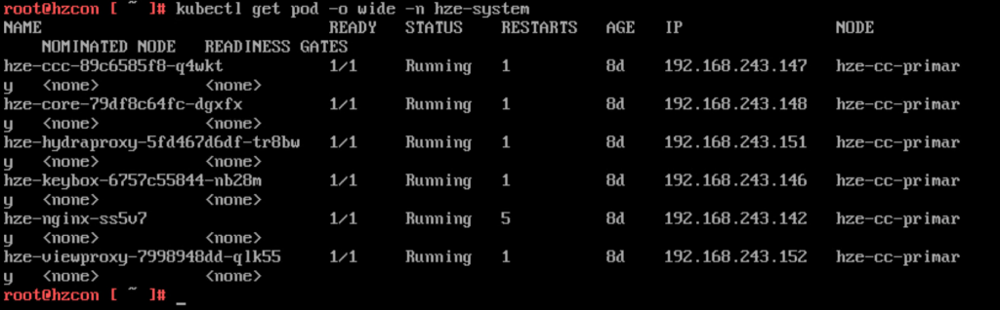](images/image-10-1024x318.png)

<figcaption>

Pod が192.168.243.x （192.168.240.0/21）でデプロイされていることが分かります。

</figcaption>

</figure>

<figure>

[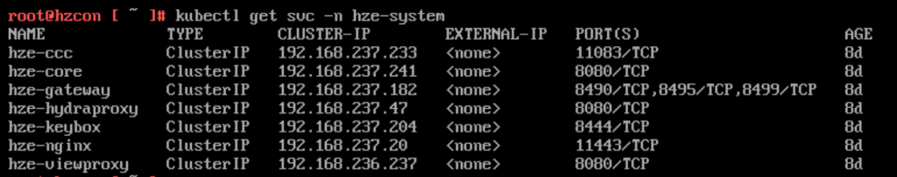](images/image-11-1024x203.png)

<figcaption>

Service リソースも同様。

</figcaption>

</figure>

他にも色々な注意点がありますので、下記ドキュメントを事前に必ず確認してください。

[https://docs.vmware.com/en/VMware-Horizon-Cloud-Service/services/hzncloudmsazure.getstarted15/GUID-43D292DA-437D-4F17-9A8E-E83B331AE4D3.html](https://docs.vmware.com/en/VMware-Horizon-Cloud-Service/services/hzncloudmsazure.getstarted15/GUID-43D292DA-437D-4F17-9A8E-E83B331AE4D3.html)

[https://docs.vmware.com/en/VMware-Horizon-Cloud-Service/services/hzncloudmsazure.getstarted15/GUID-B1CD2B75-E4DB-401D-9C68-E86762A9BBFD.html](https://docs.vmware.com/en/VMware-Horizon-Cloud-Service/services/hzncloudmsazure.getstarted15/GUID-B1CD2B75-E4DB-401D-9C68-E86762A9BBFD.html)

プロキシ設定はアプライアンス展開後も設定できます。

[https://docs.vmware.com/en/VMware-Horizon-Cloud-Service/services/hzncloudmsazure.admin15/GUID-5DEB4E07-9FF2-45DA-9938-50B481FFEF3C.html](https://docs.vmware.com/en/VMware-Horizon-Cloud-Service/services/hzncloudmsazure.admin15/GUID-5DEB4E07-9FF2-45DA-9938-50B481FFEF3C.html)

デプロイが完了したら、10分程度待ちます。正常にデプロイできたら、アプライアンスのIP アドレスにアクセスすると下記の画面が見えるはずです（http**s**:// に注意）。

[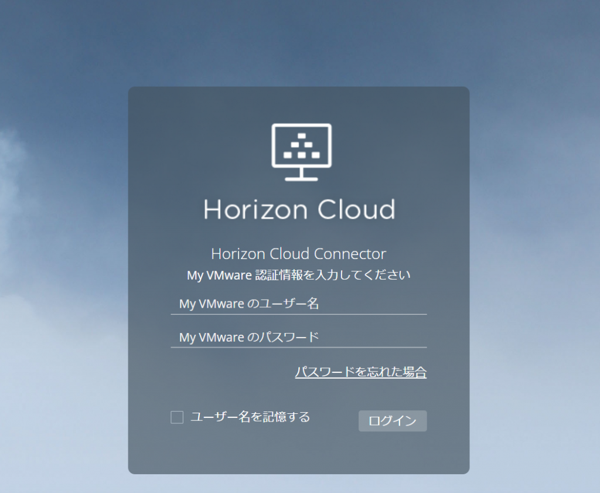](images/image-12-1024x841.png)

Customer Connect のアカウントを入力してログインすると、正常にデプロイできていればConnectrion Server との接続を指示されますので、指示通り進めていけば、Cloud Connector の展開およびUniversal Consoler との接続は完了です。

[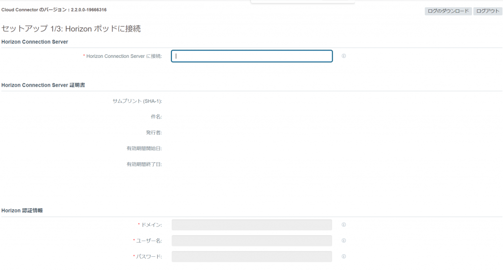](images/image-13-1024x553.png)

[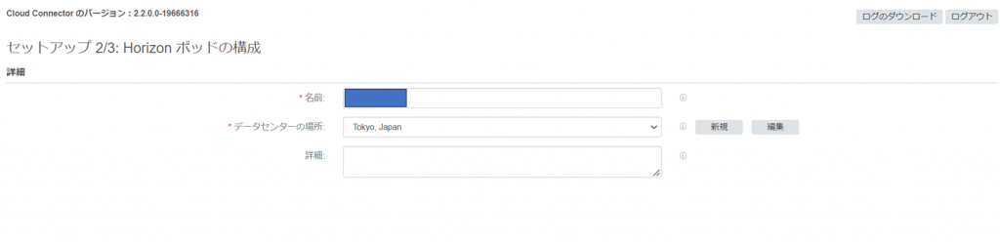](images/image-16-1024x248.png)

[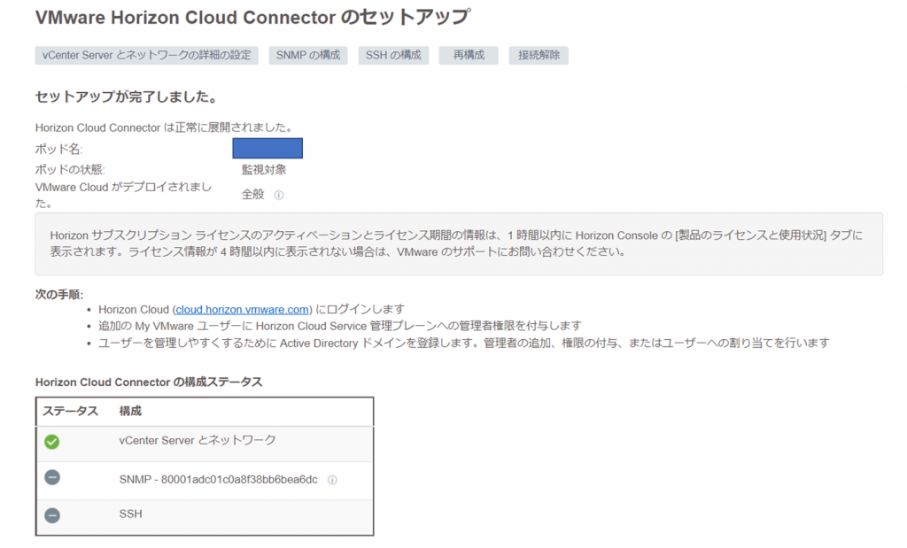](images/image-15-1024x619.png)

Horizon Universal Console にアクセスし、問題なく接続できているかを確認します。

<figure>

[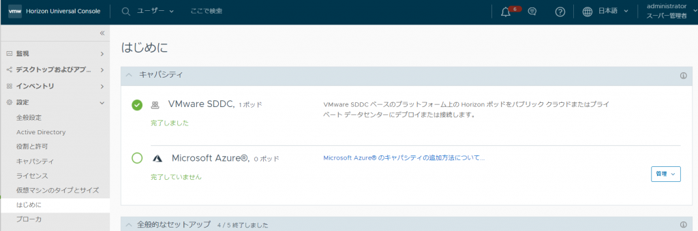](images/image-17-1024x339.png)

<figcaption>

画面左のメニューはUniversal Console 上でのAD の登録が完了するまで操作できません。

</figcaption>

</figure>

## ライセンスに関するポイント

最後に、Horizon Universal ライセンスのポイントをまとめてみました。

- Horizon UniversalライセンスはCustomer Connect アカウントに紐づき、ライセンスコードは発行されない

- 購入するとメールでその旨が通知され、Customer Connect からコンポーネントをダウンロード可能になり、Universal Console にアクセス可能になる（ライセンスを購入しないとCloud Connector すらダウンロードできない）
- Horizon Universal に付随するPerpetual ライセンス製品（vSphere など）はメールでそのライセンスコードが通知される
- Cloud Connector が何らかの障害で停止し、オンプレミスHorizon と同期できなかった場合、最悪の場合デスクトップが使用不能になる

……と最後に不穏な記載がありますが、これは要注意です。この挙動について解説します。

Cloud Connector が停止すると、クラウド側としてはオンプレミス環境でHorizon が有効なのかどうかも知る由がありませんので、ライセンスを購入した環境なのかどうかも分かりません。したがって、Horizon Cloud としてはサービスを中断し、ユーザーは仮想デスクトップにアクセスできなくなります。気持ちは分かりますが、中々厳しいです。

ただ、Cloud Connector が停止したからと言って即時にユーザーがデスクトップにアクセスできなくなるわけではありません。ライセンスの同期はCloud Connector を通して24時間ごとに実行されるのですが、このタイミングで同期が失敗すると、一定の猶予期間が発生します。この猶予期間に関してはドキュメント曰く「公開しておらず、SR で問い合わせてほしい」と記載がありますが、Cloud Connector と言えど残念ながら編集側の同期は取れていないみたいで、25日といたるところに記載があります。

> If the entire primary node loses operation, the Horizon Universal License enters a 25-day sync grace period.
> 
> [https://docs.vmware.com/en/VMware-Horizon-Cloud-Service/services/hzncloudmsazure.admin15/GUID-C966B7D8-1B49-4577-BE38-524D5020FB26.html](https://docs.vmware.com/en/VMware-Horizon-Cloud-Service/services/hzncloudmsazure.admin15/GUID-C966B7D8-1B49-4577-BE38-524D5020FB26.html)

> If one of the links in the license communication chain becomes non-operational, the license sync fails and the Horizon Pod enters a sync grace period of 25 days.
> 
> [https://blogs.vmware.com/euc/2020/12/horizon-cloud-connector-know-how-series-troubleshooting-horizon-universal-license-status.html](https://blogs.vmware.com/euc/2020/12/horizon-cloud-connector-know-how-series-troubleshooting-horizon-universal-license-status.html)

したがって、（おそらく）25日 以内にCloud Connector 側の問題を解決すればOK であり、基本的にはHA で保護されているはずなのでそこまで問題になることはないと思うのですが、HA に失敗した時などは注意で（一応デュアルノードによる追加の可用性機能もあります）、Horizon Universal Console 側ではおそらくメールで飛ばす機能もなく、現時点でAPI の公開もされていないので、気づかずに25日経過してアクセス不能……の悪い予感がします。そういう意味ではどういう運用形態にするべきかが中々悩ましいところです。もう一つ厄介な点として、1 Customer Connect アカウントでアクセスできるHorizon Universal Console は1つまでなので（例えばUniversal Console [https://cloud-jp.horizon.vmware.com/](https://cloud-jp.horizon.vmware.com/) にアクセスするとCustomer Connect のアカウントの入力を求められますが、テナント毎にURL が分かれているわけではないので、1 つのアカウントで様々なHorizon Universal の環境にログインできるわけではありません）、例えばVMware パートナーが単一のCustomer Connect アカウントを作成して複数の顧客環境のHorizon 環境の監視をする、みたいなことはできません。これをしたい場合顧客ごとにCustomer Connect のアカウントを作成する必要があります（もちろんその後にAD のユーザーアカウントも求められるのでそれも作成する必要があります）。

ライセンス管理については下記kb やドキュメントも参照してください。

[https://docs.vmware.com/en/VMware-Horizon-Cloud-Service/services/hzncloudmsazure.admin15/GUID-7E8C2D00-CCF2-4327-89AA-5A0663D64BE8.html](https://docs.vmware.com/en/VMware-Horizon-Cloud-Service/services/hzncloudmsazure.admin15/GUID-7E8C2D00-CCF2-4327-89AA-5A0663D64BE8.html)

[https://kb.vmware.com/s/article/87490](https://kb.vmware.com/s/article/87490)

[https://docs.vmware.com/en/VMware-Horizon-Cloud-Service/services/hzncloudmsazure.admin15/GUID-7B764C58-B251-4571-9C3A-18697CDB59F6.html](https://docs.vmware.com/en/VMware-Horizon-Cloud-Service/services/hzncloudmsazure.admin15/GUID-7B764C58-B251-4571-9C3A-18697CDB59F6.html)
