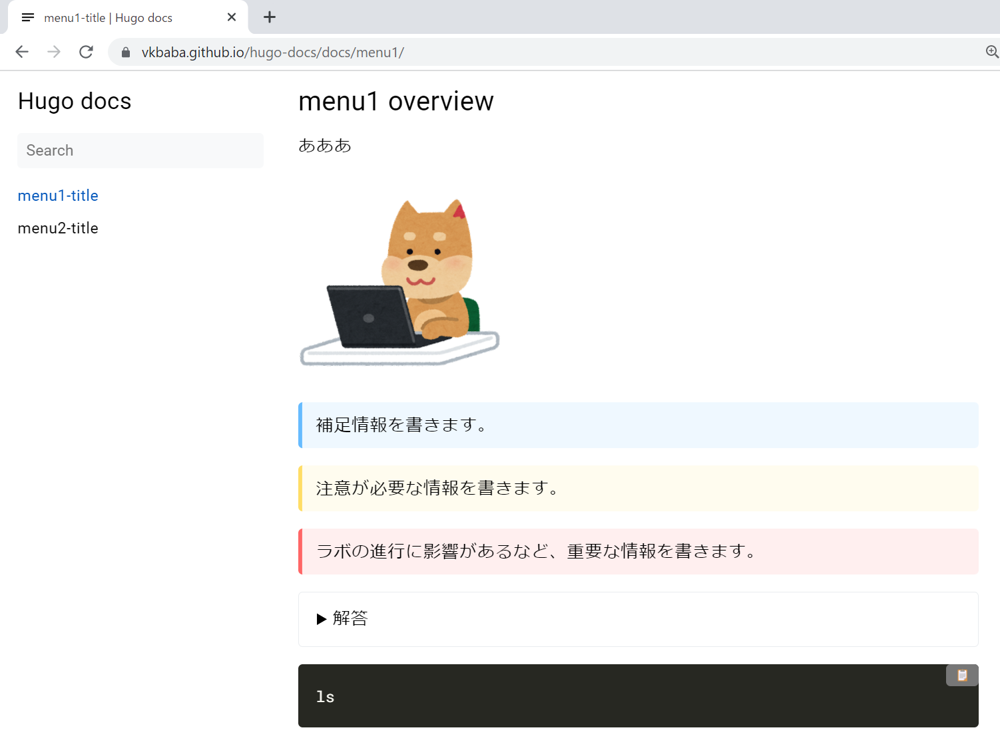

業務でハンズオン資料を作ることがあります突然ですが今日から急に文体が柔らかくなります。

。VMware 製品や、最近だとコンテナのトレーニングのために、触って覚えるをテーマにオンラインでハンズオンを実施したのですが、このハンズオン資料の作り方として、従来はプレゼンテーションファイルの形式で作っていました。この方式であれば、とりあえずラボの環境とシナリオを試しながら動画撮影、スクショをぺたぺたパワポに貼り付けるという単調な作業を繰り返せば、まあ形にはなります。

しかしながら、ここ最近の、特にクラウドサービスをテーマにしたハンズオンだと機能の更新が早く、スクショの更新が追い付きません。また、チームでその資料を使いまわそうとしたときに、うまく管理ができていない場合、どれが最新版か分からなくなってしまいます。

そこで、そろそろハンズオンもモダンにしてみようと思い、静的サイトジェネレータであるHugo を試したので、今回は閑話休題的＆備忘録として、こちらの紹介をしてみようと思います（ただ、Hugo にもメリットデメリットがあり、パワポで作る方が良い場合もあります）。

なお、今回作成した成果物は下記の通りです。

- [https://vkbaba.github.io/hugo-docs/](https://vkbaba.github.io/hugo-docs/)
- [https://github.com/vkbaba/hugo-docs](https://github.com/vkbaba/hugo-docs)

少し前に同じ方法で作成したコンテナ/Kuberentes ハンズオンはこんな感じです。

- [https://vkbaba.github.io/k8s-workshop/](https://vkbaba.github.io/k8s-workshop/)
- [https://github.com/vkbaba/k8s-workshop](https://github.com/vkbaba/k8s-workshop)

## Hugo とは

ググれば出てきます、が、一言でいうと簡単に静的なWeb ページを作成することができるツールです。[Kubernetes のドキュメントもHugo を使っています。](https://github.com/kubernetes/website)要するに、かっこいいドキュメント的なものを作りたい時に有用です。

## Web ページ作成の流れ

Hugo の環境を準備し、テーマを選び、Hugo とそのテーマのお作法に倣ってコンテンツとなるファイルを作っていきます。Hugo はあくまでもWeb ページに必要なHTML ファイルなどを作成するだけですので、作ったWeb ページを楽に外部に公開するには、[Github pages](https://gohugo.io/hosting-and-deployment/hosting-on-github/) や[netlify](https://gohugo.io/hosting-and-deployment/hosting-on-netlify/) などのようなホスティングサービスを使います。私は Github pages を使いました。

## Hugo インストール方法

ドキュメントに書いてあるのですぐに始められます。バイナリをダウンロードしてパスを通せば使えます。ここではextended バージョンをインストールします（extended でないと後述するテーマ使用時にエラーが出ます）。

[https://gohugo.io/getting-started/installing/](https://gohugo.io/getting-started/installing/)

```
hugo-docs> hugo version
hugo v0.92.1-85E2E862+extended windows/amd64 BuildDate=2022-01-27T11:44:41Z VendorInfo=gohugoio
```

他のOS は知りませんが、環境を汚したくないゆえにWindows 上でHugo コンテナをデプロイし、その中でブログを作成しようとすると、Live Reload と呼ばれる、ファイルを更新したら自動的にプレビューも更新される非常に便利な機能が使えないようなので、普通にインストールした方がいいです（1敗）。

<figure>


<figcaption>

超絶便利なdevcontainer にデフォルトでHugo イメージが入っているのですが、これがイマイチでした。

</figcaption>

</figure>

## 記事を作成してみよう

この記事に従うといい感じです。

[https://qiita.com/ysdyt/items/a581277dd1312a0e83c3](https://qiita.com/ysdyt/items/a581277dd1312a0e83c3)

テーマは私のセンスで[book](https://github.com/alex-shpak/hugo-book)を選びます。テーマの使い方は各テーマのドキュメントに従います。

```
blog> hugo new site hugo-docs
Congratulations! Your new Hugo site is created in C:\Users\vkbaba\Workspace\blog\hugo-docs.

Just a few more steps and you're ready to go:

1. Download a theme into the same-named folder.
   Choose a theme from https://themes.gohugo.io/ or
   create your own with the "hugo new theme <THEMENAME>" command.
2. Perhaps you want to add some content. You can add single files
   with "hugo new <SECTIONNAME>\<FILENAME>.<FORMAT>".       
3. Start the built-in live server via "hugo server".        

Visit https://gohugo.io/ for quickstart guide and full documentation.

hugo-docs> git init 
Initialized empty Git repository in C:/Users/vkbaba/Workspace/blog/hugo-docs/.git/

hugo-docs> git submodule add https://github.com/alex-shpak/hugo-book themes/hugo-book
Cloning into 'C:/Users/vkbaba/Workspace/blog/hugo-docs/themes/hugo-book'...
remote: Enumerating objects: 4026, done.
-reused 3712
Receiving objects: 100% (4026/4026), 6.39 MiB | 4.93 MiB/s, done.
Resolving deltas: 100% (2040/2040), done.
warning: LF will be replaced by CRLF in .gitmodules.
The file will have its original line endings in your working directory

hugo-docs> hugo server --minify --theme hugo-book
Start building sites … 
hugo v0.92.1-85E2E862+extended windows/amd64 BuildDate=2022-01-27T11:44:41Z VendorInfo=gohugoio

                   | EN  
-------------------+-----
  Pages            |  7
  Paginator pages  |  0
  Non-page files   |  0
  Static files     | 78
  Processed images |  0
  Aliases          |  2
  Sitemaps         |  1
  Cleaned          |  0

Built in 249 ms
Watching for changes in C:\Users\vkbaba\Workspace\blog\hugo-docs\{archetypes,content,data,layouts,static,themes}
Watching for config changes in C:\Users\vkbaba\Workspace\blog\hugo-docs\config.toml
Environment: "development"
Serving pages from memory
Running in Fast Render Mode. For full rebuilds on change: hugo server --disableFastRender
Web Server is available at http://localhost:1313/ (bind address 127.0.0.1)
Press Ctrl+C to stop
```


とりあえず、これでそれっぽい感じのものはできました。

## 記事の書き方

book テーマのサンプルを参考に作っていきます。

[https://github.com/alex-shpak/hugo-book/tree/master/exampleSite/content](https://github.com/alex-shpak/hugo-book/tree/master/exampleSite/content)

[](images/image-4.png)

プロジェクト名（ここではhugo-docs）/content/docs/ 配下にフォルダや\_index.md ファイルを作っていくとコンテンツを作成できます。各コンテンツのタイトルは下記のような表現をします（weight の低い方がメニューで上の方にきます）。

```
---
weight: 1
title: "menu1-title"
---

```

記事はマークダウンで書きますが、私も慣れていないので、ググりながら書いています（といっても基本的な装飾であれば簡単です）。

さらに、よりリッチな表現をしていくために、ショートコードと呼ばれる記法を使っていきます。ショートコードは で囲まれた記法で、Hugo のデフォルトのショートコードや、各テーマ独自のものがあり、もちろん自作することもできます。book テーマで使える便利なショートコードは[コチラ](https://github.com/alex-shpak/hugo-book/tree/master/exampleSite/content/docs/shortcodes)。

実際使ってみて、ハンズオンにいくつか有効なショートコードをいくつか記載しておきます（book テーマを前提としています）。

### 画像の表示

画像ファイルを\_index.md と同じディレクトリに配置して、\_index.md ファイルの中で以下のような記述をします。 文面だけでは伝わらない情報は多いため、ラボの内容によっては多用することになります。

```

```

実際、「こういう操作をしてください」「このコマンドを入力してください」のような案内がハンズオンであったとしても、参加者としては「ほんとにこの操作であっているかな？」と不安になりがちです。そのような時に、参加者と同じ画面をスクショで共有したり、コマンドの入力結果と出力結果がきちんとスクショ（テキストでもOK ですが）として共有されていれば、ユーザー側は安心してその操作を進めることができます。

### 補足情報や重要な情報の記載

ハンズオンでは主にラボの進め方を記載していきますが、例えばラボと直接関係はないけれども伝えたい情報や、ラボの進行に影響がある極めて重要な情報を伝えたい時などには、book テーマのhint ショートコードが便利です。info、warning、danger の3段階の警告レベルがあります。

```

補足情報を書きます。

```

### 情報のマスキング

例えばクイズを作る際に、その回答を隠す時などに便利なショートコードです。

```

解答です。

```

### コードブロック

様々なコードに対応して色分けすることができます。

```
```shell
ls
```
```

参考：[https://gohugo.io/content-management/syntax-highlighting/](https://gohugo.io/content-management/syntax-highlighting/)

**（補足）コードブロックにコピペボタンを追加する方法**

コードをクリップボードにクリック1回でコピーすることができると、CLI を多用するハンズオンでは便利です。やり方さえわかっていればボタンの追加は簡単で、下記を参考にして設定できます。

[https://www.tomspencer.dev/blog/2018/09/14/adding-click-to-copy-buttons-to-a-hugo-powered-blog/](https://www.tomspencer.dev/blog/2018/09/14/adding-click-to-copy-buttons-to-a-hugo-powered-blog/)

[https://github.com/alex-shpak/hugo-book#partials](https://github.com/alex-shpak/hugo-book#partials)

プロジェクト名（ここではhugo-docs）/static/css/ 配下およびhugo-docs/static/js/ 配下にそれぞれコピペボタンの仕様が定義されたcss とjs ファイルを作成します。また、hugo-docs/layouts/partials/docs/inject/head.html を作成してコピペボタンを有効化します（これはbook テーマの仕様に基づきます）。

下記の成果物を参考にしてみてください。

[https://github.com/vkbaba/hugo-docs/tree/master/static](https://github.com/vkbaba/hugo-docs/tree/master/static)

[https://github.com/vkbaba/hugo-docs/blob/master/layouts/partials/docs/inject/head.html](https://github.com/vkbaba/hugo-docs/blob/master/layouts/partials/docs/inject/head.html)

ここまでをまとめると、こんな感じです。

[](images/image-5.png)


それでは、作ったガイドをgithub pages を使って公開してみましょう。とその前に、hugo コマンドでビルドするのを忘れずに。ビルドのためにはhugo-docs/config.toml を調整します（ここでサイトのタイトルも設定できます）。以下はconfig.toml のサンプルになりますが、baseURL は公開されるGithub pages のURL と同一に設定することに注意です。

```
baseURL = 'https://vkbaba.github.io/hugo-docs'
languageCode = 'ja'
title = 'Hugo docs'
publishDir = "docs"
theme = "hugo-book"
```

ビルドはhugo コマンド一発です。

```
hugo-docs> hugo   
Start building sites … 
hugo v0.92.1-85E2E862+extended windows/amd64 BuildDate=2022-01-27T11:44:41Z VendorInfo=gohugoio

                   | EN  
-------------------+-----
  Pages            | 13
  Paginator pages  |  0
  Non-page files   |  1
  Static files     | 80
  Processed images |  0
  Aliases          |  2
  Sitemaps         |  1
  Cleaned          |  0

Total in 525 ms
```

## Github Pages でコンテンツを公開

Github Pages はGitHubが提供するホスティングサービスで、基本的に無料で使うことができます。

[https://pages.github.com/](https://pages.github.com/)

公開する方法は以下の記事を参照してください。

[https://qiita.com/ysdyt/items/a581277dd1312a0e83c3](https://qiita.com/ysdyt/items/a581277dd1312a0e83c3)

空のリポジトリを作成後、Github Pages の設定をする前に、成果物をコミットして、作成したリポジトリにプッシュします。

```
hugo-docs> git add -A
hugo-docs> git commit -m "Initial commit" 
hugo-docs> git remote add origin https://github.com/vkbaba/hugo-docs.git
hugo-docs> git push -u origin master
```

ここでは、私のgit のバージョンが古く"master" ブランチとなっていますが、今は"main" ブランチと名前が変更されています。

この後、pages の設定して、数分待てば、ハンズオンのドキュメントが公開されているはずです。

[](images/image-7.png)

[](images/image-8.png)

一度ひな形を作ってしまえば、あとはそれをベースに記事の中身を変更すればよいので、次回以降は作成は楽になると思います。

## （補足）資料の更新

ちょっとした修正であれば、github からちゃちゃっとやっちゃいましょう。大がかりな更新であれば、ローカルで更新して再度プッシュしましょう。

チームで単一のハンズオンドキュメントを使いまわすケースがあります。この場合、チームの誰かが資料にミスを見つけた場合、その人に更新してもらうのがベストではあります。更新方法としては、チーム全体にリポジトリの権限を渡して、github から直接編集してもらうのが簡単です。何より編集する人にgit のスキルセットが必要ありません。問題点としては、コンテンツに統制が効かなくなる可能性があります。

次に取り得る方法として、issue を上げる方法があります。要するに修正要望を上げてハンズオンの管理者に対応してもらいます。管理者側の対応が手間ですが、修正希望を上げること自体のハードルは低いため、個人的には最も現実的な選択肢かと思います。

そのハンズオンが労力をかけるほど価値があるものなのであれば、本格的にチーム開発をしましょう。本格的と言っても基本的なGit の操作とHugo のお作法を身につければ、やることはテキストファイルの作成や更新だけです。が、ハードルは比較的高いのは事実です。
