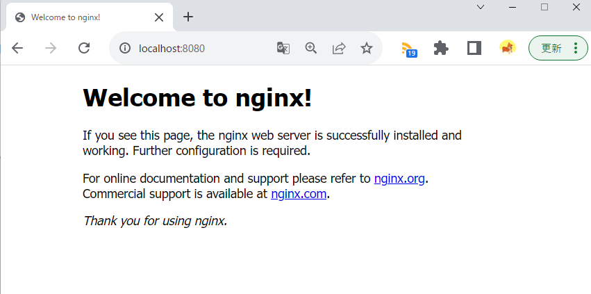
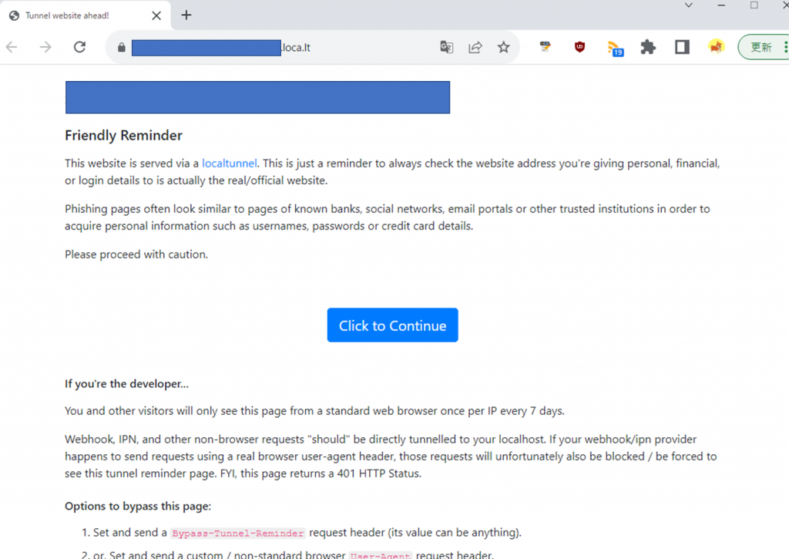
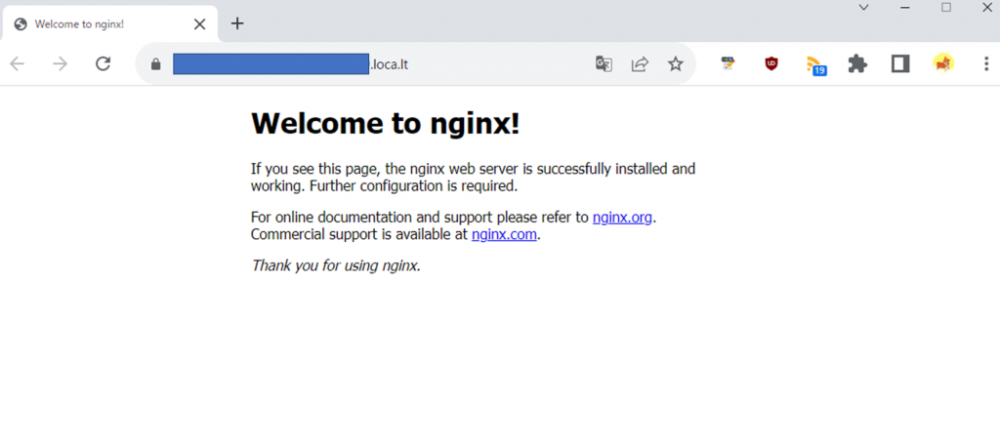
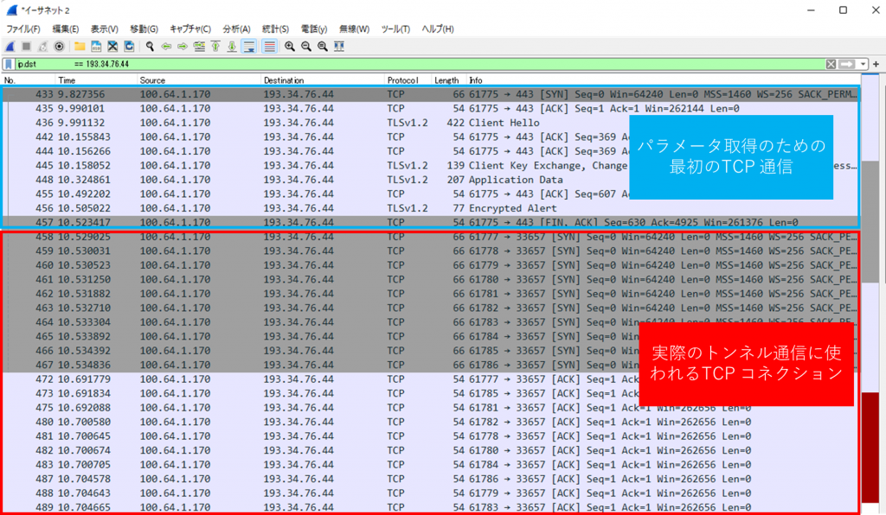
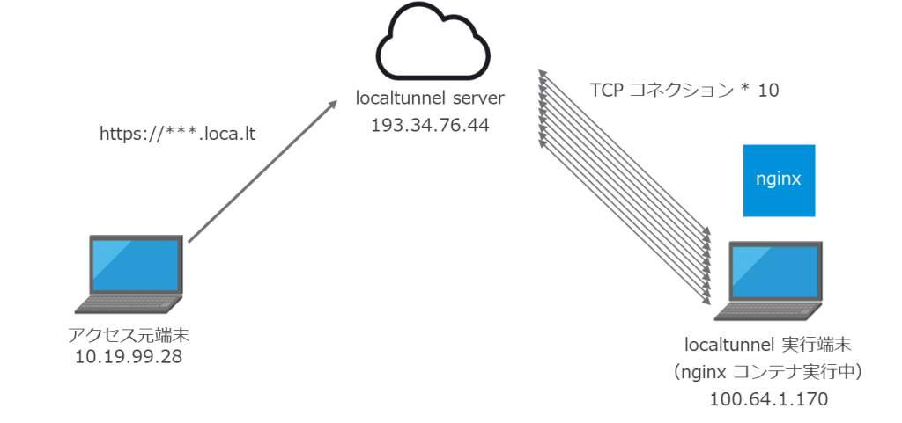
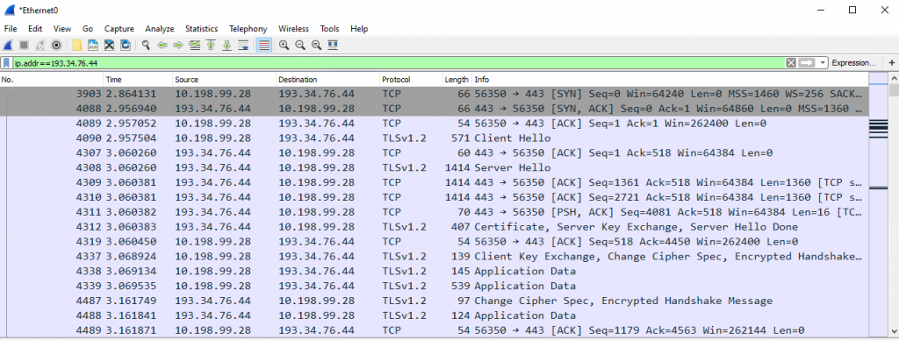
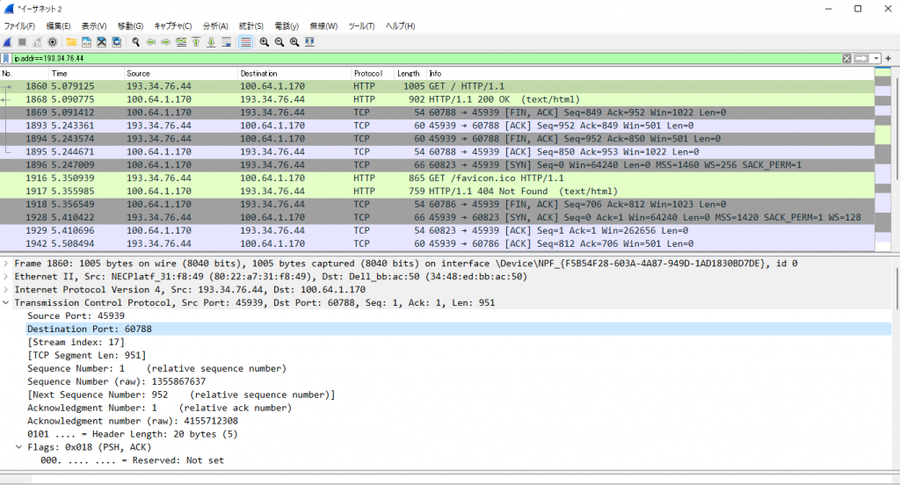
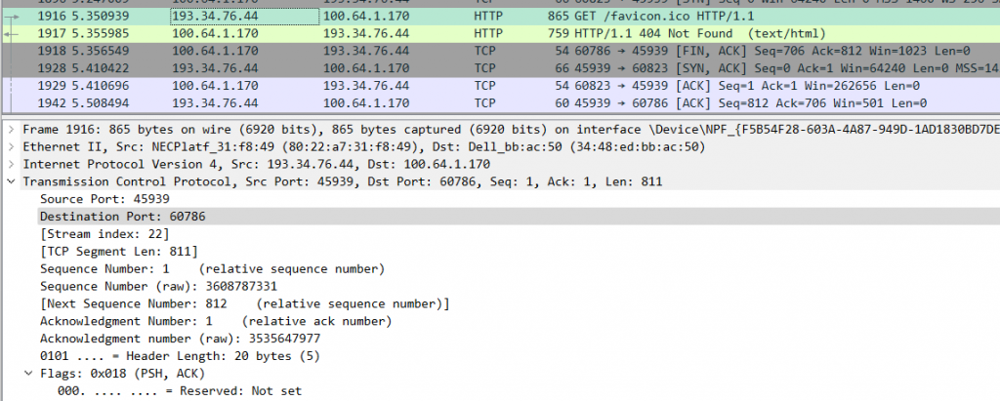

[localtunnel](https://github.com/localtunnel/localtunnel) は、クライアント側でローカルに起動したアプリケーションを外部に公開するために使われるOSS です。例えばおなじみのコマンド

```
docker run --rm -it --name nginx -p 8080:80 nginx 
```

は、クライアント上でNginx コンテナを立ち上げ、8080 ポートで待ち受け、コンテナの80 ポートに転送するコマンドであり、http://localhost:8080 でNginx にアクセスすることができます。

[](images/image-25.png)

これは当然クライアント端末からしかアクセスできないわけですが、localtunnel を使えば、これを外部からアクセス可能にします。つまり、https://\*\*\*.loca.lt のようなURL が自動的に発行され、だれでもhttps でアクセスすることができるようになります。自分の作ったアプリのテストや公開、slack bot の開発など、ユースケースは幅広く、出会ったときは感動したものです。同じような仕組みで[ngrok](https://ngrok.com/) や[frp](https://github.com/fatedier/frp) がありますが、frp はともかくngrok は無料だと色々制限が多いので、個人的にはあまりお勧めしません。

localtunnel のインストール方法や使い方は他の記事がたくさんありますのでそちらを参照していただくとして、私としては「なぜクライアントで立ち上げたプロセスを外部に公開できるのか」不思議で仕方ありませんでした。そこで、本記事ではおなじみパケットキャプチャ等を通して、このlocaltunnel の仕組みを探っていきたいと思います。

さっそくlocaltunnel でアプリを公開してみましょう。

```
lt --port 8080
```

<figure>

[](images/image-26-1024x725.png)

<figcaption>

アクセス前に注意書きが表示される場合があります。

</figcaption>

</figure>

[](images/image-28-1024x452.png)

実はこのタイミングで、クライアント端末からサーバーへTCP コネクションが10 本張られます。宛先のIP アドレスは、localtunnel.me または払い出されたURL にnslookup すると分かります（以下はwindows で調べています）。

```
localtunnel> netstat -an | findstr "193.34.76.44"
  TCP         100.64.1.170:61777     193.34.76.44:33657     ESTABLISHED
  TCP         100.64.1.170:61778     193.34.76.44:33657     ESTABLISHED
  TCP         100.64.1.170:61779     193.34.76.44:33657     ESTABLISHED
  TCP         100.64.1.170:61780     193.34.76.44:33657     ESTABLISHED
  TCP         100.64.1.170:61781     193.34.76.44:33657     ESTABLISHED
  TCP         100.64.1.170:61782     193.34.76.44:33657     ESTABLISHED
  TCP         100.64.1.170:61783     193.34.76.44:33657     ESTABLISHED
  TCP         100.64.1.170:61784     193.34.76.44:33657     ESTABLISHED
  TCP         100.64.1.170:61785     193.34.76.44:33657     ESTABLISHED
  TCP         100.64.1.170:61786     193.34.76.44:33657     ESTABLISHED
```

ちょっとだけソースコードを見てみましょう。

```js
    const baseUri = `${opt.host}/`;
    // no subdomain at first, maybe use requested domain
    const assignedDomain = opt.subdomain;
    // where to quest
    const uri = baseUri + (assignedDomain || '?new');

    (function getUrl() {
      axios
        .get(uri, params)
        .then(res => {
          const body = res.data;
          debug('got tunnel information', res.data);
          if (res.status !== 200) {
            const err = new Error(
              (body && body.message) || 'localtunnel server returned an error, please try again'
            );
            return cb(err);
          }
          cb(null, getInfo(body));
        })
        .catch(err => {
          debug(`tunnel server offline: ${err.message}, retry 1s`);
          return setTimeout(getUrl, 1000);
        });
    })();
  }
```

[https://github.com/localtunnel/localtunnel/blob/1f47bd6ae7a6cb71974b50fe9188b3884aff5789/lib/Tunnel.js#L54-L79](https://github.com/localtunnel/localtunnel/blob/1f47bd6ae7a6cb71974b50fe9188b3884aff5789/lib/Tunnel.js#L54-L79)

流れとしては、baseUri （[https://localtunnel.me](https://localtunnel.me)）に?new を末尾に加えたURL （[https://localtunnel.me?new](https://localtunnel.me?new)） にアクセスし、json 形式でパラメータを取得します。実際にアクセスすると分かりますが、ポート番号や先ほどのTCP の最大コネクション数、発行されるURL などの情報が得られます。

先ほどのTCP コネクションが10 本張られるのは、下記のコードの通り、得られた最大コネクション数だけループさせながらコネクションをOpen しているためです。

```js
    // establish as many tunnels as allowed
    for (let count = 0; count < info.max_conn; ++count) {
      this.tunnelCluster.open();
    }
```

[https://github.com/localtunnel/localtunnel/blob/1f47bd6ae7a6cb71974b50fe9188b3884aff5789/lib/Tunnel.js#L134-L137](https://github.com/localtunnel/localtunnel/blob/1f47bd6ae7a6cb71974b50fe9188b3884aff5789/lib/Tunnel.js#L134-L137)

なお、コードの流れをより詳細に追うために自前でソースコードを弄る場合は、git clone 後にlocaltunnel ディレクトリに入り、lib ディレクトリ配下のTunnelCluster.js やTunnel.js に対して例えばconsole.log(); などを挿入した後に、下記のような感じで実行することができます（無論Node.js インストール前提）。

```
node .\bin\lt.js --port 8080
```

さて、パケットキャプチャでもこのTCP コネクション作成のようすを確認してみましょう。Wireshark を起動したままlocaltunnel を起動した結果が下記の画像になります。

[](images/image-30-1024x596.png)

ソースコードの流れと同様、パラメータを取得後、10 回のTCP 3way ハンドシェイクが実行されていることが分かりますね。

それでは実際に外部からアクセスしてみましょう。

localtunnel で発行されたURL にアクセスする端末とlocaltunnel 実行端末を用意します。localtunnel 実行端末では先と同様Nginx コンテナが端末の8080 ポートで待ち受けています。lt コマンドを実行後、10 本のTCP コネクションが張られ、外部アクセス用のhttps://\*\*\*.loca.lt というURL が発行されます。そのURL に対してアクセス元端末がブラウザからアクセスする、という流れです。

[](images/image-31-1024x481.png)

アクセス元端末でパケットキャプチャをした結果がこちらです。

[](images/image-33-1024x388.png)

見やすいようにlocaltunnel サーバーとの通信に絞っていますが、localtunnel 実行端末への直接の通信は発生しないことに注意してください。最初のTCP 3way ハンドシェイクはアクセス元端末（10.198.99.28）とlocaltunnel サーバー（193.34.76.44）の間で実行され、その後証明書を受け取り、鍵交換完了後TLS 通信が実行され、アクセス元端末にはNginx のトップページがブラウザ上で表示される、という流れがパケットキャプチャから読み取れます。

次にlocaltunnel 実行端末でパケットキャプチャをした結果がこちらです。

[](images/image-34-1024x552.png)

localtunnel サーバー（193.34.76.44）からlocaltunnel 実行端末（100.64.1.170）にHTTP GET リクエストが送信され、それに対しての応答を確認することができます。なお、Nginx コンテナとはTLS 通信をしていないことに注意してください。Nginx にはhttps ではなくhttp でアクセスさせています。今回の場合、https で通信しているのはアクセス元端末とlocaltunnel サーバーです（ゆえにパケットキャプチャでHTTP GET リクエストが見えない）。

Destination Port に注目してください。localtunnel サーバーはlocaltunnel 実行端末の60788 ポートに対してパケットを送信していますが、この時事前に作成されていた10 本のTCP コネクションは下記のようでした。

```
localtunnel> netstat -an | findstr "193.34.76.44"
TCP 100.64.1.170:60781 193.34.76.44:45939 ESTABLISHED
TCP 100.64.1.170:60782 193.34.76.44:45939 ESTABLISHED
TCP 100.64.1.170:60783 193.34.76.44:45939 ESTABLISHED
TCP 100.64.1.170:60784 193.34.76.44:45939 ESTABLISHED
TCP 100.64.1.170:60785 193.34.76.44:45939 ESTABLISHED
TCP 100.64.1.170:60786 193.34.76.44:45939 ESTABLISHED
TCP 100.64.1.170:60787 193.34.76.44:45939 ESTABLISHED
TCP 100.64.1.170:60788 193.34.76.44:45939 ESTABLISHED
TCP 100.64.1.170:60789 193.34.76.44:45939 ESTABLISHED
TCP 100.64.1.170:60790 193.34.76.44:45939 ESTABLISHED
```

今回のHTTP GET リクエストには、この中の60788 ポートが使われたことになります。

なお、パケットキャプチャの画像にもある次のfavicon のGET リクエストは60786 ポートが使われていました。サーバー側で使用するTCP コネクションを適宜変更しているようです。

[](images/image-35-1024x411.png)

これでlocaltunnel の仕組みが分かりましたね。すなわち、**localtunnel サーバーはリバースプロキシとして作用し、localtunnel 実行端末と事前に張ったTCP コネクションを通して、発行したURL に対するHTTP リクエストをlocaltunnel 実行端末に送信、その応答をアクセス元端末に返しているということになります**。言われてみればとてもシンプルですね。

最後に、ここまでの流れをまとめると下記のようになります。

1. lt コマンドをローカル端末で実行
2. localtunnel クライアントが[https://localtunnel.me?new](https://localtunnel.me?new) にアクセスし、URL や最大コネクション数などのパラメータを取得
3. TCP コネクションを最大コネクション数に応じて作成（通常10本）
4. ローカル端末のターミナルに外部公開したURL を出力
5. ユーザーが出力されたURL にアクセス
6. localtunnel サーバーが事前に作成したTCP コネクションを利用してローカル端末にユーザーのHTTP リクエストを転送
    - このタイミングで外部のlocaltunnel サーバーから内部のローカル端末に対して新たにTCP コネクションを張る必要がないのがポイント
7. ローカル端末は転送されたHTTP リクエストに対するレスポンスをlocaltunnel サーバーに送信
8. localtunnel サーバーがユーザーの端末にローカル端末からのレスポンスを転送

なお、今回は共用のlocaltunnel サーバーを使いましたが、自前で建てることができます。本記事との趣旨とはずれるため割愛しますが、非常に便利なので興味のある方は試してみてください。
