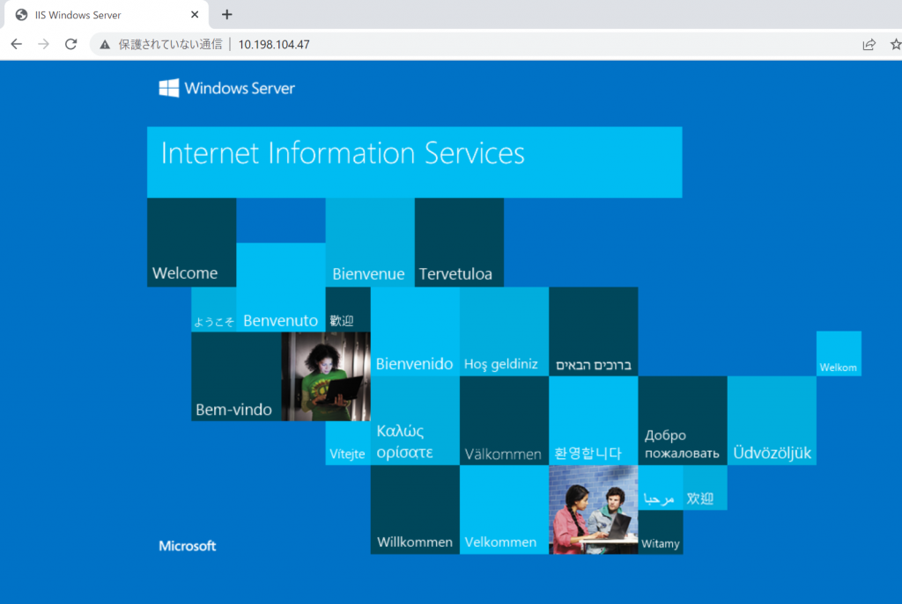
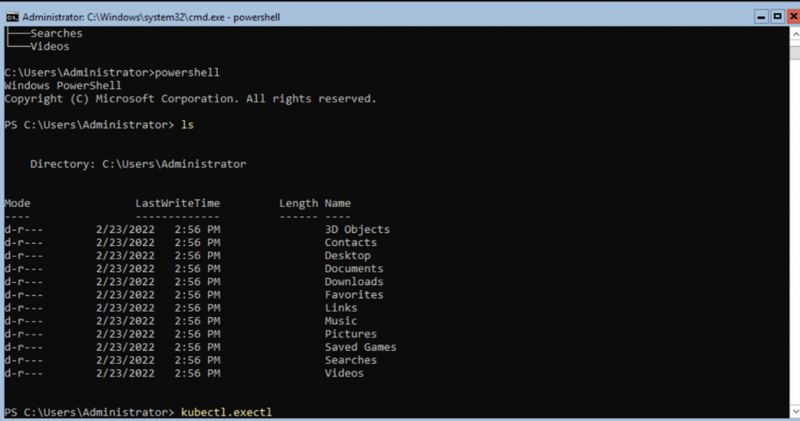
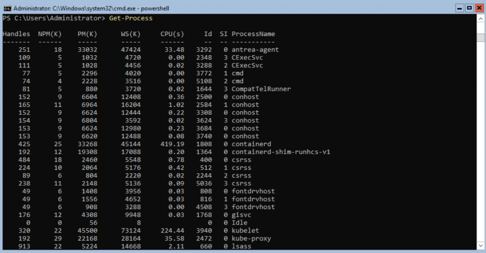
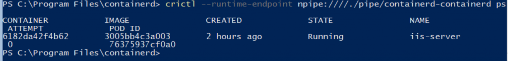

TKG 1.5.1 から正式にWindows Cluster がサポートされました。さっそく試してみたので、本記事ではWindows クラスタの作成方法とハマリどころを共有しつつ、この新しいおもちゃで色々遊んでみようと思います。

## 前提条件

TKG1.5.1 で管理クラスタのデプロイを完了しておきます。ノードのイメージは最新版であるUbuntu 2004 Kubernetes v1.22.5 指定であることに注意します。

## Windows クラスタの作成

下記ドキュメントに従って、Kubernetes クラスタ用のWindows Server イメージのビルドと、ビルドしたイメージをもとにワークロードクラスタを作成します。

[https://docs.vmware.com/en/VMware-Tanzu-Kubernetes-Grid/1.5/vmware-tanzu-kubernetes-grid-15/GUID-build-images-windows.html](https://docs.vmware.com/en/VMware-Tanzu-Kubernetes-Grid/1.5/vmware-tanzu-kubernetes-grid-15/GUID-build-images-windows.html)

### イメージのビルド

基本的にはドキュメントの通りですが、前提条件記載の通り、Windows でのイメージビルドは不可のため、tanzu cli やdocker の準備が整ったMacOS かLinux のマシンを用意します。また、VMware tools やWindows Server のミニマムのバージョンも指定があるため注意してください。tools のISO ファイルは[コチラ](https://packages.vmware.com/tools/releases/latest/windows)から取得できます。それら2 つのISO ファイルをデータストアに配置します（packer のドキュメントを見るとコンテンツライブラリでも行けそうな気がします）。ドキュメントには記載がないですが、イメージをビルドする際にDHCP サーバーが必要になります（といってもワークロードクラスタ作成時に必要ではありますが）。

次に、管理クラスタに、イメージのビルドに使うリソースキットDeployment をデプロイします。これは素直にドキュメントと同じマニフェストを使ってOK です。

その後、イメージビルダーコンテナをクライアント側にdocker コマンドでデプロイします。これにはwindows.json とautounattend.xml の2 つの入力ファイルが必要で、ドキュメントをベースにそれらを作成していきます。

windows.json はドキュメントのテンプレートを適切に修正していきます。注意点として、WINDOWS-TIMEZONE の値はvCenter Server に合わせる必要があります。

VMTOOLS-ISO-PATH/OS-ISO-PATH はドキュメントが少しわかりづらいですが、データストアの名前を\[ \] で指定します。参考までに私がビルドに使ったwindows.json を置いておきます。

```json
{
    "unattend_timezone": "Tokyo Standard Time",
    "windows_updates_categories": "",
    "windows_updates_kbs": "",
    "kubernetes_semver": "v1.22.5",
    "cluster": "Cluster",
    "template": "",
    "password": "PASSWORD",
    "folder": "",
    "runtime": "containerd",
    "username": "administrator@vsphere.local",
    "datastore": "vsanDatastore",
    "datacenter": "Datacenter",
    "convert_to_template": "true",
    "vmtools_iso_path": "[vsanDatastore] iso-for-tkg-windows/VMware-tools-windows-11.3.5-18557794.iso",
    "insecure_connection": "true",
    "disable_hypervisor": "false",
    "network": "VM Network-1070",
    "linked_clone": "false",
    "os_iso_path": "[vsanDatastore] iso-for-tkg-windows/en-us_windows_server_2019_updated_aug_2021_x64_dvd_a6431a28.iso",
    "resource_pool": "",
    "vcenter_server": "10.198.99.5",
    "create_snapshot": "false",
    "netbios_host_name_compatibility": "false",
    "kubernetes_base_url": "http://10.198.99.166:30008/files/kubernetes/",
    "containerd_url": "http://10.198.99.166:30008/files/containerd/cri-containerd-v1.5.9+vmware.1.windows-amd64.tar",
    "containerd_sha256_windows": "0aa0df1c3d6c545b360e75fa4d20f604e1bb2ccd05b1651dc92941fdb4b49587",
    "pause_image": "mcr.microsoft.com/oss/kubernetes/pause:3.5",
    "prepull": "false",
    "additional_prepull_images": "mcr.microsoft.com/windows/servercore:ltsc2019",
    "additional_download_files": "",
    "additional_executables": "true",
    "additional_executables_destination_path": "c:/k/antrea/",
    "additional_executables_list": "http://10.198.99.166:30008/files/antrea-windows/antrea-windows-advanced.zip",
    "load_additional_components": "true"
}
```

autounattend.xml は、ライセンスの部分だけ任意に変更します。今回は<ProductKey>...</ProductKey> を削除しています。その後、ドキュメント記載のコマンドでdocker run するのですが…

```
[root@localhost ~]# docker run -it --rm --mount type=bind,source=$(pwd)/windows.json,target=/windows.json --mount type=bind,source=$(pwd)/autounattend.xml,target=/home/imagebuilder/packer/ova/windows/windows-2019/autounattend.xml -e PACKER_VAR_FILES="/windows.json" -e IB_OVFTOOL=1 -e IB_OVFTOOL_ARGS='--skipManifestCheck' -e PACKER_FLAGS='-force -on-error=ask' -t projects.registry.vmware.com/tkg/image-builder:v0.1.11_vmware.3 build-node-ova-vsphere-windows-2019
hack/ensure-ansible.sh
hack/ensure-ansible-windows.sh
hack/ensure-packer.sh
hack/ensure-goss.sh
Right version of binary present
hack/ensure-ovftool.sh
packer build -var-file="/home/imagebuilder/packer/config/kubernetes.json"  -var-file="/home/imagebuilder/packer/config/windows/kubernetes.json"  -var-file="/home/imagebuilder/packer/config/containerd.json"  -var-file="/home/imagebuilder/packer/config/windows/containerd.json"  -var-file="/home/imagebuilder/packer/config/windows/docker.json"  -var-file="/home/imagebuilder/packer/config/windows/ansible-args-windows.json"  -var-file="/home/imagebuilder/packer/config/common.json"  -var-file="/home/imagebuilder/packer/config/windows/common.json"  -var-file="/home/imagebuilder/packer/config/windows/cloudbase-init.json"  -var-file="/home/imagebuilder/packer/config/goss-args.json"  -var-file="/home/imagebuilder/packer/config/additional_components.json"  -force -on-error=ask -color=true -var-file="packer/ova/packer-common.json" -var-file="/home/imagebuilder/packer/ova/windows-2019.json" -only=file -var-file="/windows.json"  packer/ova/packer-windows.json
file: output will be in this color.

Build 'file' finished after 1 millisecond 77 microseconds.

==> Wait completed after 1 millisecond 114 microseconds

==> Builds finished. The artifacts of successful builds are:
--> file: Stored file: ./packer_cache/unattend.json
hack/windows-ova-unattend.py --unattend-file='./packer/ova/windows/windows-2019/autounattend.xml'
windows-ova-unattend: cd .
windows-ova-unattend: Setting Timezone to Tokyo Standard Time
windows-ova-unattend: Updating ./packer/ova/windows/windows-2019/autounattend.xml ...
Traceback (most recent call last):
  File "/usr/lib/python3.8/xml/etree/ElementTree.py", line 786, in _get_writer
    write = file_or_filename.write
AttributeError: 'str' object has no attribute 'write'

During handling of the above exception, another exception occurred:

Traceback (most recent call last):
  File "hack/windows-ova-unattend.py", line 80, in <module>
    main()
  File "hack/windows-ova-unattend.py", line 74, in main
    unattend.write(args.unattend_file)
  File "/usr/lib/python3.8/xml/etree/ElementTree.py", line 756, in write
    with _get_writer(file_or_filename, enc_lower) as write:
  File "/usr/lib/python3.8/contextlib.py", line 113, in __enter__
    return next(self.gen)
  File "/usr/lib/python3.8/xml/etree/ElementTree.py", line 792, in _get_writer
    file = open(file_or_filename, "w", encoding=encoding,
PermissionError: [Errno 13] Permission denied: './packer/ova/windows/windows-2019/autounattend.xml'
make: *** [Makefile:320: build-node-ova-vsphere-windows-2019] Error 1
[root@localhost ~]# 
```

ここからが第一関門で、Linux の場合、ドキュメント記載のdocker run コマンドがPermission Error で通らない場合があります。作成したwindows.json とautounattend.xml の所有者と内部で起動するビルドスクリプトのユーザーが異なり、スクリプトの途中でwindows.json の内容をautounattend.xml に書き込むのですが、そこで書き込みができないということでイメージビルドが止まります。回避策として、他にもっとクールな方法があるかもしれませんが、現状下記の方法で私はなんとかしました。

- entrypoint をbash で上書きし、autounattend.xml をテキトーにautounattend.xml.bak などと名前を変えてコンテナをデプロイ

```
docker run -it --rm  --mount type=bind,source=$(pwd)/windows.json,target=/windows.json --mount type=bind,source=$(pwd)/autounattend.xml,target=/home/imagebuilder/packer/ova/windows/windows-2019/autounattend.xml.bak -e PACKER_VAR_FILES="/windows.json" -e IB_OVFTOOL=1 -e IB_OVFTOOL_ARGS='--skipManifestCheck' -e PACKER_FLAGS='-force -on-error=ask' --entrypoint bash -t projects.registry.vmware.com/tkg/image-builder:v0.1.11_vmware.3 
```

- コンテナの中でcp でautounattend.xml を作成し、make （cp でautounattend.xml の所有者を無理やりimagebuilder ユーザーに変更しています）

```
cp packer/ova/windows/windows-2019/autounattend.xml.bak packer/ova/windows/windows-2019/autounattend.xml
make build-node-ova-vsphere-windows-2019
```

あとは自動的にWindows Server のテンプレートが出来上がります。ちなみに、autounattend.xml にもTIME ZONE の記載はありますが、これはmake 中にwindows.json の値で上書きされるので修正する必要はありません。

### Windows ワークロードクラスタの作成

第二関門です。通常のワークロードクラスタと同様、管理クラスタ構築時に出力されたconfig ファイルをもとに、tanzu cluster create をしますが、いくつか注意があります。

まず、config ファイルにWindows クラスタ用のいくつかの追記/修正が必要です。これはドキュメントを参照してください。

次に、**デプロイは必ずエラーになります（！）**。というのも、ako のPod ステータスがPending でスタックし、クラスタ作成後のpackage のインストールが完了せず、タイムアウトになります（ただ、クラスタ自体のデプロイは完了します）。これはドキュメントに回避策があります。

[https://docs.vmware.com/en/VMware-Tanzu-Kubernetes-Grid/1.5/vmware-tanzu-kubernetes-grid-15/GUID-tanzu-k8s-clusters-vsphere.html#windows](https://docs.vmware.com/en/VMware-Tanzu-Kubernetes-Grid/1.5/vmware-tanzu-kubernetes-grid-15/GUID-tanzu-k8s-clusters-vsphere.html#windows)

要するに、本来ako はワーカーノード上でデプロイされますが、Windows クラスタの場合ako がワーカーノード上にデプロイできないため、コントロールプレーンでデプロイできるようにtolerations をセットします。ただ、ClusterAPI の設計上管理クラスタにワークロードクラスタの設定情報が埋め込まれているため、デプロイ後に管理クラスタ側でytt のパッチを当てるという流れです。パッチを当てた後はako pod の再作成をします（kubectl delete pod すれば自動的にstatefulset が再作成してくれます）。

なお、pinniped を設定している場合も似たような修正が必要です。この辺は次のリリースで解消してほしいところです。

最後に、管理クラスタを最小のサイズsmall で組んでいるときに引っ掛かるのですが、そのままのconfig ファイルでワークロードクラスタをデプロイしようとすると、システムのcpu リソースが足りずako がデプロイできません。実際、small だとCPU リクエストの合計が1970m となり、Small の2vcpu (2000m) ギリギリです。ワーカーノード上にデプロイされるako がコントロールプレーン側に来ることによって必要リソースが増えることに起因します。

```
  Namespace                   Name                                                          CPU Requests  CPU Limits  Memory Requests  Memory Limits  Age
  --------- ---- ------------ ---------- --------------- ------------- ---
  kube-system                 antrea-agent-mt77z                                            400m (20%)    0 (0%)      0 (0%)           0 (0%)         61m
  kube-system                 antrea-controller-fc5689cc6-65s9p                             200m (10%)    0 (0%)      0 (0%)           0 (0%)         61m
  kube-system                 coredns-6765cf8944-bp6zk                                      100m (5%)     0 (0%)      70Mi (1%)        170Mi (4%)     63m
  kube-system                 coredns-6765cf8944-ffzfm                                      100m (5%)     0 (0%)      70Mi (1%)        170Mi (4%)     63m
  kube-system                 etcd-tkg-wkld-win-1-control-plane-542sg                       100m (5%)     0 (0%)      100Mi (2%)       0 (0%)         63m
  kube-system                 kube-apiserver-tkg-wkld-win-1-control-plane-542sg             250m (12%)    0 (0%)      0 (0%)           0 (0%)         63m
  kube-system                 kube-controller-manager-tkg-wkld-win-1-control-plane-542sg    200m (10%)    0 (0%)      0 (0%)           0 (0%)         63m
  kube-system                 kube-proxy-hgqn8                                              0 (0%)        0 (0%)      0 (0%)           0 (0%)         63m
  kube-system                 kube-scheduler-tkg-wkld-win-1-control-plane-542sg             100m (5%)     0 (0%)      0 (0%)           0 (0%)         63m
  kube-system                 metrics-server-6dccdfdd98-hp58l                               100m (5%)     0 (0%)      200Mi (5%)       0 (0%)         62m
  kube-system                 vsphere-cloud-controller-manager-9lbhz                        200m (10%)    0 (0%)      0 (0%)           0 (0%)         62m
  tkg-system                  kapp-controller-5d878fb6d8-9qlf8                              120m (6%)     0 (0%)      100Mi (2%)       0 (0%)         63m
  tkg-system                  tanzu-capabilities-controller-manager-65ccbf9d84-g97pq        100m (5%)     100m (5%)   20Mi (0%)        30Mi (0%)      63m
Allocated resources:
  (Total limits may be over 100 percent, i.e., overcommitted.)
  Resource           Requests     Limits
  -------- -------- ------
  cpu                1970m (98%)  100m (5%)
  memory             560Mi (14%)  370Mi (9%)
  ephemeral-storage  0 (0%)       0 (0%)
  hugepages-1Gi      0 (0%)       0 (0%)
  hugepages-2Mi      0 (0%)       0 (0%)
```

回避策として、設定ファイルのコントロールプレーンのCPU 数（VSPHERE\_CONTROL\_PLANE\_NUM\_CPUS）を4vcpu 程度に設定します。

このようないくつかの地雷を回避しつつ、クラスタのデプロイが完了し、ako も無事稼働したら、テスト用のIIS サーバーを立ち上げてみましょう。サンプルマニフェストは下記の通りです。初回起動時はイメージの取得にかなり時間がかかります（自分の場合6 分程度かかりました）。

```yaml
apiVersion: apps/v1
kind: Deployment
metadata:
  name: iis
  labels:
    app: iis
spec:
  replicas: 1
  selector:
    matchLabels:
      app: iis
  template:
    metadata:
      labels:
        app: iis
    spec:
      nodeSelector:
        kubernetes.io/os: windows
      containers:
      - name: iis-server
        image: mcr.microsoft.com/windows/servercore/iis
        ports:
        - containerPort: 80
      tolerations:
      - key: "os"
        value: "windows"
        effect: "NoSchedule"
---
kind: Service
apiVersion: v1
metadata:
  name: iis
spec:
  type: LoadBalancer
  selector:
    app: iis
  ports:
    - name: http
      protocol: TCP
      port: 80
```

```
[root@localhost ~]# kubectl apply -f iis.yaml 
deployment.apps/iis created
service/iis created
[root@localhost ~]# kubectl get pod
NAME                   READY   STATUS    RESTARTS   AGE
iis-784d6b5c9b-xczvj   1/1     Running   0          10s
[root@localhost ~]# kubectl get svc
NAME         TYPE           CLUSTER-IP       EXTERNAL-IP     PORT(S)        AGE
iis          LoadBalancer   100.71.140.116   10.198.104.47   80:30201/TCP   14s
kubernetes   ClusterIP      100.64.0.1       <none>          443/TCP        3h20m
```

[](images/image-99-1024x687.png)

Kubernetes でIIS が建ってちょっと感動です。

## 中身は実際どうなってるの？

Windows クラスタを触るのが初めてなので色々遊んでみます。

```
kubectl exec -it iis-784d6b5c9b-xczvj -- powershell
```

```
Windows PowerShell
Copyright (C) Microsoft Corporation. All rights reserved. 

PS C:\> ls 


    Directory: C:\ 

Mode                LastWriteTime         Length Name
---- ------------- ------ ----
d----- 2/23/2022   2:47 PM                dev
d----- 2/9/2022   3:32 AM                inetpub
d-r--- 2/3/2022  12:30 PM                Program Files
d----- 2/3/2022   4:28 AM                Program Files (x86)
d-r--- 2/3/2022   4:31 AM                Users
d----- 2/23/2022   2:47 PM                var
d----- 2/9/2022   3:32 AM                Windows
Windows PowerShell
Copyright (C) Microsoft Corporation. All rights reserved.
```

なんとkubectl exec でpowershell が立ち上がりました。面白い。

```
PS C:\> Get-Process 

Handles  NPM(K)    PM(K)      WS(K)     CPU(s)     Id  SI ProcessName
------- ------ ----- ----- ------ -- -- -----------
    121       6     1264       5128       0.05   2348   3 CExecSvc
    100       7     1184       4876       0.02   2616   3 conhost
    239      12     2152       5148       0.09   5036   3 csrss
     49       6      912       3292       0.00   4508   3 fontdrvhost
      0       0       56          8                 0   0 Idle
    775      21     4508      13308       0.28   4120   3 lsass
    224      13     2780      10068       0.09   3868   3 msdtc
    641      49    56308      73332       5.03   3860   3 powershell
     66       6      868       4104       0.02   3660   3 ServiceMonitor
    206      10     2288       6500       0.19   4940   3 services
     50       3      492       1228       0.06   2512   0 smss
    169      11     3776      10860       0.03    328   3 svchost
    418      16     7396      13760       0.13    904   3 svchost
    143       8     1460       6420       0.02   1124   3 svchost
    305      12     2376       8408       0.03   1324   3 svchost
    350      13     2684      10176       0.14   2140   3 svchost
    241      15     4716      11940       0.08   2184   3 svchost
    123       7     1196       5764       0.00   2232   3 svchost
    578      34     5868      18812       0.17   3008   3 svchost
    955      34    14752      35088       3.39   3420   3 svchost
    177      14     2936       8980       0.02   4996   3 svchost
    458      20    14128      28132       1.92   5012   3 svchost
   3113       0      188        152      40.42      4   0 System
    229      34     5088      13648       0.08   3588   3 w3wp
    172      11     1484       7112       0.02   4032   3 wininit
```

Linux と違って色々なプロセスが立ち上がっていますね。

次にワーカーノードに入ります。ワーカーノードからの直接の操作は非サポートだと思うので、本番環境では当たり前ですがNG です。

[](images/image-101-1024x539.png)

[](images/image-102-1024x535.png)

お馴染みのディレクトリ構造ですね。antrea-agent やらkubelet やらが稼働していて、当たり前ですがKubernetes としての仕事をきちんとこなしています。

[](images/image-100-1024x123.png)

crictl でも稼働中のIIS サーバーが見えました。

## おまけ：クラスタの削除

Windows クラスタに限りませんが、ワークロードクラスタの削除をするときは必ずロードバランサーとPVC を事前に削除します。ただ、先のako 問題で、ako がpending の状態でクラスタを削除する際に、そのままtanzu cluster delete をするとdeleting の状態からステータスが進みません。これを回避するためには、管理クラスタにあるcluster オブジェクトのFinalizer をkubectl edit で削除します。

```
[root@localhost ~]# kubectl get cluster -o yaml
apiVersion: v1
items:
- apiVersion: cluster.x-k8s.io/v1beta1
  kind: Cluster
~~~
    finalizers:
    - cluster.cluster.x-k8s.io
    - ako-operator.networking.tkg.tanzu.vmware.com // <- delete
```

これ以外にも削除できない原因が別にあるかもしれませんし、もちろん正規の方法ではないので、本番環境で発生したらSR を上げましょう。
