Workspace ONE UEM には、デバイスを使う通常のユーザーとは別に、UEM の管理コンソールにログインし、運用管理を行う管理者がいます。管理者はそれぞれロールを持ち、デフォルトではおおよそすべての操作ができるConsole Administrator というロールを持つ管理者が作成されています。基本的な操作はこのデフォルトの管理者から行えばよいのですが、運用を複数人で担当するなどのケースで管理者を複数追加したい時があります。その際、Console Administrator ロールでは強すぎるため、ロールを調整して特定の操作に限定させることで操作ミスなどのリスクを減らすことができます。

幸い、Workspace ONE UEM の場合、非常に柔軟に管理者のロールを指定できます。

参考：管理者ロールに設定できる権限一覧

AdminUserChangeStatus, Promote, AdminUserEdit, AdminUserAdd, AdminUserDelete, AdminUserBatchImport, AdminUserBatchImportView, AdminUserChangePassword, AdminUserTermsOfUseView, AdminUserExport, AdminUserViewOnly, AdminUserLoginHistory, EditAdminGroup, AddAdminGroup, DeleteAdminGroup, AdminGroupChangeRank, MergeAdminGroup, SyncAdminGroup, AddMissingAdmins, AdminGroupMembersExport, ViewAdminGroupMembers, AdminGroupGrid, AdminRoleCopy, AdminRoleOverride, AdminRoleAdd, AdminRoleEdit, AdminRoleDelete, AdminRoleView, CompareRoles, UserAccountsAddDevice, UserRegistrationEdit, UserRegistrationExport, EnrollmentUserTermsOfUseView, UserAccountsEdit, UserAccountsAdd, BatchUpload, UserAccountsBatchImport, BatchImportStatus, UserAccountBatchSendMessage, UserAccountBatchActivate, UserAccountBatchDeactivate, UserAccountBatchDelete, UserAccountBatchAddToUserGroup, UserAccountBatchRemoveFromUserGroup, AssignDeviceEnrollmentProgram, RemoveDeviceEnrollmentProgram, SyncDeviceEnrollmentProgram, UserAccountDelete, UserAccountMove, UserAccountsExport, UserMigrationAllowAutoMatch, UserMigrationAllowUnMatched, UserMigration, UserSearch, UserDetailsView, UserRegistrationMessage, NavigationAdministration, UserAccounts, UserRegistration, NavigationUserAccounts, EnrollOffline, UserRoleAdd, UserRoleEdit, UserRoleDelete, UserRoleExport, UserRoleView, UserRole, UserGroupEdit, UserGroupAdd, UserGroupDelete, UserGroupBatchImport, UserGroupExport, UserGroupMerge, UserGroupSync, UserGroupAddMissingUsers, UserGroupMembersExport, UserGroupViewMembers, UserGroupGrid, UserGroupView, RESTAPISystemGroups, RESTAPISystemAdmin, RESTAPISystemUsers, RestApiAdminsWrite, RestApiAdminsExecute, RestApiAdminsDelete, RestApiAdminsRead, RestApiAppsWrite, RestApiAppsExecute, RestApiAppsDelete, RESTAPIMAMApps, RESTAPIMAMBlob, RestApiAppsRead, CompliancePolicyDelete, CompliancePolicyExecute, CompliancePolicyWrite, CompliancePolicyRead, RestApiCustomAttriutesDelete, RestApiCustomAttributesExecute, RestApiCustomAttributesWrite, RestApiCustomAttributesRead, RESTAPIMDMSmartgroups, RESTAPIMDMUsergroups, RESTAPIMDMProfiles, RESTAPIMDMDevices, RestApiDevicesWrite, RestApiDevicesExecute, RestApiDevicesDelete, RestApiDevicesAdvanced, RestApiBlobsWrite, RestApiBlobsExecute, RestApiBlobsDelete, RestApiDevicesRead, RestApiBlobsRead, RestApiEnterpriseIntegrationRead, RestApiGroupsWrite, RestApiGroupsExecute, RestApiGroupsDelete, RestApiSmartGroupsWrite, RestApiSmartGroupsExecute, RestApiSmartGroupsDelete, RestApiUserGroupsWrite, RestApiUserGroupsExecute, RestApiUserGroupsDelete, RestApiCartWrite, RestApiCartDelete, RestApiRosterSyncWrite, RestApiPersonEnrollmentUserMapWrite, RestApiClassAssignmentSave, RestApiClassWrite, RestApiClassDelete, RestApiAirWatchEducationWrite, RestApiLoadEducation, RestApiSmartGroupsRead, RestApiUserGroupsRead, RestApiGroupsRead, RestApiRosterSyncRead, RestApiEduAppsForDeviceRead, RestApiClassLoad, RestApiProductsExecute, RestApiProductsWrite, RestApiProductsDelete, RestApiProductsRead, RestApiProfilesWrite, RestApiProfilesExecute, RestApiProfilesDelete, RestApiUpdatesPolicyWrite, RestApiUpdatesPolicyExecute, RestApiUpdatesPolicyDelete, RestApiProfilesRead, RestApiUpdatesPolicyRead, RestApiUsersWrite, RestApiUsersExecute, RestApiUsersDelete, RestApiUserTokensRead, RestApiUsersRead, AdvancedApi, ReadWriteUpdate, EditUserComment, DeleteUserComment, ViewUserComment, ExportUserComment, ApplicationGroupUpdateActiveStatus, ApplicationGroupAddItem, ApplicationGroupDeleteItem, ApplicationGroupEditItem, ApplicationGroupView, AdaptiveManagement, AppRemovalProtectionLogEdit, ApplicationPublish, AppRemovalProtectionLogView, AddApplicationWorkflow, ReviewApplicationWorkflow, AssignApplicationWorkflow, PublishApplicationWorkflow, EnableApplicationWrapping, ApplicationEdit, ApplicationDelete, ApplicationCreate, IdmAccessPolicies, GettingStartedApplication, NavigationAppsApplications, NavigationApps, InternalBookCreate, InternalBookEdit, InternalBookDelete, PublicBookCreate, PublicBookEdit, PublicBookDelete, BookPublish, BookRemove, Books, InternalBooksGridView, InternalBookView, PublicBooksGridView, PublicBookView, ViewDevicesForBook, ViewRatingForBook, PurchasedBooksGridView, ApplicationUpdateActiveStatus, ApplicationUpdateRetiredStatus, ApplicationCreateNewVersion, ApplicationView, ApplicationNotifyDevices, BoxerConfigReadWrite, PublicApplicationUpdateActiveStatus, PublicApplicationPublish, PublicApplicationCreate, PublicApplicationDelete, PublicApplicationEdit, PublicApplicationEditAssignment, PublicApplicationView, PublicApplicationViewDevices, OrderDelete, OrderAdd, OrderEdit, OrderEditAssignment, OrderLicenseDelete, OrderLicenseDisable, Orders, OrderLicenseView, PurchasedApplicationsView, LicensesView, RunAppScan, ViewAppScan, SdkAnalytics, ApplicationEditAssignment, ApplicationViewDevices, VirtualApplications, Collections, WebApplicationEdit, SaaSApplications, WebApplicationCreate, WebApplicationDelete, WebApplicationView, WebApplicationViewDevices, AssistRemoteControl, AssistRemoteView, AssistFileManager, AssistRegistryEditor, AssistRemoteShell, AssistUnattendedAccess, AssistSessionCollaboration, AddBlueprint, EditBlueprint, DeleteBlueprint, LearnMoreAccess, BlueprintListViewAccess, ViewWSOneDemConfiguration, CreateWSOneCatalogTenant, EditWSOneHubConfiguration, ViewWSOneHubConfiguration, OauthClientEdit, OauthClientRead, CloudContentPlatform, ContentBatchImport, ContentCategoryCreate, ContentCategoryEdit, ContentCategoryDelete, ContentCategoryView, ContentCategory, ContentDownload, ContentCreate, ContentCreateNewVersion, ContentEdit, ContentSettings, ContentDeviceInstall, ContentDelete, ContentDeviceRemove, ContentRepositoryAdd, ContentRepositoryEdit, ContentRepositoryDelete, ContentRepository, ContentRepositoryView, GettingStartedContent, Content, ContentDashboard, ContentView, NavigationContent, ContentViewDevices, DeviceLocationAssignment, DeviceBulkManagementSendMessage, DeviceBulkManagementEnterpriseWipe, DeviceBulkManagementDeviceWipe, DeviceBulkManagementChangeLG, DeviceBulkManagementDeviceDelete, DeviceBulkManagementWarmBoot, DeviceBulkManagementLockDevice, DeviceBulkManagementOverrideJobLogLevel, DeviceBulkManagementRebootDevice, DeviceBulkManagementDeviceConfiguredGroup, BulkManagementAssignOwnership, DeviceBulkManagement, DeviceBulkManagementToggleDND, DeviceBulkManagementQueryDevice, CustomMdmCommand, DeviceBulkManagementScheduleOsUpdateBulk, DeviceBulkManagementEnableLostModeGroup, DeviceBulkManagementDisableLostModeGroup, DeviceBulkManagementDeviceViewGps, DeviceBulkManagementForceBiosPasswordReset, DeviceBulkManagementSendMessageToAll, DeviceBulkManagementAddTags, DeviceBulkManagementInstallProduct, DeviceBulkManagementAssignUnassignDeviceGroup, DeviceBulkManagementEnterpriseReset, DeviceBulkManagementGPS, DeviceBulkManagementActions, SMIMESettings, RevokeCertificate, RenewCertificate, ViewCertificateDashboard, CompliancePolicyAddItem, CompliancePolicyEditItem, CompliancePolicyDeleteItem, OnDemandCompliance, ComplianceCellDataUsageRule, ComplianceCellMessageUsage, ComplianceCellVoiceUsage, ComplianceRoaming, ComplianceRoamingCellDataUsage, ComplianceSimCardChange, CompromisedDeviceComplianceEdit, OperatingSystemComplianceEdit, ModelComplianceEdit, DeviceComplianceEdit, ComplianceDevicePolicies, CompliancePolicyViewDevices, DeviceComplianceView, ApplicationComplianceView, CompliancePoliciesView, NavigationDeviceCompliance, NavigationCompliance, CustomAttributesAdd, CustomAttributesEdit, CustomAttributesDelete, AssignmentRulesAdd, AssignmentRulesEdit, AssignmentRulesDelete, CustomAttributesView, CustomAttributeAssignmentRules, ApproveUpdate, UnApproveUpdate, NavigationAssetTracking, ViewUpdateDevices, NavigationDashboards, DashboardShowSignalIcon, DashboardShowTunnelIcon, Dashboard, PeripheralsDashboard, DashboardDeviceGroups, PortletSupervised, AndroidFileManagerDelete, AndroidFileManagerCopy, AndroidFileManagerRename, AndroidFileManagerAdd, AndroidFileManagerUpload, AndroidFileManagerMove, AndroidFileManager, AndroidFileManagerDownload, DeviceAppInstall, DeviceAppRemove, DeviceClearAppPasscode, DeviceAppUpdate, DeviceRequestLogs, ManagedApplicationFeedback, DeviceViewAppList, DeviceImageAdd, DeviceImageDelete, HyperLinkDelete, DeviceAddImageAttachment, DeviceAddDocumentAttachment, DeviceAddLinkAttachment, DeviceViewAttachments, DeviceDetailsStartAWCM, DeviceDetailsStopAWCM, DeviceViewCertificates, ViewDeviceCompliance, ExportDeviceCompliance, ReadOnlyCompliancePolicy, DeviceDeleteDocument, DeviceViewContent, DeviceDelete, DeviceWipe, DeviceViewDeviceTrustPoliciesList, DisableActivationLockBypassCode, SuspendBitlockerEncryption, ForceBiosPasswordReset, RenameDevice, OsUpdateStatus, RefreshEsim, DeviceUpdateFriendlyName, DeviceDetailsAssignOwnership, DeviceDetailsEditDevice, DeviceEditCustomFields, DeviceEditAssetNumber, DeviceSIMCardEdit, DeviceUpdatePhoneNumber, EnterAdminMode, DeviceRemoveMdm, DeviceEnterpriseReset, ExitAdminMode, ExitAirWatchLauncher, LostMode, FindDevice, DeviceUpdateLocationGroup, AirPlay, JasperSimToggle, BesRegistration, ScheduleOsUpdate, ReprocessDevicePolicy, ToggleDoNotDisturb, DeviceRemoteReboot, InstallIntelligentHub, QueryWorkflows, DeviceCICOCheckIn, DeviceMgmtProvision, DeviceChangeCategory, DeviceRestartHost, DeviceDetailsUpdates, UpdateEditAssignment, GenerateAppToken, ViewGeneratedAppToken, ChangeAppTokenEmail, DeviceDeleteProduct, DeviceConsole, DeviceEditProduct, DeviceAddProduct, DeviceClearAppData, DeviceDeleteImage, DeviceDeleteLink, DeviceDetailsSetRoaming, DeviceDetailsEnroll, DeviceDetailsDebugLog, RegistryEditor, ViewOemUpdates, ViewBiosPassword, DeviceViewDeviceInformation, DeviceShowCredentials, DeviceViewDetails, DeviceViewAppleCare, ViewUpdates, DeviceViewCustomFields, DeviceViewDeviceDetails, DeviceViewBreadcrumbs, DeviceViewGps, LockSso, RemoteDeviceLock, DeviceViewEventLog, ViewSharedDeviceLog, DeviceViewMessageLog, DeviceViewAuditLog, DeviceMessenger, DeviceSendMessage, DeviceSendMessageSMS, DeviceSendMessageEmail, DeviceSendMessagePushNotification, DeviceViewNetwork, ViewDeviceWnsStatus, AddNote, EditNote, DeleteNote, EditNoteState, ViewNotes, SearchNotes, OverrideJobLogLevel, ClearSsoPasscode, DeviceResetPasscode, ClearRestrictionPasscode, ChangeContainerPasscode, RemoteChangePasscode, DeviceClearPasscode, DeviceUpdatePoP, DeviceInstallProfile, DeviceRemoveProfile, DeviceViewProfiles, DeviceDetailsQueryApps, DeviceDetailsQueryDeviceInfo, DeviceDetailsQueryCerts, DeviceDetailsQueryProfiles, DeviceDetailsQuerySecurity, DeviceDetailsQueryOSUpdates, DeviceDetailsQueryAgent, DeviceDetailsQueryUsers, DeviceRemoteManagement, DeviceScreenCapture, DeviceRemoteScreenShare, DeviceRemoteUtilities, DeviceRemote, RemoteView, RepairHub, DeviceRequestCheckin, RequestDeviceCheckIn, DeviceRequestRestrictions, DeviceViewRestrictions, RotateRecoveryKey, DeviceViewSecurityInfo, ViewRecoveryLockPassword, ViewUnlockPin, ViewRecoveryKey, ViewManagedAdminPassword, SyncDeviceSensors, DeviceStatusHistoryView, DeviceSync, DeviceViewTelecomLog, DeviceViewPhoneCalls, DeviceViewSms, DeviceViewTermsOfUse, DeviceShowEnrollmentUserName, DeviceViewUserInfo, DeviceColdBoot, DeviceWarmBoot, DeviceFileManagerAdd, DeviceFileManagerEdit, DeviceFileManagerCopy, DeviceFileManagerMove, DeviceFileManagerDelete, DeviceFileManagerUpload, DeviceFileManagerDownload, DeviceRegistryManagerAdd, DeviceRegistryManagerEditProperty, DeviceRegistryManagerDelete, DeviceViewDeviceConsole, FileManager, RegistryManager, DeviceViewAdditionalDetails, DomainJoinConfigEdit, DeviceViewWorkflowsList, DeviceListExport, DeviceDetailsQueryHealthAttestation, DeviceListViewAccess, Devices, SearchDevices, GSuiteRotatePasswordAction, LegacyAndroidMigration, ManageBaselines, ViewBaselines, ViewUserDetails, ProfileBatchImport, GeoFencingAreaAddEdit, GeoFencingAreaDelete, ProfileAdd, ProfileSetActive, ProfileEditAssignment, ProfileCopy, ProfileDelete, ProfileEdit, ProfilePublish, ProfileEncryptExportXML, TimeSchedule, TimeScheduleAddEdit, TimeScheduleDelete, ProfileResources, ProfileView, ProfileReadOnly, NavigationProfilesPolicies, ProfileViewDevices, ViewProfileXML, AddEditScripts, DeleteScripts, ViewScripts, ManageDeviceSensors, ViewDeviceSensors, ViewProvisioningPackages, AgentPackageAdd, AgentPackageDelete, AgentPackageView, ProvisioningPolicyApplication, ProvisioningPolicyConditionAdd, ProvisioningPolicyConditionEdit, ProvisioningPolicyConditionDelete, ProvisioningPolicyConditionCopy, ProvisioningPolicyCondition, ProvisioningPolicyEventActionAdd, ProvisioningPolicyEventActionEdit, ProvisioningPolicyEventActionCopy, ProvisioningPolicyEventActionDelete, ProvisioningPolicyEventActionView, ProvisioningPolicyFileActionCopy, ProvisioningPolicyFileActionAdd, ProvisioningPolicyFileActionEdit, ProvisioningPolicyFileActionDelete, ProvisioningPolicyFileAction, EditFileServerConfiguration, AddFileServerConfiguration, DeleteFileServerConfiguration, ViewFileServerConfiguration, ProvisioningPolicyAdd, ProvisioningPolicyEdit, ProvisioningPolicyDelete, ExpeditedProvisioningPolicyEdit, ReprocessProduct, ProvisioningPolicy, ProductSetAdd, ProductSetEdit, ProductSetDelete, ProductSets, ProvisioningPolicyProfile, DownloadWindowsPullServiceInstaller, DownloadLinuxPullServiceInstaller, DownloadPullServiceInstallerConfigurationFile, PullServiceInstallersView, RelayServerAdd, RelayServerEdit, RelayServerCopy, RelayServerDelete, RelayServerSetActive, RelayServerBatching, RelayServerRemoteFileList, RelayServerView, QRCode, StagingSideLoad, StagingAdd, StagingEdit, StagingCopy, StagingDelete, StagingBarcode, StagingOnDemand, StagingView, ManageTimeWindow, ViewTimeWindow, ViewTimeWindowOnDeviceDetail, BatchSearch, BatchImportWizard, BatchImportDevice, BatchImportDeviceSmsEnroll, BatchImportSmsEnroll, BatchImport, AssetAdd, AssetEdit, Asset, DeviceViewMetrics, EmDashboardSyncMailboxes, EMComplianceEdit, EMComplianceView, EMComplianceRefresh, EMDashboardDeleteUnmanagementDevice, EMAdvancedLogging, EMDashboardDxModeOn, EMDashboardDxModeOff, EMDashboardWhitelist, EMDashboardBlacklist, EMDashboardDefault, DeviceActiveSyncAllow, DeviceActiveSyncBlock, EMDashboardMigrateDevice, PolicyOverrideListView, EMComplianceTestModeEdit, EmailManagement, AddEditFreestyle, DeleteFreestyle, NavigationFreestyle, ViewFreestyle, NavigationResources, LocationGroupTypeAdd, LocationGroupTypeEdit, LocationGroupTypeDelete, LocationGroupType, LocationTypeDelete, LocationStatusEdit, LocationStatusAdd, LocationStatusDelete, LocationCodeEdit, LocationTypeEdit, LocationTypeAdd, LocationDelete, LocationNotesAdd, LocationNotesActive, DeviceDistSerPath, LocationAdd, LocationEdit, LocationNotesInternal, Location, LocationGroupDelete, LocationGroupAdd, LocationGroupEdit, LocationGroupCodeEdit, LocationGroupSetDefaultLocation, NetworkRangeAdd, NetworkRangeImport, NetworkRangeEdit, NetworkRangeDelete, NetworkRange, DashboardLocationGroupTree, LocationGroup, AddCart, DeleteCart, SmartGroupEdit, SmartGroupDelete, SmartGroupView, AddEducationApp, RestApiUserWrite, ViewEducationOverview, LoadCart, LoadEducationApp, LoadEducationStudents, LoadEducationTeachers, HeroCards, MobileFlowsServerUrl, MobileFlowsAuthToken, MobileFlowsTenantAdd, CustomReportSupplementalTerms, EditCustomReportsGettingStarted, EditCustomReport, AddCustomReportSubscription, DeleteCustomReportSubscription, EditIntelligenceWithAddOn, ViewCustomReportsGettingStarted, ViewCustomReport, ViewCustomReportSubscription, EditAppleTemplate, ProductMonitor, NavigateAdminPanel, HubDevices, HubCompliance, HubProfiles, HubApps, HubContent, HubTelecom, HubEmail, HubCertificates, NavigationHub, NavigateExportStatus, ViewAppleTemplate, Automation, ViewExtendedDeviceInventoryOnDeviceDetail, AddSubscription, EditSubscription, DeleteSubscription, AddMyReport, DeleteMyReport, Report, ViewAllReports, ViewMyReports, ViewRecentReports, ViewSubscriptions, ViewReport, ViewSample, ReportSubscriptions, GettingStartedWorkspaceONE, GettingStartedDevice, InProductSupport, WhatsNew, PrinterViewAlerts, PrinterViewCpcl, PrinterViewPrinterDetails, PrinterViewToshibaGeneral, PrinterViewToshibaDevice, PrinterViewToshibaPower, PrinterViewToshibaWiFi, PrinterViewToshibaZmode, PrinterViewToshibaAdjustment, PrinterViewDataMaxONeilCustomSettings, PrinterViewDataMaxONeilBattery, PrinterViewDataMaxONeilSystemSettings, PrinterViewDataMaxONeilAutoUpdate, PrinterViewDataMaxONeilBluetooth, PrinterViewEpsonGeneral, PrinterTestPrint, PrinterViewAveryDennisonGeneral, PrinterViewDataMaxONeilGeneral, PrinterViewDataMaxONeilMediaLabel, PrinterViewDataMaxONeilPrintControl, PrinterViewDataMaxONeilMiscellaneous, PrinterViewDataMaxONeilGeneralNetwork, PrinterViewDataMaxONeilWifi, PrinterViewDevice, PrinterViewDataMaxONeilRS232, PrinterViewFiles, PrinterViewEpsonPrintSettings, PrinterViewGeneral, PrinterSoftReset, PrinterFactoryReset, PrinterDelete, PrinterDeviceQueryAll, PrinterViewMirror, PrinterViewPower, PrintServerAdd, PrintServerDelete, PrinterSetting, PrinterViewProfiles, PrinterManagement, PeripheralSettings, PrinterViewWeblink, PrinterViewWiFi, PrinterViewZpl, PrinterFileSetActive, PrinterFilesAdd, PrinterFilesEdit, PrinterFilesDelete, PrinterFilesPublish, PrinterFilesCopy, PrinterFileEditAssignment, PrinterFiles, PrinterFileViewDevices, PrinterFilesViewPayload, PrinterInstallProfile, PrinterRemoveProfile, PrinterProfilesCopy, PrinterProfileEditAssignment, PrinterProfileSetActive, PrinterProfilesAdd, PrinterProfilesEdit, PrinterProfilesDelete, PrinterProfilesPublish, PrinterProfileViewDevices, PrinterProfiles, PrinterProfilesViewPayload, AdminSaaSNotifications, EditBulkManagementSettings, ViewBulkManagementSettings, LocationGroupExpireAllUsers, EventLogSyncFailureSettings, EditEventNotifications, ViewEventNotifications, SettingsiOSAgentSettings, SettingsApnsApplicationEdit, SettingsApnsApplicationDelete, SettingsAPNsForApplications, SettingsCertificateAuthorities, InstallFonts, SettingsiOSManagedSettings, SettingsSCEP, ApplicationSecurityPolicies, SettingsiOS, ProductProvisioningSettings, SystemCodeAuditView, UEIPSetting, Admin, JITSettings, DeviceEditCustom, SettingsCustomFields, Advanced, AirWatchHelpSettings, AirWatchHelp, Customization, CustomizationLg, ViewConsoleEventLog, EventLogView, LanguageManagement, LocationGroupChange, SettingsAwEmailClient, SettingsAppConfiguration, BrowserPolicies, WebsiteFiltersSettings, HorizonWorkspaceSettings, SettingsApplicationIntegration, ApplicationCatalogEdit, LicenseBasedVPP, ExternalAppRepository, AppRestriction, EnableAppScanning, FeaturedApplication, EnableThirdPartyAppScanning, PaidPublicManagement, AppRemovalProtection, AppCatalog, AppCategoryDelete, AppCategoryAdd, AppCategoryEdit, Catalog, StandaloneCatalog, AppScan, ApplicationWorkflow, ApplicationCatalog, AppCategoryView, Office365MamIntegrationSettings, ApplicationProfilesAdd, ApplicationProfilesEdit, ApplicationProfilesDelete, SettingsAppSettings, SettingsAppSecurityPolicies, ApplicationProfiles, ApplicationProfilesViewXML, Apps, SettingsWorkspace, AirWatchSync, SettingsSecureContentLocker, ContentAdvanced, ContentAdvancedFileTypes, ContentAdvancedRequiredContent, OutlookAddIn, ContentAdvancedCorporateFileServers, ContentRightsManagement, ESignature, ContentViewer, ContentGateway, PersonalContent, RemoteStorage, UserStorage, FileEncryptionStats, SettingsDeviceAdvanced, SettingsDeviceGroups, InteractiveProfileSettings, DeviceGroupAdd, DeviceGroupEdit, DeviceGroupDelete, DeviceGroups, Geofencing, SettingsUserCategories, SettingsWipeProtection, AutoEnrollment, AndroidForWork, SettingsAndroidAgentApplications, SettingsAndroidAgentSettings, InternalApplicationsInstallOptions, AndroidCollectLocationData, AndroidForceGPSOn, AndroidTelecomSettings, SettingsAndroidServiceApplications, SettingsAndroidMarketIntegration, EFOTA, AndroidEMMRegistrationConfigurations, AndroidEMMRegistrationEnrollmentSettings, AndroidEMMRegistrationEnrollmentRestrictions, ZebraLifeguardFOTA, SettingsAndroid, SettingsAPNs, SettingsAppleConfigurator, SettingsDeviceEnrollmentProgram, GlobalServiceExchangeSettings, GlobalServiceExchangeSettingsView, SettingsiOSProfiles, AppleEducation, SettingsApple, SettingsMac, SettingsMacAgentSettings, SettingsChromeBookAgentSettings, UserCategoryEdit, UserCategoryDelete, UserCategoryAdd, SettingsAttribute, SettingsDeviceGeneralAdvanced, UserCategories, UserCategoryExport, ReleaseDeviceWipes, AbortDeviceWipes, DeviceWipes, SettingsEnrollmentOptionalPrompt, SettingsEnrollmentCustomization, SettingsEnrollmentRestrictions, SettingsEnrollmentAuthentication, AddBlacklistedDevices, AddWhitelistedDevices, DeviceLimitRestrictionEdit, SettingsEnrollmentLocationGroup, SettingsEnrollmentUserRole, SetTokenOnlyAuthentication, SettingsEnrollment, EnrollmentRestrictionsEdit, SettingsFriendlyName, SettingsLifecycleNotifications, SettingsLookupFields, SettingsMessageTemplates, SettingsMessaging, AgentSettingsEdit, AgentApplicationSettingsEdit, SettingsEnrollmentUserPasswordPolicyEdit, SettingsEnrollmentUserPasswordPolicyView, SettingsPrivacy, SharedDevice, SettingsDevice, SettingsDeviceGeneral, SettingsLinuxAgentSettings, SettingsQnxAgentSettings, WindowsRuntimeProvisioning, WindowsAutoDiscoverySettingsEdit, SettingsWindows, WindowsHealthAttestationEdit, DeviceDetailsHealthAttestation, WindowsAgentApplicationSettingsEdit, SettingsWinRT, EditWinRTAgentSettings, WindowsAutoEnrollmentSettings, SettingsWindowsPc, SettingsWindowsPcAgentApplications, SettingsWindowsPcAgentSettings, SettingsMetrics, SettingsWindowsMobileAgentSettings, SettingsProvisioning, SettingsPowerOnPassword, SettingsWindowsMobileAgentApplication, SettingsWindowsMobile, EmailAdvanced, SettingsEASIntegration, EmailNotificationService, EmailGatewayStatus, EmailGeneralSettings, EmailSettings, SettingsInstallationProxy, DataSecurity, RestrictedActions, SystemSecurity, SSLPinning, SettingsSiteURLs, SettingsApplicationAdvanced, SettingsApplicationRESTAPI, PolicySigningCertificate, DeviceRootCertificate, SettingsApplicationAPI, SettingsBranding, SettingsBrandingUrlUpload, DropshipProvisioning, ProxiesAndTunnel, IntelEmaIntegration, BranchCacheSetup, EnterpriseIntegrationServices, F5Integration, StandardProxy, EnterpriseIntegration, VMwareEnterpriseSystemsConnector, ConditionalAccessIntegrations, SettingsDirectoryServices, EnableSyslogSettings, SettingsEmailSMTP, SettingsSMS, CertificateAuthorityEdit, P2PSetup, AdaptivaSetup, SettingsHeaderBasedAuthentication, SettingsExternalDirectoryIntegration, AirWatchTunnel, EnvironmentSetup, SettingsAuthentication, ExpressSetupEdit, SettingsApplicationGeneral, ExpressSetupRead, SettingsGettingStarted, Localization, LanguageActivation, LocalizationEditor, NetworkAccessControlIntegration, SettingsTermsOfUseConsole, SettingsTermsOfUseEnrollment, SettingsTermsOfUse, SettingsTermsOfUseRead, NavigationSystemSettings, ViewConfigurationsList, SettingsApplication, NavigationConfigure, AddTag, EditTag, DeleteTag, TagManagementView, ViewTag, JasperIntegrationSettingsEdit, JasperIntegrationSettingsView, TelecomSettingsEdit, TelecomSettingsView, AppLog, EditTelecomPlanDynamicAssignment, EditTelecomPlanStaticAssignment, DeleteTelecomPlan, AddTelecomPlan, EditTelecomPlan, TelecomPooledPlans, AllowlistRoamingPartner, ViewTelecomPlan, ViewTelecomPlansGrid, NavigationTelecom, TelecomManagement, NavigationTelecomListView, TelecomBasicSettingsView, ViewPlansDetails, NavigationTelecomDashboard

……柔軟すぎるがゆえに数がとても多く、これを一から作り上げるのは中々しんどいです。

ということで、デフォルトのロールがいくつかあります。たとえばRead Only というロールでは、その名の通りUEM の編集権限は与えず、あくまでもコンソールからすべてのリソースを読み取るだけのロールであり、中身を見ればわかりますが、UEM の各リソースのRead 権限が与えられています。

<figure>

[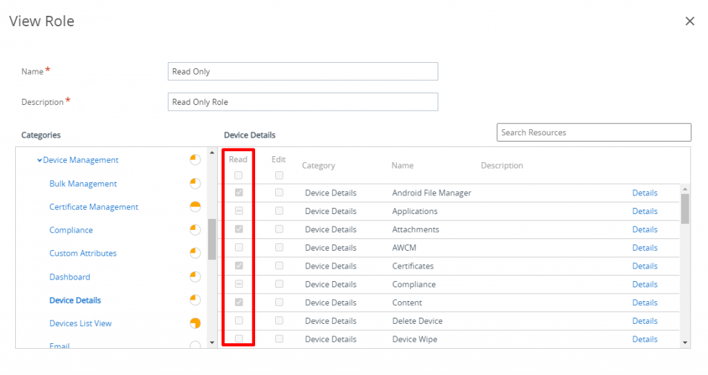](images/image-2-1024x543.png)

<figcaption>

いくつかのリソースにはRead のチェックが入っていませんが、これはEdit 権限しかないためです。

</figcaption>

</figure>

他にも、例えばReport Viewer はレポート機能に特化したロールで、レポートの出力などの操作はできるのですが、デバイスのワイプなどはできません。

こんな感じでいくつかのデフォルトのロールが用意されているものの、数は結構少ないです。デフォルトで要件を満たさない場合は作り込む必要があるのですが、その場合は既存で定義済みのデフォルトロールをベースにしていきます。つまり、UEM にはロールのコピー機能があるのですが、まずはデフォルトロールをコピーし、そこから調整をしていくのがよさそうです。調整の際には、役割同士の比較機能（どのリソースにチェックが入っているか、入っていないかを比較）もあるので、うまく活用しましょう。

さて、今回のメイントピックはここからなのですが、実はこの調整も一苦労だったりします。実際に遭遇したのですが、**デバイスのワイプだけを許可したロールを作りたい**、という要望を例に、役割の調整を考えてみましょう。

まずは安直に、どのリソースに対して権限を与えるべきかを調べるために、「wipe」 で検索してみましょう。

<figure>

[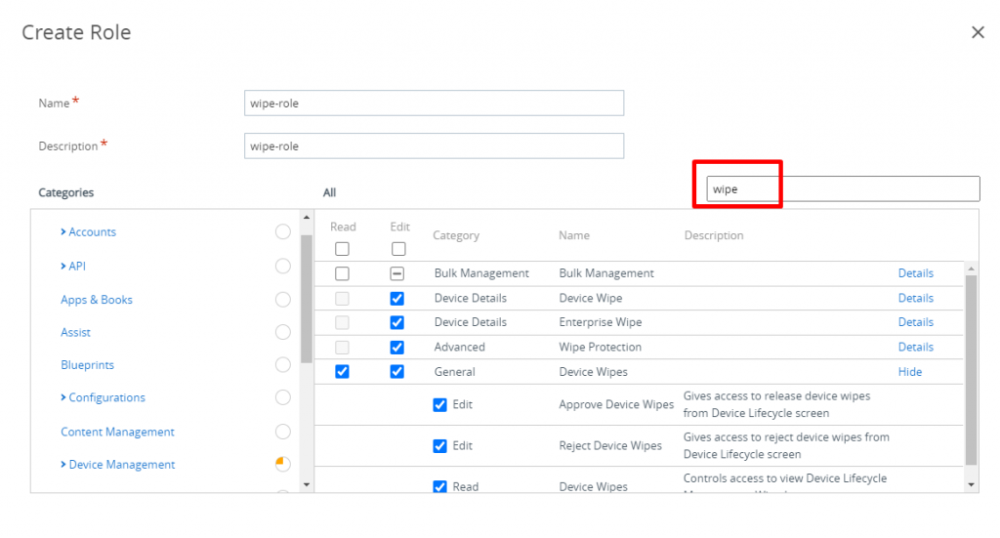](images/image-4-1024x551.png)

<figcaption>

こういう場合英語UI にした方が楽です。

</figcaption>

</figure>

ワイプ関連のリソースがいくつか出てきたので、すべてにEdit 権限を与えます。まずはこれで試してみましょう。作ったロールを任意の管理者に割り当てて、コンソールにログインします。

[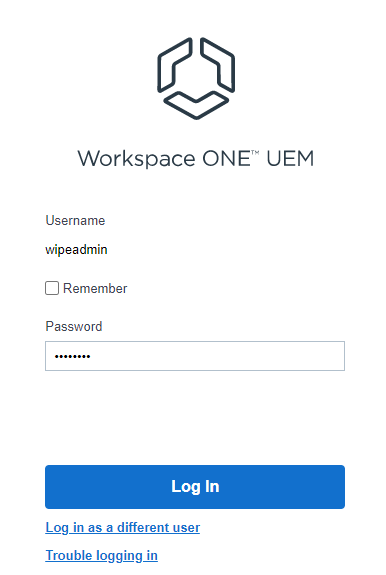](images/image-5.png)

[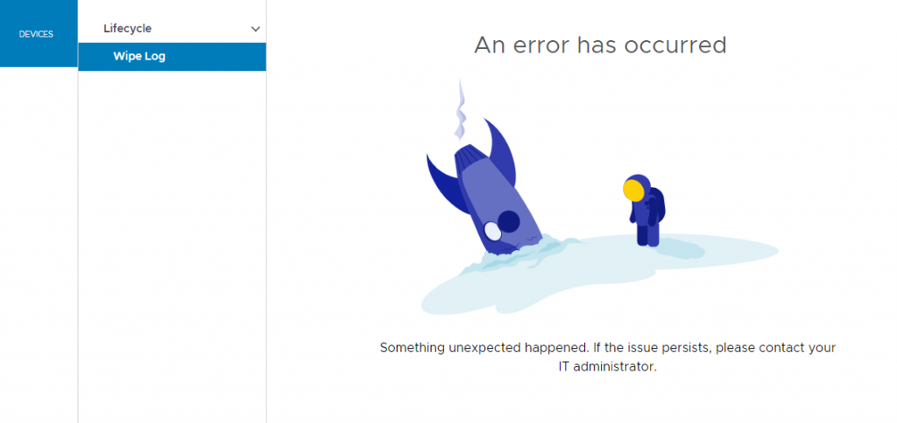](images/image-7-1024x484.png)

ダメなようです。

デバイスのワイプの操作を思い出してください。デバイスのリストビューから、デバイスを選択し、ワイプをする流れでした。上記画面ではそもそもデバイスのリストが見えていませんので、ワイプの画面にすらたどり着けていません。

したがって、楽をするなら、Read Only ロールをコピーして、そこをベースにワイプの権限を与えるのがよさそうです。が、今回はあえていばらの道を進みましょう。

デバイスのリスト表示の読み取り権限を与えてみましょう。リソースの探し方のコツとしては、ある程度カテゴリ分けされているので、それで判断するか、あとは例えばデバイスのリスト画面にアクセスしたときのURL \*\*\*/AirWatch/#/Device/List から判断していくと良いでしょう。

<figure>

[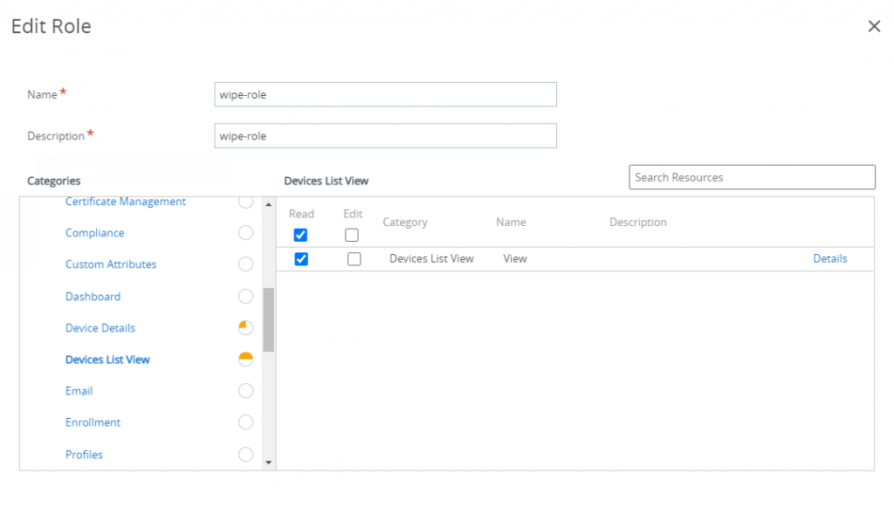](images/image-8-1024x589.png)

<figcaption>

確認します。

</figcaption>

</figure>

<figure>

[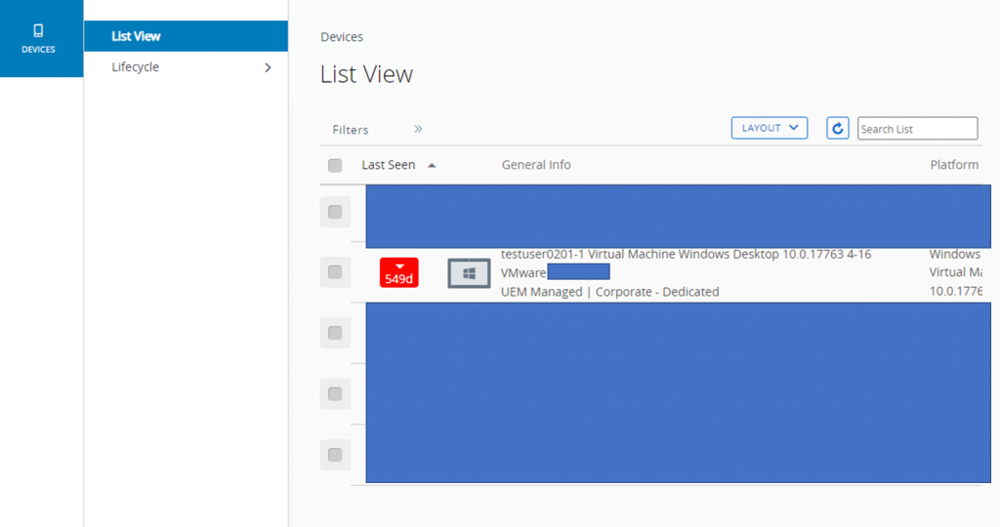](images/image-9-1024x540.png)

<figcaption>

個人情報を多く含んでいたのでマスクしている部分が多いことはご容赦ください。

</figcaption>

</figure>

画像からは分かりづらいですが、デバイスをクリックできません。クリックできないと、デバイス詳細画面に遷移せず、ワイプの操作もできません。詳細を見る権限を見つけます。Device Details → General にそれっぽいリソースがあるのでチェックを入れます。Description を読んで判断しますが、いかんせんよく分からない場合も多いので、ある程度試行錯誤で調整していきます。もしくは、Read なのでそれほど影響はないだろうと判断してチェックを多めに入れるのも一つの手です。

[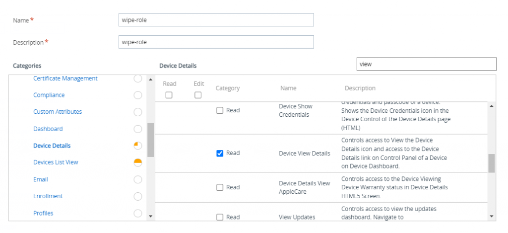](images/image-11-1024x469.png)

[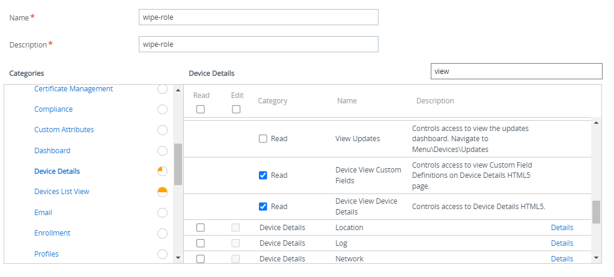](images/image-10.png)

ようやくこれでデバイスの画面に行けました。ワイプを試してみます。

[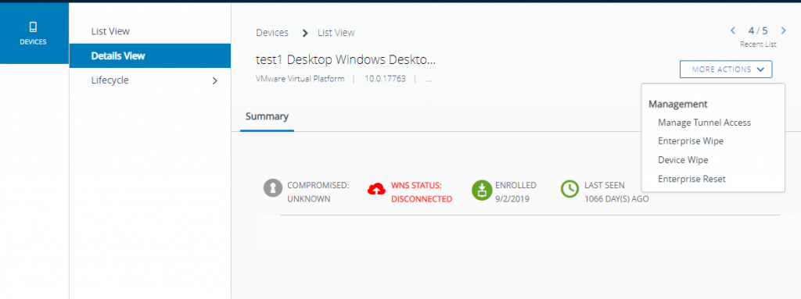](images/image-13-1024x383.png)

[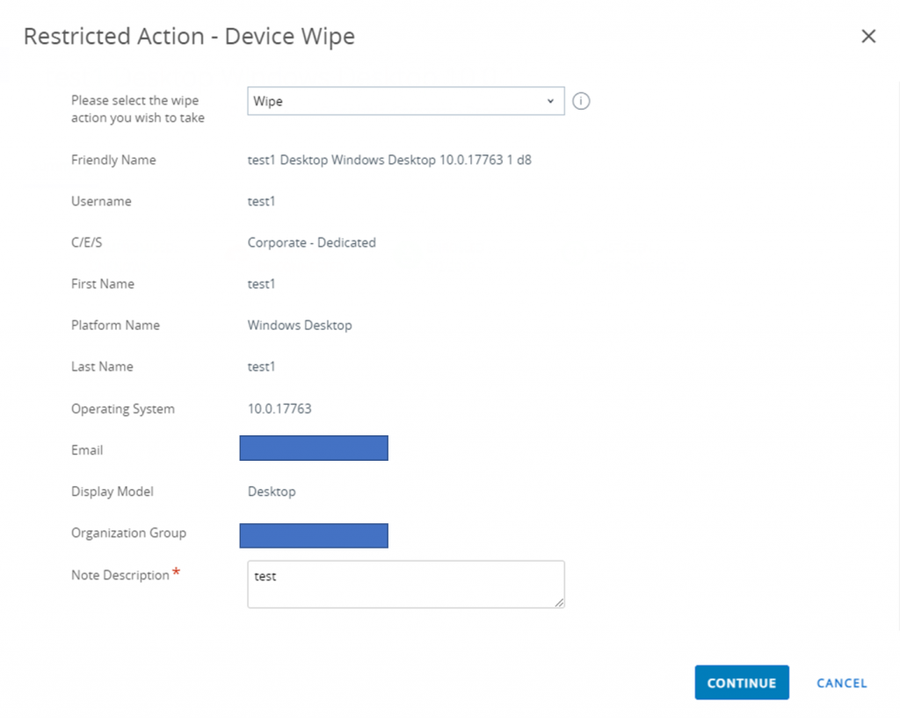](images/image-21-1024x818.png)

[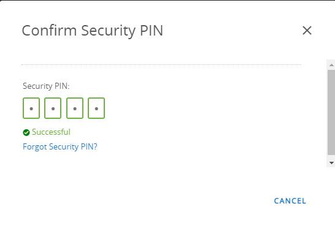](images/image-14.png)

...…PIN 入力画面でスタックします。PIN 自体は適切で、画面としてもSuccessful と出ているのにもかかわらず、ワイプができません。どうやらまだ権限が足りないようです。お手上げです。

**最後の手段として、Chrome のデベロッパーツールを使います。**

もう一度、デバイスワイプを試しますが、今度はChrome のデベロッパーツールを起動し、クライアントからのAPI リクエストをトラッキングします。

[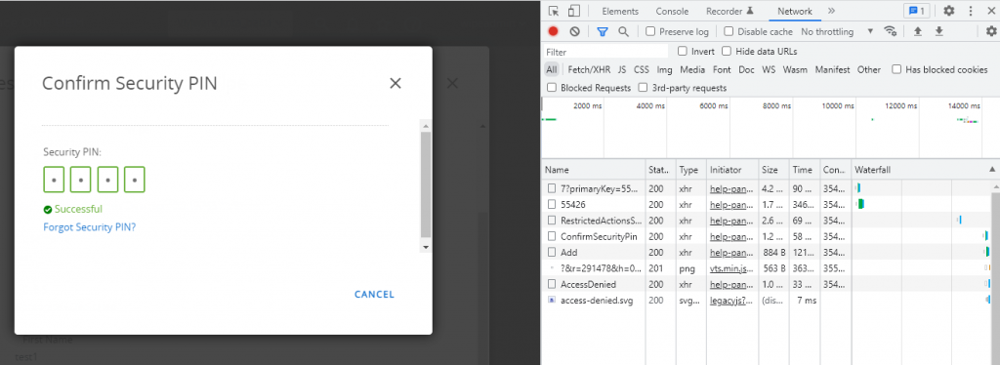](images/image-16-1024x374.png)

すると、ConfirmSecurityPin の後にAdd というPOST リクエストが投げられていることが分かります。

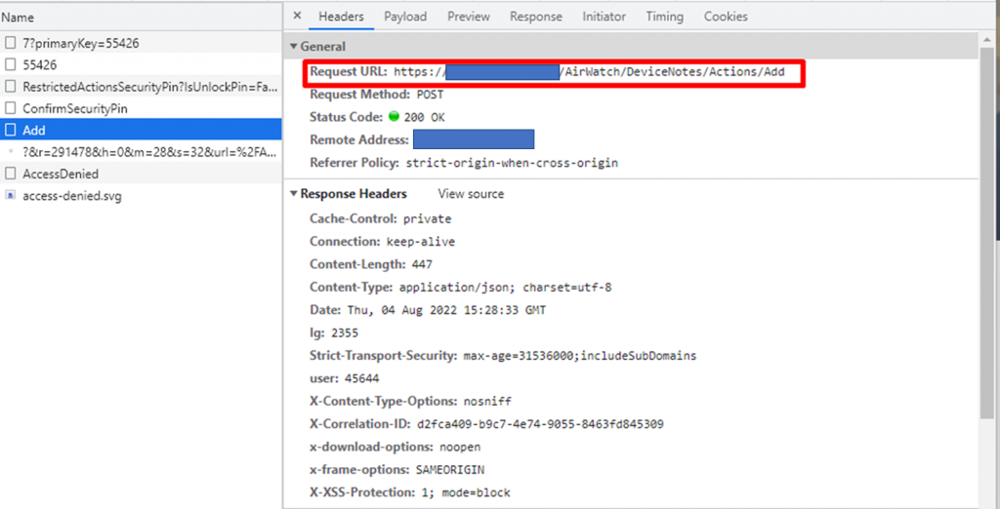

このリクエストURL に注目してください。\*\*\*/AirWatch/**DeviceNotes**/Action/Add 、すなわち、ノートの操作が入っています。これは、デバイスワイプの時に入力したノートを指します。その後AccessDenied となっていることから、ノート周りの権限が不足しているのではないか？と推測できます。

<figure>

[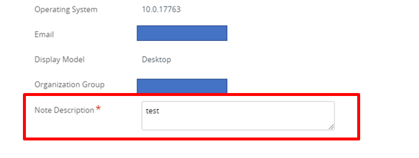](images/image-22.png)

<figcaption>

まさかお前に権限が必要とは思わなかった……

</figcaption>

</figure>

note で検索し、該当のリソースのEdit 権限を与えればOK です。

<figure>

[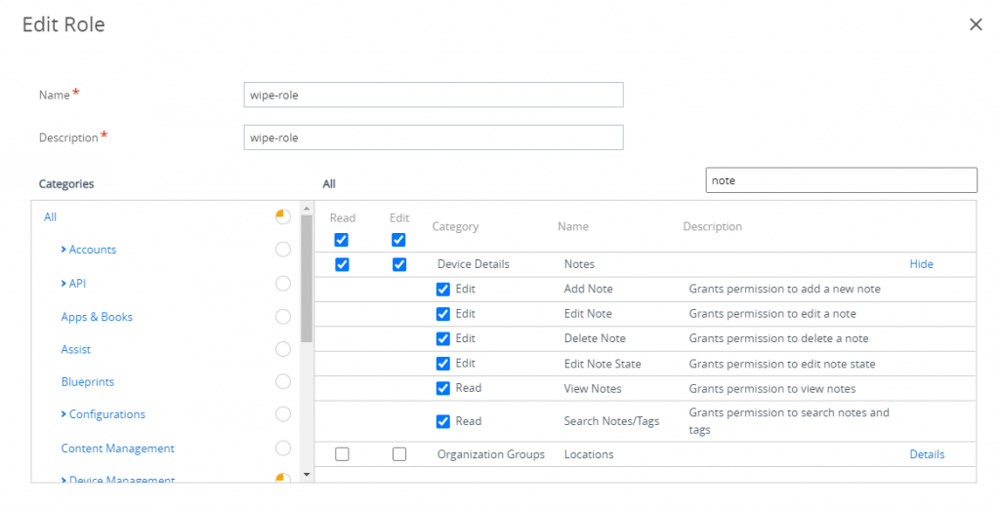](images/image-23-1024x520.png)

<figcaption>

Add Note だけでいいと思いますが、念のため。

</figcaption>

</figure>

これで、無事デバイスワイプができるようになりました。

## まとめ

役割の調整の際には下記手順に従うと良いと思います。

1. デフォルトのロールで代替可能かをまずは確認
2. 代替できない場合、ReadOnly ロールをコピーして新規ロールを作成
3. 追加で必要な権限を、リソース名、リソースの説明、URL などから検索してあたりをつけてチェックを入れる
4. 試してみて、ダメだったら再度調整。その際にはChrome デベロッパーツールが有効になる場合がある。

なお、役割の調整中に、権限の設定は正しいにもかかわらず、謎のドアに操作をブロックされる事象がたまに発生します。この場合、Console Administrator を持つ管理者アカウントで一度ログインして、操作できることを確認した後に再度対象のユーザーでログインするとうまくいくようです。もしくは、対象のユーザーに一時的にConsole Administrator ロールを与えて同様にドアが開くことを確認してもよいです。

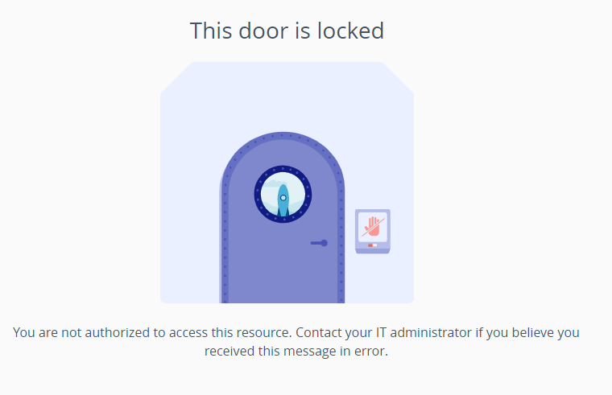
