実は1週間くらいこのブログにアクセスできず、もろもろ重なって復旧対応ができなかったのですが、せっかくなのでChatGPT を使ってどこまで復旧対応ができるかを試してみました。

**結論としては、見事に復旧できました。スゴイ。**

## このブログの環境

このブログはAWS Lightsail のBitnami WordPress で動かしています。月々大体500 円くらいで、Wordpress が使える環境としてはかなり安い部類かなと思います。とはいえ最安で動かすためのリソースには当然制約があり、1 vCPU、512 MB RAM、20 GB SSD とかなり小さめのインスタンスです（これでも単に技術ブログとしてほそぼそ運用していくのであれば十分です）。

ちなみに、仮にもし私が今ブログを作るなら、Github Pages などの無料で使える静的ページのホスティングサービスを使います。というのもWordpress はセキュリティ的に大変脆弱と言わざるをえず、しかもBitnami WordPress のバージョンとインスタンスのPHP バージョンの互換性があるにもかかわらず、直接のPHP のアップグレードがサポートされていません。つまり、攻撃されやすいWordpress の脆弱性対応をスムーズに行うことができない場合があります。

一方でGithub Pages はWordpress ほどリッチなコンテンツを表現できるわけではないですが、単なる技術ブログにそこまで必要ないだろう、ということで私はそちらをオススメします。

話がそれましたが、一応4 年ほど運用してきて、そこそこのアクセス数もあり、いくつかのトラブルはあれど、比較的安定して稼働はしてきました。

## 発生した事象

[](images/image-10.png)

先週、ブログにアクセスすると突然「Error establishing a database connection」という見たことがないエラーが表示されました。一見データベースとの接続ができてないように見えますが、Bitnami Wordpress なので1 つのインスタンスにウェブサーバーやPHP、DB が稼働していて、ネットワークの問題には思えません。特にパスワードを変更するなどの操作もしていないので、プロセスが死んでるとかかなーと予想はしますが、ググっても様々な原因があるようで、正解を見つけることは中々難しいです。

ということで、ChatGPT でAIOps 的なことがどこまでできるのか、実際の事象をもとに試してみました。なお課金勢のためGPT-4 を使っています。

ただ、当初は事象を直すことばかりに気が取られ、**最初は安直に再起動をしてしまいました。その結果実はサイト自体に全く接続できず、上記のエラーも表示されていないところからのスタートとなります（もちろん事前にスナップショットは取りました）。**

## ChatGPT を使った復旧対応

まずは切り分けの方法を教えてもらいます。

[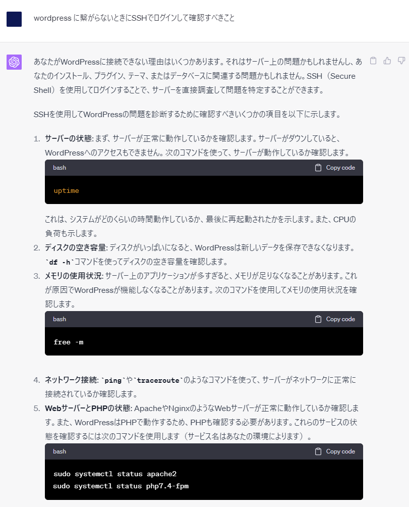](images/image-12.png)

このうち、1-3 のいわゆるリソースの問題については、確認を実際に行い、十分なリソースが確保されていることが確認できています。4 については名前解決はOK、Ping はFW の問題かどうかは分かりませんが通らず、AWS コンソールからのSSH 接続ではアクセスできているという状況です。

5 の切り分けでは、Bitnami バージョンのWordpress ということを伝えていなかったので、一般的なWordpress のサービス確認方法を案内されました。Bitnami Wordpress では、各サービス（Web/App/DB）のステータスは下記コマンドで実施できます。

```
sudo /opt/bitnami/ctlscript.sh status
```

ちなみに私はこれを知っていましたが、実際知らなくてもChatGPT に聞けばわかります。

[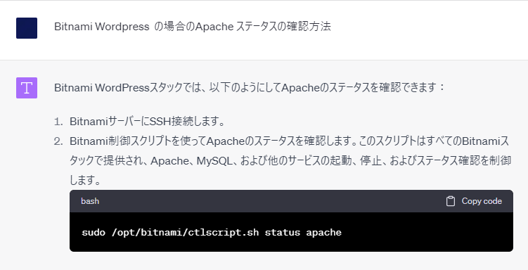](images/image-13.png)

この結果、すべてのサービスがnot running でした。ゆえに、ctlscript.sh を使ってサービスを再起動します。しかしながら、エラーでうまく再起動できないようです。

```
sudo /opt/bitnami/ctlscript.sh restart
Restarting services..
Job for bitnami.service failed because the control process exited with error code.
See "systemctl status bitnami.service" and "journalctl -xe" for details.
bitnami@ip-172-26-7-18:~$ journalctl -xe
May 24 13:17:25 ip-172-26-7-18 systemd[1]: bitnami.service: Unit process 641 (php-fpm) remains running after unit stopped.
May 24 13:17:25 ip-172-26-7-18 systemd[1]: bitnami.service: Unit process 642 (php-fpm) remains running after unit stopped.
May 24 13:17:25 ip-172-26-7-18 systemd[1]: bitnami.service: Unit process 643 (php-fpm) remains running after unit stopped.
May 24 13:17:25 ip-172-26-7-18 sudo[3501]: pam_unix(sudo:session): session closed for user root
May 24 13:17:25 ip-172-26-7-18 systemd[1]: bitnami.service: Unit process 644 (php-fpm) remains running after unit stopped.
May 24 13:17:25 ip-172-26-7-18 systemd[1]: Failed to start LSB: bitnami init script.
░░ Subject: A start job for unit bitnami.service has failed
░░ Defined-By: systemd
░░ Support: https://www.debian.org/support
░░ 
░░ A start job for unit bitnami.service has finished with a failure.
░░ 
░░ The job identifier is 389 and the job result is failed.
May 24 13:17:25 ip-172-26-7-18 systemd[1]: bitnami.service: Consumed 1.811s CPU time.
░░ Subject: Resources consumed by unit runtime
░░ Defined-By: systemd
░░ Support: https://www.debian.org/support
░░ 
░░ The unit bitnami.service completed and consumed the indicated resources.
```

そのため、このエラーを丸っとコピペし、ChatGPT に聞いたところ、以下のような返答となりました。

[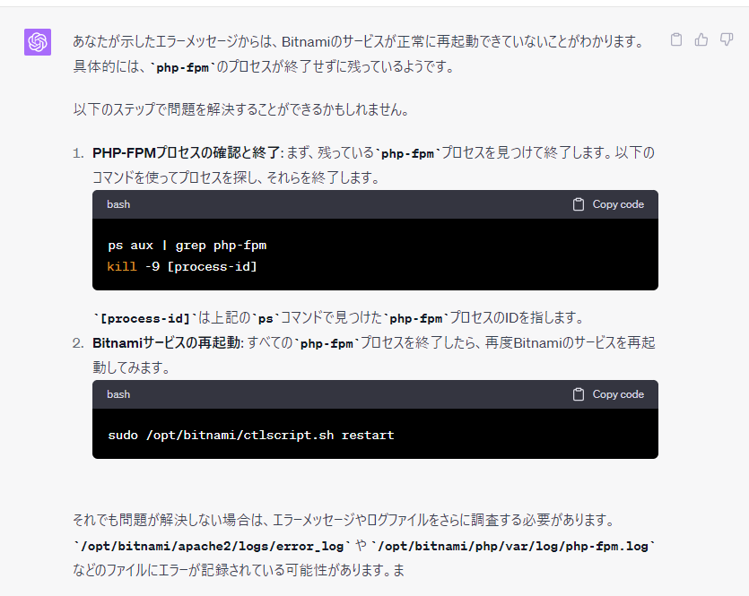](images/image-14.png)

この対応に従い、php-fpm プロセスをすべてkill し、再度サービスの再起動を試みましたが、同じ事象が発生しました。

[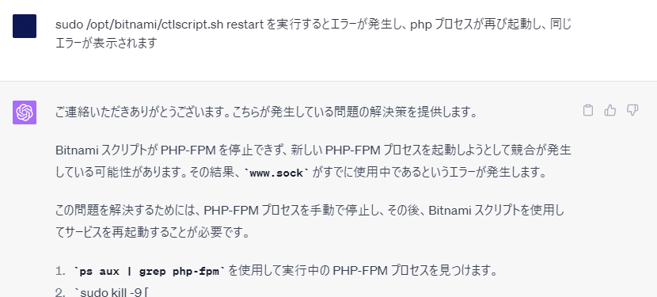](images/image-15.png)

このように、**ChatGPT はたまにループが発生します。**つまり、一見正しそうな回答なのですが、それを実行したとしても事象の解決にならず、再度聞くとまだ同じ回答をする……というループです。このようなループは実際とてもよくあることなので、ここからの脱出方法は様々な人の意見も聞いてみたいところですが、**ループを防ぐ1 つの方法としては「聞き方をより具体的にする」です。**たとえば「先ほどの回答の案内の通り●●を実施したが同様のエラーが出るので解決策を提示して」などです。ChatGPT に、先の回答が誤りであることを確実に指摘するのがポイントです。

<figure>

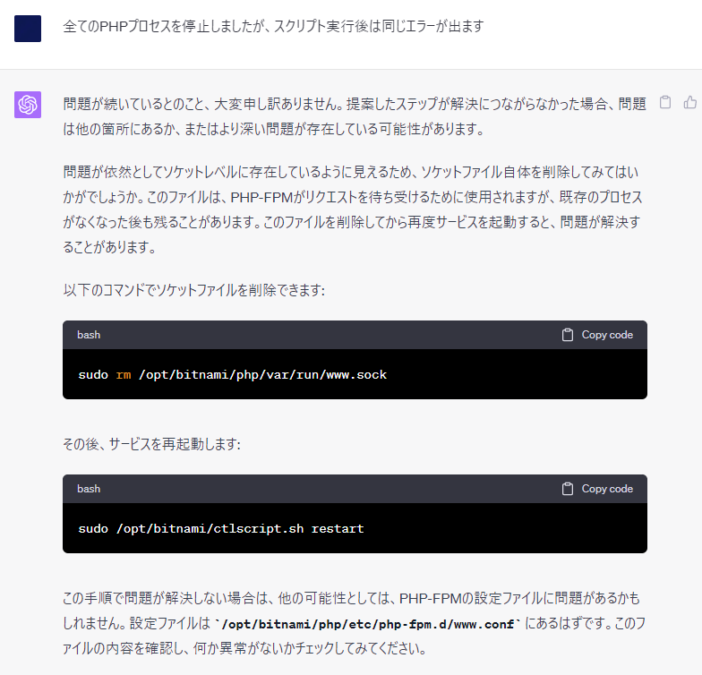

<figcaption>

この例はかなり雑な聞き方です（イライラが見て取れます）

</figcaption>

</figure>

で、指示通りソケットファイルを削除し、サービスの再起動をかけ、サイトにアクセスすると「The server is temporarily unable to service your request due to maintenance downtime or capacity problems. Please try again later. 」というエラーが表示されていることに気づきます。

[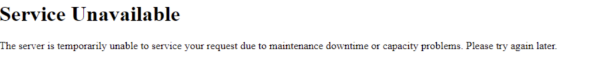](images/image-18-1024x119.png)

[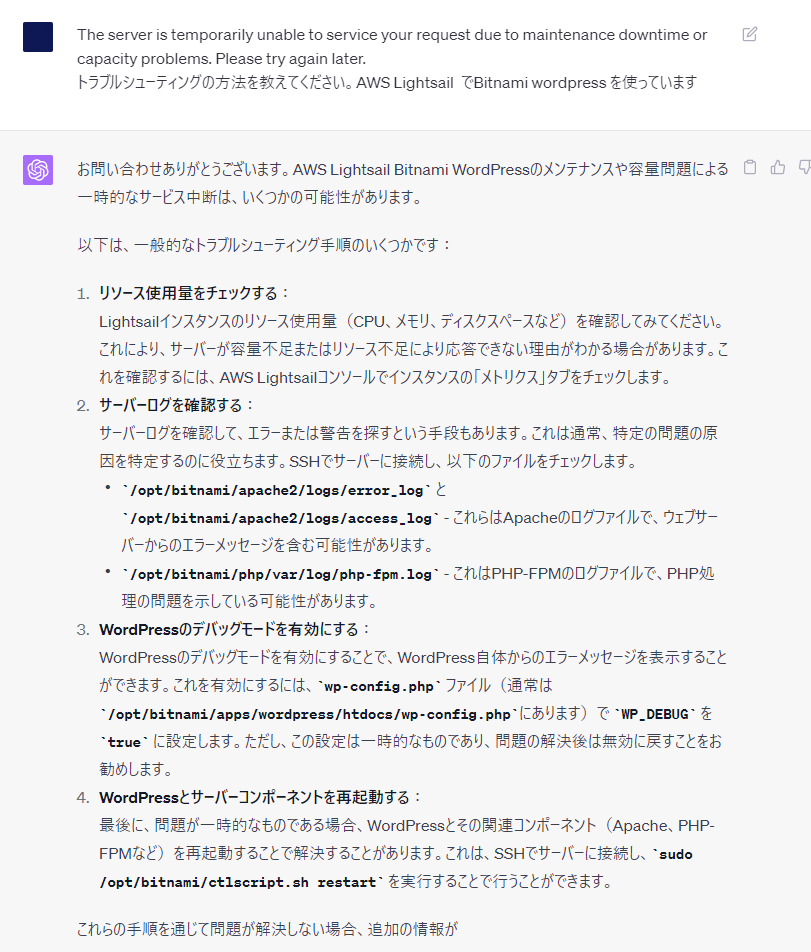](images/image-19.png)

はい、最初の回答と同じような回答となり、ループになりました。ということで、ここからは聞き方をより具体化するべく、error\_log を見ていきます。この辺は実際のトラブルシューティングと同じですね。

[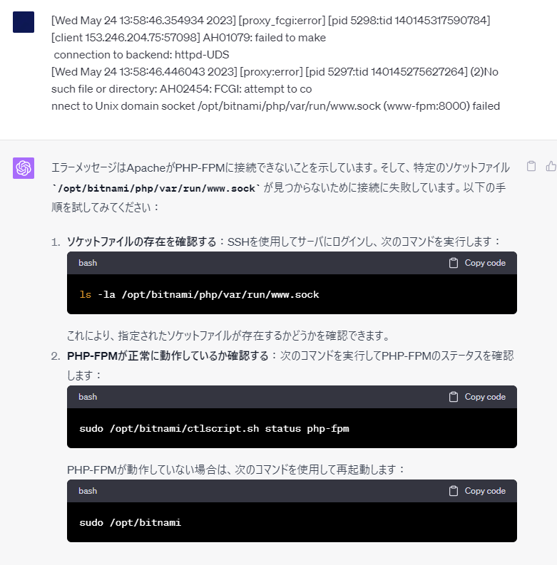](images/image-20.png)

**さきほどあなたの指示でソケットファイルを消しましたが？と思いつつ**、ここでは大人の対応を見せます。

<figure>

[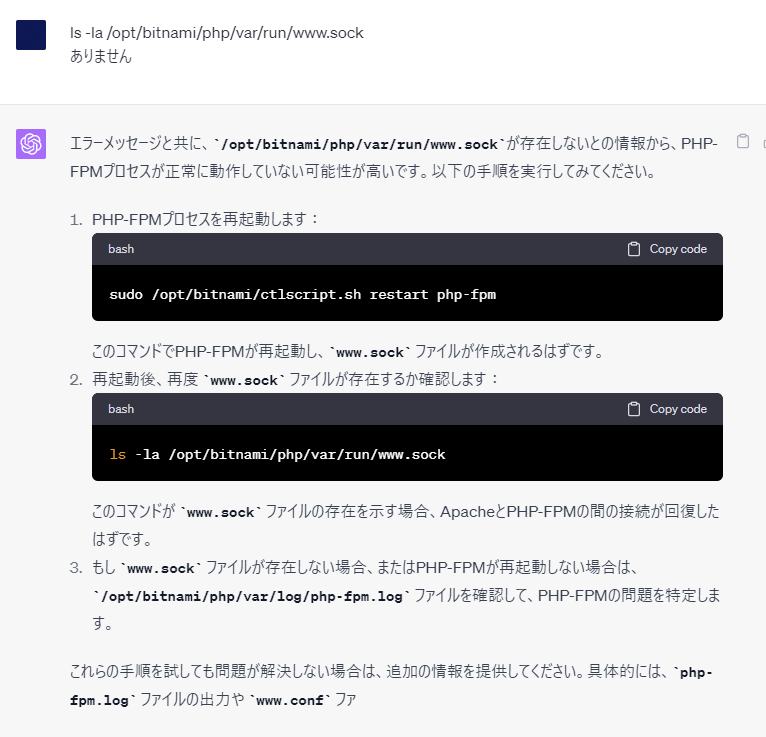](images/image-21.png)

<figcaption>

聞き方が段々雑になってきます

</figcaption>

</figure>

ここで、当初のデータベースエラーまで持って行くことができました。**ようやく状況は-1 から0 に戻りました。**

で、例のサービスの再起動をしたところ、今度は再起動スクリプトの実行そのものができなかったので、これも聞いてみます。**状況はまだ-0.5 のようです。**

[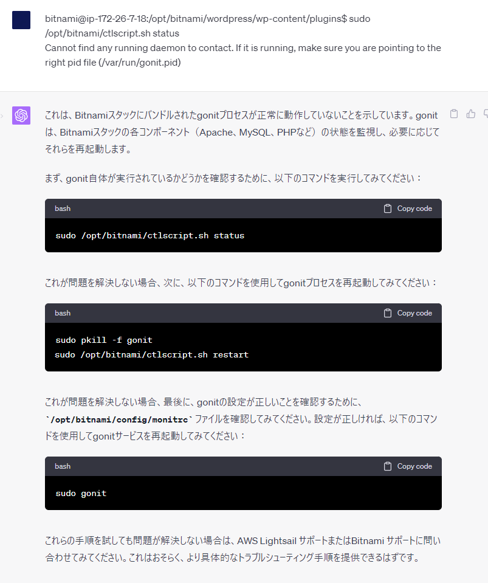](images/image-22.png)

この操作はうまくいきまして、ようやくサービスのステータスはmariadb 以外running になりました！

さて、ここからデータベースがなぜ起動していないかを探っていきます。これもループを防ぐために、ログ（/opt/bitnami/mariadb/logs/mysqld.log）を見ていきます。すると「 **\[ERROR\] InnoDB: Failed to read page 27258 from file './bitnami\_wordp ress/wp\_statpress.ibd': Page read from tablespace is corrupted.**」といったような非常に不穏なログが出ていることが分かりました。

このようなデータベース破損エラーが大量に出ていたので、それをそのままChatGPT に貼り付けます。

[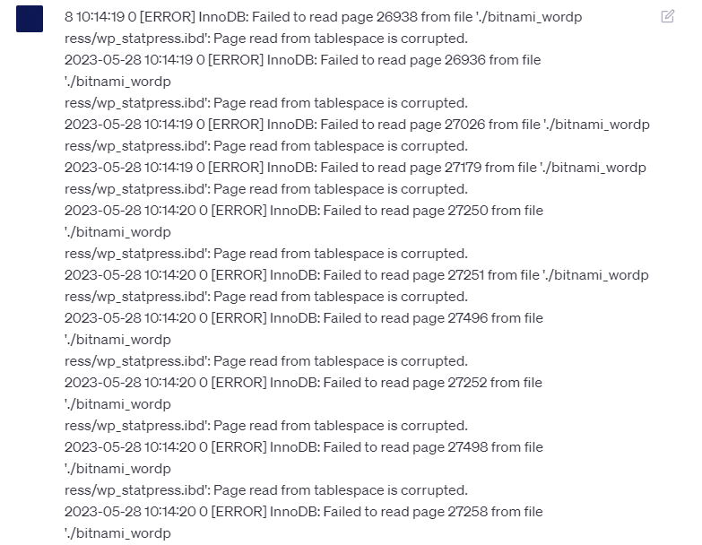](images/image-24.png)

[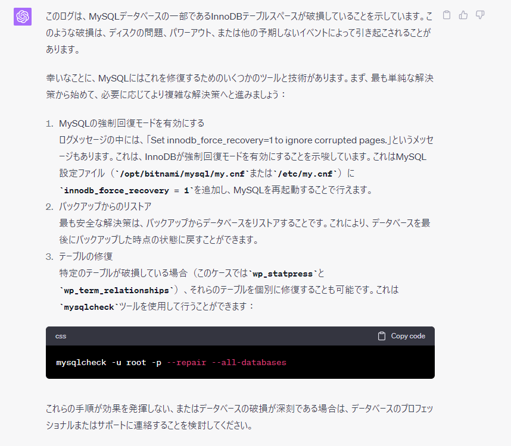](images/image-23.png)

この中で、1が一番すぐに試せそうだったのと、これがうまくいかなかった場合は2 や3 の面倒な方法を（スナップショット復旧を準備して）試そうかなと思い、1を実行しました。念のためこの解決策をググり、一応問題ない方法のように見えることを確認しています。

[https://dev.mysql.com/doc/refman/8.0/ja/forcing-innodb-recovery.html](https://dev.mysql.com/doc/refman/8.0/ja/forcing-innodb-recovery.html)

**これを実行したところ、あっさりブログが復旧しました。**

ただし、これはエラーを無視する一時的な方法ということで、その後はDB の修復をするべきとのことです。とはいえ、これでWordpress にログインすることができるようになり、コンテンツのバックアップをWordpress レイヤで実施できるようになったので、取り急ぎの事象は解決されました。

[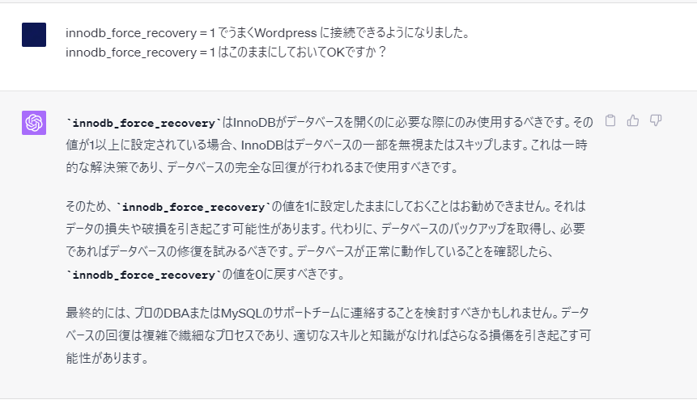](images/image-25.png)

## 得られた知見

実際のトラブルシューティングと同様、切り分けの方法を教えてもらい、まずは事象を正確に把握することから努めます。その後、ChatGPT の指示に従いつつ、リスクの高そうな操作はググったり追加でリスクをChatGPT に確認したりしながらトラシュを進めます。正しい回答を得たり、回答のループを防ぐポイントは、事象をなるべく具体的に記述することです。ログをそのまま貼り付けるのも有効です。

…とここまで書きましたが、これはまさに人手のトラブルシューティングと同様の注意点がそのままChatGPT によるトラブルシューティングに適用できることになります。**たとえAI でも、事象を把握しないまま正しい回答をする、いわゆるエスパー回答は難しいので、やはり事象の正確な把握のためのログが重要です。そのログを分析することにAI は長けています。**

AI は必ずしも正しい回答をするわけではありませんが、今回のような公開情報がたくさんあるであろう問題に対しては恐ろしいほど正確に回答してくれます。うまくAI と付き合っていくことで、インフラ運用もかなり楽になっていきそうです。
