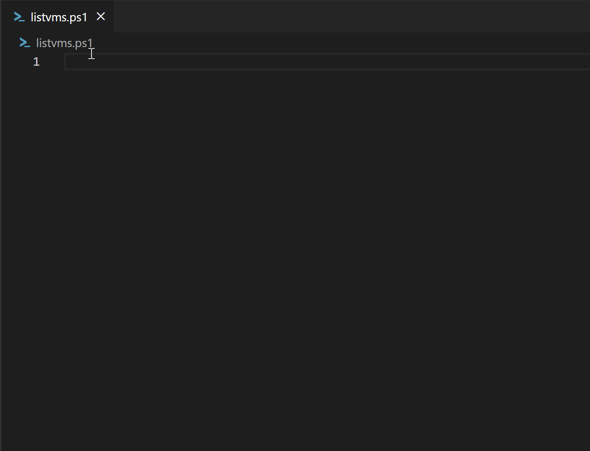
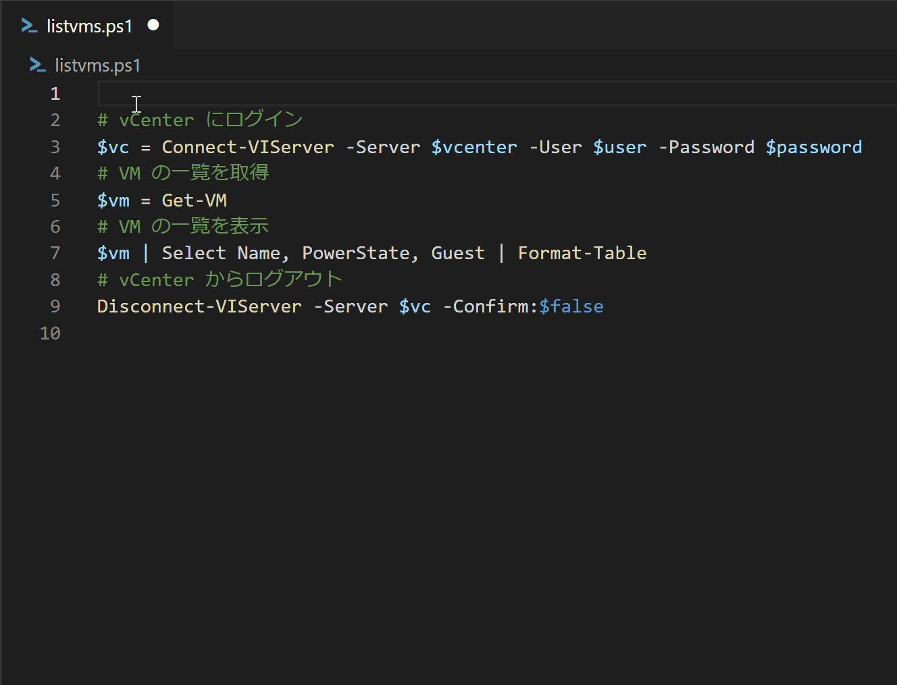
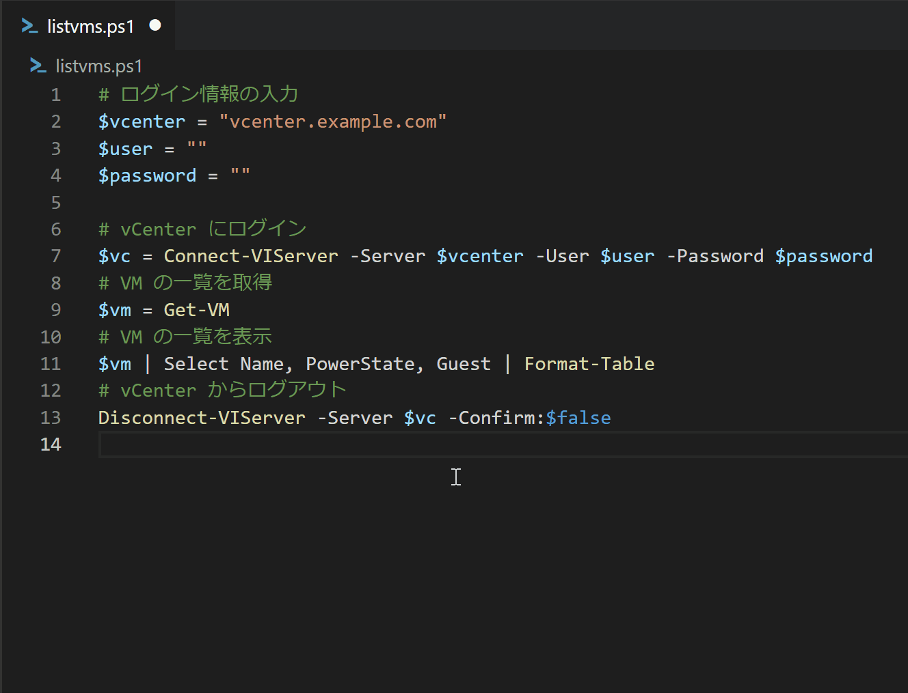
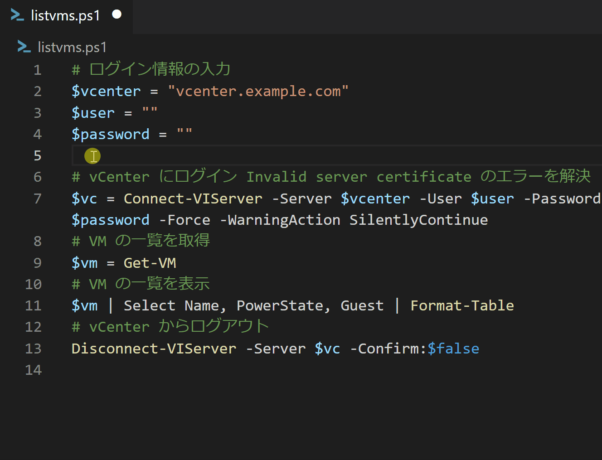

先日の[ツナカン](https://tuna-jp.connpass.com/event/273593/) の雑談の中で、jacopen さんより「Github Copilot がTerraform にも使える」という話を聞き、ならPowerCLI にも使えるんじゃ？と思ってさっそく試してみました。結論から言うと「AIのちからってすげー!」でした。

## GitHub Copilot とは

AI の力でコードを補完してくれるサービスです。日本語のコメントにも対応しているのが中々凄く、例えばコメントで「Hello World を出力」と書いたらそれをコードに変換してくれます。もちろん100% 正しいというわけではないですが、これが中々精度が高く、AI の力に驚かされます。

ただしこのサービスは有料で、2023/2/18 現在、月額払いだと月10ドル、年額払いだと1年あたり100ドルとなります。60日のトライアルがあるので、是非触ってみて欲しいです。

[https://docs.github.com/ja/billing/managing-billing-for-github-copilot/about-billing-for-github-copilot](https://docs.github.com/ja/billing/managing-billing-for-github-copilot/about-billing-for-github-copilot)

## PowerCLI とは

おなじみ、Powershell でvCenter API を使って操作を自動化するためのツールです。Powershell が嫌いな人は、他にも[Python (pyvmomi)](https://github.com/vmware/pyvmomi) や[Go (govmomi)](https://github.com/vmware/govmomi) のようなものがあるのでそちらを使えます。

## さっそく自動化してみよう

今回は「指定したvCenter 配下の仮想マシンをすべて出力する」という極めて基本的なスクリプトを書いてみます。 Github Copilot を使えば、このような単純なスクリプトでも書き方が大きく変わり、非常に面白いです。

まずはvCenter に接続します。接続方法が分からないのでCopilot 君に聞いてみます。コメントで「vCenter にログイン」と書くだけです。書いたらなんと、仮想マシンの一覧を取得し表示、ログアウトまで一連のコードを提案してくれました。



ただ、これだけだと当然vCenter の接続先などを指定していないのでログインできません（上記アニメーションでいうと$vcenter 変数などが空です）。そこで、今度は接続情報を入力します。これもよくわからないのでCopilot 君に聞いてみます。コメントで「ログイン情報の入力」と書いてみました。



いい感じです。ここで先ほどの変数に実際のvCenter の情報を格納して(vcenter.example.com などを適宜変更)、問題なくコードが動くか試してみるとエラーが発生しました。vCenter との接続時に証明書エラーが発生しているようです。

```
vc> .\listvms.ps1
Connect-VIServer : 2023/02/18 15:03:12  Connect-VIServer                Error: Invalid server certificate. Use Se
t-PowerCLIConfiguration to set the value for the InvalidCertificateAction option to Prompt if you'd like to connect once or to add a permanent exception for this server.
Additional Information: 機関 'vcenter.example.com' との SSL/TLS のセキュリティで保護されているチャネルに対する信頼関係を確立できませんでした。
```

うーんわからない、ということでこれもCopilot 君に聞いてみます。エラーはConnect-VIServer 時に発生しているので、その行を消し、出たエラーを解決するように、「vCenter にログイン」 の後にコメントで「Invalid server certificate のエラーを解決」と追記します。



それっぽいコードができました。実際に試すと、問題なく仮想マシンの情報が出力されるはずです。

さて、先ほどはコードの中にvCenter の接続情報を埋め込みましたが、汎用性を高めるためにプログラム実行時の引数として渡してあげたいです。ついでに引数の説明文も追加してくれるとなおよし。先ほどのログイン変数を削除し、コメントに「ログイン情報をコマンド実行時の引数から入力 help も用意」とすげー雑な感じで書きました。



出来上がったコードが下記となります。

```powershell
# ログイン情報をコマンド実行時の引数から入力 help も用意
[CmdletBinding()]
param(
    [Parameter(Mandatory=$true, HelpMessage="vCenter Server FQDN or IP Address")]
    [string]$vcenter,
    [Parameter(Mandatory=$true, HelpMessage="vCenter Server User Name")]
    [string]$user,
    [Parameter(Mandatory=$true, HelpMessage="vCenter Server Password")]
    [string]$password
)

# vCenter にログイン Invalid server certificate のエラーを解決
$vc = Connect-VIServer -Server $vcenter -User $user -Password $password -Force -WarningAction SilentlyContinue
# VM の一覧を取得
$vm = Get-VM
# VM の一覧を表示
$vm | Select Name, PowerState, Guest | Format-Table
# vCenter からログアウト
Disconnect-VIServer -Server $vc -Confirm:$false
```

これを実行するとマジで動きます。スゴイ。

```
vc> .\listvms.ps1

コマンド パイプライン位置 1 のコマンドレット listvms.ps1
次のパラメーターに値を指定してください:
(ヘルプを表示するには、「!?」と入力してください。)
vcenter: !?
vCenter Server FQDN or IP Address
vcenter: vcenter.example.com
user: administrator@vsphere.local
password: 

Name                                             PowerState Guest
---- ---------- -----
cwp-va-1.1.0.0-18741640_OVF10                     PoweredOn cwp-va-1.1.0.0-18741640_OVF10:
win2019-cb                                        PoweredOn win2019-cb:Microsoft Windows Server 2019 (64-bit)
~~~ (以下略)

```

ちなみにgovmomi でも同じようなことができました。ただ、PowerCLI の方がより直感的に書ける印象を持ちました。

コードを書くのが面倒ということで敬遠されがちなIaC ですが、Github Copilot のようなAI 補完機能と組み合わせると非常に可能性を感じます。VMware 製品でいうとAria Automation などが該当しますが、この手の製品は顧客の「このプロセスは自動化できるの？」という質問に対して「作り込みが必要ですが、できると思います、実際に検証してみれば確実です」とつい説明を逃げがちですが、Github Copilot を使えば、このような実際に試すというハードルを大分下げてくれる気がします。
